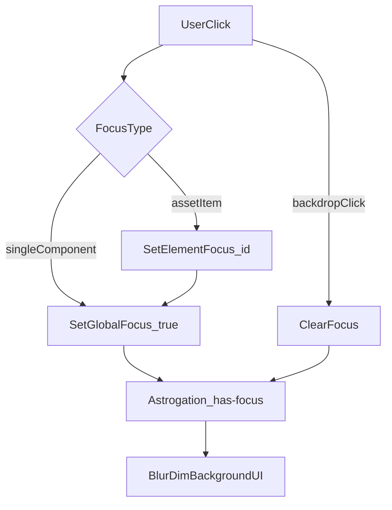

# Astrogation robustness refactor

### Goals (based on your priorities)

- **Modularize** the 2.5k-line `page.tsx` so it’s easier to reason about and extend.
- **Harden the state model** (selection/tab/focus/presets) to reduce “stale state” bugs.
- **Clean up CSS architecture** to prevent drift/duplication and make global behaviors (focus/blur/glass) consistent.
- **Targeted performance wins** (fewer unnecessary re-renders, lighter work per render).

### Non-goals (for safety)

- No feature additions.
- No intentional behavior changes.
- Visual changes only if they’re incidental to deduplication/consistency (per your “behavior-perfect” tolerance).

### Safety strategy (don’t break anything)

- **Baseline checklist** before refactor (manual, quick):
- Selecting categories/components updates preview.
- Vectors + Word Marks: click item → focused overlay appears; click backdrop → closes.
- Global focus mode: background UI blurs/dims; center preview stays interactive.
- Presets: load/save/delete works.
- Work in **small, mechanical commits**: extract code first (no logic change), then state refactor, then CSS cleanup, then perf.

### Proposed structure (route-local, scalable)

- Keep the route entry in [`app/astrogation/page.tsx`](app/astrogation/page.tsx) as a thin orchestrator.
- Add route-local modules:
- `app/astrogation/_components/`
  - `AstrogationShell.tsx` (layout + rails/nav/footer)
  - `CatalogPanel.tsx`
  - `CenterPanel.tsx` (tabs)
  - `VaultView.tsx`, `FoundryView.tsx`
  - `SpecPanel.tsx`, `DialsPanel.tsx`
  - `previews/ComponentPreview.tsx`
  - `previews/VectorsPreview.tsx`, `previews/WordmarksPreview.tsx`
  - `DynamicSVG.tsx`, `ThoughtformLogo.tsx`
- `app/astrogation/_state/astrogationReducer.ts`
- `app/astrogation/_hooks/usePresets.ts`

> Note: Any extracted TSX/hook files that use React hooks will include `"use client"`.

### State model hardening

- Replace scattered `useState` + cross-coupled effects with a **typed reducer**:
- `AstrogationState`: category, selectedComponentId, activeTab, focus (global + element-level), componentProps, style, presets, toast.
- Actions like: `selectComponent`, `setTab`, `setFocus`, `setElementFocus`, `setProps`, `loadPresets`, `presetSaved`, `presetDeleted`, `toastShown`.
- Keep side effects (fetch/save/delete presets) inside `usePresets()` to isolate network + error handling.
- Make focus explicit (reduces edge cases):

### CSS refactor (robust + scalable)

- Keep [`app/astrogation/astrogation.css`](app/astrogation/astrogation.css) but **dedupe + parameterize**:
- Introduce page-scoped CSS vars on `.astrogation` for focus system:
  - `--focus-overlay-bg`, `--focus-overlay-blur`, `--focus-bg-opacity`, `--focus-bg-blur`
- Consolidate shared “asset grid” patterns across vectors/wordmarks:
  - Shared rules for `__grid`, `__focused-content`, `__focused-overlay`, `__backdrop`, and `--has-focus`.
- Audit and remove any remaining duplicate selectors (this is what caused the Word Mark focus mismatch recently).

### Performance wins (safe, low-risk)

- Make static data lists (vectors/wordmarks definitions) **module constants** (not recreated on each render).
- Wrap heavier leaf components with `React.memo` where prop stability is clear.
- Use `useMemo`/`useCallback` to stabilize props passed deep into the tree.
- Optional (if profiling shows benefit): add a small in-memory cache in `DynamicSVG` for fetched SVG text keyed by `src`.

### Validation

- Run TypeScript + lint checks.
