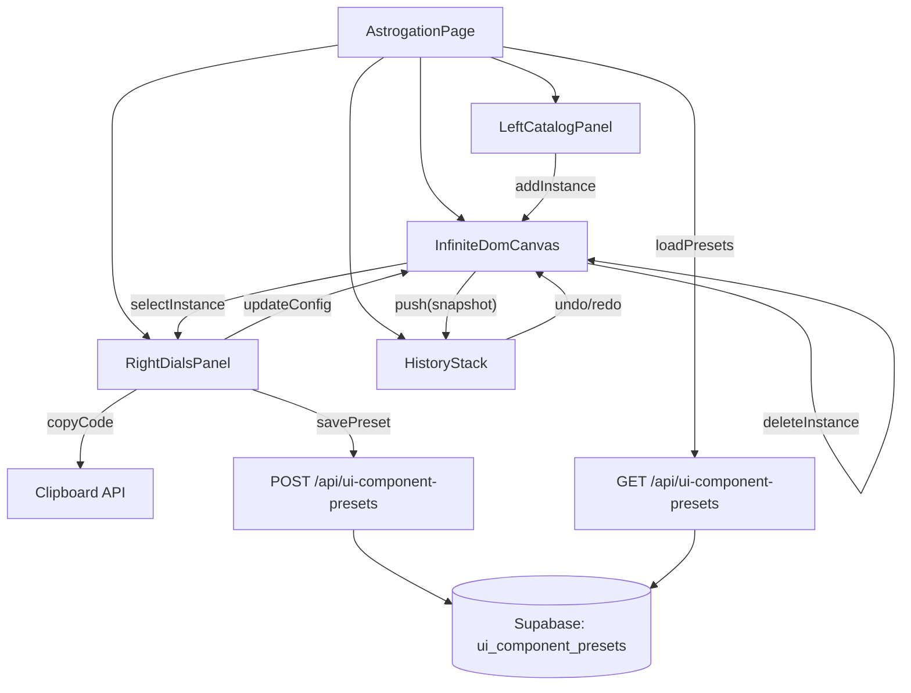

# Astrogation Page (UI Component Builder)

## Goals

- Create a new **admin-only** route **`/astrogation`** with the same left/canvas/right layout as **`/orrery`**, but focused on **visualizing and building reusable UI components**.
- Add an **ASTROGATION** entry in the admin tools list alongside **Particles / Voices / Orrery**.
- Implement **Save** for **individual component presets** (selected component type + config JSON) into Supabase, and allow reloading them.

## Key repo primitives we’ll leverage

- **Orrery layout + styling**: [`app/orrery/page.tsx`](app/orrery/page.tsx), [`app/orrery/orrery.css`](app/orrery/orrery.css)
- **Admin tool links**: [`components/admin/AdminTools.tsx`](components/admin/AdminTools.tsx)
- **Existing shadcn-compatible component registry**: [`registry/registry.json`](registry/registry.json) + `registry/thoughtform/*` (great for the left-panel catalog)
- **Supabase server access**: [`lib/supabase.ts`](lib/supabase.ts) + auth helper [`lib/auth-server.ts`](lib/auth-server.ts)

## UI architecture (V1)



## Implementation steps

### 1) Add Astrogation to the admin tools list

- Update [`components/admin/AdminTools.tsx`](components/admin/AdminTools.tsx):
- Add a new tool entry `{ id: "astrogation", label: "ASTROGATION", href: "/astrogation" }`.
- Adjust any spacing rules (currently there’s a special margin rule for `orrery`) so the list remains aligned with 4 items.

### 2) Create the Astrogation route using Orrery’s layout primitives

- Add new files:
- [`app/astrogation/page.tsx`](app/astrogation/page.tsx)
- [`app/astrogation/astrogation.css`](app/astrogation/astrogation.css)
- Reuse Orrery’s structure:
- Left panel (catalog)
- Center “canvas” (but DOM-based for interactive UI components)
- Right panel (dials)
- Top buttons above panels (optional in V1; easy to add later)
- Gate access the same way as Orrery:
- Wrap with `AdminGate` and enforce allowlist via `isAllowedUserEmail`.

### 3) Component catalog (left panel)

- Add [`app/astrogation/catalog.ts`](app/astrogation/catalog.ts) defining **categories + subcategories** exactly as requested:
- **BrandElements**: start with assets already in repo (`public/logos/*`). (We can optionally import additional SVGs from the attached `.branding` folder in a follow-up once you confirm which ones should ship in-repo.)
- **Grids** → **HUDs**: include `HUDFrame`, HUD rails/corners, navigation grid primitives.
- **Navbars**: include `components/hud/NavigationBar` and/or `registry/thoughtform/hud/navigation-bar`.
- **Frames** → **Terminals**: include `components/ui/CardFrame` with `tier="terminal"` and other frame variants.
- **Buttons**: include `components/ui/Button` and `components/hud/NavigationCockpitV2/MorphingCTAButtons` (wrapped with demo props).
- Left panel UX:
- Search filter
- Expand/collapse categories
- Click item → “Add to canvas” (places at viewport center)

### 4) Infinite interactive canvas (DOM)

- Implement a small pan/zoom engine (no new dependency) in [`app/astrogation/InfiniteDomCanvas.tsx`](app/astrogation/InfiniteDomCanvas.tsx):
- Wheel zoom (cursor-anchored)
- Drag pan on background
- Instances positioned in world coordinates; rendered inside a transformed container.
- Selection + drag to reposition instances.
- **Delete instance**: remove selected instance from canvas (via button or keyboard).
- Each instance renders a "preview wrapper" component that takes a typed config and returns React nodes.

### 5) Undo/redo history

- Add [`app/astrogation/history.ts`](app/astrogation/history.ts) with a simple state-history stack:
- `push(state)` — record a snapshot after each action (add, delete, move, config change).
- `undo()` / `redo()` — restore previous/next snapshot.
- Limit stack depth (e.g., 50 steps) to bound memory.
- Wire into canvas state so all mutations go through a `dispatch` that auto-pushes history.

### 6) Keyboard shortcuts

- Add [`app/astrogation/useKeyboardShortcuts.ts`](app/astrogation/useKeyboardShortcuts.ts) hook:
- **Delete / Backspace** — delete selected instance.
- **Cmd+Z (Ctrl+Z)** — undo.
- **Cmd+Shift+Z (Ctrl+Shift+Z)** — redo.
- **Escape** — deselect.

### 7) Right panel dials (component + global)

- Add [`app/astrogation/DialsPanel.tsx`](app/astrogation/DialsPanel.tsx):
- **Global dials** (applied via CSS variables on the Astrogation root): font family vars, spacing scale, optional colorway toggles.
- **Component dials** based on the selected component definition:
  - e.g. `Button.variant`, `Button.size`, `CardFrame.tier`, etc.
- Use Thoughtform UI primitives from `registry/thoughtform/ui/*` (`Slider`, `Toggle`, `Select`, `Accordion`) for the control UI.

### 8) Copy Code (export JSX snippet)

- In the right panel (or a floating button on the selected instance), add a **Copy Code** action.
- Generate a JSX snippet for the current component + config, e.g.:

  ```jsx
  <Button variant="solid" size="lg">
    Label
  </Button>
  ```

- Copy to clipboard on click with visual feedback (toast or button text change).

### 9) Save-to-Supabase for individual component presets

- Add a new migration:
- [`supabase/migrations/20251229_ui_component_presets.sql`](supabase/migrations/20251229_ui_component_presets.sql)
- Table proposal:
  - `id uuid primary key default gen_random_uuid()`
  - `name text not null`
  - `component_key text not null` (e.g. `button`, `hud-frame`, `morphing-cta-buttons`)
  - `config jsonb not null`
  - `created_at timestamptz default now()`
  - `updated_at timestamptz default now()`
- Add API route:
- [`app/api/ui-component-presets/route.ts`](app/api/ui-component-presets/route.ts) implementing `GET/POST/PUT/DELETE`.
- Use `createServerClient()` and enforce admin access using `isAuthorized(request)` from [`lib/auth-server.ts`](lib/auth-server.ts).
- Update Astrogation UI:
- Add a **Save** control for the selected instance (name input + save button).
- Add a **Saved Presets** section in the left panel to load a preset back onto the canvas.
- Add a **Delete Preset** option for saved presets (with confirmation).

### 10) Optional: shadcn MCP server setup

- Since we already have [`registry/registry.json`](registry/registry.json) in shadcn registry format, MCP is optional.
- If you want it, add `.cursor/mcp.json` per the shadcn MCP docs and verify it shows connected in Cursor (ref: `https://ui.shadcn.com/docs/mcp`).

## Acceptance criteria

- Visiting **`/astrogation`** (admin) shows a familiar Orrery-like layout with a component catalog, canvas, and dials.
- You can place a component on the canvas, select it, tweak settings live, and **Save** it to Supabase.
- Clicking a catalog item adds a component instance to the canvas.
- Selecting an instance reveals its dials in the right panel; editing dials updates the instance live.
- **Delete**: Pressing Delete/Backspace or clicking a delete button removes the selected instance.
- **Undo/redo**: Cmd+Z undoes the last action; Cmd+Shift+Z redoes. History covers add, delete, move, and config changes.
- **Copy Code**: A button copies the selected component's JSX snippet to the clipboard.
