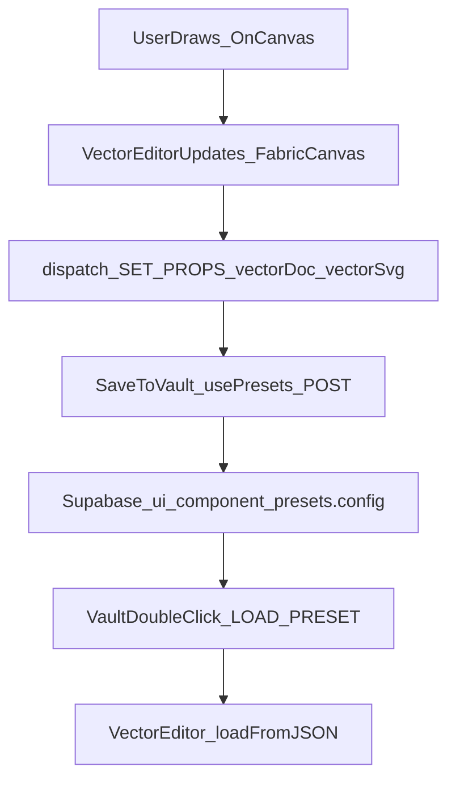

# Foundry Vector Editor (Figma‑lite) — MVP Plan

## Goal

Embed a lightweight, intuitive **vector drawing + layout editor** in the Foundry workspace so you can:

- draw basic vector shapes
- add/edit text
- select/move/resize/rotate
- delete/duplicate
- **snap to grid**
- export **SVG** and save/load via the existing **“Save to Vault”** preset system

This is intentionally a focused subset of Figma’s capabilities (see Figma docs hub: [Figma Design docs](https://help.figma.com/hc/en-us/categories/360002042553)).

## Scope (MVP)

- **Tools**: Select, Rectangle, Ellipse, Line, Pen (free draw path), Text
- **Editing**: drag/move, resize handles, rotate, multi-select, delete
- **Grid**: show grid overlay + snap toggle + grid size
- **History**: undo/redo (basic)
- **Export**: copy SVG to clipboard + persist SVG + document JSON in presets

## Key decision

Use **Fabric.js** as the interaction engine (object model, transforms, editable text, JSON serialization, SVG export). Context7 confirms core APIs for JSON + SVG export (`canvas.toJSON()`, `canvas.loadFromJSON()`, `canvas.toSVG()`).

## How it fits into current Astrogation

### What we already have

- Presets are saved to Supabase via `/api/ui-component-presets` and loaded through `usePresets`, stored as `config` JSON.
- Foundry center area renders `FoundryView` (preview) and the right panel provides the “Save to Vault” flow.

### Proposed integration

- Add a new catalog component **`vector-asset`** (Brand category) that opens the editor.
- When `selectedComponentId === "vector-asset"`, render a new `VectorEditor` inside `FoundryView`.
- Store editor state inside `componentProps` so it automatically participates in existing preset save/load:
- `componentProps.vectorDoc` = Fabric JSON (string or object)
- `componentProps.vectorSvg` = exported SVG string (for preview + copy)

## Data flow

## Files we’ll touch

- [app/astrogation/page.tsx](app/astrogation/page.tsx): plumb `onPropsChange` into center Foundry (so the editor can update `componentProps`).
- [app/astrogation/\_components/CenterPanel.tsx](app/astrogation/_components/CenterPanel.tsx): pass `onPropsChange` down to `FoundryView`.
- [app/astrogation/\_components/FoundryView.tsx](app/astrogation/_components/FoundryView.tsx): render `VectorEditor` for `vector-asset` and disable the existing wheel-zoom handler in this mode.
- [app/astrogation/\_components/previews/ComponentPreview.tsx](app/astrogation/_components/previews/ComponentPreview.tsx): add a `vector-asset` preview path that renders `componentProps.vectorSvg`.
- [app/astrogation/catalog.ts](app/astrogation/catalog.ts): add `vector-asset` to Brand category (props intentionally empty so the inspector doesn’t show a giant SVG string).
- [app/astrogation/astrogation.css](app/astrogation/astrogation.css): editor canvas + grid styling + bottom toolbar styling.
- (new) `app/astrogation/_components/vector-editor/*`: editor engine wrapper, toolbar UI, helpers.
- [package.json](package.json): add `fabric` dependency.

## Implementation notes (high-signal)

- **Client-only**: `VectorEditor` will be `"use client"` and initialize Fabric in `useEffect` with proper cleanup.
- **Persistence**: on changes, debounce updates to `vectorDoc`; on explicit export/save, regenerate `vectorSvg`.
- **Grid snapping**: implement via Fabric events (e.g., on object moving/scaling) by rounding `left/top/scale` to nearest grid step; draw a subtle grid as background.
- **Keyboard shortcuts**: delete/backspace, Ctrl/Cmd+Z, Ctrl/Cmd+Shift+Z (or Y), arrow nudges, duplicate.

Fabric JSON/SVG APIs (Context7): `canvas.toJSON()`, `canvas.loadFromJSON()`, `canvas.toSVG()`.

## Out of scope (for MVP)

- Node-level path editing (vector networks), boolean ops, auto-layout, constraints
- Collaboration / multiplayer
- Full Figma parity

## Follow-ups (Phase 2)

- Add alignment/distribution + snapping to objects/guides
