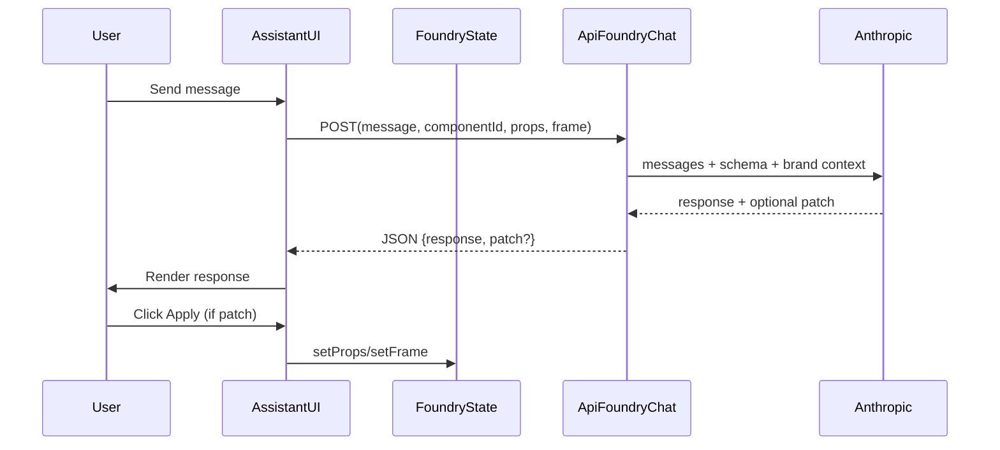

# Foundry Workbench + Assistant Chat (Astrogation)

## Goal

Make **Foundry** feel distinct from Vault: a **workbench** where you can quickly pick templates, tweak framing/styling (stroke/chamfer), and use a **Cursor-like assistant** to apply changes via chat.

## What we’ll build (MVP)

### 1) Foundry Workbench UI

- **Template tray (bottom, horizontal, scrollable)**
- Source: **Brand System catalog components** (your selection).
- Quick-select a component without switching context.
- Lives inside the Foundry center stage so Foundry stops looking like Vault.
- Files: [`app/astrogation/_components/FoundryView.tsx`](app/astrogation/_components/FoundryView.tsx), [`app/astrogation/astrogation.css`](app/astrogation/astrogation.css)
- **Stage framing controls** (the “Figma-like frame” around the preview)
- Add a Foundry-only `foundryFrame` config (ChamferedFrame wrapper) with:
  - shape preset/custom ticket notch (corner + notchWidthPx + notchHeightPx)
  - strokeColor, strokeWidth
  - fillColor
- Stage wraps the preview in `@thoughtform/ui`’s `ChamferedFrame`.
- Files: [`app/astrogation/_state/astrogationReducer.ts`](app/astrogation/_state/astrogationReducer.ts), [`app/astrogation/_components/types.ts`](app/astrogation/_components/types.ts), [`app/astrogation/_components/FoundryView.tsx`](app/astrogation/_components/FoundryView.tsx)

### 2) Right Panel: Structured Inspector (Foundry)

Keep the current prop controls, but add a top “Frame” section so the **bare minimum knobs** exist:

- **Frame**: shape, chamfer/notch width/height, stroke width, stroke color, fill
- **Component props**: existing categorized dials
- **Export/Save**: existing Copy JSX + Save to Vault, plus **Copy Framed JSX** (exports the stage frame + component)

Files: [`app/astrogation/_components/DialsPanel.tsx`](app/astrogation/_components/DialsPanel.tsx), [`app/astrogation/astrogation.css`](app/astrogation/astrogation.css)

### 3) Assistant Chat Button + Drawer (left of right panel)

- **Placement**: a small icon button **just left of the right panel**, bottom-aligned (as in your screenshot).\n+ - Implementation detail: render as a child of the right panel and position with a **negative left offset** (stable anchoring; no viewport math).\n+ - Responsive: under 900px (stacked panels), switch to a **bottom-sheet** style drawer (full-width, docked to viewport bottom).
- **Interaction**: click toggles a **semi-transparent drawer** (Thoughtform-styled; inspired by the Shadcn AI chatbot block at `https://www.shadcn.io/blocks/ai-chatbot`).
- **Behavior**:
- message list + input
- Enter to send, Shift+Enter newline
- auto-scroll to newest message
- lightweight loading state
- optional “Apply” CTA when the assistant proposes a patch

Files: [`app/astrogation/page.tsx`](app/astrogation/page.tsx), new [`app/astrogation/_components/FoundryAssistantDock.tsx`](app/astrogation/_components/FoundryAssistantDock.tsx), [`app/astrogation/astrogation.css`](app/astrogation/astrogation.css)

### 4) Assistant Backend: “suggest + patch” API

Add a new route:

- `POST /api/foundry/chat`
- Uses existing Anthropic pattern from [`app/api/survey/chat/route.ts`](app/api/survey/chat/route.ts).
- Client sends **Authorization Bearer token** in production (align with `isAuthorized`).
- Sends the model:
  - Thoughtform design aesthetic/system prompt (reuse + refine)
  - current selection (componentId + current prop values)
  - allowed prop schema for the selected component (from [`app/astrogation/catalog.ts`](app/astrogation/catalog.ts))
  - current Foundry frame config
- Returns JSON:
  - `response: string`
  - optional `patch: { setProps?: Record<string,unknown>; setFrame?: Partial<FoundryFrameConfig> }`
- Server validates/clamps patch to allowed props/options.

File: new [`app/api/foundry/chat/route.ts`](app/api/foundry/chat/route.ts)

### 5) Make “Save to Vault” include the new frame config (non-breaking)

- Extend preset payload to include `__foundryFrame` alongside existing `__style` so a saved creation restores framing.
- Keep backward compatibility (if `__foundryFrame` missing, use defaults).

Files: [`app/astrogation/_hooks/usePresets.ts`](app/astrogation/_hooks/usePresets.ts), [`app/astrogation/_state/astrogationReducer.ts`](app/astrogation/_state/astrogationReducer.ts)

## Data flow (high level)

## Important constraints / realism notes

- **“Same as Cursor”** inside a web app means: the assistant can **change Foundry state (props/frame)** and explain what it did. It **cannot** literally run Cursor MCP tools or edit repo code at runtime.
- We’ll approximate “repo knowledge” by grounding the assistant in:
- the **catalog’s designRationale/frontendNotes**
- key design docs (curated excerpts)
- chamfer/frame primitives from `@thoughtform/ui`
- (optional next phase) Survey semantic search results injected as “inspiration context”

## Follow-up phase (optional, after MVP)
