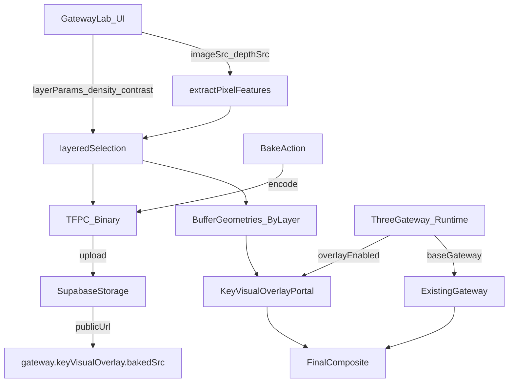

# Gateway Image→Particles (Layered + Bake)

### Goals

- **Generate an accurate 3D point cloud** from a key visual + depth map.
- Support **3 layers**: **Contours**, **Fill**, **Highlights** with independent density controls.
- Add **global controls** that feel “art-directable”: density, contrast/gamma, thresholds, depth remap.
- Support **Overlay mode** on the live gateway: keep existing ring/tunnel/attractor and add the image-based cloud on top.
- Add **Bake mode** so we can replace image+depth sampling at runtime with a precomputed dataset (while still allowing density/contrast tweaks at render time).

### Current foundation we’ll extend

- **Sampling**: [`lib/key-visual/sampler.ts`](lib/key-visual/sampler.ts) already computes luma/alpha/edgeWeight and supports depth maps.
- **Rendering**: [`components/hud/KeyVisualPortal.tsx`](components/hud/KeyVisualPortal.tsx) renders a PNG→particles cloud via custom shader.
- **Gateway**: [`components/hud/ThreeGateway.tsx`](components/hud/ThreeGateway.tsx) already supports `shape === "keyVisual"` (image-based portal).
- **Admin config**: Gateway settings are persisted via [`lib/contexts/ParticleConfigContext.tsx`](lib/contexts/ParticleConfigContext.tsx) → `/api/particles/config` → Supabase `particle_config`.
- **Shape Lab**: Gateway experimentation UI exists in [`app/shape-lab/GatewayLabTab.tsx`](app/shape-lab/GatewayLabTab.tsx).

### Design: data flow

### 1) Layered sampling + art-direction controls

**Files**: [`lib/key-visual/sampler.ts`](lib/key-visual/sampler.ts)

Add a new pipeline that extracts reusable per-pixel features once, then selects particles for each layer without re-reading the image unless sources change.

- **New types**
  - `PixelFeatures` (typed arrays): position (x,y), depth (zRaw), luma, alpha, edgeWeight, color.
  - `LayerKind = "contour" | "fill" | "highlight"`
  - `LayerSelectionConfig`:
    - `enabled`
    - `weight` (relative share of maxParticles)
    - `importanceMix` (edge vs luma bias defaults per layer)
    - `thresholds` (min alpha, min luma, min edge)
  - `ArtDirectionConfig`:
    - `contrast` (luma remap)
    - `gamma` (luma curve)
    - `depthScale`, `depthGamma`, `depthInvert`
    - `sampleStep`, `maxParticles`

- **Selection strategy (fast + controllable)**
  - Compute a per-layer **importance score** per pixel, e.g.
    - Contour: `importance = edgeWeight * 0.8 + luma * 0.2`
    - Fill: `importance = luma * 0.6 + (1-edgeWeight) * 0.4`
    - Highlight: `importance = luma * 0.9 + edgeWeight * 0.1`
  - Sort candidate indices per layer by importance (candidate count is bounded by sample resolution).
  - Allocate counts per layer: `layerCount = round(maxParticles * layerWeight / sumWeights)`.
  - Output **layered typed arrays** + store indices in importance order so we can later use **drawRange** for density sliders.

### 2) Bake format + loader

**Files**: new [`lib/key-visual/baked-pointcloud.ts`](lib/key-visual/baked-pointcloud.ts)

Add an efficient binary “TFPC” format:

- Header: magic `TFPC`, version, counts per layer, offsets.
- Payload: Float32 arrays for positions/colors and Float32 arrays for luma/alpha/edgeWeight/seed.
- Layer separation: store points grouped by layer so each layer can be drawn independently and density can be adjusted via drawRange.

Provide:

- `encodeTFPC(layersData) => ArrayBuffer`
- `decodeTFPC(arrayBuffer) => layersData`

### 3) New renderer: layered overlay portal

**Files**: new [`components/hud/KeyVisualOverlayPortal.tsx`](components/hud/KeyVisualOverlayPortal.tsx)

Create a dedicated component that supports:

- **Dynamic mode**: sample from image+depth map.
- **Baked mode**: fetch `bakedSrc` and decode TFPC.
- **Three layers** rendered as **three `<points>` draw calls**, each with:
  - independent `opacityMultiplier`, `sizeMultiplier`, `drawCount` (density)
  - color policy: contour/highlight lean accent; fill can use image colors or primary.

Render-time flexibility (works for both dynamic + baked):

- `density` per layer uses `geometry.setDrawRange(0, drawCount)`.
- `contrast/gamma/threshold` implemented as **shader uniforms** operating on stored per-point `aLuma/aEdgeWeight/aAlpha`.

### 4) Gateway runtime integration (overlay)

**Files**: [`components/hud/ThreeGateway.tsx`](components/hud/ThreeGateway.tsx), [`lib/particle-config.ts`](lib/particle-config.ts)

- Extend `GatewayConfig` with a new nested config, e.g. `keyVisualOverlay`:
  - `enabled`, `mode: "dynamic"|"baked"`
  - `imageSrc`, `depthMapSrc`, `bakedSrc`
  - `maxParticles`, `sampleStep`
  - `contrast`, `gamma`, `lumaThreshold`
  - `depthScale`, `depthGamma`, `depthInvert`
  - `layers: { contour, fill, highlight }` (weights + style)

- Update `DEFAULT_GATEWAY` and `mergeWithDefaults()` to provide safe defaults.
- Update `getMobileEffectiveConfig()` to apply mobile overrides (lower particle counts / optionally disable overlay by default).

- In `ThreeGateway`, keep existing portal rendering and **conditionally render** `<KeyVisualOverlayPortal />` inside the same gateway group so it inherits position/rotation/scale.

### 5) Particle Admin panel: new Gateway section

**Files**: [`components/admin/ParticleAdminPanel.tsx`](components/admin/ParticleAdminPanel.tsx)

Add a new section under Gateway:

- Toggle: **Enable Overlay Key Visual**
- Mode: **Dynamic / Baked**
- Inputs:
  - `imageSrc`, `depthMapSrc` (text inputs)
  - `bakedSrc` (read-only URL + “Clear”)
- Sliders:
  - global `maxParticles`, `sampleStep`
  - `contrast`, `gamma`
  - `depthScale`, `depthGamma`, `invert`
  - per-layer weights/densities
  - per-layer opacity/size multipliers

### 6) Bake & upload workflow

**Files**: new API route, plus UI hooks in Admin + ShapeLab

- Add API route similar to voices upload:
  - New: [`app/api/gateway-particles/upload/route.ts`](app/api/gateway-particles/upload/route.ts)
  - Admin-only via `isAuthorized()`
  - Uploads to a dedicated Supabase Storage bucket (e.g. `gateway-particles`)
  - Returns `{ publicUrl, path }`

- In **Gateway tab** (`app/shape-lab/GatewayLabTab.tsx`):
  - Button: **Bake → Download TFPC**
  - Button: **Bake → Upload** (admin only)
  - After upload, show the URL and allow “Preview baked vs dynamic”.

- In **Admin panel**:
  - Button: **Bake current overlay settings** (uses same client-side bake) then uploads and sets `gateway.keyVisualOverlay.bakedSrc`.

### 7) Shape Lab upgrades (density + layers)

**Files**: [`app/shape-lab/GatewayLabTab.tsx`](app/shape-lab/GatewayLabTab.tsx), [`app/shape-lab/shape-lab.css`](app/shape-lab/shape-lab.css)

Add:

- 3 layer controls (Contour/Fill/Highlight): enable + density + size + opacity.
- Global art-direction controls: contrast/gamma, luma threshold, depth gamma/invert.
- Optional debug toggles: show only one layer; show point count per layer.

### Acceptance criteria

- Gateway overlay renders on the live gateway without breaking existing portal shapes.
- Density controls update smoothly (via drawRange) without full resampling.
- Contrast/gamma/threshold affect visual output in real time.
- Bake produces a TFPC file that can be:
  - downloaded
  - uploaded to Supabase Storage
  - loaded back in baked mode producing the same look.

### Notes / defaults

- Keep sampling resolution capped (≤512px) and use `sampleStep` for performance.
- Default layer weights: Contour 0.45, Fill 0.45, Highlight 0.10.
- Default mobile override: reduce `maxParticles` and/or disable highlight layer.
