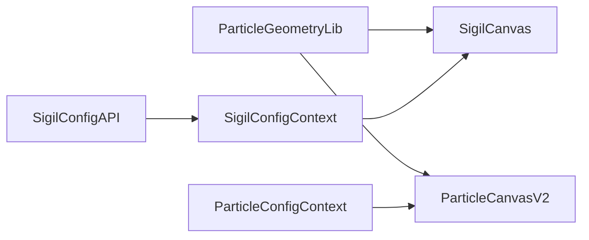

# Thoughtform Particle Shape Library Expansion

## Goals

- Build a **shared, reusable particle-geometry library** that powers:
  - Service-card sigils (`SigilCanvas`)
  - Landmark shapes and admin options (`ParticleCanvasV2` + `ParticleAdminPanel`)
- Add new **deeper, more topological, alien-looking shapes** (seeded randomness + math-driven structure) for services and landmarks.
- **Do not change**: hero gateway rendering (`ThreeGateway`) or the manifold terrain in `ParticleCanvasV2` (keep visuals and defaults intact). Also do not remove/alter any gateway shape options.
- **Remove** these sigil presets entirely: `star4`, `star5`, `star6`, `star8`, `spiral`, `concentricRings`.
- **Legacy handling**: hard-remove; if old values still appear (e.g. in Supabase), **fall back** to a default supported shape.

## Current State (what we’re building on)

- Sigil shapes are defined in [`lib/sigil-geometries.ts`](lib/sigil-geometries.ts) and rendered by [`components/hud/NavigationCockpitV2/SigilCanvas.tsx`](components/hud/NavigationCockpitV2/SigilCanvas.tsx).
- Background “landmarks” (including Lorenz/Halvorsen/Rössler) are generated inline inside [`components/hud/ParticleCanvasV2.tsx`](components/hud/ParticleCanvasV2.tsx).
- Gateway attractors/surfaces are generated inline inside [`components/hud/ThreeGateway.tsx`](components/hud/ThreeGateway.tsx) (out of scope — no changes).
- There are additional attractor implementations in [`components/canvas/AttractorCanvas.tsx`](components/canvas/AttractorCanvas.tsx) and [`components/canvas/GatewayCardinalCanvas.tsx`](components/canvas/GatewayCardinalCanvas.tsx).

## Proposed Architecture

Create a shared geometry kernel + registry:

- **New** `lib/particle-geometry/`
  - `rng.ts`: deterministic PRNG (seeded) + helpers
  - `math.ts`: vector ops, normalization, bounds, transforms
  - `integrators.ts`: Euler / RK2 or RK4 for flow-field / ODE sampling
  - `projection.ts`: 3D→2D projection helpers (optional rotation, depth→alpha/size)
  - `registry.ts`: a shape registry that maps `shapeId → {label, category, generator, defaultParams}`
  - `shapes/`: implementations (sigil + landmark reuse the same primitives)

### Data flow (shared library)

## “Thoughtform” Shape Grammar (new library shapes)

Introduce a small, curated family of shapes that _feel_ attractor-like/topological but are **not** direct named attractors:

- **FlowField shapes** (ODE/vector-field integration; seeded params): produces filamentary clouds and folds.
  - Example IDs: `tf_filamentField`, `tf_foldedFlow`, `tf_vortexBloom`
- **Knot / ribbon shapes** (parametric curves/surfaces + warp + thickness): strong topology, reads as 3D.
  - Example IDs: `tf_trefoilKnot`, `tf_twistedRibbon`
- **Constellation shapes** (cluster + graph edges sampled as points): structured “network” silhouettes.
  - Example IDs: `tf_constellationMesh`

Each shape should support:

- **seed** (deterministic randomness)
- **density/pointCount** (controls resolution)
- **depth profile** (how much 3D reads via alpha/size)

## Sigils: remove legacy + upgrade to depth

Files:

- [`lib/sigil-geometries.ts`](lib/sigil-geometries.ts)
- [`components/hud/NavigationCockpitV2/SigilCanvas.tsx`](components/hud/NavigationCockpitV2/SigilCanvas.tsx)
- [`components/hud/NavigationCockpitV2/SigilEditorPanel.tsx`](components/hud/NavigationCockpitV2/SigilEditorPanel.tsx)
- [`lib/contexts/SigilConfigContext.tsx`](lib/contexts/SigilConfigContext.tsx)
- [`app/api/sigils/config/route.ts`](app/api/sigils/config/route.ts)
- [`components/hud/NavigationCockpitV2/ServicesDeck.tsx`](components/hud/NavigationCockpitV2/ServicesDeck.tsx)
- [`supabase/schema.sql`](supabase/schema.sql)

Plan:

- Refactor `SigilCanvas` to optionally render **3D-origin points** (z-aware) using the shared projection helpers (similar depth treatment already used in `ThoughtformSigil`).
- Remove sigil presets: `star4`, `star5`, `star6`, `star8`, `spiral`, `concentricRings` from type unions, labels, and registry.
- Replace the “Strategies” default sigil shape (currently `spiral`) with a new Thoughtform shape (e.g. `tf_filamentField`).
- Implement **hard fallback** when loading/using a shape string not in the registry:
  - In API + context load path, coerce unknown shapes to the default.
  - In render path, treat unknown as default to avoid crashes.

## Landmarks: shared generators + new topology options

Files:

- [`components/hud/ParticleCanvasV2.tsx`](components/hud/ParticleCanvasV2.tsx)
- [`lib/particle-config.ts`](lib/particle-config.ts)
- [`components/admin/ParticleAdminPanel.tsx`](components/admin/ParticleAdminPanel.tsx)

Plan:

- Add a small set of new landmark shapes that use the Thoughtform grammar (e.g. `tf_continuumFold`, `tf_fractureSpire`) and expose them in the Particle Admin Panel (landmark shape selector).
- Keep **all existing landmark generators** and the **manifold terrain** logic unchanged to avoid any visual regressions.
- Use deterministic seeding for **new** Thoughtform landmark shapes only (existing landmark shapes retain current behavior unless you later request a consistency pass).

## Shape Lab (fast iteration + preview)

- Add a small internal preview page (reuse [`app/test/isometric-manifold/page.tsx`](app/test/isometric-manifold/page.tsx) patterns) to:
  - select a shape id
  - tweak a few params (seed, pointCount/density, depth)
  - render in both **Sigil mode** and **Landmark mode** for parity checks

## Documentation

- Update [`design/PARTICLE_SYSTEM.md`](design/PARTICLE_SYSTEM.md) with:
  - the new “shape registry” concept
  - how to add a new Thoughtform shape
  - seeding rules + performance guidelines

## Acceptance Criteria

- Service-card sigils no longer offer stars/spiral/concentricRings; any legacy values safely fall back.
- New sigils have **visible depth/topology** (not just flat 2D outlines) while respecting grid-snap + square-pixel aesthetic.
- Hero gateway (`ThreeGateway`) and the manifold terrain remain visually unchanged by this work (no regressions).
- A dev/test “Shape Lab” exists for rapidly iterating on new shapes.

## Implementation Todos

- `shape-kernel`: Create `lib/particle-geometry/` (rng, integrators, projection, registry)
- `sigil-upgrade`: Migrate `SigilCanvas` + remove legacy sigil shapes + update defaults + hard fallback
- `landmark-unify`: Add Thoughtform landmark shapes + admin options (keep existing landmarks + manifold terrain unchanged)
- `shape-lab`: Add internal preview page for rapid shape iteration
- `docs`: Update particle system docs to reflect the new registry/grammar
