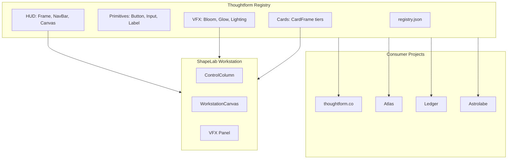

# Plan: Registry-First ShapeLab Redesign

This plan establishes a private Thoughtform component registry using shadcn's distribution architecture, then redesigns the ShapeLab as a unified workstation that consumes registry components.---

## Architecture Overview



---

## Phase 1: Registry Infrastructure

### 1.1 Create Registry Structure

Create a `registry/` directory at the project root with the shadcn registry schema:

```javascript
registry/
  registry.json           # Component manifest
  thoughtform/
    ui/                   # Primitive components
      button.tsx
      input.tsx
      label.tsx
      slider.tsx
    cards/                # CardFrame variants
      card-frame.tsx
      content-card.tsx
      terminal-card.tsx
      data-card.tsx
    hud/                  # HUD components
      hud-frame.tsx
      navigation-bar.tsx
    vfx/                  # VFX primitives
      glow-layer.tsx
      bloom-effect.tsx
```

### 1.2 Define Registry Schema

Create [registry/registry.json](registry/registry.json) following shadcn's schema with Thoughtform-specific metadata:

```json
{
  "$schema": "https://ui.shadcn.com/schema/registry.json",
  "name": "thoughtform",
  "homepage": "https://thoughtform.co",
  "items": [...]
}
```

### 1.3 Add Build Script

Add `registry:build` script to [package.json](package.json):

```json
{
  "scripts": {
    "registry:build": "shadcn build"
  },
  "dependencies": {
    "shadcn": "^3.0.0"
  }
}
```

---

## Phase 2: Migrate Core Components

### 2.1 Primitives (from [components/ui/](components/ui/))

Migrate with Thoughtform variants:| Component | Source | Registry Item |

|-----------|--------|---------------|

| Button | [Button.tsx](components/ui/Button.tsx) | `thoughtform/ui/button` |

| CardFrame | [CardFrame.tsx](components/ui/CardFrame.tsx) | `thoughtform/cards/card-frame` |

| Stack | [Stack.tsx](components/ui/Stack.tsx) | `thoughtform/ui/stack` |

### 2.2 HUD Components (from [components/hud/](components/hud/))

Migrate core layout components:| Component | Source | Registry Item |

|-----------|--------|---------------|

| HUDFrame | [HUDFrame.tsx](components/hud/HUDFrame.tsx) | `thoughtform/hud/hud-frame` |

| NavigationBar | [NavigationBar.tsx](components/hud/NavigationBar.tsx) | `thoughtform/hud/navigation-bar` |

| GlitchText | [GlitchText.tsx](components/hud/GlitchText.tsx) | `thoughtform/ui/glitch-text` |

### 2.3 Create VFX Primitives (NEW)

Extract from the Enhanced Mode work into reusable components:

- `GlowLayer` - Applies shadowBlur and additive blending
- `BloomEffect` - Post-processing bloom wrapper
- `PointLight` - Parametric light influence for 2D canvas

---

## Phase 3: ShapeLab Workstation Redesign

### 3.1 Layout Architecture

Refactor [app/shape-lab/page.tsx](app/shape-lab/page.tsx) into:

```javascript
ShapeLab (HUDFrame wrapper)
├── NavigationBar (visible)
├── ControlColumn (360px sidebar)
│   ├── CategoryPanel (Shape selection)
│   ├── GeometryPanel (Point count, seed)
│   ├── VFXPanel (Glow, bloom, lighting)
│   └── SavePanel (anchored bottom)
└── MainViewer (flexible)
    └── WorkstationCanvas (unified preview)
```

### 3.2 Unified WorkstationCanvas

Merge the three preview canvases into a single component with toggleable modes:

- **Rotation**: Toggle via floating button (replaces Landmark vs Sigil distinction)
- **Grid Snap**: Toggle computational aesthetic on/off
- **VFX Rendering**: Real-time application of GlowLayer, BloomEffect

### 3.3 VFX Panel Design

Replace scattered "Enhanced Mode" controls with a structured panel:

```javascript
VFX CONTROLS
├── Glow
│   ├── Intensity [slider 0-1]
│   └── Color [gold | verde | dawn]
├── Bloom
│   ├── Radius [slider 0-1]
│   └── Threshold [slider 0-1]
├── Lighting
│   ├── Point Light Position [X, Y sliders]
│   └── Ambient [slider 0-1]
└── Motion
    └── Trail Persistence [slider 0-1]
```

### 3.4 Styling with Brand Tokens

Update [app/shape-lab/shape-lab.css](app/shape-lab/shape-lab.css) to use CSS variables from [app/styles/variables.css](app/styles/variables.css):

- Replace hardcoded `#d4af37` with `var(--gold)`
- Use `var(--surface-1)` for panel backgrounds
- Apply `var(--dawn-08)` for borders

---

## File Changes Summary

| Action | File |

|--------|------|

| CREATE | `registry/registry.json` |

| CREATE | `registry/thoughtform/ui/button.tsx` |

| CREATE | `registry/thoughtform/ui/slider.tsx` |

| CREATE | `registry/thoughtform/cards/card-frame.tsx` |

| CREATE | `registry/thoughtform/hud/hud-frame.tsx` |

| CREATE | `registry/thoughtform/vfx/glow-layer.tsx` |

| UPDATE | `package.json` (add shadcn, registry:build) |

| REWRITE | `app/shape-lab/page.tsx` (workstation architecture) |

| UPDATE | `app/shape-lab/shape-lab.css` (brand tokens, grid layout) |---

## Success Criteria

1. **Registry**: `npm run registry:build` generates valid JSON files in `public/r/`
2. **ShapeLab**: Single unified canvas with rotation toggle, VFX panel in sidebar
3. **Brand Alignment**: All controls use Thoughtform color tokens (gold, dawn, verde)
