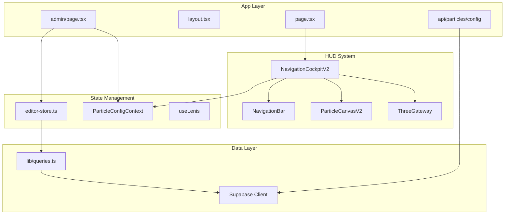

# Thoughtform.co Repository Analysis & Recommendations

## Context7 Skill Validation

**Status: Working**The Context7 API is functional. Test query for "nextjs" returned proper results:

- `/vercel/next.js` - Official Next.js docs (benchmark: 86.7%, 582K tokens)
- `/websites/nextjs` - Alternative source (benchmark: 80.3%, 652K tokens)

The skill is correctly configured in `.claude/skills/context7/SKILL.md` with proper YAML frontmatter and instructions. The `.cursorrules` file will auto-invoke Context7 for library documentation requests.---

## Architecture Overview



---

## Issues Found

### Critical

| Issue | Location | Impact ||-------|----------|--------|| No test coverage | Entire project | High - no safety net for regressions || 65 console.log statements | 13 files | Medium - performance/security in prod || Legacy code duplication | `legacy/` folder | Medium - maintenance overhead |

### Warnings (ESLint)

8 React hooks dependency warnings in:

- [`app/admin/page.tsx`](app/admin/page.tsx) - missing `bootSequence` dependency
- [`components/hud/NavigationCockpitV2/index.tsx`](components/hud/NavigationCockpitV2/index.tsx) - 2 warnings
- [`components/hud/NavigationCockpitV2/ConnectorLines.tsx`](components/hud/NavigationCockpitV2/ConnectorLines.tsx)
- [`components/hud/ThoughtformSigil.tsx`](components/hud/ThoughtformSigil.tsx)
- [`components/hud/ThreeGateway.tsx`](components/hud/ThreeGateway.tsx)
- [`lib/contexts/ParticleConfigContext.tsx`](lib/contexts/ParticleConfigContext.tsx)
- [`components/editor/elements/ImageElement.tsx`](components/editor/elements/ImageElement.tsx) - using `` not `<Image>`

---

## Recommendations

### Priority 1: Production Readiness

1. **Remove console.log statements** (13 files)

- Create a custom logger utility for dev-only logging
- Or use `eslint-plugin-no-console` to enforce

2. **Fix ESLint warnings** (8 warnings)

- Add missing dependencies or use `// eslint-disable-next-line` with comments

3. **Add environment-based logging**

```typescript
// lib/logger.ts
export const logger = {
  log: (...args: unknown[]) => {
    if (process.env.NODE_ENV === "development") console.log(...args);
  },
  error: console.error, // Always log errors
};
```

### Priority 2: Code Quality

4. **Delete or archive the `legacy/` folder**

- It's already excluded from TypeScript compilation
- Contains 40+ files duplicating active code
- Consider moving to a git branch for reference

5. **Split `globals.css` (2,800+ lines)**

- Extract into modular CSS files:
  - `hud.css` - HUD frame styles
  - `navigation.css` - NavigationCockpit styles
  - `bridge.css` - Bridge frame styles
  - `manifesto.css` - Manifesto terminal styles

6. **Split `NavigationCockpitV2/index.tsx` (1,109 lines)**

- Already has good hook extraction in `hooks/`
- Consider extracting more rendering logic into sub-components

### Priority 3: Testing

7. **Add testing infrastructure**

- Install Vitest (lighter than Jest for Next.js)
- Add Playwright for E2E testing of scroll animations

```bash
npm install -D vitest @vitejs/plugin-react jsdom @testing-library/react
npm install -D @playwright/test
```

8. **Priority test coverage:**

- `useScrollCapture` hook (critical for UX)
- `editor-store.ts` Zustand store
- RLS policy verification

### Priority 4: Performance

9. **Image optimization**

- Replace `` with `<Image>` from `next/image` in [`ImageElement.tsx`](components/editor/elements/ImageElement.tsx)

10. **Consider React Server Components**
    - Layout and static content sections could be RSC
    - Keep interactive HUD as client components

### Priority 5: Developer Experience

11. **Update fetch-docs.sh for Windows compatibility**
    - The bash script won't work on Windows PowerShell
    - Add a PowerShell version or Node.js script

```typescript
// .claude/skills/context7/fetch-docs.ts
const library = process.argv[2];
const tokens = process.argv[3] || 5000;
// Use fetch() to call Context7 API
```

12. **Add pre-commit hooks for lint**
    - Already have husky + lint-staged configured
    - Add `no-console` rule

---

## Summary Metrics

| Metric | Value | Status ||--------|-------|--------|| TypeScript Strict Mode | Enabled | Good || ESLint Warnings | 8 | Needs attention || Test Coverage | 0% | Critical || Console Statements | 65 | Remove for prod || Legacy Files | 40+ | Should delete || Main CSS File | 2,800+ lines | Consider splitting || Largest Component | 1,109 lines | Acceptable (well-organized) || Supabase RLS | Enabled | Good || Context7 Skill | Working | Good |---

## Recommended Order of Implementation

1. Fix ESLint warnings (quick win)
2. Add logger utility and remove console.logs
3. Delete legacy folder
