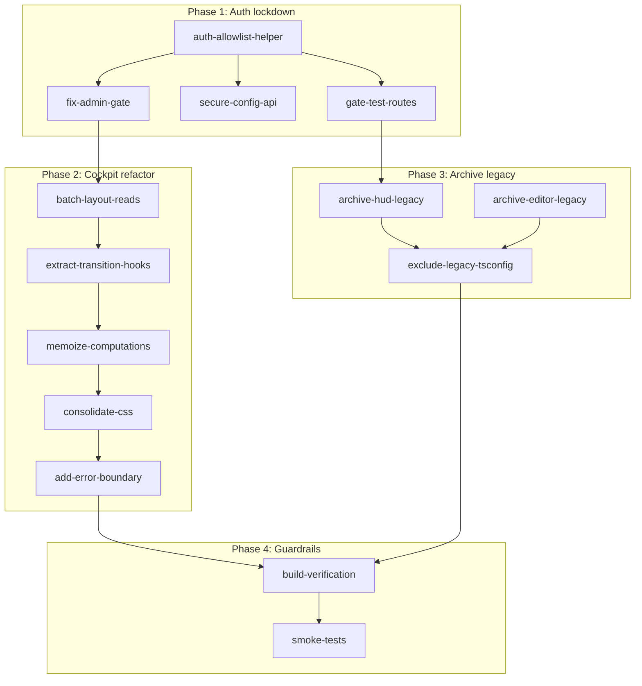

# Thoughtform.co robustness refactor (no-break, complete)

## Goals

- **Future-proof structure**: make the cockpit and particle system easier to evolve without fear.
- **No-break changes**: incremental, behavior-preserving refactors with guardrails.
- **Only-you access**: ensure admin UI, `/admin`, and `/test/*` are not usable by the public.
- **Performance and resilience**: batch layout reads, memoize computations, add error boundaries.

---

## Phase 1 — Lock down "only-you" access

### 1.1 Centralize allowlist logic

Create `lib/auth/allowed-user.ts`:

```ts
export const getAllowedEmail = () => process.env.NEXT_PUBLIC_ALLOWED_EMAIL?.toLowerCase() ?? null;
export const isAllowedUserEmail = (email?: string | null) =>
  !!email && email.toLowerCase() === getAllowedEmail();
```

Use this helper in:

- [components/admin/AdminGate.tsx](components/admin/AdminGate.tsx)
- [components/auth/LoginModal.tsx](components/auth/LoginModal.tsx)
- [app/admin/page.tsx](app/admin/page.tsx)
- [lib/auth.ts](lib/auth.ts) (`signInWithMagicLink`)

### 1.2 Fix `AdminGate` (remove network probe)

Replace the `HEAD /api/particles/config` check with:

```tsx
const { user } = useAuth();
const isAdmin = isAllowedUserEmail(user?.email);
```

This ensures the admin panel in the landing cockpit never renders for visitors.

### 1.3 Make API writes verifiably authorized

Update [lib/auth-server.ts](lib/auth-server.ts):

```ts
export async function isAuthorized(request: Request): Promise<boolean> {
  if (process.env.NODE_ENV === "development") return true;

  const authHeader = request.headers.get("Authorization");
  if (!authHeader?.startsWith("Bearer ")) return false;

  const token = authHeader.slice(7);
  const supabase = createServerClient();
  if (!supabase) return false;

  const {
    data: { user },
    error,
  } = await supabase.auth.getUser(token);
  if (error || !user) return false;

  return isAllowedUserEmail(user.email);
}
```

Update POST/DELETE in [app/api/particles/config/route.ts](app/api/particles/config/route.ts) to call `isAuthorized(request)`.Update client saves in [lib/contexts/ParticleConfigContext.tsx](lib/contexts/ParticleConfigContext.tsx) to include `Authorization: Bearer ${session.access_token}` header.

### 1.4 Gate `/test/*` routes

Create `app/test/layout.tsx`:

```tsx
"use client";
import { useAuth } from "@/components/auth/AuthProvider";
import { useRouter } from "next/navigation";
import { useEffect } from "react";
import { isAllowedUserEmail } from "@/lib/auth/allowed-user";

export default function TestLayout({ children }: { children: React.ReactNode }) {
  const { user, isLoading } = useAuth();
  const router = useRouter();

  useEffect(() => {
    if (!isLoading && !isAllowedUserEmail(user?.email)) {
      router.replace("/admin");
    }
  }, [user, isLoading, router]);

  if (isLoading || !isAllowedUserEmail(user?.email)) return null;
  return <>{children}</>;
}
```

---

## Phase 2 — Cockpit scroll/transition refactor (behavior-preserving)

### 2.1 Batch layout reads into a single hook

Create `lib/hooks/useScrollMetrics.ts`:

- Single rAF loop per frame
- Reads all element positions via refs passed in
- Exposes positions + scroll progress via return value
- Replaces multiple `scroll` event listeners in cockpit

### 2.2 Extract transition math into hooks

Create `components/hud/NavigationCockpitV2/hooks/`:

- `useHeroToDefTransition.ts` — returns memoized `tHeroToDef`, derived styles
- `useDefToManifestoTransition.ts` — returns memoized `tDefToManifesto`, derived styles
- `useManifestoProgress.ts` — current manifesto rAF logic moved out

### 2.3 Memoize heavy computations

Wrap transition values in `useMemo([scrollProgress])`:

```ts
const tHeroToDef = useMemo(() => {
  const rawT = Math.max(0, Math.min(1, (scrollProgress - HERO_END) / (DEF_START - HERO_END)));
  return easeInOutCubic(rawT);
}, [scrollProgress]);
```

### 2.4 Consolidate CSS (remove styled-jsx)

Move contents of [components/hud/NavigationCockpitV2/styles.ts](components/hud/NavigationCockpitV2/styles.ts) into [app/globals.css](app/globals.css) (or a CSS module).Delete the `<style jsx global>{cockpitStyles}</style>` from `NavigationCockpitInner`.

### 2.5 Add error boundary for WebGL/canvas

Create `components/hud/CanvasErrorBoundary.tsx`:

```tsx
class CanvasErrorBoundary extends Component<{ children: ReactNode }, { hasError: boolean }> {
  state = { hasError: false };
  static getDerivedStateFromError() {
    return { hasError: true };
  }
  render() {
    if (this.state.hasError) {
      return <div style={{ background: "#0a0908", width: "100%", height: "100%" }} />;
    }
    return this.props.children;
  }
}
```

Wrap `<ParticleCanvasV2>` and `<ThreeGateway>` in `NavigationCockpitV2`.---

## Phase 3 — Archive legacy code

### 3.1 Move unused HUD components to `legacy/`

Verified unused by grep:

- [components/hud/NavigationCockpit.tsx](components/hud/NavigationCockpit.tsx)
- [components/hud/ParticleCanvas.tsx](components/hud/ParticleCanvas.tsx)

Move to `legacy/hud/` and remove from [components/hud/index.ts](components/hud/index.ts).

### 3.2 Archive page-editor system

The following are not routed/used by `app/` currently:

- `components/editor/**`
- `components/sections/**` (except `CelestialManifesto` used by `/test/celestial-manifesto`)
- `components/canvas/**`
- `store/editor-store.ts`
- `lib/queries.ts`
- `lib/layout-engine.ts`
- `lib/hooks/useKeyboardShortcuts.ts`

Move to `legacy/editor/` as a block.Update [components/index.ts](components/index.ts) to remove these exports.

### 3.3 Exclude `legacy/` from TypeScript

Add to [tsconfig.json](tsconfig.json):

```json
"exclude": ["node_modules", "legacy"]
```

---

## Phase 4 — Guardrails

### 4.1 Build verification

Run after each phase:

```bash
npm run lint && npm run build
```

### 4.2 Optional smoke tests (Playwright)

- Home page renders without console errors
- `/test/*` redirects to `/admin` when logged out
- After login as allowed email, admin panel toggle is visible

---

## Dependency graph



---

## Files changed summary

| Phase | Files created | Files modified | Files moved |

|-------|---------------|----------------|-------------|

| 1 | `lib/auth/allowed-user.ts`, `app/test/layout.tsx` | `AdminGate.tsx`, `auth-server.ts`, `route.ts`, `ParticleConfigContext.tsx`, `LoginModal.tsx`, `app/admin/page.tsx`, `lib/auth.ts` | — |

| 2 | `useScrollMetrics.ts`, 3 transition hooks, `CanvasErrorBoundary.tsx` | `NavigationCockpitV2/index.tsx`, `globals.css` | — |

| 3 | — | `components/hud/index.ts`, `components/index.ts`, `tsconfig.json` | 2 HUD files, editor block to `legacy/` |
