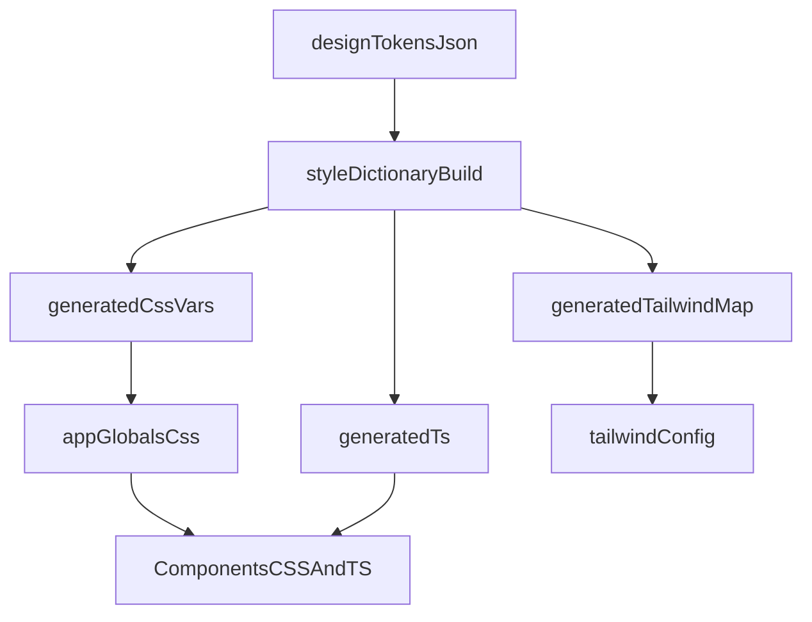

# Semantic Token System + Encoded Semantics Upgrade

## Goals

- Preserve current look/feel (HUD/grid/cards/particles) while making the system **more “semantic” and portable**.
- Make tokens **JSON-first** (single source of truth) and **generate**:
- CSS custom properties used by the site
- TypeScript exports/types for runtime + authoring safety
- Tailwind mappings (so Tailwind + CSS vars don’t drift)
- Encode higher-level semantics you selected:
- **Component variants** (Frame/Terminal/Card/HUD as contract-driven primitives)
- **Motion/scroll semantics** (named phases + progress channels)
- **Particle semantics** (performance tiers + brand-aligned presets)

## Architecture (token pipeline)

## Token model to adopt (layers)

- **Reference tokens** (raw values): base colors (void/dawn/gold), spacing scale, typography scale, radii, z-index levels.
- **Semantic tokens** (meaning): `color.text.primary`, `color.border.frame`, `surface.hud`, `motion.duration.fast`, `motion.ease.standard`, `scroll.phase.manifestoStart`.
- **Component tokens** (contracts): `component.frame.borderWidth`, `component.terminal.scanlineOpacity`, `component.hud.railWidth`, `component.card.paddingX`.

## Step-by-step plan (non-breaking)

### 1) Introduce JSON token source-of-truth

- Create [`design-tokens/`](design-tokens/) with clear separation:
- `reference.tokens.json`
- `semantic.tokens.json`
- `components.tokens.json`
- `motion.tokens.json`
- `particles.tokens.json`
- Keep names compatible with your existing mental model (void/dawn/gold), but **publish semantic names** as the primary API.

### 2) Add a token build pipeline (codegen)

- Add Style Dictionary (and optionally Tokens Studio transforms) and a build script:
- Generate `app/styles/tokens.generated.css` (CSS vars)
- Generate `lib/tokens/generated.ts` (typed token object + string literal unions)
- Generate a Tailwind theme mapping file (or a small `tailwind` preset) that points to CSS vars
- Add scripts in [`package.json`](package.json):
- `tokens:build`, `tokens:watch`

### 3) Add a compatibility layer so nothing breaks

- Keep [`app/styles/variables.css`](app/styles/variables.css) as **aliases** initially:
- Existing vars like `--gold`, `--dawn`, `--hud-padding` become `var(--tf-...)` aliases.
- This prevents a big-bang rename and keeps existing CSS stable.
- Update [`app/globals.css`](app/globals.css) to import `tokens.generated.css` before the rest of the CSS modules.

### 4) Encode “component variants” as first-class primitives

- Define a minimal primitive set (re-usable across the site):
- `Frame` (cards + terminals + bridge frames)
- `Terminal` (header/body/scanlines/cursor)
- `HudChrome` (rails/corners)
- `NavBar` (desktop/mobile variants)
- Add **variant semantics** via data-attributes/classes rather than ad-hoc styling:
- `data-variant="hud" | "terminal" | "card" | "bridge"`
- `data-density="sparse" | "standard" | "dense"`
- `data-energy="calm" | "active"`
- Back these variants with **component tokens** so the meaning stays consistent.

### 5) Encode motion/scroll semantics as named phases + channels

- Create a small motion module (e.g. `lib/motion/`) that defines:
- Named scroll phases (hero/definition/manifesto/services/contact) as constants
- Shared easing + timing tokens (referencing generated TS tokens)
- In the cockpit, publish **CSS variable channels** instead of bespoke inline styles wherever safe:
- Example channels: `--p-heroToDefinition`, `--p-manifestoReveal`, `--p-servicesIntro`
- CSS consumes those channels to compute transforms/opacity

### 6) Encode particle semantics (performance tiers + brand-aligned presets)

- Define **performance tiers** as tokens:
- `particles.profile.lowPower` / `standard` / `highFidelity`
- Control DPR, particle count caps, expensive effects toggles
- Define **semantic presets** that map to the brand anchors you care about:
- `particles.preset.navigation` (clean, stable, legible)
- `particles.preset.signal` (more shimmer/noise, higher “presence”)
- `particles.preset.instrument` (more structured, grid-aligned)
- Wire preset selection through your existing Supabase config pathway (so ops can tune without redeploys), while keeping **token defaults** as fallback.

### 7) Document the semantic system in Sentinel

- Add a small “Token Spec” doc under [`sentinel/`](sentinel/):
- Token layers + naming conventions
- Variant contracts + when to use each
- Motion channels + phase definitions
- Particle profiles + budgets
- Use the Thoughtform MCP to validate alignment (drift check) for each primitive/preset.

## Acceptance criteria

- No visual regressions on key pages (use your Playwright visual suite).
- Tokens are authored in JSON, generated into CSS/TS/Tailwind.
- Component styling uses variants + tokens instead of one-off constants.
