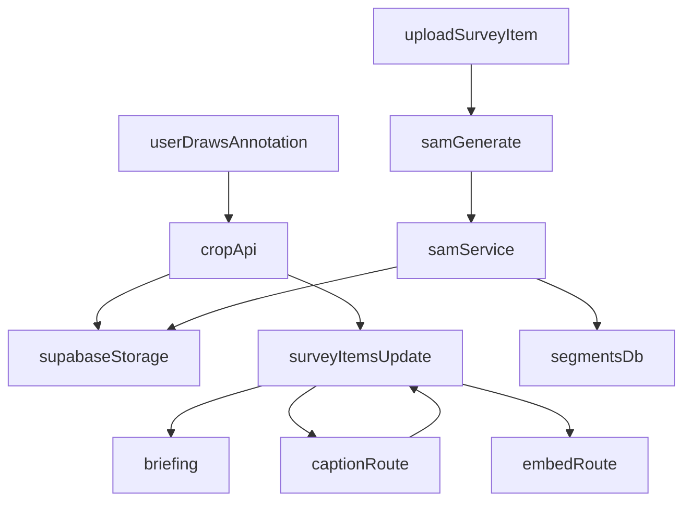

# Survey Annotations + Crops + SAM Foundation

## What we’re shipping first (based on your choices)

- **Survey annotation UX overhaul** in the pop-up (overlay) and right inspector
- **Per-annotation crop screenshots** saved to Supabase + visible as thumbnails
- **Briefing + embedding pipeline** updated to leverage those crops (via image-aware briefing + text summaries for embeddings)
- **Segment Anything (SAM) foundation** via an external **Python service** called from Next.js + DB/storage schema (full multi-layer overlay UI deferred)

## Current baseline (so we change the right places)

- The Survey “pop-up” is the overlay in [`app/astrogation/_components/SurveyView.tsx`](app/astrogation/_components/SurveyView.tsx).
- Annotations are rectangles stored as JSON on `survey_items.annotations` (`SurveyAnnotation` in [`app/astrogation/_components/types.ts`](app/astrogation/_components/types.ts)), and edited today via the right inspector (`SurveyInspectorPanel`).
- The “delete reference” visual style is the `ConfirmDialog` ([`app/astrogation/_components/ConfirmDialog.tsx`](app/astrogation/_components/ConfirmDialog.tsx) + `.confirm-dialog` CSS in [`app/astrogation/astrogation.css`](app/astrogation/astrogation.css)).

## Phase 1 — Annotation UX (overlay + inspector) + zoom

### Overlay pop-up (Survey detail overlay)

Changes in:

- [`app/astrogation/_components/SurveyView.tsx`](app/astrogation/_components/SurveyView.tsx)
- [`app/astrogation/_components/AnnotationBox.tsx`](app/astrogation/_components/AnnotationBox.tsx)
- [`app/astrogation/astrogation.css`](app/astrogation/astrogation.css)

Deliverables:

- Add a **subtle annotation number** at the **top-right outside** the dashed rectangle.
- Clicking that number opens an **annotation popover** styled like the `ConfirmDialog` “landscape frame” (no garbled tooltip).
- Popover behavior:
- **Delete button** in the top-right inside the frame (trash icon/button, not “×”).
- Clicking the text toggles **edit mode**; the top-right action becomes **Save** while editing.
- Click outside / Esc closes popover (number click toggles open/close).
- Add a **top-right overlay toolbar** in the pop-up:
- **Eye icon** toggles overlays (initially: annotations; later: segmentation layers too).
- Zoom readout optional (e.g., 100%).
- Add **scroll-to-zoom** (mouse wheel) in the pop-up.
- Refactor draw/resize math to use **`getBoundingClientRect()`** dimensions so it stays correct under CSS transforms.
- Clamp zoom (e.g., 1.0 → 3.0) and keep transform origin sensible (start centered; cursor-origin later if needed).

### Right inspector annotations list

Changes in:

- [`app/astrogation/_components/SurveyInspectorPanel.tsx`](app/astrogation/_components/SurveyInspectorPanel.tsx)
- [`app/astrogation/astrogation.css`](app/astrogation/astrogation.css)

Deliverables:

- Replace the “×” with a **Delete button** in the **top-right** of each annotation row.
- When the user clicks the note to edit, that same spot becomes a **Save** button (mirrors overlay behavior).
- Add a **bottom-right thumbnail icon** for the crop screenshot (opens a small preview / new tab to the signed URL).

## Phase 2 — Annotation crop screenshots saved to Supabase

### Data shape (no DB migration needed)

Because `survey_items.annotations` is JSON, we’ll extend each annotation object with optional fields (stored inside JSON):

- `crop_path` (storage path)
- `crop_mime`, `crop_width`, `crop_height`
- Optional: `crop_caption` (short textual description for embeddings)

Update types in:

- [`app/astrogation/_components/types.ts`](app/astrogation/_components/types.ts)

### API: generate + store crop

Add route:

- [`app/api/survey/annotations/crop/route.ts`](app/api/survey/annotations/crop/route.ts)

Behavior:

- Input: `itemId`, `annotationId`, `{x,y,width,height}` in %.
- Server downloads the source image (via Supabase signed URL), **crops** it, uploads to `survey-media` under a deterministic path like:
- `annotations/{itemId}/{annotationId}.png`
- Updates the matching annotation JSON entry on `survey_items.annotations` with `crop_path` + metadata.

Implementation notes:

- Use **`sharp`** in the Next.js node runtime for reliable cropping (keeps crop independent of the SAM service).
- Trigger crop generation:
- On annotation create
- After resize ends (debounced)

### Signed URLs for crops

Update:

- `[app/api/survey/items/[id]/route.ts](app/api/survey/items/[id]/route.ts)`

So the full-item payload includes **ephemeral `crop_url`** fields injected into `annotations` when `crop_path` exists.

## Phase 3 — Use crops in Briefing + Embeddings

### Briefing (multimodal)

Update:

- [`app/api/survey/briefing/route.ts`](app/api/survey/briefing/route.ts)

Changes:

- Include up to **N** annotation crops (default N=3, prioritizing the most recently created or those with notes).
- Provide a short textual preface before each crop: “Annotation #i: note…” so Claude knows what it’s looking at.
- Update the `SYSTEM_PROMPT` to explicitly instruct using the crops as “focused inspiration targets”.

### Embeddings (text-only)

Update:

- [`app/api/survey/embed/route.ts`](app/api/survey/embed/route.ts)

Changes:

- Extend `buildFullEmbeddingText()` to include:
- annotation notes (already)
- `crop_caption` (if available) and/or stable labels

To avoid making embeddings depend on extra LLM calls inside `/embed`, we’ll generate `crop_caption` via a separate action (next bullet).

### Crop caption generation (for embeddings)

Add route:

- [`app/api/survey/annotations/caption/route.ts`](app/api/survey/annotations/caption/route.ts)

Behavior:

- Downloads the crop image and asks Claude for:
- a 1–2 sentence description of the crop
- optional label suggestions
- Stores the caption back into the annotation JSON (`crop_caption`).

## Phase 4 — Segment Anything (SAM) foundation (Python service + DB)

### Python SAM service (external)

Add a new service folder:

- [`services/sam-segmenter/`](services/sam-segmenter/)

Deliverables:

- FastAPI (or similar) endpoint: `POST /segment`
- Input: `{ image_url, params }`
- Output: segments with `{bbox, mask_rle_or_path, scores}`
- A `README.md` + `requirements.txt` (or `pyproject.toml`) + `Dockerfile` for running locally.

Reference: [Segment Anything repository](https://github.com/facebookresearch/segment-anything)

### DB schema for segments

Add migration:

- [`supabase/migrations/202601xx_survey_segments.sql`](supabase/migrations/202601xx_survey_segments.sql)

Proposed tables:

- `survey_segments` (many segments per `survey_item_id`)
- bbox, scores, optional label fields, storage paths for mask/crop previews
- RLS enforced by `exists(select 1 from survey_items where id=survey_item_id and user_id=auth.uid())`

### Next.js API to run segmentation

Add route:

- [`app/api/survey/segments/generate/route.ts`](app/api/survey/segments/generate/route.ts)

Behavior:

- Creates a short-lived signed URL for `survey_items.image_path`
- Calls the Python SAM service (`SEGMENTER_URL` env)
- Stores results into `survey_segments` + uploads any previews to storage

## Later (deferred, but enabled by the foundation)

- Segmentation overlay UI (layers, hover labels, inline edit) with an **eye toggle** (already added in Phase 1).
- Foundry left-panel “layer stack” to browse Survey items and (later) segments without tab switching.
- Optional: segment-level embeddings (careful to avoid noise; likely gated to user-selected segments only).

## Data flow (high level)

