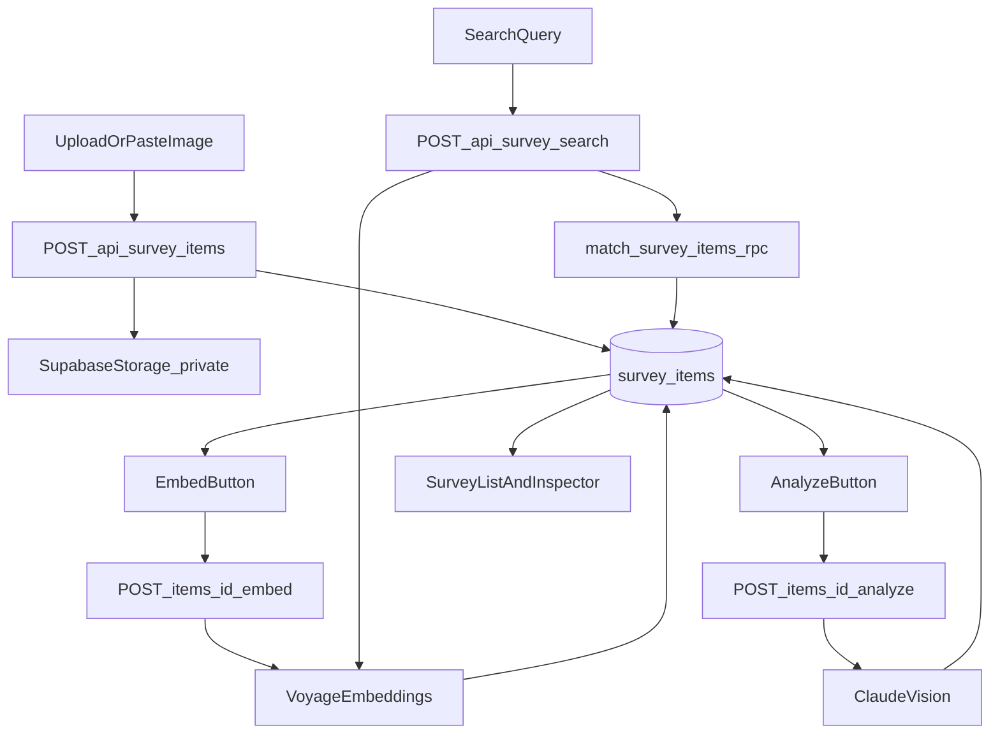

# Astrogation Survey Tab (Semantic Inspiration System)

## Goal

Create a new **third workspace tab** in Astrogation called **Survey** that lets you:

- Upload / paste screenshots into a **private** Supabase Storage bucket
- Organize them using the **same category + component tree** as the left panel (your atomic/brand system)
- Inspect/edit structured fields on the right, plus an **AI chat** tab
- Generate **Claude analysis** + **Voyage embeddings** so you can do **semantic retrieval** and build an evolving “design memory”

## Scope (MVP)

- **Media**: images only (png/jpg/webp/gif). (Video/code can be Phase 2.)
- **Storage**: Supabase Storage bucket **private** + signed URLs via API.
- **AI**: Claude for vision+structure extraction; Voyage for embeddings; pgvector search.

## Existing Architecture We’ll Extend

- **Tabs** are driven by `activeTab` (`WorkspaceTab`) and rendered in `CenterPanel`.
- **Left panel** is a category→component tree (`CatalogPanel`) built from `app/astrogation/catalog.ts`.
- **Right panel** currently switches between `DialsPanel` (Foundry) and `SpecPanel` (Vault).
- **Admin/auth** infrastructure exists (`AdminGate`, `isAuthorized`, server-side Supabase client).

Key entry points:

- UI: [app/astrogation/page.tsx](app/astrogation/page.tsx), [app/astrogation/\_components/CenterPanel.tsx](app/astrogation/_components/CenterPanel.tsx)
- Auth/DB: [lib/supabase.ts](lib/supabase.ts), [lib/auth-server.ts](lib/auth-server.ts)
- Catalog model: [app/astrogation/catalog.ts](app/astrogation/catalog.ts)

## Data Model (Supabase)

We’ll add a new migration:

- `supabase/migrations/YYYYMMDD_survey_items.sql`

### Table: `survey_items`

Stores the reference and its evolving interpretation.

- `id uuid pk`
- `category_id text` (must match `CATEGORIES[].id`)
- `component_key text` (optional; matches `ComponentDef.id` like `hud-frame`)
- `title text` (optional)
- `notes text` (your subjective commentary)
- `sources jsonb` (array of `{ label, url, note }` for now; normalize later if needed)
- `tags text[]`
- `image_path text not null` (Storage path)
- `image_mime text`
- `image_width int`, `image_height int` (optional)
- `analysis jsonb` (Claude output; versioned)
- `embedding vector(N)` + `embedding_model text` + `embedding_text text` (Voyage)
- `created_at`, `updated_at`

### Vector search RPC

Add a Postgres function (RPC) like `match_survey_items(...)` to return top-K similar items with a similarity score, with optional `category_id/component_key` filters.

### Storage bucket: `survey-media` (private)

- Bucket created in Supabase dashboard: `survey-media`, `public=false`
- Policies: allow **authenticated** select/insert (API uses service role, but policies keep the project sane)
- API will generate **signed URLs** for list/detail display.

## Backend API (Next.js Route Handlers)

Create new route handlers mirroring existing admin patterns (see `app/api/ui-component-presets/route.ts`). All routes use:

- `isAuthorized(request)`
- `createServerClient()`

Proposed endpoints:

- `GET /api/survey/items?category_id=&component_key=&q=`
- Returns items (optionally filtered), including **signed thumbnail URL** (or signed image URL).
- `POST /api/survey/items` (multipart/form-data)
- Upload image to Storage, insert row, return created item.
- `PATCH /api/survey/items/[id]`
- Update fields (category/component/title/notes/sources/tags).
- `DELETE /api/survey/items/[id]`
- Delete row + Storage object.
- `POST /api/survey/items/[id]/analyze`
- Calls Claude vision, writes `analysis` + suggested `category_id/component_key/tags` (without overwriting user edits unless requested).
- `POST /api/survey/items/[id]/embed`
- Builds `embedding_text` from the item’s fields + analysis summary, calls Voyage, stores embedding.
- `POST /api/survey/search`
- Voyage-embed query string → call `match_survey_items` RPC → return ranked items.
- `POST /api/survey/chat`
- Chat with Claude using selected item as context (+ optional similar items retrieved via vectors).

## Frontend (Astrogation UI)

### 1) Add the third tab

Update:

- [app/astrogation/\_components/types.ts](app/astrogation/_components/types.ts): extend `WorkspaceTab` to include `"survey"`.
- [app/astrogation/\_components/CenterPanel.tsx](app/astrogation/_components/CenterPanel.tsx): add a new tab button + render `SurveyView` when active.

### 2) Left panel for Survey

Add a new panel:

- `app/astrogation/_components/SurveyCatalogPanel.tsx`

Behavior:

- Reuse the **same Tree** + `CATEGORIES` + `getComponentsByCategory`.
- Selecting a **category** filters Survey list by `category_id`.
- Selecting a **component leaf** sets `component_key` (and implicitly category).

### 3) Center panel Survey view

Add:

- `app/astrogation/_components/SurveyView.tsx`

Behavior:

- Top “intake” zone: **click-to-upload + drag/drop + paste** (clipboard image)
- List view: aligned rows with thumbnail, title, component_key, tags, created_at
- Optional “Sort”: **Recent** (chronological) vs **Similar** (semantic to current selection or a query)
- Uses `Ctrl+wheel` to zoom the preview canvas; normal wheel scrolls the list.

### 4) Right panel Survey inspector

Add:

- `app/astrogation/_components/SurveyInspectorPanel.tsx`

Two tabs:

- **FIELDS**: editable metadata + buttons:
- “Analyze (Claude)”
- “Embed (Voyage)”
- “Save”
- **CHAT**: shadcn AI chatbot-style UI adapted to Astrogation HUD styling.

### 5) State wiring

Update:

- [app/astrogation/\_state/astrogationReducer.ts](app/astrogation/_state/astrogationReducer.ts)
- [app/astrogation/page.tsx](app/astrogation/page.tsx)

Add Survey-specific state:

- `surveyCategoryId`, `surveyComponentKey`, `surveySelectedItemId`

Render logic:

- If `activeTab === "survey"`:
- Left: `SurveyCatalogPanel`
- Center: `CenterPanel` → `SurveyView`
- Right: `SurveyInspectorPanel`
- Else: current behavior

### 6) Auth header consistency

Survey fetches will include `Authorization: Bearer <session.access_token>` (pattern already used elsewhere).

While we’re here, we’ll also patch [app/astrogation/\_hooks/usePresets.ts](app/astrogation/_hooks/usePresets.ts) to include Authorization so presets work once auth is re-enabled.

## AI Prompts (High Signal, Iterative)

### Claude analysis output (JSON)

We’ll prompt Claude to return structured JSON (no prose) including:

- `suggestedCategoryId`
- `suggestedComponentKey`
- `tags[]`
- `layout`: inferred grid/spacing heuristics (e.g. columns, gutters, baseline rhythm guesses)
- `informationArchitecture`: what modules exist and how hierarchy is expressed
- `interactionPatterns`: HUD affordances, reticles, frames, tabs, etc.
- `transferNotes`: “what to borrow” guidance constrained by Thoughtform tokens and HUD leitmotif

We’ll keep a “re-run” button and store the last N analyses in `analysis.history[]` so you can iterate without losing earlier interpretations.

### Voyage embeddings

We’ll embed a deterministic `embedding_text` string built from:

- `title`, `notes`, `tags`, `sources`
- Claude `transferNotes` + short summary
- `category_id/component_key`

Vector dimension `N` will be chosen to match the configured Voyage model (we’ll set a default model + dimension pair and keep it centralized so migration+code agree).

## Data Flow (Mermaid)

## Env Vars / Config

Add to `.env.local`:

- `SUPABASE_SERVICE_ROLE_KEY=...`
- `NEXT_PUBLIC_ALLOWED_EMAIL=...`
- `ANTHROPIC_API_KEY=...`
- `VOYAGE_API_KEY=...`
- (optional) `VOYAGE_EMBED_MODEL=...`

## Follow-ups (Phase 2+)

- Video support + automatic thumbnail extraction (reuse pattern from voices upload)
- “Screenshot → React” experiments (separate pipeline; store generated code blocks linked to an item)
- Normalized `survey_sources` table + richer provenance
