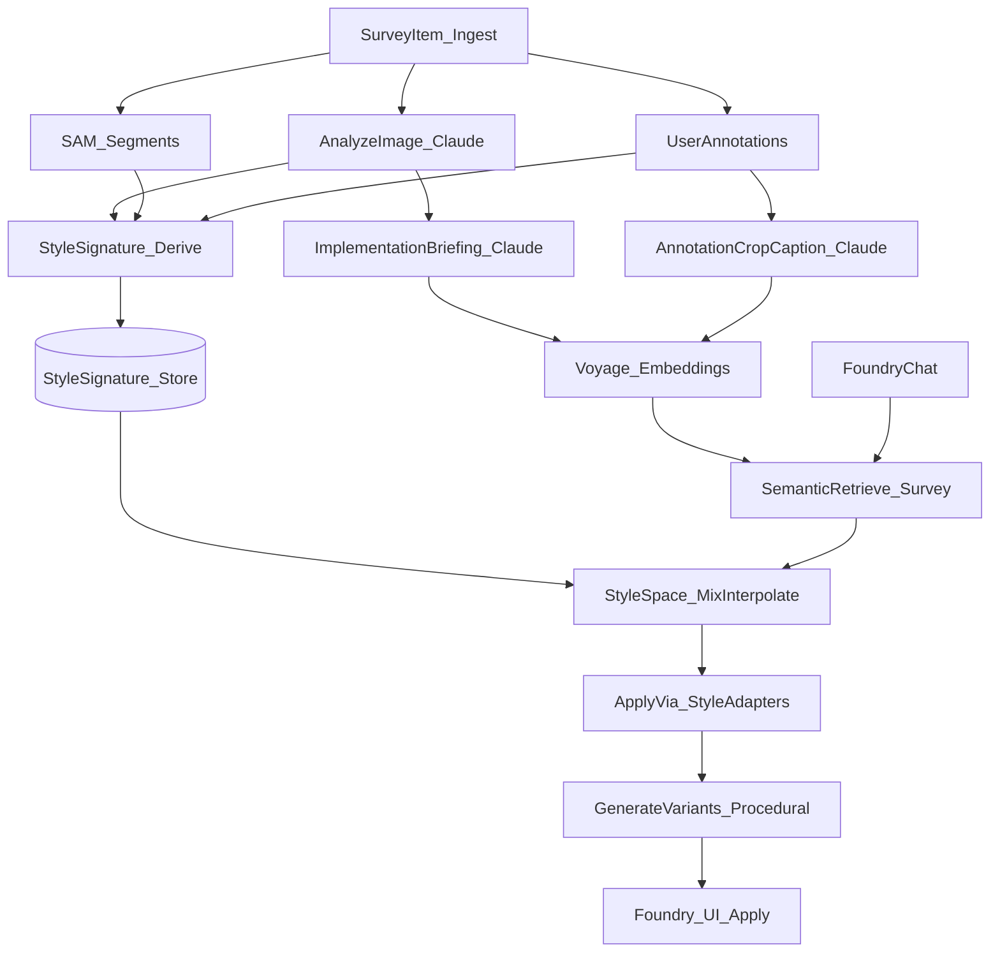

# Survey→Foundry StyleSpace (Mosaic-inspired)

This plan implements an “ambient infusion” pipeline that turns your curated Survey work (uploads, notes, annotations, SAM segments) into **interpretable style vectors** that can be **mixed/interpolated** and **applied procedurally** in Foundry—aligned with [Mosaic](https://githubnext.com/projects/mosaic/) and the “deconstruct media → feature palettes → transform” framing in [AI Interfaces](https://origamiparty.substack.com/p/ai-interfaces) and [Shapeshifting media & collaboration](https://origamiparty.substack.com/p/shapeshifting-media-and-collaboration).

## Goals & constraints

- **No new sliders/panels**: the user experience stays “chat → apply”.
- **Brand projection by default**: source colors are treated as _roles_ (accent/background/etc.) but mapped to Thoughtform tokens (`--void`, `--dawn`, `--gold`, opacity ladder).
- **Beyond borders**: translate references into **motifs + layout rhythm + texture cues + hierarchy** that can drive variants.
- **Procedural variation**: once the style vector exists, generate multiple coherent variants **without extra LLM calls** (small parameter sampling around a style point).

## Conceptual architecture

## Phase 1 — Create the StyleSignature + StyleVector data model

- **Add Supabase tables** (new migration):
- `survey_style_signatures`
  - `survey_item_id` (FK)
  - `style_params` (`jsonb`) — interpretable features
  - `style_vector` (`vector`) — derived numeric vector for similarity/mixing
  - `version`, `generated_at`, `source_hash`
- **RLS policies** mirroring `survey_segments` (owner-only).

Files:

- Add: `supabase/migrations/YYYYMMDD_survey_style_signatures.sql`
- Reuse patterns from: `supabase/migrations/20260105_survey_segments.sql`

## Phase 2 — “Conversion phase”: derive StyleSignatures from references

Implement a server route that converts a Survey item into a **feature palette** + **brand-projected style params**.

- **New API route**: `app/api/survey/style/derive/route.ts`
- Input: `itemId`
- Load:
  - `survey_items` (analysis, briefing, notes, tags)
  - `annotations` (notes + crop captions)
  - `survey_segments` (ai_label/ai_description + crop/mask paths)
- Ask Claude for **structured JSON**:
  - `motifs`: bracket types, reticles, tick marks, grids, scanlines, label styles
  - `geometry`: sharpness, chamfer prevalence, corner language, line weight bands
  - `composition`: density, spacing rhythm, layering depth, panel hierarchy
  - `texture`: noise/scanlines/glow strength (as scalars)
  - `color_roles`: `background/surface/border/accent/text` (roles only)
  - `typography_roles`: display/body/mono treatments
- **Project to Thoughtform**:
  - Convert `color_roles` → actual token assignments (always brand tokens)
- Persist to `survey_style_signatures`.

## Phase 3 — StyleSpace: mixing, interpolation, and fast variant generation

Create a small “style engine” that:

- Converts `style_params` → `style_vector` deterministically (interpretable dimensions).
- Mixes multiple references into a single **style point** (weighted by similarity + recency).
- Generates N variants by sampling within constrained ranges of key dimensions (density, ornamentation, line weight, texture).

Files:

- Add: `app/astrogation/_foundry/styleSpace.ts`
- `toStyleVector(styleParams)`, `mixStyleVectors(refs)`, `sampleVariants(styleProfile, seed)`

## Phase 4 — Foundry integration (ambient, no extra UI)

Upgrade Foundry chat to **use StyleSignatures** rather than only “briefing text”.

- Update `app/api/foundry/chat/route.ts`:
- After Survey retrieval, fetch `survey_style_signatures` for the top refs.
- Append a concise **StyleSignature summary** to the system prompt (motifs + geometry + rhythm + token roles).
- Produce variants primarily via the deterministic StyleSpace sampling (minimize LLM dependence).
- Add “apply layer” that can influence more than borders **without adding sliders**:
- Extend the patch protocol to optionally include `setStyleVars` (CSS variable overrides applied at the preview wrapper level), in addition to `setProps`/`setFrame`.
- This lets the assistant apply scanlines/glow/density/texture via CSS vars (single apply action).

Files:

- Update: `app/api/foundry/chat/route.ts`
- Update: `app/astrogation/_components/FoundryAssistantDock.tsx` (support applying `setStyleVars`)
- Update: Foundry state/types (where `StyleConfig` lives) to store `styleVars` overrides (likely in `app/astrogation/_components/types.ts` + reducer).

## Phase 5 — True “shape transfer” (optional but aligned with your radar example)

To preserve _geometry_ (not color), we’ll add a “motif extraction” step from masks:

- Vectorize segment masks into simplified SVG paths (contours → polylines → bezier approximation).
- Store “motif primitives” (SVG + metadata) and let StyleSpace reference them.
- Use motifs as ornamental layers (reticle rings, ticks, corner marks) in frames/cards.

This is the step that makes “green radar screenshot” → “on-brand radar geometry overlay” feel real.

## Success criteria

- Asking “Create a landscape card inspired by radar references” yields variants that:
- Preserve **motifs/geometry** (reticle rings, ticks, brackets)
- Are **brand-colored** by default
- Change **layout rhythm + layering + texture**, not just border thickness
- Can generate multiple coherent options quickly (procedural sampling)

## Rollout strategy

- Start with one high-impact component: `Frames/Frame (Basic)` and `Cards/Card (Landscape)`.
