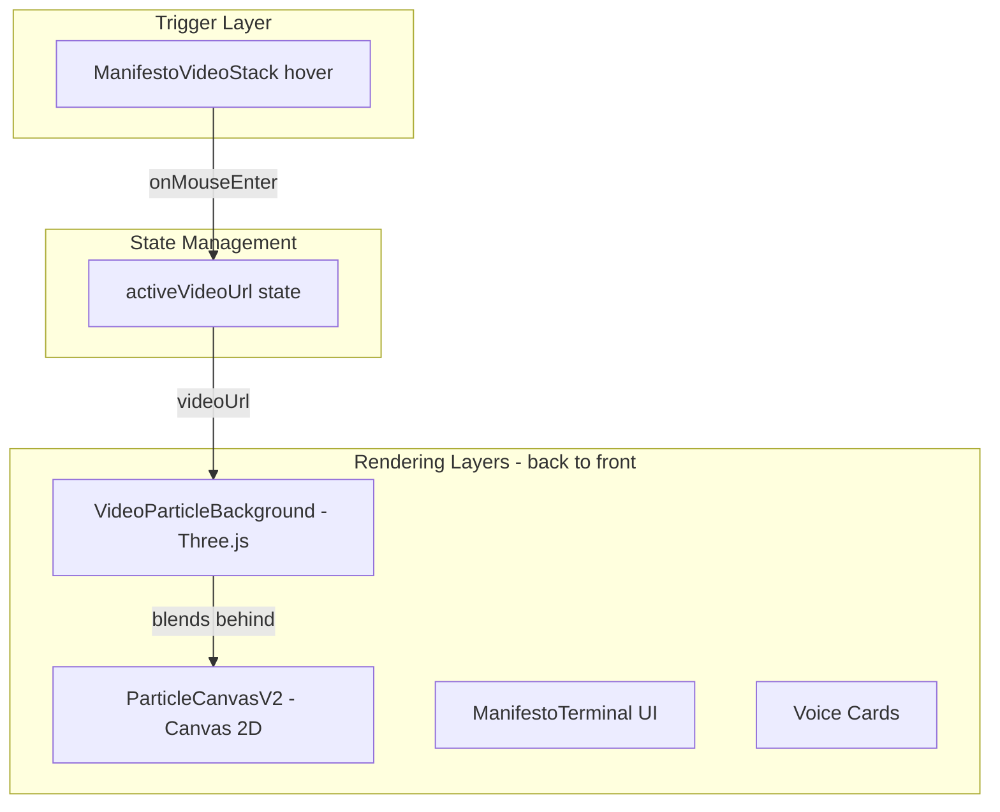

# Video Particle Effect for Manifesto Voices

## Architecture



## Implementation

### 1. Create VideoParticleBackground Component

New file: [`components/hud/VideoParticleBackground.tsx`](components/hud/VideoParticleBackground.tsx)

- Three.js component using React Three Fiber
- Samples video frames as a texture
- Renders as a point cloud with custom shaders (similar to the [Kinect example](https://github.com/mrdoob/three.js/blob/master/examples/webgl_video_kinect.html))
- Uses luminance to control point displacement/depth
- Gold/dawn color palette matching your brand
- Fade in/out transitions on hover

Key shader uniforms:

- `map` - VideoTexture from the voice video
- `pointSize` - Match manifold particle size
- `opacity` - For fade transitions
- `colorTint` - Gold tint to blend with manifold

### 2. Create State Bridge

Modify [`ManifestoVideoStack.tsx`](components/hud/NavigationCockpitV2/ManifestoVideoStack.tsx):

- Add callback prop `onHoverVideo?: (videoUrl: string | null) => void`
- Call it on mouse enter/leave with the video URL
- Parent component will pass this URL to VideoParticleBackground

### 3. Wire Up in NavigationCockpitV2

Modify [`components/hud/NavigationCockpitV2/index.tsx`](components/hud/NavigationCockpitV2/index.tsx):

- Add state for `activeBackgroundVideo`
- Pass callback to ManifestoVideoStack
- Render VideoParticleBackground behind ParticleCanvasV2
- Only render when in manifesto section and video URL is set

### 4. Positioning and Blending

- VideoParticleBackground renders at `z-index: 0` (behind manifold)
- Use additive blending to merge with manifold particles
- Position the point cloud in the center-right area (behind voice cards)
- Apply same gold color palette as manifold for visual cohesion

## Key Technical Details

Shader approach (from Kinect example adapted):

```glsl
// Vertex: displace points based on video luminance
float depth = (color.r + color.g + color.b) / 3.0;
vec3 pos = position;
pos.z = depth * depthScale;

// Fragment: tint with gold, blend with manifold
gl_FragColor = vec4(goldTint * luminance, opacity);
```

## Files to Create/Modify

| File | Action |

|------|--------|

| `components/hud/VideoParticleBackground.tsx` | Create - Three.js video particles |

| `components/hud/NavigationCockpitV2/ManifestoVideoStack.tsx` | Modify - Add hover callback |
