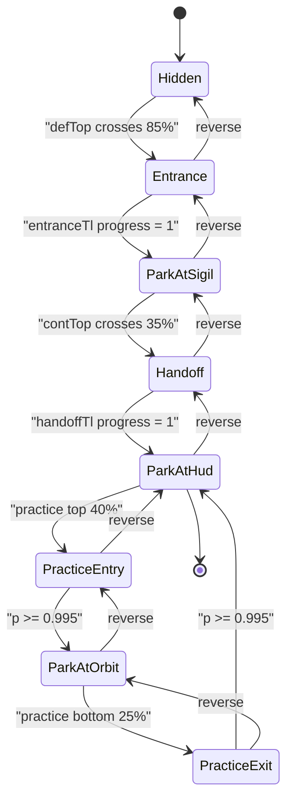

# ADR-010: Brandmark (Sigil) Scroll Choreography

**Date:** 2026-04-25  
**Status:** Accepted

---

## Context

The landing brandmark is a single `position: fixed` “actor” (`tf-brandmark-actor`, `BrandmarkActor`) that must travel a predictable path through the page:

`HERO → (entrance) → SIGIL (park) → (handoff) → HUD → (practice entry) → ORBIT → (practice exit) → HUD`

The choreography is implemented in `components/landing/v7/hooks/useSigilChoreography.ts` and coordinated with `components/landing/v7/BrandmarkActor.tsx` and `components/landing/v7/landing.css`.

Because the actor is **fixed in viewport space** while most targets **scroll, stick, and scale**, naive DOM measurement pinches the brandmark: it can appear in the wrong place between sections, drift while it should be static, or flash in the hero after refresh. Several regressions came from **sticky engagement timing**, **scale-driven bounding-box wobble**, and **ScrollTrigger scrub** lag vs. user scroll speed.

---

## Decision

### Canonical state machine (high level)

The scroll story is a **finite state flow** (GSAP `ScrollTrigger` timelines drive transitions; `onUpdate` / `onLeave` / `onRefresh` settle flags):

### Seven regression rules (load-bearing invariants)

1. **Live, unscaled sigil rect** — Pin the actor to a **live** rect derived from the sigil, compensating for **scale-around-centre** on the mark. Do not pin to a precomputed “sticky viewport” coordinate; that paints the fixed actor over empty space when the real sigil is still mid-scroll.
2. **Horizontal from untransformed parent; vertical from centre** — The entrance scrubs `scale: 0.7 → 1` on the sigil. Reading raw `getBoundingClientRect()` on the scaled node wobbles edges; `readSigilRect()` centers vertically on the **live** box and **horizontally** on the **container** (untransformed width).
3. **Actor render scale = 1 during entrance** — While the **source** sigil scales for reveal, the **fixed actor** should not inherit that transform for positioning math; only opacity (and similar) may scrub. Forcing `scale: 1` on `pinToRect` avoids “breathing” between sections.
4. **Handoff timing and scrub** — `handoffTl` uses `scrub: 0.4` and is anchored to **`contEl` (`top 35% → top 5%`)** so the move starts as the user **exits the continuum band**, not too early. (`scrub: 1.8` felt dragged out; alternative anchors on `defEl.bottom` collided with connector height.)
5. **Never HUD-pin from practice entry `onRefresh` at `scrollY = 0`** — `practiceUndockFromEntry()` (or any path that pins the actor to the HUD) must not run in the `onRefresh` else-branch when the user is still in the **hero**; that was the “brandmark in bottom-left on refresh” bug.
6. **Live HUD/orbit rects for practice travel (forward)** — `applyPracticeTravel(forward)` must use **live** `getBoundingClientRect()` for HUD + orbit, not rects captured at `onEnter`, because `position: sticky` may not be engaged at trigger entry → multi-hundred-pixel snap when docking to orbit.
7. **`onLeave` on practice entry/exit** — When users **fast-scroll**, they can outrun `scrub: 0.4`. `onLeave` on the practice entry/exit timelines finalizes dock state so flags like `practiceEntryArmed` cannot remain stale.

---

## Consequences

### Positive

- Visual expectations (“static in section 2”, “smooth handoff”, “no hero flash on refresh”, “no drift Navigate→Encode”) are encoded as testable invariants.
- Future edits to one trigger (e.g. practice entry) have an explicit list of **cross-regressions** to re-check.

### Negative

- Choreography is **tightly coupled** to section DOM structure, sticky behavior, and trigger thresholds; a layout or section-order change can require re-tuning every related trigger.
- Debugging is **time- and scroll-speed-dependent**; fast-scroll and `onRefresh` paths must be exercised, not just slow scrub.

### Related artifacts

- **Operational how-to (checklists, Playwright recipe):** `.claude/skills/brandmark-choreography/SKILL.md`
- **Compositing / layer rules for the same page:** `sentinel/decisions/008-landing-v7-background-layers.md`, `.claude/skills/landing-v7-compositing/SKILL.md`
- **Scroll / cockpit architecture (shared patterns):** `sentinel/decisions/002-scroll-animation-architecture.md`

---

## Links

- Implementation: `components/landing/v7/hooks/useSigilChoreography.ts`
- Actor: `components/landing/v7/BrandmarkActor.tsx`
- Styles: `components/landing/v7/landing.css`
