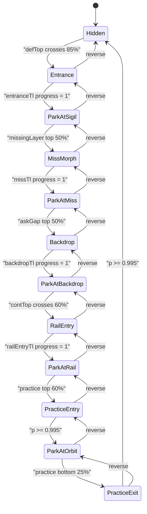

# ADR-010: Brandmark (Sigil) Scroll Choreography

**Date:** 2026-04-25 (v1) · **Updated:** 2026-05-10 (v2 — asking-gap + rail scrub) · **Updated:** 2026-05-10 (v3 — missing-layer dock between sigil and asking-gap)
**Status:** Accepted

---

## Context

The landing brandmark has two owners:

1. the **native diagram source** (`.sigil__mark img`) inside section 02, which owns the mark while it is part of the diagram; and
2. the `position: fixed` **travel actor** (`tf-brandmark-actor`, `BrandmarkActor`), which takes over only when the mark needs to travel between stations.

In **v1 (2026-04-25)** the actor produced this visible path:

`HERO → (entrance) → SIGIL (park) → (handoff) → HUD → (practice entry) → ORBIT → (practice exit) → HUD`

In **v2 (2026-05-10)** — when the [`#asking-gap`](../../public/prototypes/v7/landing-v7-motion.html) interstitial was inserted between Definition and Continuum and the brandmark became a fixed scroll character that anchors the narrative end-to-end (the [legend.xyz](https://legend.xyz/) "smartphone with the page" pattern) — the path was rewritten to:

`HERO → (entrance) → SIGIL → (backdrop) → ASK BACKDROP → (rail entry) → CONTINUUM RAIL (scrub L→R) → (practice entry) → ORBIT → (practice exit) → HIDDEN`

In **v3 (2026-05-10)** — when the new [`#missing-layer`](../../public/prototypes/v7/landing-v7-motion.html) diagnostic section (4-card grid + brandmark in centre) was inserted between Definition and Asking-gap — a new dock was added between sigil and backdrop:

`HERO → (entrance) → SIGIL → (miss morph) → MISSING-LAYER CENTRE → (backdrop morph) → ASK BACKDROP → (rail entry) → CONTINUUM RAIL → (practice entry) → ORBIT → (practice exit) → HIDDEN`

The missing-layer dock follows the rail-brand pattern: a native `.miss__brand-slot img` element parented inside the 4-card grid owns the visible mark while parked (no fixed-position jiggle, scrolls with the grid DOM); the fixed `BrandmarkActor` only handles the two travel legs in (sigil → miss) and out (miss → backdrop).

The HUD bottom-left brandmark slot (`#hudBrandmark`) is **no longer a docking target** on v7. It remains in the DOM as a legacy frame anchor but is hidden by CSS while the new choreography owns the actor.

The choreography is implemented in [`useSigilChoreography.ts`](../../components/landing/v7/hooks/useSigilChoreography.ts) and coordinated with [`BrandmarkActor.tsx`](../../components/landing/v7/BrandmarkActor.tsx) and [`landing.css`](../../components/landing/v7/landing.css).

Because the actor is **fixed in viewport space** while most targets **scroll, stick, and scale**, naive DOM measurement pinches the brandmark: it can appear in the wrong place between sections, drift while it should be diagram-locked, flash in the hero after refresh, or snap when the rail scrub re-enters from below. The seven regression rules below carry forward from v1; they are tightened in v2 to cover the new destinations.

---

## Decision

### Canonical state machine (v3 — current)

The scroll story is a **finite state flow** (GSAP `ScrollTrigger` timelines drive transitions; `onUpdate` / `onLeave` / `onRefresh` settle flags):

### Visible destinations and DOM targets

| State            | Pin target                                                  | Opacity    | Size                     | Notes                                                                                                                                |
| ---------------- | ----------------------------------------------------------- | ---------- | ------------------------ | ------------------------------------------------------------------------------------------------------------------------------------ |
| `Hidden`         | —                                                           | 0          | —                        | Hero or post-practice exit                                                                                                           |
| `ParkAtSigil`    | `.sigil__mark img` (native)                                 | 1 (source) | diagram                  | Actor stays hidden; native source owns the visible mark                                                                              |
| `ParkAtMiss`     | `.miss__brand-slot img` (native, in 4-card grid centre)     | 1 (source) | clamp(96px, 11vw, 144px) | Source-owned mirror of the rail brand pattern; actor hidden via CSS while parked. Lives inside the grid DOM so it scrolls naturally. |
| `ParkAtBackdrop` | `.ask__brandmark-anchor`                                    | 0.08       | ~640px sq                | Faint backdrop behind Evans quote                                                                                                    |
| `ParkAtRail`     | `.crail__brand img` (native, on rail line at AI lives here) | 1 (source) | 56px sq                  | Replaces `.crail__reticle__diamond`; reticle hidden via `[data-brand-on-rail="parked"]` on root. Source-owned, no JS scroll lag.     |
| `ParkAtOrbit`    | `.approach__orbit__mark` (orbit centre, left of practice)   | 1          | live                     | Sticky parent — re-pin every scroll frame                                                                                            |

### Eight regression rules (load-bearing invariants — v3)

1. **Section 02 is source-owned, not actor-owned** — The visible mark inside the section-02 diagram is the native `.sigil__mark img`. The fixed `BrandmarkActor` stays hidden through hero, entrance, and the parked section-02 reading state. Do not make the actor imitate the diagram during this phase: it can drift independently and read as a sticky element. The actor only takes over when `missTl` arms at `#missing-layer top 50%`.
2. **Source-owned park stations** — Three docks own the visible mark via native DOM elements (no fixed actor), all using the same pattern: `.sigil__mark img` (section 02), `.miss__brand-slot img` (missing-layer centre), `.crail__brand img` (continuum rail middle). The fixed actor stays positioned at the brand's rect (so it can re-emerge instantly for the next morph) but is hidden via CSS opacity (`[data-brand-on-missing="parked"]` / `[data-brand-on-rail="parked"]`). This is what eliminates the fixed-position jiggle.
3. **Travel legs read from live source rects** — At each transition the source rect comes from the live element: `readSigilRect()` for sigil → miss; `readMissBrandRect()` for miss → backdrop; `readBackdropRect()` for backdrop → rail-entry; `readRailBrandRect()` for rail → practice. The previous-stage source must be hidden (or visually replaced) only as the morph begins.
4. **Horizontal from untransformed parent; vertical from centre** — The entrance scrubs `scale: 0.7 → 1` on the sigil. Reading raw `getBoundingClientRect()` on the scaled node wobbles edges; `readSigilRect()` centers vertically on the **live** box and **horizontally** on the **container** (untransformed width).
5. **Trigger anchors and scrub values** — Tuned in v3 for the new station order: `missTl @ #missing-layer top 50% → top 0%, scrub: 0.4`; `backdropTl @ #asking-gap top 50% → top 0%, scrub: 0.4`; `railEntryTl @ #continuum top 60% → top 30%, scrub: 0.4`; `practiceEntryTl @ #practice top 60% → top 0%, scrub: 0.4`; `practiceExitTl @ #practice bottom 25% → bottom -10%, scrub: 0.4`. Do not re-tune without an ADR update.
6. **Never pin to any docked target from `onRefresh` at `scrollY < 4`** — On initial page load the user is in the hero. `onRefresh` else-branches must short-circuit when `scrollY < 4` (or use a self-relative gate) instead of pinning to miss / backdrop / rail / orbit. This is the generalisation of the v1 "no HUD pin from practice entry refresh at scrollY=0" rule.
7. **Live rects for moving / sticky targets** — Backdrop reads `.ask__brandmark-anchor.getBoundingClientRect()` each capture; missing-layer reads `.miss__brand-slot img.getBoundingClientRect()` every frame while parked (re-pin invisible actor); rail reads `.crail__brand img.getBoundingClientRect()` per practice-entry frame; practice entry / exit reads `.approach__orbit__mark.getBoundingClientRect()` every frame. None of these can be cached across triggers because their viewport position changes with scroll, sticky engagement, and asking-gap layout.
8. **`onLeave` / `onLeaveBack` on every travel timeline + tri-state attrs on documentElement** — When users **fast-scroll**, they can outrun `scrub`. `onLeave` settles the destination dock; `onLeaveBack` reverses to the previous parked state. The five travel timelines (`missTl`, `backdropTl`, `railEntryTl`, `practiceEntryTl`, `practiceExitTl`) all have both finalisers. Tri-state attributes (`data-brand-on-missing`, `data-brand-on-rail` ∈ `"false" | "true" | "parked"`) are written to BOTH the LandingPage rootRef AND `documentElement`; the fixed `.tf-brandmark-actor` renders as a sibling of rootRef, so descendant selectors only reach it via `documentElement`.

### Diamond reticle (continuum)

The `.crail__reticle__diamond` (a CSS-keyframe-animated diamond on an infinite `crailSlideLarge` loop) is hidden whenever the actor owns the rail (`[data-brand-on-rail="true"]` or `"parked"` on the root). The reticle's ring, cross, line, trail, frame, stops, and tick marks remain visible — only the diamond is replaced by the brandmark. The CSS lives in [`landing.css`](../../components/landing/v7/landing.css) under the `Brandmark choreography (post-ADR-010 v2)` block.

### HUD slot retirement

`#hudBrandmark` is no longer a destination. The actor never pins to it. CSS hides `#hudBrandmark` while `[data-brand-on-rail]` is set on the root (truthy or falsy — both states keep it hidden). The element stays in the DOM because legacy CSS rules use it as a layout anchor for the HUD bottom-left corner brackets.

---

## Consequences

### Positive

- Visual expectations (“static in section 2”, “smooth handoff”, “no hero flash on refresh”, “no drift Navigate→Encode”) are encoded as testable invariants.
- Future edits to one trigger (e.g. practice entry) have an explicit list of **cross-regressions** to re-check.

### Negative

- Choreography is **tightly coupled** to section DOM structure, sticky behavior, and trigger thresholds; a layout or section-order change can require re-tuning every related trigger.
- Debugging is **time- and scroll-speed-dependent**; fast-scroll and `onRefresh` paths must be exercised, not just slow scrub.

### Related artifacts

- **Operational how-to (checklists, Playwright recipe):** `.claude/skills/brandmark-choreography/SKILL.md`
- **Compositing / layer rules for the same page:** `sentinel/decisions/008-landing-v7-background-layers.md`, `.claude/skills/landing-v7-compositing/SKILL.md`
- **Scroll / cockpit architecture (shared patterns):** `sentinel/decisions/002-scroll-animation-architecture.md`

---

## Links

- Implementation: `components/landing/v7/hooks/useSigilChoreography.ts`
- Actor: `components/landing/v7/BrandmarkActor.tsx`
- Styles: `components/landing/v7/landing.css`
