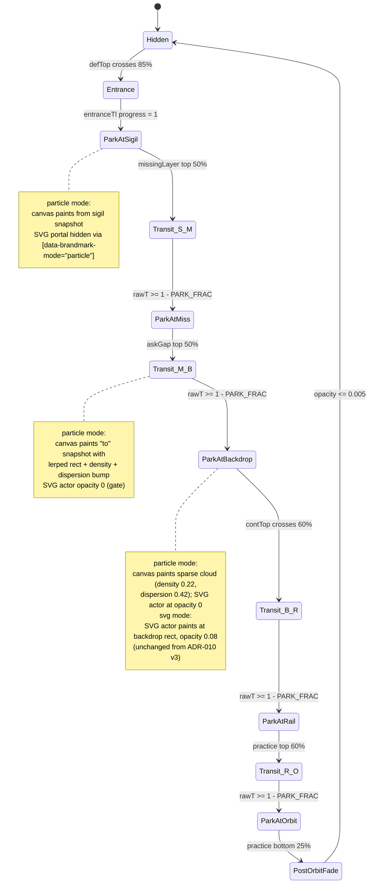

# ADR-011: Brandmark as Morphable Particle Artifact

**Date:** 2026-05-11 (v1) / 2026-05-15 (v2 amendment)
**Status:** SUPERSEDED by [ADR-013 — Brandmark Journey Refactor](013-brandmark-journey-refactor.md) (2026-05-16).

> **Historical record.** The per-station snapshot model with one `BrandmarkParticleStation` mesh per kind, the `data-brand-svg-dock` pixel-perfect handoff fabric, and the dispersion bump applied uniformly to every transit are all retired. The current model is one painter (one `BrandmarkParticleStation` instance) reading one `BrandmarkTransform` from `brandmarkJourneyStore`. The dispersion bump is now per-keyframe-arrival (suppressed for substrate, rail, orbit; kept for miss). The point cloud sampling (`buildBrandmarkParticles` in `brandmarkParticles.ts`) is gone; the global shader is the only painter — even inside the intelligence-layer section. See ADR-013.

**v2 amendment (2026-05-15):** entrance fade-in into section 02 now
hands off to the canonical SVG glyph via `data-brand-svg-dock="sigil"`
instead of writing a particle snapshot with a per-particle opacity
ramp. The original "particles assemble the mark from atoms" design
read as stipple because the shader alpha-blends each grain
individually. Particles are now reserved for cross-section motion
(transit + backdrop + fade-out); within-section entries paint as
clean vector via the diagram's existing entrance scrub. See
"Dock-park SVG handoff" below and `brandmark-particle` SKILL.md.

---

## Context

ADR-010 captured the brandmark's scroll choreography across five stations
(`sigil → miss → backdrop → rail → orbit`) and four travel legs between
them. In that architecture the brandmark was always one of two things:

1. a native SVG `` at a parked dock site (`.sigil__mark img`,
   `.miss__brand-slot img`, `.crail__brand img`), or
2. a fixed-position SVG actor (`.tf-brandmark-actor`) that the
   `useSigilChoreography` hook tweens between dock rects during transit
   and pins faintly behind the Benedict Evans quote at the asking-gap
   backdrop.

The brand was, in other words, a **finished asset** being moved around.

This ADR makes the brand a **runtime substrate**. The canonical brandmark
geometry (`BRANDMARK_FILLED_PATHS` in
[`components/landing/v7/BrandmarkGlyph.tsx`](../../components/landing/v7/BrandmarkGlyph.tsx))
is sampled into a deterministic point cloud at mount time; a single shared
React Three Fiber canvas paints that cloud into every brandmark site on
the page. Density, dispersion, opacity, and tint are dialled per station.
At full density the cloud reads as the filled mark; at the sparse
"diagnostic" tier it reads as atmosphere; mid-transit it scatters and
re-coheres at the destination.

Strategic framing — this is the Navigate → Encode → Build flywheel
expressed visually: the brand stops being a translation endpoint and
becomes a starting point the runtime keeps re-rendering. Mediums collapse
— vector and particle (and, in future phases, 3D) are one substrate
dialled differently. The brandmark is no longer a frozen asset; it is the
same set of paths every time, sampled and projected by whatever the
moment needs.

---

## Decision

### Sampling and engine

- One canonical shape source: `BRANDMARK_FILLED_PATHS` +
  `BRANDMARK_VIEWBOX` in
  [`BrandmarkGlyph.tsx`](../../components/landing/v7/BrandmarkGlyph.tsx).
  Nothing else is allowed to be a source of truth for the brandmark
  geometry. Adding a new shape (compass, lotus, key visual, etc.) is one
  entry in a future `lib/brandmark/shapes.ts`; the engine treats every
  shape identically.
- One sampling utility:
  [`lib/brandmark/sampleShape.ts`](../../lib/brandmark/sampleShape.ts).
  **Stratified sampler** (one point per grid cell with intra-cell jitter)
  combined with `Path2D + ctx.isPointInPath()` hit-tests against the
  filled path union. Stratified placement eliminates the Poisson
  clumping that uniform-random rejection sampling produces and is
  what lets the dock stations read as a _solid filled silhouette_
  visually indistinguishable from the SVG at density 1.0. The sampler
  also measures `fillRatio` (fraction of viewBox that is filled) so
  the shader can auto-size point coverage. Output is `Float32Array` of
  (x, y) pairs in `[-0.5, 0.5]` normalised to the viewBox; seeded
  Mulberry32-style PRNG keeps the cloud stable across mounts and Fast
  Refresh; cell-order shuffle keeps density-clip subsets spatially
  uniform. Memoised by `(shapeKey, count)`.
- One shared GL canvas:
  [`components/brand/BrandmarkParticleField/BrandmarkParticleCanvas.tsx`](../../components/brand/BrandmarkParticleField/BrandmarkParticleCanvas.tsx).
  An R3F `<Canvas>` mounted once at the v7 landing root via
  `BrandmarkSystem`, fixed-positioned + viewport-sized, z-index 23 (just
  under `.tf-brandmark-actor`'s z-index 24).
- One mesh per station:
  [`BrandmarkParticleStation.tsx`](../../components/brand/BrandmarkParticleField/BrandmarkParticleStation.tsx)
  renders a `THREE.Points` with a custom `ShaderMaterial`. Each station
  subscribes imperatively (via `useBrandmarkParticleStore.getState()`
  inside `useFrame`) to its `StationSnapshot` so writes from the
  choreography hook never re-render the React tree.
- Custom shader pair
  ([`shaders.ts`](../../components/brand/BrandmarkParticleField/shaders.ts)):
  vertex shader rank-clips invisible particles, applies a two-frequency
  sinusoidal wander scaled by `uDispersion`, and projects pixel-space
  coordinates to NDC directly (no camera matrix dependency). Fragment
  shader paints a solid square (no antialiasing, no radial falloff) so
  the cloud matches the Canvas-2D `fillRect(GRID, GRID)` aesthetic from
  `ParticleWordmarkMorph` and reads as a hard-edged filled mark at full
  density.

### Choreography integration

- [`lib/stores/brandmarkParticleStore.ts`](../../lib/stores/brandmarkParticleStore.ts)
  is the seam between the scroll-state machine and the GL canvas. The
  store carries `mode: "particle" | "svg"` and a per-station snapshot map.
  `useSigilChoreography` writes snapshots imperatively; `BrandmarkParticleStation`
  reads them in `useFrame` without ever re-rendering React.
- [`useSigilChoreography.ts`](../../components/landing/v7/hooks/useSigilChoreography.ts)
  runs a one-shot mode probe at mount time (`!prefers-reduced-motion &&
WebGL feasibility`). If it passes, the hook switches the store to
  `"particle"` mode and writes a snapshot every frame the brandmark is
  visible (parked, transit, fade-in, fade-out). If either condition
  fails, the store stays in `"svg"` mode and the existing actor + portal'd
  glyphs paint exactly as they did pre-ADR-011.

### Density tiers (load-bearing — keep in sync with

`PARTICLE_STATION_DEFAULTS` in
[`useSigilChoreography.ts`](../../components/landing/v7/hooks/useSigilChoreography.ts))

| Station    | Density | Dispersion | Notes                                                                                                                                            |
| ---------- | ------- | ---------- | ------------------------------------------------------------------------------------------------------------------------------------------------ |
| `sigil`    | 1.00    | 0.00       | Full filled mark inside the diagram. Reads as a solid SVG silhouette at the diagram's size (~232 px).                                            |
| `miss`     | 1.00    | 0.00       | Full filled mark at the centre of the 4-card grid. Same density tier as the dock stations.                                                       |
| `backdrop` | 0.22    | 0.42       | Sparse diagnostic backdrop behind the Benedict Evans quote. Particles drift on noise; the brandmark dissolves into atmosphere.                   |
| `rail`     | 1.00    | 0.00       | Full filled mark on the continuum spectrum.                                                                                                      |
| `orbit`    | 1.00    | 0.00       | Full filled mark at the orbit centre during practice.                                                                                            |
| _transit_  | lerped  | bump       | Density and dispersion interpolate between adjacent stations using `power3.inOut`. A bell-curve bump (`sin(πt) * 0.45`) adds mid-flight scatter. |

### Point sizing (density-aware, computed per-frame)

`BrandmarkParticleStation` derives point size from rect dimensions and
the per-station density each frame, rather than using a fixed
`POINT_SIZE_PX`. The formula:

```
coverage  = COVERAGE_AT_FULL_DENSITY × density ^ COVERAGE_FALLOFF_EXP
pointSize = sqrt(coverage × rectW × rectH × fillRatio / visibleCount)
pointSize = clamp(pointSize, POINT_SIZE_MIN_PX, POINT_SIZE_MAX_PX)
```

Current tuning (in
[`BrandmarkParticleStation.tsx`](../../components/brand/BrandmarkParticleField/BrandmarkParticleStation.tsx)):

| Constant                   | Value | Why                                                                                                |
| -------------------------- | ----- | -------------------------------------------------------------------------------------------------- |
| `COVERAGE_AT_FULL_DENSITY` | 2.0   | At density 1.0 the points oversize their pitch by sqrt(2), so neighbours overlap and gaps close.   |
| `COVERAGE_FALLOFF_EXP`     | 1.6   | Coverage drops faster than density, so the diagnostic backdrop reads as airy grain (not confetti). |
| `POINT_SIZE_MIN_PX`        | 1.6   | Sub-pixel points disappear into AA noise on small docks (rail at ~56 px).                          |
| `POINT_SIZE_MAX_PX`        | 6     | Caps blockiness on very large rects (asking-gap at ~640 px).                                       |
| `PARTICLE_COUNT` (desktop) | 3200  | High enough density that the stratified sampler reduces inter-particle pitch below 3 px at sigil.  |
| `PARTICLE_COUNT_MOBILE`    | 1800  | Mobile budget; auto-sized points compensate by drawing slightly larger grains.                     |

### Gate attributes (load-bearing — keep in sync with

[`landing.css`](../../components/landing/v7/landing.css) § Brandmark
particle artifact)

| Attribute (on documentElement)       | Set by                       | Read by (CSS)                                                                                          | Purpose                                                                                                                                             |
| ------------------------------------ | ---------------------------- | ------------------------------------------------------------------------------------------------------ | --------------------------------------------------------------------------------------------------------------------------------------------------- |
| `data-brandmark-mode`                | `useSigilChoreography` setup | hides native dock glyphs at parked states, hides actor at orbit dock                                   | global mode flag (`"particle"` / `"svg"`)                                                                                                           |
| `data-brand-particle-backdrop`       | per-frame                    | fades `.tf-brandmark-particle-canvas` opacity 0 → 1; hides `.tf-brandmark-actor` regardless of station | gate that flips on whenever the particle field is the painter (any station + transit/fadeout)                                                       |
| `data-brand-svg-dock`                | per-frame                    | re-shows the portal'd SVG glyph at the named anchor with a 200 ms crossfade; particle mesh opacity 0   | pixel-perfect dock handoff at full-density parks (sigil / miss / rail / orbit). Clears during transit, fade-in, fade-out, and at the backdrop park. |
| `data-brand-on-missing` (ADR-010 v3) | per-frame                    | (pre-existing) shows native miss brand at park / hides actor at parked-miss                            | composes with `data-brandmark-mode="particle"` to hide the native miss glyph in particle mode                                                       |
| `data-brand-on-rail` (ADR-010 v3)    | per-frame                    | (pre-existing) shows native rail brand at park / hides reticle diamond                                 | composes with `data-brandmark-mode="particle"` to hide the native rail glyph in particle mode                                                       |
| `data-orbit-docked` (ADR-010 v3)     | per-frame                    | (pre-existing) drives orbit telemetry; particle mode adds an actor-hide rule                           | hides actor at parked-orbit in particle mode                                                                                                        |

### Dock-park SVG handoff (pixel-perfect at rest)

At full-density parks the particle field is **silenced** (per-station
`opacity: 0` in the snapshot) and the portal'd SVG glyph at the same
anchor is **re-shown** by a CSS gate. The result: dock states are
literally the canonical SVG file (zero stipple, true vector
crispness), while particles handle every moment of transition.

The crossover is governed by `SVG_DOCK_THRESHOLD` (currently `0.95`)
in [`useSigilChoreography.ts`](../../components/landing/v7/hooks/useSigilChoreography.ts).
Stations whose default density meets the threshold trigger the
handoff in `parkAt`; the backdrop (density `0.22`) stays as
particles.

**Entrance band amendment (v2, 2026-05-15):** the pre-sigil
fade-in band (`scrollY` in `[c[0] - 0.6 * vh, c[0]]`) also hands
off to the SVG glyph — `setSvgDock("sigil")` is called as soon as
the user crosses into the band, the particle station is cleared,
and the diagram's existing entrance scrub
(`#definition top 85% → top 35%`) is left alone to animate
`.sigil__mark` opacity 0 → 1. The result: a clean vector fade-in
on direct entry / refresh, no stippled particle-assembly artefact.

**Rail → orbit segment + practice sticky-window amendment (v2,
2026-05-15):** the orbit anchor (`.approach__orbit__mark`) is sticky
inside `.approach__stage` (CSS rule `position: sticky; top:
clamp(60px, 12vh, 120px)`). During sticky engagement its
`getBoundingClientRect().top` clamps to that offset regardless of
`scrollY`, so `stationCenterY(orbit) = scrollY + rect.top + height/2 -
vh/2` slides below `scrollY` by a constant and `scrollY > c[orbit]`
is true for the entire practice section. Two compounding effects
result, both fixed below:

1. **Rail → orbit segment never reaches `parkAt(orbit)`.** The
   generic `rawT = (scrollY - c[rail]) / (c[orbit] - c[rail])` only
   approaches 1 asymptotically when both numerator and denominator
   grow in lockstep. `applyJourney` special-cases this segment by
   re-basing the transit window on the practice section's top edge:
   once `practiceEl.getBoundingClientRect().top <= 0`, the orbit is
   treated as parked. The pre-engagement transit window
   (`scrollY` from `c[rail]` to the scrollY at which `practiceTop`
   hits 0) still uses the standard transit dispersion bump.

2. **Post-orbit fade-out branch fires too early.** The
   `scrollY > c[lastIdx]` branch (which paints a decaying-opacity
   particle cloud) becomes perpetually true once sticky engages,
   so without a guard the entire practice section — Navigate /
   Encode / Build — would render the orbit as a degrading
   particle stipple over the canonical SVG. `applyJourney` therefore
   short-circuits to `parkAt(orbit)` whenever the practice section
   straddles viewport top (`practiceTop <= 0 && practiceBottom > 0`).
   The original fade-out branch still fires after practice has
   scrolled past — at that point sticky has released, the orbit's
   `rect.top` has gone negative, and `c[orbit] < scrollY` again
   reflects "user has scrolled past the orbit's natural centre",
   which is the correct trigger for fade-out.

Why this matters: the brandmark is a **logo**. At rest it must read
as the logo, not as a creative interpretation of the logo. The
particle texture is the visual story during _motion_ — entrance,
transit, dispersion, backdrop, fade-out. The substrate metaphor is
preserved: at full density the substrate converges to the canonical
asset, which is exactly what the strategic story says it should.

A 200 ms CSS opacity transition on each portal'd dock glyph smooths
the particle → SVG handoff so park entry / exit feels like the cloud
crystallising into a vector mark and then dissolving back.

### State machine (preserves ADR-010 v3 contracts)



The journey function (`applyJourney`) is unchanged from ADR-010 v3 — same
scroll-position-derived state machine, same PARK*FRAC math, same hero
guard, same fade-in / fade-out windows. What changes is what each branch
\_paints*. ADR-010 v3 mutated the SVG actor's `pinToRect`; this ADR
augments that with a `writeStationSnapshot` (parked / fadeout) or a
transit-snapshot (mid-segment), and the CSS gate flips hide the SVG
painters so the canvas reads alone.

### Singleton invariant (extends ADR-010 v3 rule 8)

[`brandmarkSingletonCheck.ts`](../../components/landing/v7/lib/brandmarkSingletonCheck.ts)
now treats `.tf-brandmark-particle-canvas` as one of the painters in its
selector list. With the CSS gates active in particle mode:

- parked at any station → canvas opacity 1, native dock + actor opacity 0 → count 1
- transit between stations → canvas opacity 1, native dock + actor opacity 0 → count 1
- gate transition (240ms canvas fade-in / 120ms actor fade-out) →
  combined effective opacity ≤ 1.25 → tolerated by
  `CROSSFADE_TOLERANCE`

In svg mode the check behaves exactly as it did under ADR-010 v3.

---

## Consequences

### Positive

- The brandmark is a **runtime substrate**, not a frozen asset. Adding a
  new shape (compass, lotus, key visual) is one entry in a future
  `lib/brandmark/shapes.ts` plus one sampled buffer — no new rendering
  code, no choreography rewrite.
- One canonical geometry source (`BRANDMARK_FILLED_PATHS`) is now
  inherited by every brandmark site on the page. No raster copies, no
  parallel asset drift.
- The asking-gap (Benedict Evans) moment now has the strategic-story
  visual: the brand literally dissolves into atmosphere while the quote
  reads in the foreground, then re-coheres at the continuum rail.
- v2 (2026-05-15): within-section entries paint as clean vector via the
  diagram's entrance scrub; particles are reserved for cross-section
  motion. The "made of pure math, pure code that can transform" story
  is now staged at the moments of motion (transit between stations),
  and the dock states read as the canonical SVG at rest in every
  section, not just at full-density parks.
- The reduced-motion + no-WebGL paths still work — the SVG actor + portal'd
  glyphs are kept verbatim as the fallback. Every ADR-010 v3 invariant
  continues to hold on that path.

### Negative

- Adds one more state attribute (`data-brandmark-mode`) and one more
  per-station snapshot bus (`useBrandmarkParticleStore`) to keep in sync
  with the journey state machine.
- The particle field is GPU-rendered; mobile devices with weak WebGL
  performance fall back to the SVG path. (Density auto-steps to a
  smaller buffer on viewport widths ≤ 960 px to reduce fillrate cost
  before the fallback kicks in.)
- Particle counts have to be tuned by viewport: 1000 on mobile / 2000 on
  desktop. Larger surfaces or higher-resolution displays may want a
  higher count; we revisit if real users report visible stipple.

### Related artifacts

- Engine package: [`components/brand/BrandmarkParticleField/`](../../components/brand/BrandmarkParticleField/)
- Sampling utility: [`lib/brandmark/sampleShape.ts`](../../lib/brandmark/sampleShape.ts)
- Snapshot bus: [`lib/stores/brandmarkParticleStore.ts`](../../lib/stores/brandmarkParticleStore.ts)
- Choreography hook: [`components/landing/v7/hooks/useSigilChoreography.ts`](../../components/landing/v7/hooks/useSigilChoreography.ts)
- CSS gates: [`components/landing/v7/landing.css`](../../components/landing/v7/landing.css) § Brandmark particle artifact
- Singleton check: [`components/landing/v7/lib/brandmarkSingletonCheck.ts`](../../components/landing/v7/lib/brandmarkSingletonCheck.ts)
- Dev preview: [`app/(internal)/test/brandmark-particle/page.tsx`](../../app/%28internal%29/test/brandmark-particle/page.tsx)
- Operational how-to (checklists, perf budget, mobile auto-step): `.claude/skills/brandmark-particle/SKILL.md`
- Choreography how-to (extends ADR-010): `.claude/skills/brandmark-choreography/SKILL.md`

---

## Future work (deferred)

- **Shape registry** beyond the brandmark (compass, lotus, key visual).
  `lib/brandmark/shapes.ts` registers each shape's paths + viewBox + a
  stable shape key; `sampleShape` already memoises by `(shapeKey,
count)` so adding a shape is one entry. Per-station snapshots could
  carry an optional `shape: ShapeKey` field for shape switches mid-journey.
- **3D depth** via R3F's perspective camera. The shared canvas already
  uses an orthographic camera with manual pixel-to-NDC projection in the
  vertex shader; switching to perspective opens fly-throughs and
  parallax. Out of scope for v1 until we have a concrete moment that
  needs depth.
- **Procedural shapes** (Lissajous, attractor curves) sampled the same
  way. Same registry mechanism; just a different shape generator.

---

## Links

- ADR-010 v3 (predecessor): [`010-brandmark-choreography.md`](010-brandmark-choreography.md)
- ADR-008 (compositing): [`008-landing-v7-background-layers.md`](008-landing-v7-background-layers.md)
- ADR-002 (scroll architecture): [`002-scroll-animation-architecture.md`](002-scroll-animation-architecture.md)
