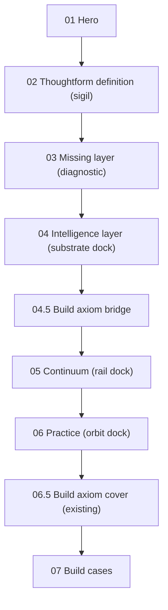

# ADR-012: Intelligence Layer Artifact (replaces asking-gap interstitial)

**Date:** 2026-05-15
**Status:** Accepted

**Related:**
[ADR-008](008-landing-v7-background-layers.md),
[ADR-010](010-brandmark-choreography.md),
[ADR-011](011-brandmark-particle-artifact.md).

---

## Context

Visitors landing on Thoughtform.co arrive without the context that the
internal Aether case has already accumulated. Sections 01–03 set up the
work (hero, definition, missing-layer diagnostic), but nothing on the
public site previously _showed_ what the intelligence layer actually is.
The fourth station was the **Benedict Evans "asking gap" interstitial**
(`#asking-gap`), a single full-viewport editorial quote backed by a
faint particle backdrop of the brandmark.

Two problems with that beat as the answer to the diagnostic:

1. It restates the diagnosis in a third party's voice rather than
   demonstrating Thoughtform's solution. Visitors leave Section 04 with
   the same problem reframed, not with a payload.
2. It hands the brandmark a **decorative** role (faint, dispersed,
   ~0.08 opacity, density 0.22). The brandmark is supposed to be the
   travelling artifact that anchors the page (the
   [legend.xyz](https://legend.xyz) "smartphone with the page" pattern,
   per ADR-010 v2). At the asking-gap it stops _meaning_ anything — it
   is just blur behind a quote.

This ADR replaces `#asking-gap` with **`#intelligence-layer`**, a
vertical three-layer artifact that translates the Aether
Sources / Substrate / Surfaces payload into a Thoughtform-grammar
stacked instrument: trusted sources (Navigate) sit as the upper input
plane, the brandmark **is** the substrate (Encode) at the centre, and
headless surfaces (Build) emerge from the lower output plane.

The brandmark choreography is updated accordingly: the third station
is renamed from `backdrop` to `substrate`, runs at full density (SVG
dock, density 1.0), and parks at a new central anchor inside the
intelligence-layer artifact instead of the asking-gap backdrop slot.

A new lightweight bridge — **`#build-axiom-bridge`** — is inserted
between `#intelligence-layer` and `#continuum`, carrying the
"What I cannot build, I do not understand" line over the Thoughtform
key visual. This is a paced breathing divider, not a duplicate of
the existing `#buildQuote` cover (which remains in place for the
practice → build cover handoff documented in `useLandingScroll.ts`).

---

## Decision

### Scroll order (v7, post-ADR-012)



The old `#asking-gap` station is removed. HUD label `04 Asking gap`
becomes `04 Intelligence layer`. The `#buildQuote` cover sits in the
same DOM position as before (after `#practice`, before `#build`) so
the practice cover-runway handoff in
[`useLandingScroll.ts`](../../components/landing/v7/hooks/useLandingScroll.ts)
keeps working unchanged.

### Brandmark station rename: `backdrop` → `substrate`

[`StationKind`](../../lib/stores/brandmarkParticleStore.ts) becomes:

```ts
export type StationKind = "sigil" | "miss" | "substrate" | "rail" | "orbit";
```

The travel sequence is now:

```
Hero → SIGIL → MISS → SUBSTRATE → RAIL → ORBIT → fade → Hidden
```

The substrate station behaves as a **full-density SVG dock**, not a
backdrop. Updated density tier table (keep in sync with
`PARTICLE_STATION_DEFAULTS` in
[`useSigilChoreography.ts`](../../components/landing/v7/hooks/useSigilChoreography.ts)
and the table in [ADR-011](011-brandmark-particle-artifact.md)):

| Station     | Density | Dispersion | Notes                                                                                                                     |
| ----------- | ------- | ---------- | ------------------------------------------------------------------------------------------------------------------------- |
| `sigil`     | 1.00    | 0.00       | Section 02 diagram centre.                                                                                                |
| `miss`      | 1.00    | 0.00       | Diagnostic 4-card grid centre.                                                                                            |
| `substrate` | 1.00    | 0.00       | **Intelligence-layer central plane.** Larger anchor than the other docks (`clamp(180px, 22vw, 280px)`); SVG dock at rest. |
| `rail`      | 1.00    | 0.00       | Continuum rail.                                                                                                           |
| `orbit`     | 1.00    | 0.00       | Practice orbit centre.                                                                                                    |
| _transit_   | lerped  | bump       | Standard `power3.inOut` lerp + `sin(πt) × 0.45` dispersion bump.                                                          |

`SVG_DOCK_THRESHOLD` is unchanged (0.95). At density 1.0 the substrate
station hands off to the portal'd SVG glyph at its anchor exactly like
sigil / miss / rail / orbit, so the brandmark reads as the canonical
SVG at rest. Transit between miss → substrate and substrate → rail
keeps the particle scatter / re-cohere story.

### New anchor key: `substrate`

[`BrandmarkSystem.tsx`](../../components/landing/v7/BrandmarkSystem.tsx)
registers a fifth `AnchorKey`:

```ts
type AnchorKey = "sigil" | "missing" | "substrate" | "rail" | "orbit";
```

The new section markup carries
`<div class="ilayer__brandmark-anchor" data-brand-anchor="substrate">`,
which the parser strips of placeholder children and into which the
`BrandmarkSystem` portals one canonical `<BrandmarkGlyph>`. The
choreography hook reads the same element via `getSubstrateAnchor` and
parks the actor / writes the substrate snapshot at its rect.

`svgDockAnchorKey("substrate")` returns `"substrate"` (no rename
needed — only `miss` → `"missing"` keeps a legacy mapping).

### CSS gates (added to `landing.css` § Brandmark particle artifact)

```css
[data-brandmark-mode="particle"] .ilayer__brandmark-anchor > :where(img, svg) {
  opacity: 0;
  transition: opacity 200ms ease-out;
}
[data-brandmark-mode="particle"][data-brand-svg-dock="substrate"]
  .ilayer__brandmark-anchor
  > :where(img, svg) {
  opacity: 1 !important;
}
```

These mirror the existing sigil / missing / rail dock gates.

### Section visual treatment (`#intelligence-layer`)

Three vertically stacked planes inside one `100svh` station:

- **Top plane — Navigate / Trusted sources.** Six labelled chips
  arranged loosely above a thin instrument rule: `Brand framework`,
  `Past campaigns`, `Customer research`, `Performance data`,
  `Style guidelines`, `Reviewer notes`.
- **Middle plane — Encode / Substrate (brandmark dock).** A central
  framed plane carrying the substrate brandmark anchor. Four encoded
  bands sit symmetrically around it: `Rules`, `Examples`, `Sources`,
  `Loops`. This is the visual heart of the section; the upper and
  lower planes are supporting annotations.
- **Bottom plane — Build / Headless surfaces.** Six surface chips
  emerge as outputs: `Cursor`, `Claude`, `Web app`, `REST`, `Slack`,
  `Agents`.
- **Connectors.** Fine dotted vertical guides + soft contour lines
  connect the three planes so the section reads as a stacked
  instrument, not a card grid.

Compositing follows ADR-008 in full: the wrapper paints opaque
`var(--void)`, reveal motion runs on inner content only, no
`transform`/`opacity` reveals on the full-bleed wrapper.

### `#build-axiom-bridge` (new lightweight divider)

A short 80svh / auto-height bridge between `#intelligence-layer` and
`#continuum`. It carries:

- The Thoughtform key visual gateway image (
  `/images/Thoughtform_Key Visual_14d.webp`), parallax-tagged at
  `data-parallax=".04"` like the `.build-quote__gateway__img`.
- The line **"What I cannot build, I do not understand."** in a
  modest editorial register (no `del`/`ins` correction interaction,
  no Caltech attribution chrome — that fuller treatment stays at
  `#buildQuote`).

The bridge is **not** the heavy practice cover. The existing
`#buildQuote` keeps its cover-runway role.

### Files touched

- [public/prototypes/v7/landing-v7-motion.html](../../public/prototypes/v7/landing-v7-motion.html) — replace `#asking-gap` markup, insert `#build-axiom-bridge`, update HUD nav label, repoint Section 02 CTA from `#asking-gap` to `#intelligence-layer`.
- [components/landing/v7/landing.css](../../components/landing/v7/landing.css) — retire `.ask*` styles, add `.ilayer*` and `.ilayer-bridge*` styles, add CSS gate for substrate dock anchor, update comments referencing the old backdrop semantic.
- [lib/stores/brandmarkParticleStore.ts](../../lib/stores/brandmarkParticleStore.ts) — `StationKind` rename + `ALL_STATION_KINDS`.
- [components/landing/v7/hooks/useSigilChoreography.ts](../../components/landing/v7/hooks/useSigilChoreography.ts) — `StationKind` rename, `PARTICLE_STATION_DEFAULTS` (substrate at density 1, opacity 1), DOM resolver renamed `getAskAnchor → getSubstrateAnchor`, station list opacity 0.08 → 1.0, `ResizeObserver` updated.
- [components/landing/v7/BrandmarkSystem.tsx](../../components/landing/v7/BrandmarkSystem.tsx) — `AnchorKey` adds `"substrate"`, `BrandmarkParticleCanvas stations={...}` extends to substrate.
- [components/brand/BrandmarkParticleField/BrandmarkParticleCanvas.tsx](../../components/brand/BrandmarkParticleField/BrandmarkParticleCanvas.tsx) — comment updates only.
- [components/landing/v7/lib/brandmarkSingletonCheck.ts](../../components/landing/v7/lib/brandmarkSingletonCheck.ts) — add the substrate anchor selector to `BRANDMARK_RENDER_SELECTORS`.

ADR-010 and ADR-011 narrative text + density / state tables should be
updated in a follow-up to reflect the rename.

---

## Consequences

### Positive

- Section 04 now **demonstrates** the Thoughtform answer instead of
  paraphrasing the problem in a borrowed voice.
- The brandmark is upgraded from "decorative blur" to "the substrate
  itself" at the heart of the artifact, which is the strategic story
  the rest of the page already tells.
- Station name `substrate` matches what the runtime actually paints
  (a dense central artifact), removing the lie embedded in the old
  `backdrop` name.
- The Aether intelligence-layer payload is now legible to first-time
  visitors without the deep operator-case context.
- The lightweight bridge inserts the axiom (`What I cannot build…`)
  earlier in the narrative without disturbing the practice → build
  cover handoff.

### Negative

- Five files change together (store, hook, system, singleton,
  styles). The path-scoped rules in `.cursor/rules/brandmark.mdc` and
  `.claude/rules/` should be re-read before any further edits to
  these files.
- The Feynman axiom now appears in two places (the bridge and the
  buildQuote cover). The treatments differ deliberately, but the
  duplication is a maintenance cost flagged for follow-up.
- The substrate station's anchor is larger than the other docks
  (`clamp(180px, 22vw, 280px)`). The point-size auto-sizing in
  `BrandmarkParticleStation` already handles this via the
  `coverage / fillRatio / visibleCount` formula, but the perf budget
  on low-end mobile should be sampled (the existing `1800` particle
  budget on mobile already keeps fillrate sane at the asking-gap's
  `~640px` anchor size).

---

## Links

- ADR-008 (compositing): [`008-landing-v7-background-layers.md`](008-landing-v7-background-layers.md)
- ADR-010 (choreography): [`010-brandmark-choreography.md`](010-brandmark-choreography.md)
- ADR-011 (particle artifact): [`011-brandmark-particle-artifact.md`](011-brandmark-particle-artifact.md)
- Skills: `.claude/skills/brandmark-choreography/SKILL.md`, `.claude/skills/brandmark-particle/SKILL.md`, `.claude/skills/landing-v7-compositing/SKILL.md`
