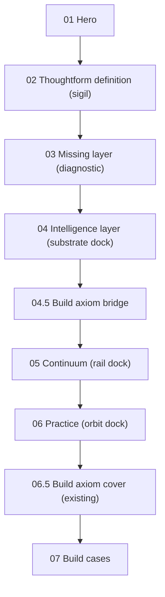

# ADR-012: Intelligence Layer Artifact (replaces asking-gap interstitial)

**Date:** 2026-05-15
**Status:** Accepted

**Related:**
[ADR-008](008-landing-v7-background-layers.md),
[ADR-010](010-brandmark-choreography.md),
[ADR-011](011-brandmark-particle-artifact.md).

---

## Context

Visitors landing on Thoughtform.co arrive without the context that the
internal Aether case has already accumulated. Sections 01–03 set up the
work (hero, definition, missing-layer diagnostic), but nothing on the
public site previously _showed_ what the intelligence layer actually is.
The fourth station was the **Benedict Evans "asking gap" interstitial**
(`#asking-gap`), a single full-viewport editorial quote backed by a
faint particle backdrop of the brandmark.

Two problems with that beat as the answer to the diagnostic:

1. It restates the diagnosis in a third party's voice rather than
   demonstrating Thoughtform's solution. Visitors leave Section 04 with
   the same problem reframed, not with a payload.
2. It hands the brandmark a **decorative** role (faint, dispersed,
   ~0.08 opacity, density 0.22). The brandmark is supposed to be the
   travelling artifact that anchors the page (the
   [legend.xyz](https://legend.xyz) "smartphone with the page" pattern,
   per ADR-010 v2). At the asking-gap it stops _meaning_ anything — it
   is just blur behind a quote.

This ADR replaces `#asking-gap` with **`#intelligence-layer`**, a
vertical three-layer artifact that translates the Aether
Sources / Substrate / Surfaces payload into a Thoughtform-grammar
stacked instrument: trusted sources (Navigate) sit as the upper input
plane, the brandmark **is** the substrate (Encode) at the centre, and
headless surfaces (Build) emerge from the lower output plane.

The brandmark choreography is updated accordingly: the third station
is renamed from `backdrop` to `substrate`, runs at full density (SVG
dock, density 1.0), and parks at a new central anchor inside the
intelligence-layer artifact instead of the asking-gap backdrop slot.

A new lightweight bridge — **`#build-axiom-bridge`** — is inserted
between `#intelligence-layer` and `#continuum`, carrying the
"What I cannot build, I do not understand" line over the Thoughtform
key visual. This is a paced breathing divider, not a duplicate of
the existing `#buildQuote` cover (which remains in place for the
practice → build cover handoff documented in `useLandingScroll.ts`).

---

## Decision

### Scroll order (v7, post-ADR-012)



The old `#asking-gap` station is removed. HUD label `04 Asking gap`
becomes `04 Intelligence layer`. The `#buildQuote` cover sits in the
same DOM position as before (after `#practice`, before `#build`) so
the practice cover-runway handoff in
[`useLandingScroll.ts`](../../components/landing/v7/hooks/useLandingScroll.ts)
keeps working unchanged.

### Brandmark station rename: `backdrop` → `substrate`

[`StationKind`](../../lib/stores/brandmarkParticleStore.ts) becomes:

```ts
export type StationKind = "sigil" | "miss" | "substrate" | "rail" | "orbit";
```

The travel sequence is now:

```
Hero → SIGIL → MISS → SUBSTRATE → RAIL → ORBIT → fade → Hidden
```

The substrate station behaves as a **full-density SVG dock**, not a
backdrop. Updated density tier table (keep in sync with
`PARTICLE_STATION_DEFAULTS` in
[`useSigilChoreography.ts`](../../components/landing/v7/hooks/useSigilChoreography.ts)
and the table in [ADR-011](011-brandmark-particle-artifact.md)):

| Station     | Density | Dispersion | Notes                                                                                                                     |
| ----------- | ------- | ---------- | ------------------------------------------------------------------------------------------------------------------------- |
| `sigil`     | 1.00    | 0.00       | Section 02 diagram centre.                                                                                                |
| `miss`      | 1.00    | 0.00       | Diagnostic 4-card grid centre.                                                                                            |
| `substrate` | 1.00    | 0.00       | **Intelligence-layer central plane.** Larger anchor than the other docks (`clamp(180px, 22vw, 280px)`); SVG dock at rest. |
| `rail`      | 1.00    | 0.00       | Continuum rail.                                                                                                           |
| `orbit`     | 1.00    | 0.00       | Practice orbit centre.                                                                                                    |
| _transit_   | lerped  | bump       | Standard `power3.inOut` lerp + `sin(πt) × 0.45` dispersion bump.                                                          |

`SVG_DOCK_THRESHOLD` is unchanged (0.95). At density 1.0 the substrate
station hands off to the portal'd SVG glyph at its anchor exactly like
sigil / miss / rail / orbit, so the brandmark reads as the canonical
SVG at rest. Transit between miss → substrate and substrate → rail
keeps the particle scatter / re-cohere story.

### New anchor key: `substrate`

[`BrandmarkSystem.tsx`](../../components/landing/v7/BrandmarkSystem.tsx)
registers a fifth `AnchorKey`:

```ts
type AnchorKey = "sigil" | "missing" | "substrate" | "rail" | "orbit";
```

The new section markup carries
`<div class="ilayer__brandmark-anchor" data-brand-anchor="substrate">`,
which the parser strips of placeholder children and into which the
`BrandmarkSystem` portals one canonical `<BrandmarkGlyph>`. The
choreography hook reads the same element via `getSubstrateAnchor` and
parks the actor / writes the substrate snapshot at its rect.

`svgDockAnchorKey("substrate")` returns `"substrate"` (no rename
needed — only `miss` → `"missing"` keeps a legacy mapping).

### CSS gates (added to `landing.css` § Brandmark particle artifact)

```css
[data-brandmark-mode="particle"] .ilayer__brandmark-anchor > :where(img, svg) {
  opacity: 0;
  transition: opacity 200ms ease-out;
}
[data-brandmark-mode="particle"][data-brand-svg-dock="substrate"]
  .ilayer__brandmark-anchor
  > :where(img, svg) {
  opacity: 1 !important;
}
```

These mirror the existing sigil / missing / rail dock gates.

### Section visual treatment (`#intelligence-layer`)

Three vertically stacked planes inside one `100svh` station:

- **Top plane — Navigate / Trusted sources.** Six labelled chips
  arranged loosely above a thin instrument rule: `Brand framework`,
  `Past campaigns`, `Customer research`, `Performance data`,
  `Style guidelines`, `Reviewer notes`.
- **Middle plane — Encode / Substrate (brandmark dock).** A central
  framed plane carrying the substrate brandmark anchor. Four encoded
  bands sit symmetrically around it: `Rules`, `Examples`, `Sources`,
  `Loops`. This is the visual heart of the section; the upper and
  lower planes are supporting annotations.
- **Bottom plane — Build / Headless surfaces.** Six surface chips
  emerge as outputs: `Cursor`, `Claude`, `Web app`, `REST`, `Slack`,
  `Agents`.
- **Connectors.** Fine dotted vertical guides + soft contour lines
  connect the three planes so the section reads as a stacked
  instrument, not a card grid.

Compositing follows ADR-008 in full: the wrapper paints opaque
`var(--void)`, reveal motion runs on inner content only, no
`transform`/`opacity` reveals on the full-bleed wrapper.

### `#build-axiom-bridge` (new lightweight divider)

A short 80svh / auto-height bridge between `#intelligence-layer` and
`#continuum`. It carries:

- The Thoughtform key visual gateway image (
  `/images/Thoughtform_Key Visual_14d.webp`), parallax-tagged at
  `data-parallax=".04"` like the `.build-quote__gateway__img`.
- The line **"What I cannot build, I do not understand."** in a
  modest editorial register (no `del`/`ins` correction interaction,
  no Caltech attribution chrome — that fuller treatment stays at
  `#buildQuote`).

The bridge is **not** the heavy practice cover. The existing
`#buildQuote` keeps its cover-runway role.

### Files touched

- [public/prototypes/v7/landing-v7-motion.html](../../public/prototypes/v7/landing-v7-motion.html) — replace `#asking-gap` markup, insert `#build-axiom-bridge`, update HUD nav label, repoint Section 02 CTA from `#asking-gap` to `#intelligence-layer`.
- [components/landing/v7/landing.css](../../components/landing/v7/landing.css) — retire `.ask*` styles, add `.ilayer*` and `.ilayer-bridge*` styles, add CSS gate for substrate dock anchor, update comments referencing the old backdrop semantic.
- [lib/stores/brandmarkParticleStore.ts](../../lib/stores/brandmarkParticleStore.ts) — `StationKind` rename + `ALL_STATION_KINDS`.
- [components/landing/v7/hooks/useSigilChoreography.ts](../../components/landing/v7/hooks/useSigilChoreography.ts) — `StationKind` rename, `PARTICLE_STATION_DEFAULTS` (substrate at density 1, opacity 1), DOM resolver renamed `getAskAnchor → getSubstrateAnchor`, station list opacity 0.08 → 1.0, `ResizeObserver` updated.
- [components/landing/v7/BrandmarkSystem.tsx](../../components/landing/v7/BrandmarkSystem.tsx) — `AnchorKey` adds `"substrate"`, `BrandmarkParticleCanvas stations={...}` extends to substrate.
- [components/brand/BrandmarkParticleField/BrandmarkParticleCanvas.tsx](../../components/brand/BrandmarkParticleField/BrandmarkParticleCanvas.tsx) — comment updates only.
- [components/landing/v7/lib/brandmarkSingletonCheck.ts](../../components/landing/v7/lib/brandmarkSingletonCheck.ts) — add the substrate anchor selector to `BRANDMARK_RENDER_SELECTORS`.

ADR-010 and ADR-011 narrative text + density / state tables should be
updated in a follow-up to reflect the rename.

---

## Consequences

### Positive

- Section 04 now **demonstrates** the Thoughtform answer instead of
  paraphrasing the problem in a borrowed voice.
- The brandmark is upgraded from "decorative blur" to "the substrate
  itself" at the heart of the artifact, which is the strategic story
  the rest of the page already tells.
- Station name `substrate` matches what the runtime actually paints
  (a dense central artifact), removing the lie embedded in the old
  `backdrop` name.
- The Aether intelligence-layer payload is now legible to first-time
  visitors without the deep operator-case context.
- The lightweight bridge inserts the axiom (`What I cannot build…`)
  earlier in the narrative without disturbing the practice → build
  cover handoff.

### Negative

- Five files change together (store, hook, system, singleton,
  styles). The path-scoped rules in `.cursor/rules/brandmark.mdc` and
  `.claude/rules/` should be re-read before any further edits to
  these files.
- The Feynman axiom now appears in two places (the bridge and the
  buildQuote cover). The treatments differ deliberately, but the
  duplication is a maintenance cost flagged for follow-up.
- The substrate station's anchor is larger than the other docks
  (`clamp(180px, 22vw, 280px)`). The point-size auto-sizing in
  `BrandmarkParticleStation` already handles this via the
  `coverage / fillRatio / visibleCount` formula, but the perf budget
  on low-end mobile should be sampled (the existing `1800` particle
  budget on mobile already keeps fillrate sane at the asking-gap's
  `~640px` anchor size).

---

## Links

- ADR-008 (compositing): [`008-landing-v7-background-layers.md`](008-landing-v7-background-layers.md)
- ADR-010 (choreography): [`010-brandmark-choreography.md`](010-brandmark-choreography.md)
- ADR-011 (particle artifact): [`011-brandmark-particle-artifact.md`](011-brandmark-particle-artifact.md)
- Skills: `.claude/skills/brandmark-choreography/SKILL.md`, `.claude/skills/brandmark-particle/SKILL.md`, `.claude/skills/landing-v7-compositing/SKILL.md`

---

## Amendment v2 — Layered 3D stack (2026-05-15)

### Why amend

The v1 treatment (three flat HTML "planes" stacked vertically with
dotted SVG guides between them) read as three confusing card rows
rather than one layered instrument. Visitors landed on Section 04
without a clear "this is the substrate" visual hit; the brandmark
dock was buried inside a 3-column substrate panel. The user
feedback ("it looks confusing and ugly") matched the diagnosis.

The reference for the new visual is
[sleep-well-creatives.com](https://sleep-well-creatives.com): a
single tilted 3D stack of nested discs, with text annotations
placed around it instead of stacked above it. The same Aether
Sources / Substrate / Surfaces payload now reads as one artifact
with depth, not three cards.

### What changes

- **Section body** in `public/prototypes/v7/landing-v7-motion.html`:
  the three `.ilayer__plane*` blocks, the SVG `.ilayer__guides`,
  and the `.ilayer__substrate` 3-column frame are retired. The new
  body is one `.ilayer__stack` grid with five children:
  - `.ilayer__stack__canvas` (R3F mount slot,
    `data-ilayer-stack-root`)
  - `.ilayer__stack__fallback` (SVG fallback — three flat ellipses
    - thread, visible only when `data-ilayer-mode="static"`)
  - `.ilayer__stack__dock` (positioned dock layer that contains
    the unchanged `.ilayer__brandmark-anchor`)
  - `.ilayer__stack__anno--navigate` (top-left annotation cluster,
    Navigate / Trusted sources)
  - `.ilayer__stack__anno--encode` (centred bottom annotation,
    Encode / Substrate bands + properties)
  - `.ilayer__stack__anno--build` (bottom-right annotation cluster,
    Build / Headless surfaces)

- **R3F module** at
  `components/landing/v7/intelligence-layer/`:
  - `IntelligenceLayerStack.tsx` — orthographic R3F canvas with
    three nested ring meshes (Navigate top, Encode middle, Build
    bottom) plus a thin vertical thread. Each ring is a halo fill +
    hairline edge. Per-frame `useFrame` reads the scroll-progress
    store and drives X-axis tilt (head-on at 0 → ~26° at 1) + Y-axis
    split (collapsed at 0 → ±1.05 disc-radii at 1) + opacity fade-in.
  - `IntelligenceLayerPortal.tsx` — `createRoot` into the
    `[data-ilayer-stack-root]` placeholder, mirroring
    `BuildCasesPortal`. Owns the static-fallback gate and the
    scroll-progress trigger.
  - `useIlayerProgress.ts` — Zustand store +
    `gsap/ScrollTrigger` pinned to `#intelligence-layer`
    (`top 80%` → `bottom 20%`, `scrub: true`). Sets
    `data-ilayer-state="open"` on `.ilayer__stack` when progress
    crosses 0.4 (with hysteresis at 0.3 on back-scroll).
  - `index.ts` — barrel.

- **`LandingPage.tsx`** — adds `<IntelligenceLayerPortal />` next
  to `<BuildCasesPortal />`, mounted before `<BrandmarkSystem />`
  so the substrate dock anchor's grid placement settles before the
  choreography hook reads its rect on first measure.

- **CSS** in `components/landing/v7/landing.css`:
  retired `.ilayer__plane*` / `.ilayer__chips*` / `.ilayer__bands*`
  / `.ilayer__guides` / `.ilayer__substrate` / `.ilayer__props`.
  Added `.ilayer__stack*` (grid layout, annotation positioning,
  static fallback, dock layer, mobile collapse).

### Brandmark contract — unchanged

The substrate dock anchor is still
`<div class="ilayer__brandmark-anchor" data-brand-anchor="substrate">`,
still inside `#intelligence-layer`, still
`clamp(180px, 22vw, 280px)`. It now lives inside
`.ilayer__stack__dock` (a positioned grid cell on top of the
canvas) so the anchor centres exactly over the encode disc, but
[`useSigilChoreography.ts`](../../components/landing/v7/hooks/useSigilChoreography.ts)
still resolves it via
`intelligenceEl.querySelector(".ilayer__brandmark-anchor")` and
parks the actor at its rect at full density. No hook change. No
particle store change. The encode ring's inner radius (0.62) is
sized so the brandmark sits cleanly inside the ring's hole — the
disc reads as a luminous halo around the canonical SVG glyph.

### Mode toggle

The portal writes `data-ilayer-mode="r3f" | "static"` on
`.ilayer__stack` based on three checks evaluated on mount and on
each preference / resize change:

1. `prefers-reduced-motion: reduce` → static
2. viewport width ≤ 767px → static
3. WebGL context fails to acquire → static

In static mode the portal does not `createRoot`; the SVG fallback
inside `.ilayer__stack__fallback` is revealed by CSS via the
`data-ilayer-mode="static"` attribute. The annotation clusters
still fade in via the `[data-ilayer-state="open"]` attribute set by
the scroll-progress hook (the hook runs in both modes), so the
content payload remains legible.

### Compositing — ADR-008 holds

- The R3F canvas mounts inside `.ilayer__inner` (a positioned
  descendant of the opaque `.ilayer` shield). It never paints on
  the bleed wrapper, so no transparency reveal exposes the gateway
  radial.
- Canvas style is `position: absolute; inset: 0; pointer-events:
none` so it never blocks scroll and never participates in opacity
  reveals on the wrapper.
- The `.ilayer__inner[data-m="instrument"]` reveal still drives the
  inner column's fade; the canvas (z:1) and dock (z:3) are children
  of the inner column and inherit its opacity transition without
  exposing the shield.

### Files touched in v2

- [`public/prototypes/v7/landing-v7-motion.html`](../../public/prototypes/v7/landing-v7-motion.html) — replaced `.ilayer__artifact` inner body.
- [`components/landing/v7/landing.css`](../../components/landing/v7/landing.css) — retired `.ilayer__plane*` block, added `.ilayer__stack*` block.
- [`components/landing/v7/LandingPage.tsx`](../../components/landing/v7/LandingPage.tsx) — added `<IntelligenceLayerPortal />` mount.
- `components/landing/v7/intelligence-layer/IntelligenceLayerStack.tsx` — NEW.
- `components/landing/v7/intelligence-layer/IntelligenceLayerPortal.tsx` — NEW.
- `components/landing/v7/intelligence-layer/useIlayerProgress.ts` — NEW.
- `components/landing/v7/intelligence-layer/index.ts` — NEW.
- `.claude/skills/landing-v7-compositing/SKILL.md`, `.claude/skills/brandmark-choreography/SKILL.md` — short notes about the new R3F mount and the unchanged dock contract.

---

## Amendment v3 — Brandmark IS the middle layer (2026-05-15)

### Why amend (again)

v2 mapped the Aether substrate-map payload onto the artifact (three R3F discs flanked by four annotation clusters with chips, bands, properties). Walking the live page revealed the same problem v1 had in a different costume: the chip/band wall pulled focus away from the artifact, and visitors read it as a card grid in 3D rather than one centerpiece. The reference for the fix is again [sleep-well-creatives.com](https://sleep-well-creatives.com): one tilted layered artifact carrying the visual story, with all framing copy living above and below it as headline + closer — not floating around it as labels.

### What changes from v2

- **Annotation clusters removed.** The three `.ilayer__stack__anno*` blocks (Navigate / Encode / Build) and all their chips, bands, and properties are gone. The section's editorial frame now lives entirely in `.ilayer__head` (eyebrow + title + lede) above the artifact and `.ilayer__closer` below it.

- **Brandmark IS the middle layer.** The substrate dock anchor (unchanged in name and choreography contract) is now the visual middle layer of the artifact. Two R3F rings emerge from its centre as the section enters view — Navigate above, Build below. Three layers total: navigate ring + brandmark + build ring.

- **The artifact tilts back on X as a single instrument.** The R3F group and the DOM brandmark anchor both lerp from `0deg` (head-on) to `~22deg` (tilted toward the camera) and back to `0deg` across the section's scroll progress. The R3F group's rotation and the dock's `--ilayer-tilt-deg` CSS variable are written by the same envelope function so they stay in lockstep — the rings and the brandmark always share one tilt.

- **Tilt envelope returns to 0 by progress 1.** Shape: `0 → 1` across `[0.00..0.50]`, hold at `1` across `[0.50..0.85]`, ease back to `0` across `[0.85..1.00]`. This guarantees the brandmark anchor's `getBoundingClientRect()` is axis-aligned (not the rotated bbox) by the time the choreography hook starts the substrate-to-rail transit, so the actor's `pinToRect` source rect stays correct.

- **CSS tilt is on the children, not the anchor.** `.ilayer__brandmark-anchor img, .ilayer__brandmark-anchor svg { transform: rotateX(var(--ilayer-tilt-deg, 0deg)); }` — the anchor element itself is never rotated, so the choreography hook's bbox read is always axis-aligned even mid-tilt.

- **Layout simplified to a single grid cell.** `.ilayer__stack` is now `grid-template-areas: "canvas"` with three siblings sharing that cell: the R3F mount, the SVG fallback (only painted when `data-ilayer-mode="static"`), and the dock layer holding the brandmark anchor. No more 3-column / 3-row grid, no more diagonal annotation positioning.

- **Brandmark anchor sized up.** `clamp(180px, 22vw, 280px)` → `clamp(220px, 26vw, 320px)` so the brandmark reads as the dominant centre of the stack, with the navigate / build rings emerging just outside it.

### Brandmark contract — still unchanged

`<div class="ilayer__brandmark-anchor" data-brand-anchor="substrate">` is still inside `#intelligence-layer`, still resolved by `useSigilChoreography.ts` via `intelligenceEl.querySelector(".ilayer__brandmark-anchor")`. The substrate station's density / opacity / dispersion stay at full SVG dock. No hook changes. No particle store changes. The anchor's own bbox stays axis-aligned at all scroll positions because the rotation lives on the anchor's children.

### Files touched in v3

- [`public/prototypes/v7/landing-v7-motion.html`](../../public/prototypes/v7/landing-v7-motion.html) — removed three `.ilayer__stack__anno*` blocks, simplified the SVG fallback to no thread.
- [`components/landing/v7/landing.css`](../../components/landing/v7/landing.css) — retired `.ilayer__stack__anno*`, `__chips*`, `__bands*`, `__band*`, `__props*`, `__prop` styles. Simplified `.ilayer__stack` grid to one `"canvas"` cell. Added `perspective: 900px` on `.ilayer__artifact` and `transform: rotateX(var(--ilayer-tilt-deg, 0deg))` on the brandmark anchor's children. Sized the anchor up to `clamp(220px, 26vw, 320px)`.
- [`components/landing/v7/intelligence-layer/IntelligenceLayerStack.tsx`](../../components/landing/v7/intelligence-layer/IntelligenceLayerStack.tsx) — rebuilt as TWO rings (navigate + build) emerging from the brandmark's centre. Removed the encode ring and the central thread. Added the `tiltEnvelope(progress)` 0 → 1 → 0 shape and the `MAX_TILT_RAD` / `MAX_TILT_DEG` constants the hook keeps in lockstep.
- [`components/landing/v7/intelligence-layer/useIlayerProgress.ts`](../../components/landing/v7/intelligence-layer/useIlayerProgress.ts) — writes `--ilayer-tilt-deg` on the brandmark anchor each scroll frame using a duplicate `tiltEnvelope` (same shape as the R3F module's). Removed the `data-ilayer-state="open"` attribute (no annotations to gate any more).
