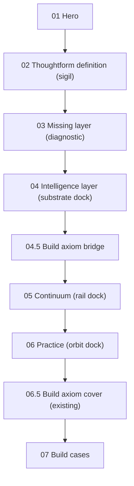

# ADR-012: Intelligence Layer Artifact (replaces asking-gap interstitial)

**Date:** 2026-05-15
**Status:** Accepted

**Related:**
[ADR-008](008-landing-v7-background-layers.md),
[ADR-010](010-brandmark-choreography.md),
[ADR-011](011-brandmark-particle-artifact.md).

---

## Context

Visitors landing on Thoughtform.co arrive without the context that the
internal Aether case has already accumulated. Sections 01–03 set up the
work (hero, definition, missing-layer diagnostic), but nothing on the
public site previously _showed_ what the intelligence layer actually is.
The fourth station was the **Benedict Evans "asking gap" interstitial**
(`#asking-gap`), a single full-viewport editorial quote backed by a
faint particle backdrop of the brandmark.

Two problems with that beat as the answer to the diagnostic:

1. It restates the diagnosis in a third party's voice rather than
   demonstrating Thoughtform's solution. Visitors leave Section 04 with
   the same problem reframed, not with a payload.
2. It hands the brandmark a **decorative** role (faint, dispersed,
   ~0.08 opacity, density 0.22). The brandmark is supposed to be the
   travelling artifact that anchors the page (the
   [legend.xyz](https://legend.xyz) "smartphone with the page" pattern,
   per ADR-010 v2). At the asking-gap it stops _meaning_ anything — it
   is just blur behind a quote.

This ADR replaces `#asking-gap` with **`#intelligence-layer`**, a
vertical three-layer artifact that translates the Aether
Sources / Substrate / Surfaces payload into a Thoughtform-grammar
stacked instrument: trusted sources (Navigate) sit as the upper input
plane, the brandmark **is** the substrate (Encode) at the centre, and
headless surfaces (Build) emerge from the lower output plane.

The brandmark choreography is updated accordingly: the third station
is renamed from `backdrop` to `substrate`, runs at full density (SVG
dock, density 1.0), and parks at a new central anchor inside the
intelligence-layer artifact instead of the asking-gap backdrop slot.

A new lightweight bridge — **`#build-axiom-bridge`** — is inserted
between `#intelligence-layer` and `#continuum`, carrying the
"What I cannot build, I do not understand" line over the Thoughtform
key visual. This is a paced breathing divider, not a duplicate of
the existing `#buildQuote` cover (which remains in place for the
practice → build cover handoff documented in `useLandingScroll.ts`).

---

## Decision

### Scroll order (v7, post-ADR-012)



The old `#asking-gap` station is removed. HUD label `04 Asking gap`
becomes `04 Intelligence layer`. The `#buildQuote` cover sits in the
same DOM position as before (after `#practice`, before `#build`) so
the practice cover-runway handoff in
[`useLandingScroll.ts`](../../components/landing/v7/hooks/useLandingScroll.ts)
keeps working unchanged.

### Brandmark station rename: `backdrop` → `substrate`

[`StationKind`](../../lib/stores/brandmarkParticleStore.ts) becomes:

```ts
export type StationKind = "sigil" | "miss" | "substrate" | "rail" | "orbit";
```

The travel sequence is now:

```
Hero → SIGIL → MISS → SUBSTRATE → RAIL → ORBIT → fade → Hidden
```

The substrate station behaves as a **full-density SVG dock**, not a
backdrop. Updated density tier table (keep in sync with
`PARTICLE_STATION_DEFAULTS` in
[`useSigilChoreography.ts`](../../components/landing/v7/hooks/useSigilChoreography.ts)
and the table in [ADR-011](011-brandmark-particle-artifact.md)):

| Station     | Density | Dispersion | Notes                                                                                                                     |
| ----------- | ------- | ---------- | ------------------------------------------------------------------------------------------------------------------------- |
| `sigil`     | 1.00    | 0.00       | Section 02 diagram centre.                                                                                                |
| `miss`      | 1.00    | 0.00       | Diagnostic 4-card grid centre.                                                                                            |
| `substrate` | 1.00    | 0.00       | **Intelligence-layer central plane.** Larger anchor than the other docks (`clamp(180px, 22vw, 280px)`); SVG dock at rest. |
| `rail`      | 1.00    | 0.00       | Continuum rail.                                                                                                           |
| `orbit`     | 1.00    | 0.00       | Practice orbit centre.                                                                                                    |
| _transit_   | lerped  | bump       | Standard `power3.inOut` lerp + `sin(πt) × 0.45` dispersion bump.                                                          |

`SVG_DOCK_THRESHOLD` is unchanged (0.95). At density 1.0 the substrate
station hands off to the portal'd SVG glyph at its anchor exactly like
sigil / miss / rail / orbit, so the brandmark reads as the canonical
SVG at rest. Transit between miss → substrate and substrate → rail
keeps the particle scatter / re-cohere story.

### New anchor key: `substrate`

[`BrandmarkSystem.tsx`](../../components/landing/v7/BrandmarkSystem.tsx)
registers a fifth `AnchorKey`:

```ts
type AnchorKey = "sigil" | "missing" | "substrate" | "rail" | "orbit";
```

The new section markup carries
`<div class="ilayer__brandmark-anchor" data-brand-anchor="substrate">`,
which the parser strips of placeholder children and into which the
`BrandmarkSystem` portals one canonical `<BrandmarkGlyph>`. The
choreography hook reads the same element via `getSubstrateAnchor` and
parks the actor / writes the substrate snapshot at its rect.

`svgDockAnchorKey("substrate")` returns `"substrate"` (no rename
needed — only `miss` → `"missing"` keeps a legacy mapping).

### CSS gates (added to `landing.css` § Brandmark particle artifact)

```css
[data-brandmark-mode="particle"] .ilayer__brandmark-anchor > :where(img, svg) {
  opacity: 0;
  transition: opacity 200ms ease-out;
}
[data-brandmark-mode="particle"][data-brand-svg-dock="substrate"]
  .ilayer__brandmark-anchor
  > :where(img, svg) {
  opacity: 1 !important;
}
```

These mirror the existing sigil / missing / rail dock gates.

### Section visual treatment (`#intelligence-layer`)

Three vertically stacked planes inside one `100svh` station:

- **Top plane — Navigate / Trusted sources.** Six labelled chips
  arranged loosely above a thin instrument rule: `Brand framework`,
  `Past campaigns`, `Customer research`, `Performance data`,
  `Style guidelines`, `Reviewer notes`.
- **Middle plane — Encode / Substrate (brandmark dock).** A central
  framed plane carrying the substrate brandmark anchor. Four encoded
  bands sit symmetrically around it: `Rules`, `Examples`, `Sources`,
  `Loops`. This is the visual heart of the section; the upper and
  lower planes are supporting annotations.
- **Bottom plane — Build / Headless surfaces.** Six surface chips
  emerge as outputs: `Cursor`, `Claude`, `Web app`, `REST`, `Slack`,
  `Agents`.
- **Connectors.** Fine dotted vertical guides + soft contour lines
  connect the three planes so the section reads as a stacked
  instrument, not a card grid.

Compositing follows ADR-008 in full: the wrapper paints opaque
`var(--void)`, reveal motion runs on inner content only, no
`transform`/`opacity` reveals on the full-bleed wrapper.

### `#build-axiom-bridge` (new lightweight divider)

A short 80svh / auto-height bridge between `#intelligence-layer` and
`#continuum`. It carries:

- The Thoughtform key visual gateway image (
  `/images/Thoughtform_Key Visual_14d.webp`), parallax-tagged at
  `data-parallax=".04"` like the `.build-quote__gateway__img`.
- The line **"What I cannot build, I do not understand."** in a
  modest editorial register (no `del`/`ins` correction interaction,
  no Caltech attribution chrome — that fuller treatment stays at
  `#buildQuote`).

The bridge is **not** the heavy practice cover. The existing
`#buildQuote` keeps its cover-runway role.

### Files touched

- [public/prototypes/v7/landing-v7-motion.html](../../public/prototypes/v7/landing-v7-motion.html) — replace `#asking-gap` markup, insert `#build-axiom-bridge`, update HUD nav label, repoint Section 02 CTA from `#asking-gap` to `#intelligence-layer`.
- [components/landing/v7/landing.css](../../components/landing/v7/landing.css) — retire `.ask*` styles, add `.ilayer*` and `.ilayer-bridge*` styles, add CSS gate for substrate dock anchor, update comments referencing the old backdrop semantic.
- [lib/stores/brandmarkParticleStore.ts](../../lib/stores/brandmarkParticleStore.ts) — `StationKind` rename + `ALL_STATION_KINDS`.
- [components/landing/v7/hooks/useSigilChoreography.ts](../../components/landing/v7/hooks/useSigilChoreography.ts) — `StationKind` rename, `PARTICLE_STATION_DEFAULTS` (substrate at density 1, opacity 1), DOM resolver renamed `getAskAnchor → getSubstrateAnchor`, station list opacity 0.08 → 1.0, `ResizeObserver` updated.
- [components/landing/v7/BrandmarkSystem.tsx](../../components/landing/v7/BrandmarkSystem.tsx) — `AnchorKey` adds `"substrate"`, `BrandmarkParticleCanvas stations={...}` extends to substrate.
- [components/brand/BrandmarkParticleField/BrandmarkParticleCanvas.tsx](../../components/brand/BrandmarkParticleField/BrandmarkParticleCanvas.tsx) — comment updates only.
- [components/landing/v7/lib/brandmarkSingletonCheck.ts](../../components/landing/v7/lib/brandmarkSingletonCheck.ts) — add the substrate anchor selector to `BRANDMARK_RENDER_SELECTORS`.

ADR-010 and ADR-011 narrative text + density / state tables should be
updated in a follow-up to reflect the rename.

---

## Consequences

### Positive

- Section 04 now **demonstrates** the Thoughtform answer instead of
  paraphrasing the problem in a borrowed voice.
- The brandmark is upgraded from "decorative blur" to "the substrate
  itself" at the heart of the artifact, which is the strategic story
  the rest of the page already tells.
- Station name `substrate` matches what the runtime actually paints
  (a dense central artifact), removing the lie embedded in the old
  `backdrop` name.
- The Aether intelligence-layer payload is now legible to first-time
  visitors without the deep operator-case context.
- The lightweight bridge inserts the axiom (`What I cannot build…`)
  earlier in the narrative without disturbing the practice → build
  cover handoff.

### Negative

- Five files change together (store, hook, system, singleton,
  styles). The path-scoped rules in `.cursor/rules/brandmark.mdc` and
  `.claude/rules/` should be re-read before any further edits to
  these files.
- The Feynman axiom now appears in two places (the bridge and the
  buildQuote cover). The treatments differ deliberately, but the
  duplication is a maintenance cost flagged for follow-up.
- The substrate station's anchor is larger than the other docks
  (`clamp(180px, 22vw, 280px)`). The point-size auto-sizing in
  `BrandmarkParticleStation` already handles this via the
  `coverage / fillRatio / visibleCount` formula, but the perf budget
  on low-end mobile should be sampled (the existing `1800` particle
  budget on mobile already keeps fillrate sane at the asking-gap's
  `~640px` anchor size).

---

## Links

- ADR-008 (compositing): [`008-landing-v7-background-layers.md`](008-landing-v7-background-layers.md)
- ADR-010 (choreography): [`010-brandmark-choreography.md`](010-brandmark-choreography.md)
- ADR-011 (particle artifact): [`011-brandmark-particle-artifact.md`](011-brandmark-particle-artifact.md)
- Skills: `.claude/skills/brandmark-choreography/SKILL.md`, `.claude/skills/brandmark-particle/SKILL.md`, `.claude/skills/landing-v7-compositing/SKILL.md`

---

## Amendment v2 — Layered 3D stack (2026-05-15)

### Why amend

The v1 treatment (three flat HTML "planes" stacked vertically with
dotted SVG guides between them) read as three confusing card rows
rather than one layered instrument. Visitors landed on Section 04
without a clear "this is the substrate" visual hit; the brandmark
dock was buried inside a 3-column substrate panel. The user
feedback ("it looks confusing and ugly") matched the diagnosis.

The reference for the new visual is
[sleep-well-creatives.com](https://sleep-well-creatives.com): a
single tilted 3D stack of nested discs, with text annotations
placed around it instead of stacked above it. The same Aether
Sources / Substrate / Surfaces payload now reads as one artifact
with depth, not three cards.

### What changes

- **Section body** in `public/prototypes/v7/landing-v7-motion.html`:
  the three `.ilayer__plane*` blocks, the SVG `.ilayer__guides`,
  and the `.ilayer__substrate` 3-column frame are retired. The new
  body is one `.ilayer__stack` grid with five children:
  - `.ilayer__stack__canvas` (R3F mount slot,
    `data-ilayer-stack-root`)
  - `.ilayer__stack__fallback` (SVG fallback — three flat ellipses
    - thread, visible only when `data-ilayer-mode="static"`)
  - `.ilayer__stack__dock` (positioned dock layer that contains
    the unchanged `.ilayer__brandmark-anchor`)
  - `.ilayer__stack__anno--navigate` (top-left annotation cluster,
    Navigate / Trusted sources)
  - `.ilayer__stack__anno--encode` (centred bottom annotation,
    Encode / Substrate bands + properties)
  - `.ilayer__stack__anno--build` (bottom-right annotation cluster,
    Build / Headless surfaces)

- **R3F module** at
  `components/landing/v7/intelligence-layer/`:
  - `IntelligenceLayerStack.tsx` — orthographic R3F canvas with
    three nested ring meshes (Navigate top, Encode middle, Build
    bottom) plus a thin vertical thread. Each ring is a halo fill +
    hairline edge. Per-frame `useFrame` reads the scroll-progress
    store and drives X-axis tilt (head-on at 0 → ~26° at 1) + Y-axis
    split (collapsed at 0 → ±1.05 disc-radii at 1) + opacity fade-in.
  - `IntelligenceLayerPortal.tsx` — `createRoot` into the
    `[data-ilayer-stack-root]` placeholder, mirroring
    `BuildCasesPortal`. Owns the static-fallback gate and the
    scroll-progress trigger.
  - `useIlayerProgress.ts` — Zustand store +
    `gsap/ScrollTrigger` pinned to `#intelligence-layer`
    (`top 80%` → `bottom 20%`, `scrub: true`). Sets
    `data-ilayer-state="open"` on `.ilayer__stack` when progress
    crosses 0.4 (with hysteresis at 0.3 on back-scroll).
  - `index.ts` — barrel.

- **`LandingPage.tsx`** — adds `<IntelligenceLayerPortal />` next
  to `<BuildCasesPortal />`, mounted before `<BrandmarkSystem />`
  so the substrate dock anchor's grid placement settles before the
  choreography hook reads its rect on first measure.

- **CSS** in `components/landing/v7/landing.css`:
  retired `.ilayer__plane*` / `.ilayer__chips*` / `.ilayer__bands*`
  / `.ilayer__guides` / `.ilayer__substrate` / `.ilayer__props`.
  Added `.ilayer__stack*` (grid layout, annotation positioning,
  static fallback, dock layer, mobile collapse).

### Brandmark contract — unchanged

The substrate dock anchor is still
`<div class="ilayer__brandmark-anchor" data-brand-anchor="substrate">`,
still inside `#intelligence-layer`, still
`clamp(180px, 22vw, 280px)`. It now lives inside
`.ilayer__stack__dock` (a positioned grid cell on top of the
canvas) so the anchor centres exactly over the encode disc, but
[`useSigilChoreography.ts`](../../components/landing/v7/hooks/useSigilChoreography.ts)
still resolves it via
`intelligenceEl.querySelector(".ilayer__brandmark-anchor")` and
parks the actor at its rect at full density. No hook change. No
particle store change. The encode ring's inner radius (0.62) is
sized so the brandmark sits cleanly inside the ring's hole — the
disc reads as a luminous halo around the canonical SVG glyph.

### Mode toggle

The portal writes `data-ilayer-mode="r3f" | "static"` on
`.ilayer__stack` based on three checks evaluated on mount and on
each preference / resize change:

1. `prefers-reduced-motion: reduce` → static
2. viewport width ≤ 767px → static
3. WebGL context fails to acquire → static

In static mode the portal does not `createRoot`; the SVG fallback
inside `.ilayer__stack__fallback` is revealed by CSS via the
`data-ilayer-mode="static"` attribute. The annotation clusters
still fade in via the `[data-ilayer-state="open"]` attribute set by
the scroll-progress hook (the hook runs in both modes), so the
content payload remains legible.

### Compositing — ADR-008 holds

- The R3F canvas mounts inside `.ilayer__inner` (a positioned
  descendant of the opaque `.ilayer` shield). It never paints on
  the bleed wrapper, so no transparency reveal exposes the gateway
  radial.
- Canvas style is `position: absolute; inset: 0; pointer-events:
none` so it never blocks scroll and never participates in opacity
  reveals on the wrapper.
- The `.ilayer__inner[data-m="instrument"]` reveal still drives the
  inner column's fade; the canvas (z:1) and dock (z:3) are children
  of the inner column and inherit its opacity transition without
  exposing the shield.

### Files touched in v2

- [`public/prototypes/v7/landing-v7-motion.html`](../../public/prototypes/v7/landing-v7-motion.html) — replaced `.ilayer__artifact` inner body.
- [`components/landing/v7/landing.css`](../../components/landing/v7/landing.css) — retired `.ilayer__plane*` block, added `.ilayer__stack*` block.
- [`components/landing/v7/LandingPage.tsx`](../../components/landing/v7/LandingPage.tsx) — added `<IntelligenceLayerPortal />` mount.
- `components/landing/v7/intelligence-layer/IntelligenceLayerStack.tsx` — NEW.
- `components/landing/v7/intelligence-layer/IntelligenceLayerPortal.tsx` — NEW.
- `components/landing/v7/intelligence-layer/useIlayerProgress.ts` — NEW.
- `components/landing/v7/intelligence-layer/index.ts` — NEW.
- `.claude/skills/landing-v7-compositing/SKILL.md`, `.claude/skills/brandmark-choreography/SKILL.md` — short notes about the new R3F mount and the unchanged dock contract.

---

## Amendment v3 — Brandmark IS the middle layer (2026-05-15)

### Why amend (again)

v2 mapped the Aether substrate-map payload onto the artifact (three R3F discs flanked by four annotation clusters with chips, bands, properties). Walking the live page revealed the same problem v1 had in a different costume: the chip/band wall pulled focus away from the artifact, and visitors read it as a card grid in 3D rather than one centerpiece. The reference for the fix is again [sleep-well-creatives.com](https://sleep-well-creatives.com): one tilted layered artifact carrying the visual story, with all framing copy living above and below it as headline + closer — not floating around it as labels.

### What changes from v2

- **Annotation clusters removed.** The three `.ilayer__stack__anno*` blocks (Navigate / Encode / Build) and all their chips, bands, and properties are gone. The section's editorial frame now lives entirely in `.ilayer__head` (eyebrow + title + lede) above the artifact and `.ilayer__closer` below it.

- **Brandmark IS the middle layer.** The substrate dock anchor (unchanged in name and choreography contract) is now the visual middle layer of the artifact. Two R3F rings emerge from its centre as the section enters view — Navigate above, Build below. Three layers total: navigate ring + brandmark + build ring.

- **The artifact tilts back on X as a single instrument.** The R3F group and the DOM brandmark anchor both lerp from `0deg` (head-on) to `~22deg` (tilted toward the camera) and back to `0deg` across the section's scroll progress. The R3F group's rotation and the dock's `--ilayer-tilt-deg` CSS variable are written by the same envelope function so they stay in lockstep — the rings and the brandmark always share one tilt.

- **Tilt envelope returns to 0 by progress 1.** Shape: `0 → 1` across `[0.00..0.50]`, hold at `1` across `[0.50..0.85]`, ease back to `0` across `[0.85..1.00]`. This guarantees the brandmark anchor's `getBoundingClientRect()` is axis-aligned (not the rotated bbox) by the time the choreography hook starts the substrate-to-rail transit, so the actor's `pinToRect` source rect stays correct.

- **CSS tilt is on the children, not the anchor.** `.ilayer__brandmark-anchor img, .ilayer__brandmark-anchor svg { transform: rotateX(var(--ilayer-tilt-deg, 0deg)); }` — the anchor element itself is never rotated, so the choreography hook's bbox read is always axis-aligned even mid-tilt.

- **Layout simplified to a single grid cell.** `.ilayer__stack` is now `grid-template-areas: "canvas"` with three siblings sharing that cell: the R3F mount, the SVG fallback (only painted when `data-ilayer-mode="static"`), and the dock layer holding the brandmark anchor. No more 3-column / 3-row grid, no more diagonal annotation positioning.

- **Brandmark anchor sized up.** `clamp(180px, 22vw, 280px)` → `clamp(220px, 26vw, 320px)` so the brandmark reads as the dominant centre of the stack, with the navigate / build rings emerging just outside it.

### Brandmark contract — still unchanged

`<div class="ilayer__brandmark-anchor" data-brand-anchor="substrate">` is still inside `#intelligence-layer`, still resolved by `useSigilChoreography.ts` via `intelligenceEl.querySelector(".ilayer__brandmark-anchor")`. The substrate station's density / opacity / dispersion stay at full SVG dock. No hook changes. No particle store changes. The anchor's own bbox stays axis-aligned at all scroll positions because the rotation lives on the anchor's children.

### Files touched in v3

- [`public/prototypes/v7/landing-v7-motion.html`](../../public/prototypes/v7/landing-v7-motion.html) — removed three `.ilayer__stack__anno*` blocks, simplified the SVG fallback to no thread.
- [`components/landing/v7/landing.css`](../../components/landing/v7/landing.css) — retired `.ilayer__stack__anno*`, `__chips*`, `__bands*`, `__band*`, `__props*`, `__prop` styles. Simplified `.ilayer__stack` grid to one `"canvas"` cell. Added `perspective: 900px` on `.ilayer__artifact` and `transform: rotateX(var(--ilayer-tilt-deg, 0deg))` on the brandmark anchor's children. Sized the anchor up to `clamp(220px, 26vw, 320px)`.
- [`components/landing/v7/intelligence-layer/IntelligenceLayerStack.tsx`](../../components/landing/v7/intelligence-layer/IntelligenceLayerStack.tsx) — rebuilt as TWO rings (navigate + build) emerging from the brandmark's centre. Removed the encode ring and the central thread. Added the `tiltEnvelope(progress)` 0 → 1 → 0 shape and the `MAX_TILT_RAD` / `MAX_TILT_DEG` constants the hook keeps in lockstep.
- [`components/landing/v7/intelligence-layer/useIlayerProgress.ts`](../../components/landing/v7/intelligence-layer/useIlayerProgress.ts) — writes `--ilayer-tilt-deg` on the brandmark anchor each scroll frame using a duplicate `tiltEnvelope` (same shape as the R3F module's). Removed the `data-ilayer-state="open"` attribute (no annotations to gate any more).

---

## Amendment v4 — Bottom-pinned podium with brandmark morph (2026-05-15)

### Why amend (yet again)

v3 read better than v2 — one centerpiece, brandmark as the encode layer — but the artifact was still a centred medium-sized object floating in the middle of the viewport with the title above and the closer below. Walking the page with the [sleep-well-creatives.com](https://sleep-well-creatives.com/) section-05 reference open made one thing obvious: the podium needs to **own the bottom of the viewport** at full width so the discs read as the floor of the page, not as a decorative widget. Sleep-well's discs span ~92vw and pin to the bottom; the upper viewport is given over to floating annotation labels with hairline connectors that drop into each disc. The brandmark is a small fixed mark at the top, not a dominant centre.

This amendment reshapes ADR-012 along those lines while keeping every choreography contract from v2/v3 intact.

### What changes from v3

- **Layout flips from centred to bottom-pinned.** `.ilayer__artifact` is now `position: absolute; inset: auto 0 0 0; width: 100vw; height: clamp(360px, 52svh, 560px)`. The discs span the full viewport width with the largest (`build`) hugging the floor.

- **Discs are real 3D cylinders, not flat ellipses.** `IntelligenceLayerStack.tsx` now renders three `THREE.CylinderGeometry` discs with visible rim thickness (build outer radius 1.00 / encode 0.62 / navigate 0.36, all height ~0.06–0.07 in scene units). Sleep-well's footer credits "DESIGN, DEVELOPMENT, **3D ASSETS**" — the rim depth on each disc is what makes the artifact read as physical. Materials switch from `MeshBasicMaterial` to `MeshStandardMaterial` so the rim/face contrast catches the lighting; new `ambientLight` + warm key + cool fill are added to support the standard material.

- **Camera switches from orthographic to perspective at slight elevation.** `PerspectiveCamera` at `position [0, 1.6, 4.2]`, `fov: 28`, `lookAt [0, 0.4, 0]` — gives the 3/4 read where you can see the disc tops. The "tilt" envelope now drives the **podium group's** X-rotation (visually equivalent to pitching the camera, but simpler to wire because the camera is set on `<Canvas>`, not a scene node).

- **Sequential disc reveal.** The discs deploy in order — build first (`reveal: [0.18..0.42]`), then encode (`[0.30..0.55]`, synced with the brandmark fade-out), then navigate (`[0.42..0.65]`). Reads as the podium "stacking itself" instead of all three popping at once.

- **Brandmark morphs INTO the encode disc.** The visual heart of v4: the SVG mark starts at upper-center (where v3 had it), then descends + scales toward the encode disc's projected screen rect across `BRAND_MORPH.descend = [0.20..0.55]`, while crossfading to opacity 0 across `BRAND_MORPH.crossfade = [0.45..0.60]`. The encode disc fades in over `[0.30..0.55]`, so the mark dissolves AS the disc appears at the same screen rect — visual substitution. Past the morph, the brandmark is invisible; the encode disc carries the identity.

- **Floating annotation labels return.** Four `.ilayer__label` blocks (`--navigate / --encode / --build / --closer`) absolute-positioned around the upper viewport with SVG hairline connectors that draw in via `stroke-dashoffset` keyed on `--ilayer-progress`. Each label fades in shortly before its matching disc fades in (gates declared per-modifier in `landing.css`). The lede + closer copy from v3 splits across the four labels — the title above and the labels do the editorial work the v3 lede + closer used to do.

- **The substrate anchor's RECT is non-stationary across the section.** The anchor element is `position: absolute` with `transform: translateX(-50%) translate(--ilayer-anchor-x, --ilayer-anchor-y) scale(--ilayer-anchor-scale)`. `useIlayerProgress` writes those three variables every scroll frame, sourcing the encode disc's live screen rect from `useIlayerGeomStore` (the R3F scene projects the encode disc into client coords each frame). Because `useSigilChoreography` resolves the anchor lazily and reads `getBoundingClientRect()` live, the actor follows the anchor's descent automatically — no choreography-hook change needed.

### New shared geometry module

`components/landing/v7/intelligence-layer/intelligenceLayerGeom.ts` — single source of truth for:

- `DISC_GEOM` (per-disc outerR / height / y / colour / metalness / roughness / reveal window / hole ratio)
- `CAMERA_PARAMS` (fov / position / lookAt)
- `BRAND_MORPH` (descend window / crossfade window / max tilt deg)
- `tiltEnvelope(progress)`, `smoothstep(...)` — duplicated from v3, now exported once
- `useIlayerGeomStore` — Zustand store the R3F scene writes the live encode rect into; the progress hook reads from it

### Brandmark contract — still unchanged at the JS level

`<div class="ilayer__brandmark-anchor" data-brand-anchor="substrate">` is still resolved by `useSigilChoreography.ts` via `intelligenceEl.querySelector(".ilayer__brandmark-anchor")`. The substrate station's density / opacity / dispersion stay at full SVG dock. The new contract subtlety is that the anchor's RECT moves during the section — but the choreography hook already reads it live every frame, so this is transparent. A comment was added at `getSubstrateAnchor()` documenting the new contract so future maintainers don't "fix" the anchor to a static center.

The dock-state opacity gate is now multiplied by `--ilayer-brand-opacity` so the morph crossfade wins over the dock state's `opacity: 1 !important` (a higher-specificity overriding rule replaces the literal `1` with `var(--ilayer-brand-opacity, 1)`).

### Compositing — ADR-008 still holds

The R3F canvas mounts inside `.ilayer__inner` as before; the bleed wrapper stays opaque. Labels and brandmark sit above the canvas on z-index but neither carries `[data-m]` so the wrapper's reveal isn't exposed. The podium and labels are inside `.ilayer__inner` so the v7-parser's `` strip rule still matches the brandmark anchor.

### Files touched in v4

- [`public/prototypes/v7/landing-v7-motion.html`](../../public/prototypes/v7/landing-v7-motion.html) — restructured `.ilayer__inner`: removed `.ilayer__stack__dock` wrapper around the brandmark anchor (the anchor is now a direct sibling of `.ilayer__artifact`); added `.ilayer__labels` with four `.ilayer__label` blocks (each containing eyebrow, body, and an inline SVG connector path); rewrote `.ilayer__stack__fallback` ellipses for the new vertically-stacked podium geometry.
- [`components/landing/v7/landing.css`](../../components/landing/v7/landing.css) — replaced the entire `.ilayer*` block: `.ilayer__inner` → absolute stage, `.ilayer__head` → top-center positioned, new `.ilayer__labels` + `.ilayer__label*` rules with per-label position + reveal gates, `.ilayer__artifact` → bottom-pinned full-viewport-width, `.ilayer__brandmark-anchor` → absolute upper-center with new transform-driving CSS variables, dock-state opacity gate multiplied by `--ilayer-brand-opacity`, mobile collapse to stacked column without connectors.
- [`components/landing/v7/intelligence-layer/intelligenceLayerGeom.ts`](../../components/landing/v7/intelligence-layer/intelligenceLayerGeom.ts) — NEW. `DISC_GEOM` / `CAMERA_PARAMS` / `BRAND_MORPH` constants, `tiltEnvelope` + `smoothstep` helpers, `useIlayerGeomStore` Zustand store.
- [`components/landing/v7/intelligence-layer/IntelligenceLayerStack.tsx`](../../components/landing/v7/intelligence-layer/IntelligenceLayerStack.tsx) — rewritten end-to-end: three `CylinderGeometry` discs with `MeshStandardMaterial`, ambient + directional lighting, `PerspectiveCamera` at slight elevation, `Disc` component, podium group with X-rotation envelope, `EncodeRectReporter` that projects the encode disc's screen rect into `useIlayerGeomStore` each frame.
- [`components/landing/v7/intelligence-layer/useIlayerProgress.ts`](../../components/landing/v7/intelligence-layer/useIlayerProgress.ts) — extended to write `--ilayer-progress` on the section root and `--ilayer-anchor-x` / `--ilayer-anchor-y` / `--ilayer-anchor-scale` / `--ilayer-brand-opacity` on the anchor each frame; reads encode rect from `useIlayerGeomStore` (with synthetic rect fallback for static mode).
- [`components/landing/v7/intelligence-layer/index.ts`](../../components/landing/v7/intelligence-layer/index.ts) — re-exports the geom module.
- [`components/landing/v7/hooks/useSigilChoreography.ts`](../../components/landing/v7/hooks/useSigilChoreography.ts) — added a comment block on `getSubstrateAnchor()` documenting the new "anchor moves during section" contract. No behavior change.
- [`.claude/skills/brandmark-choreography/SKILL.md`](../../.claude/skills/brandmark-choreography/SKILL.md) — note about the substrate anchor's non-stationary rect across the section.

---

## Amendment v5 — Brandmark ringfield, ONE artifact, no crossfades (2026-05-15)

### Why amend (yet again)

v4's bottom-pinned podium of cylinders read as off-brand. The brand reference docs (`celestial-diagram-grammar.md`, `identity-system.md`, `data-visualization.md`) explicitly call out solid disc fills, PBR materials, and smooth-shaded surfaces as anti-patterns; v4 violated all three. More fundamentally, v4's "morph the brandmark into the encode disc via opacity crossfade" pattern treated the brandmark as TWO different paint sources that needed swapping — a UI compositing pattern, not a transformation of a single artifact. The user's design philosophy is that the brandmark IS pure code (per ADR-011), and it should physically transform between shapes, not be re-painted.

This amendment rewrites the section under three principles:

1. **ONE artifact, pure code.** The brandmark in this section is the SAME brandmark that lives at every other station — particles sampled from `BRANDMARK_FILLED_PATHS` (per ADR-011). The R3F scene's particle cloud and the global brandmark canvas share the same data source.
2. **Transform geometrically, never composite.** Major scene elements (rings, ticks, diamonds, flow arcs, the brandmark cloud) appear / disappear via translation / scale / rotation, NEVER via `material.opacity` ramps. Opacity is reserved only for ambient breathing on autonomous decoration.
3. **Hard swaps at section boundaries, never crossfades.** The boundary handoffs between the global brandmark painter and the local R3F ringfield are atomic CSS attribute toggles. Visual identity matches at the swap instant (same data source, same colour, same screen pixels), so the swap reads as visual continuity, not as a fade.

### What changes from v4

- **Discs replaced with hairline rings.** Three coaxial `THREE.LineLoop` rings (Navigate / Encode / Build) rendered with `LineBasicMaterial` only. No `RingGeometry` solid fills, no `CylinderGeometry`, no `MeshStandardMaterial`, no PBR lighting. Pure hairline strokes per the brand grammar.

- **Brandmark is a 3D particle cloud.** New `brandmarkParticles.ts` calls the same `sampleShape` utility against the same `BRANDMARK_FILLED_PATHS` as the global brandmark canvas. The cloud sits in a 2D plane at local z=0 within the parent group, rendered as a `THREE.Points` mesh with `PointsMaterial` (size in pixels, fixed, square fragments — the default GL_POINT shape matches the global station's solid-square fragment shader). NO CanvasTexture, NO flat plane with a baked image. Same data source, same colour (`--gold`), so the boundary swap is visually invisible.

- **One scalar drives everything.** `splitProgress` (from the section's scroll trigger) feeds a single `splitRotation()` envelope (parent group `rotation.y`) and a single `splitExtrude()` envelope (per-ring `position.z` plus child `scale.setScalar()` for ticks / diamonds). No per-element opacity envelopes for major scene elements.

- **Geometric extrusion, not opacity reveal.**
  - Side rings translate from `z=0` (coincident at section entry) to `±0.32` (full split at peak rotation), then RETRACT back to `z=0` at section exit so the brandmark hands off to the rail morph from a unified state.
  - Bearing ticks and diamond markers use `scale.setScalar(extrude)` so they grow with the ring's emergence and shrink with its retraction. Scale 0 = invisible because there is no size, not because of opacity.
  - Flow arcs (Navigate→Encode and Encode→Build) have their geometry rebuilt every frame from the rings' live world positions; length 0 when rings are coincident, full length at peak split. Geometric absence, not opacity 0.

- **Sub-orbits + halo dots around the brandmark** (Section 02 sigil grammar). Concentric `LineLoop` hairlines in `--dawn-30`, with halo diamond markers in `--gold` at cardinal positions. Wrapped in a spin group that rotates autonomously on Z (independent of scroll) for the celestial breath that matches `.sigil__orbits`.

- **HARD SWAP at boundaries via attribute toggle.** `IntelligenceLayerPortal` writes `data-ilayer-mode="r3f"` on BOTH `.ilayer__stack` AND `#intelligence-layer` (the section element) when the canvas mounts. A new CSS rule:

  ```css
  #intelligence-layer[data-ilayer-mode="r3f"] .ilayer__brandmark-anchor > :where(img, svg) {
    opacity: 0 !important;
    transition: none !important;
  }
  ```

  hides the SVG dock the moment the canvas mounts, with NO transition. The R3F particle cloud takes over at exactly the same pixels (the substrate anchor is sized from the encode ring's projected rect by `useIlayerProgress` on init / resize). On section exit, when the canvas unmounts, the attribute is removed and the SVG dock returns instantly. Both swaps happen with zero fade window.

- **Anchor sizing matches the projected encode ring.** `useIlayerProgress` reads `useIlayerGeomStore.encodeRect` (populated by the R3F scene's `EncodeRectReporter`) and writes inline `top` / `left` / `width` / `height` on `.ilayer__brandmark-anchor`. The fallback CSS layout (centred upper-area, `clamp` size) shows for the first few frames before the first sizeAnchor() call. The anchor's `transform: translateX(-50%)` fallback is cleared by the JS write so positioning stays clean.

- **All v4 CSS variables removed.** No more `--ilayer-tilt-deg`, `--ilayer-anchor-x`, `--ilayer-anchor-y`, `--ilayer-anchor-scale`, `--ilayer-brand-opacity`. The progress hook only writes `--ilayer-progress` (for the floating-label opacity gates, which are HTML labels not major scene elements). The dock-state opacity gate `[data-brand-svg-dock="substrate"] ... { opacity: var(--ilayer-brand-opacity, 1) !important }` from v4 is removed; the v5 hard-swap rule wins via specificity (`#intelligence-layer` ID > `[data-brandmark-mode]` attribute).

- **Static SVG fallback rewritten.** Three concentric hairline circles (`fill="none"`) with bearing ticks (8 on build, 4 on navigate) and diamond markers — matches the R3F composition at rest. Visible only in static-fallback mode (mobile / reduced-motion / no-WebGL). The R3F-mounted state hides this fallback as before.

### Brandmark choreography contract — still unchanged at the JS level

`<div class="ilayer__brandmark-anchor" data-brand-anchor="substrate">` is still resolved by `useSigilChoreography.ts` via `intelligenceEl.querySelector(".ilayer__brandmark-anchor")`. The substrate station's density / opacity / dispersion stay at full SVG dock. The anchor's RECT is now STATIC (not descending as in v4); the rail handoff at section exit reads from this static rect. Comment block on `getSubstrateAnchor()` updated to describe the v5 contract.

### Files touched in v5

- [`components/landing/v7/intelligence-layer/intelligenceLayerGeom.ts`](../../components/landing/v7/intelligence-layer/intelligenceLayerGeom.ts) — replaced `DISC_GEOM` / `BRAND_MORPH` with `RING_GEOM` / `SPLIT_ENVELOPE` / `SUB_ORBIT_RADII` / `HALO_DOT_COUNT` / `PARTICLE_COUNT` / `BRAND_PARTICLE_COLOR` / `BRAND_PARTICLE_SIZE_PX` / `BRAND_SCALE` / `DIAMOND_SIZE` / `TICK_LENGTH` / `RING_SEGMENTS` / `SUB_ORBIT_SPIN_RATE`. Added `splitRotation()` and `splitExtrude()` envelope helpers. Camera params eased (fov 32, position [0, 0.6, 3.4]).
- [`components/landing/v7/intelligence-layer/brandmarkParticles.ts`](../../components/landing/v7/intelligence-layer/brandmarkParticles.ts) — NEW. Builds the brandmark `BufferGeometry` + `PointsMaterial` from `BRANDMARK_FILLED_PATHS` via `sampleShape`. Same data source as the global brandmark canvas (per ADR-011).
- [`components/landing/v7/intelligence-layer/BrandmarkRingfield.tsx`](../../components/landing/v7/intelligence-layer/BrandmarkRingfield.tsx) — NEW. The v5 R3F scene: parent group + brandmark cloud + sub-orbits + halo dots + three RingHairline `LineLoop`s with bearing ticks + diamond markers + flow arcs + EncodeRectReporter. Single `useFrame` writes only `parentGroup.rotation.y` + per-ring `position.z` + child `scale.setScalar()`.
- [`components/landing/v7/intelligence-layer/IntelligenceLayerStack.tsx`](../../components/landing/v7/intelligence-layer/IntelligenceLayerStack.tsx) — rewritten as a thin Canvas wrapper around `BrandmarkRingfield`. Drops cylinder Disc components and lighting.
- [`components/landing/v7/intelligence-layer/useIlayerProgress.ts`](../../components/landing/v7/intelligence-layer/useIlayerProgress.ts) — simplified. Drops all per-frame opacity writes. Now only writes `--ilayer-progress` on section root + sizes the substrate anchor from the encode rect on init / resize / store changes.
- [`components/landing/v7/intelligence-layer/IntelligenceLayerPortal.tsx`](../../components/landing/v7/intelligence-layer/IntelligenceLayerPortal.tsx) — also writes `data-ilayer-mode` on the section element (in addition to `.ilayer__stack`) so the v5 hard-swap CSS rule can reach the brandmark anchor.
- [`components/landing/v7/intelligence-layer/index.ts`](../../components/landing/v7/intelligence-layer/index.ts) — re-exports the new geom module surface + `BrandmarkRingfield` + `buildBrandmarkParticles`.
- [`components/landing/v7/landing.css`](../../components/landing/v7/landing.css) — replaced the v4 `.ilayer*` block with v5: anchor sized from JS (no transform-driven CSS variables), hard-swap rule via `#intelligence-layer[data-ilayer-mode="r3f"]`, hairline static fallback styles. Removed v4 dock-state override rule.
- [`public/prototypes/v7/landing-v7-motion.html`](../../public/prototypes/v7/landing-v7-motion.html) — rewrote `.ilayer__stack__fallback` SVG: three concentric circles + bearing ticks + diamond markers (was three vertically-offset filled ellipses).
- [`components/landing/v7/hooks/useSigilChoreography.ts`](../../components/landing/v7/hooks/useSigilChoreography.ts) — updated comment block on `getSubstrateAnchor()` for v5 contract. No behavior change.
- [`.claude/skills/brandmark-choreography/SKILL.md`](../../.claude/skills/brandmark-choreography/SKILL.md) — substrate-dock paragraph updated for v5 (SVG glyph hidden via attribute gate, anchor sized from JS).

---

## Amendment v5b — Imperative SVG dock mask, R3F always renders (2026-05-15)

### Why amend (third time, same day)

After v5 deployed the user reported that the brandmark "isn't really transitioning" — when scrolling from the diagnostic section into the intelligence-layer, the section's brandmark felt "still there" before they had scrolled into it. They expected `everything needs to transition into each other`.

Two underlying issues:

1. **The hard-swap CSS rule was unreliable.** The selector `#intelligence-layer[data-ilayer-mode="r3f"] .ilayer__brandmark-anchor > :where(img, svg) { opacity: 0 !important }` was brittle in practice because the `[data-brandmark-mode="particle"][data-brand-svg-dock="substrate"]` dock-state gate also sets `opacity: 1 !important` on the same SVG with comparable specificity, and the dock-state gate sometimes won the cascade depending on rule declaration order and which attribute was set first by HMR. The result: the SVG dock and the R3F particle cloud both painted the brandmark at the substrate anchor at the same instant, which is what the user saw.

2. **The `data-ilayer-mode` attribute was sometimes missing on the section element.** The portal cached the section ref at mount time, but Fast Refresh / HMR re-renders the v7 prototype HTML (it is rendered via `dangerouslySetInnerHTML` from `lib/v7-parse.ts`), which replaces the section element. The cached ref then pointed at the detached node and `setAttribute()` was a no-op on the live DOM.

### What changes from v5

- **Hard-swap CSS rule replaced with imperative inline style.** `IntelligenceLayerPortal` now exposes `applyR3FDockMask(mask: boolean)` which calls `el.style.setProperty("opacity", "0", "important")` (and the matching transition disable) on the substrate anchor's direct `` and `<svg>` children. Inline `!important` styles beat stylesheet `!important` styles of any specificity per the CSS cascade, so the dock-state gate cannot override us. The mask is applied on every `evaluate()` call (including mount, MQ change, and explicit re-evaluation) and on every BrandmarkSystem re-portal via a `MutationObserver` on the substrate anchor's children.

- **`#intelligence-layer[data-ilayer-mode="r3f"] ...` CSS rule removed.** Replaced with a comment in `landing.css` pointing at `applyR3FDockMask()` so future maintainers understand why the rule moved out of CSS.

- **Section element re-queried on every `evaluate()` call.** The portal no longer caches the section ref from mount time; it calls `container.querySelector("#intelligence-layer")` inside `evaluate()` so the live element is always targeted. Same for cleanup. This was the root cause of "`sectionAttr: (none)` even though portal logged `sectionAttrAfter: r3f`" — the cached ref was stale.

- **R3F visibility gate simplified.** The `useFrame` no longer toggles `parentGroup.visible` based on `data-brand-svg-dock`. The R3F always paints whenever the canvas is mounted; the natural DOM clipping of the section element (`.ilayer__artifact { inset:0 }` inside `#intelligence-layer { height: 100svh }`) keeps the ringfield from being seen from sections above or below. The earlier attempt to gate on the choreography's substrate park state was too restrictive — the substrate park zone is a narrow scroll range and didn't align with the section's `top 80% / bottom 20%` ScrollTrigger window, so the R3F never appeared in normal scrolling.

### What this fixes vs. what's still inherent

Fixed:

- The "two brandmarks at the substrate position" perception. The SVG dock is now reliably hidden whenever the canvas is mounted; the R3F particle cloud is the SOLE painter for the section's read beat.

Still inherent (and intentional):

- The R3F brandmark + rings can be seen at the bottom of the viewport when the section first enters from below, while the diagnostic section is still partially visible at the top. This is a property of the stacked-section layout: any in-section content (HUD frame, labels, diagram) reads the same way during the entry seam. The composition is consistent with how the rest of the page handles section seams.

### Files touched in v5b

- [`components/landing/v7/intelligence-layer/IntelligenceLayerPortal.tsx`](../../components/landing/v7/intelligence-layer/IntelligenceLayerPortal.tsx) — added `applyR3FDockMask()` helper and a `MutationObserver` on the substrate anchor that re-applies the mask whenever its children change (BrandmarkSystem re-portals after Fast Refresh / route nav). Re-queries the section element on every `evaluate()` call and on cleanup. Cleanup also calls `applyR3FDockMask(false)` to restore the SVG's CSS-controlled visibility.
- [`components/landing/v7/intelligence-layer/BrandmarkRingfield.tsx`](../../components/landing/v7/intelligence-layer/BrandmarkRingfield.tsx) — removed the per-frame `parent.visible` gate. The R3F scene paints unconditionally while the canvas is mounted; the section's DOM box clips it to the section's bounds.
- [`components/landing/v7/landing.css`](../../components/landing/v7/landing.css) — replaced the v5 hard-swap rule with a comment block pointing at `applyR3FDockMask()`. The cascade-fragile attribute-selector approach is gone.

---

## Amendment v5c — Handoff-aligned R3F window (2026-05-15)

### Why amend (fourth time, same day)

After v5b the SVG / R3F double-paint at the substrate anchor was solved, but the user reported that scrolling from `#missing-layer` into `#intelligence-layer` still didn't read as a smooth transition: "it then disappears and then, all of a sudden, the fix is intelligence layer appears". The brandmark **morphed** into substrate (via the global particle field's miss → substrate transit) but the local R3F brandmark was already mid-rotation by the time the morph arrived, so the swap from "flat morphing cloud" to "rotating R3F cloud" read as a discontinuity.

The two timing systems were running independently:

- The brandmark choreography reaches `parkAt(substrate)` roughly at `scrollY ≈ miss.offsetTop + 68vh` — when the intelligence section is still 32vh below viewport top.
- The R3F ringfield's ScrollTrigger window was `top 80% → bottom 20%` (≈ 160vh span). At that same scrollY the R3F `progress` was already ≈ 0.30 — heading into the EXTRUDE beat with rotation around -22°.

The local R3F brandmark cloud was visible **and rotated** at the exact moment the global particle field handed it ownership.

A second compounding issue: `BrandmarkRingfield`'s parent group was set to `visible: true` unconditionally (per v5b's "natural DOM clipping" assumption). So even before the global particle field arrived at substrate, the user could already see the local R3F brandmark cloud rotating in the lower viewport — two brandmarks at once during the entry seam.

### What changes from v5b

- **Substrate-aligned R3F progress.** [`useIlayerProgress`](../../components/landing/v7/intelligence-layer/useIlayerProgress.ts) now derives `progress` from the live substrate-parked scroll range published by [`useSigilChoreography`](../../components/landing/v7/hooks/useSigilChoreography.ts), via two new fields on [`useIlayerProgressStore`](../../components/landing/v7/intelligence-layer/useIlayerProgress.ts):

  ```ts
  interface IlayerProgressState {
    // …
    handoffActive: boolean;
    substrateRange: { engageY: number; exitY: number } | null;
  }
  ```

  - `progress = 0` at the moment the global particle field hands ownership to the local R3F (substrate park engage = `c[miss] + (1 - PARK_FRAC) * (c[substrate] - c[miss])`).
  - `progress = 1` at the moment the local R3F hands ownership back to the global particle field for the substrate → rail transit (substrate park exit = `c[substrate] + PARK_FRAC * (c[rail] - c[substrate])`).

  At both instants `splitRotation` returns `0` (per its rotate-only `[0..0.30]` and handoff `[0.92..1.00]` beats), so the R3F brandmark cloud is axis-aligned at both swap moments and reads as visual continuity with the global field.

  A `top 80% → bottom 20%` ScrollTrigger window is kept as a fallback for the first few frames after mount when `useSigilChoreography` hasn't published the range yet.

- **Handoff-gated R3F visibility.** [`BrandmarkRingfield`](../../components/landing/v7/intelligence-layer/BrandmarkRingfield.tsx)'s `useFrame` reads `handoffActive` from the store and sets `parent.visible = handoffActive`. Outside the substrate-parked window the entire R3F scene is invisible; the global particle field is the sole painter. Inside it, the R3F scene paints (with the brandmark cloud axis-aligned at the engage/exit instants and rotating in between).

  This restores the v5-era visibility gate but ties it to the **brandmark journey state** instead of the section's own ScrollTrigger progress. The `parent.visible` gate is the only paint-control; we still don't ramp `material.opacity` for any major scene element.

- **No DOM/CSS changes.** The same `applyR3FDockMask` keeps the substrate SVG hidden in particle mode; no rule-set change in `landing.css`. The R3F brandmark cloud's coordinates still match the encode ring's projected rect, which still matches the substrate anchor's CSS rect.

### Painter table (v5c — current)

| Scroll window                                 | Painter                                           | Notes                                                                                                                                                            |
| --------------------------------------------- | ------------------------------------------------- | ---------------------------------------------------------------------------------------------------------------------------------------------------------------- |
| `scrollY < missEngageY`                       | global particle field at `sigil` / `miss` slot    | source-owned dock SVG via `data-brand-svg-dock`                                                                                                                  |
| `missEngageY ≤ scrollY < substrateEngageY`    | global particle field, transit `miss → substrate` | dispersion bump; R3F invisible (`handoffActive = false`)                                                                                                         |
| `substrateEngageY ≤ scrollY ≤ substrateExitY` | local R3F ringfield + brandmark cloud             | global particle silenced (snapshot `opacity 0`); SVG dock masked by `applyR3FDockMask`; R3F visible (`handoffActive = true`); progress 0 → 1 drives rotation arc |
| `substrateExitY < scrollY ≤ railEngageY`      | global particle field, transit `substrate → rail` | R3F invisible again                                                                                                                                              |
| `scrollY > railEngageY`                       | global particle field at `rail`, then `orbit`     | unchanged                                                                                                                                                        |

### Files touched in v5c

- [`components/landing/v7/intelligence-layer/useIlayerProgress.ts`](../../components/landing/v7/intelligence-layer/useIlayerProgress.ts) — extended store with `handoffActive` + `substrateRange`. Replaced the `onUpdate` ScrollTrigger driver with a rAF-throttled writer that reads `substrateRange` (when available) and computes `progress` from `(scrollY - engageY) / (exitY - engageY)`. ScrollTrigger window kept as fallback only.
- [`components/landing/v7/hooks/useSigilChoreography.ts`](../../components/landing/v7/hooks/useSigilChoreography.ts) — publishes `substrateRange` and `handoffActive` to `useIlayerProgressStore` every `applyJourney` call. Memoised so we don't churn the store on every scroll frame for unchanged layout. Cleared on hook teardown so HMR / Fast Refresh starts from a clean state.
- [`components/landing/v7/intelligence-layer/BrandmarkRingfield.tsx`](../../components/landing/v7/intelligence-layer/BrandmarkRingfield.tsx) — restored `parent.visible` gate, now driven by `handoffActive` instead of the section's ScrollTrigger window. Skips per-ring updates when invisible (sub-orbit autonomous spin still ticks).
- [`components/landing/v7/intelligence-layer/index.ts`](../../components/landing/v7/intelligence-layer/index.ts) — re-exports `SubstrateRange`.

### Pre-merge checklist (v5c)

- [ ] At `scrollY ≈ substrateEngageY`: global particle station `substrate.opacity === 0`, `handoffActive === true`, R3F `parent.visible === true`, `progress` very close to 0, parent rotation ≈ 0 rad.
- [ ] At `scrollY ≈ substrateExitY`: same as above except `progress` very close to 1, parent rotation ≈ 0 rad again.
- [ ] At any scrollY in `(substrateEngageY, substrateExitY)`: exactly one painter is visible at the substrate position — the local R3F brandmark cloud. The global `BrandmarkParticleStation` for substrate has `mesh.visible === false`, the substrate SVG has inline `opacity: 0 !important`.
- [ ] At any scrollY outside the substrate range: the local R3F scene is invisible (`parent.visible === false`); the global particle field is the sole painter (or hidden in hero / post-orbit).
- [ ] HMR / Fast Refresh on `useSigilChoreography`: `handoffActive` is reset to `false` and `substrateRange` to `null` in cleanup so the next mount publishes from scratch.

---

## Amendment v5d — Sticky-cover handoff stage (2026-05-15)

### Why amend (fifth time, same day)

After v5c the brandmark hand-off was timed correctly (R3F axis-aligned at the engage / exit instants, no double-paint), but the user was still unhappy with the visual: the intelligence-layer section read as "kind of cut off" because at the relevant scroll position the user could see the bottom half of `#missing-layer` AND the top half of `#intelligence-layer` at the same time. Two 100svh sections back-to-back share the viewport during scroll, so the local R3F brandmark cloud appeared in the lower half of the viewport while the diagnostic cards were still above — which read as "the brandmark just shows up suddenly in a section that hasn't even arrived yet" rather than "the brandmark grew out of the diagnostic dock into the intelligence-layer artifact".

The user wanted each section to fill the viewport at its own beat, with the brandmark physically traveling between docks via the global particle field — and only then handed off to the local R3F (per ADR-011 + v5c).

### What changes from v5c

- **`#missing-layer` and `#intelligence-layer` are wrapped in a sticky-cover stage.** A new `<div class="brand-handoff-stage" data-handoff="miss-to-ilayer">` containing both sections becomes 300svh tall on desktop. Inside the stage:
  - `#missing-layer` is `position: sticky; top: 0; z-index: 2; height: 100svh; background: var(--void)`.
  - `#intelligence-layer` is `position: sticky; top: 0; z-index: 3; height: 100svh; background: var(--void)`.

  Same pattern as the existing `.hero` (sticky `top: 0` + opaque higher-z next sibling slides up to cover). On viewports ≤ 960 px the stage's `@media` block collapses to `height: auto` and removes the sticky positioning, so behaviour matches today's stacked layout on mobile / tablet.

- **Three-phase scroll inside the stage (300svh / 3 = 100svh per phase).**

  | Phase | Local scroll   | Visible state                                                   | Brandmark                                                                                                                                              |
  | ----- | -------------- | --------------------------------------------------------------- | ------------------------------------------------------------------------------------------------------------------------------------------------------ |
  | 1     | `[0, vh)`      | miss pinned at top:0; ilayer slides up from below covering miss | global particle morphs from miss live rect to substrate **live** rect — the brandmark "rides" the slide downward as substrate moves up from off-bottom |
  | 2     | `[vh, 2*vh)`   | both pinned at top:0; ilayer fully covers miss                  | `parkAt(substrate)` silences the global station; `handoffActive = true`; R3F brandmark cloud paints + rotates 0 → peak → 0                             |
  | 3     | `[2*vh, 3*vh)` | both released; both scroll up out of the viewport               | global particle morphs from substrate live rect (now scrolling up) toward rail live rect (still way below in the page)                                 |

  After the stage (`localScroll ≥ 3 * vh`): the standard five-station journey resumes; `c[substrate]` computed from the post-stage absolute position of the anchor sits inside the stage's footprint, so the journey reads as "substrate → rail past PARK_FRAC = parkAt(rail)" or as the natural transit window into rail — no extra coordination required.

- **`useSigilChoreography.applyJourney` special-cases the stage range.** A new `handleStageHandoff(scrollY, stageTop, vh)` branch runs whenever `scrollY ∈ [stageTop, stageTop + stageEl.offsetHeight)` and the stage is in desktop sticky mode (detected via `stageEl.offsetHeight > 2.5 * vh`). The branch dispatches to one of the three phases and `return`s before the standard journey logic. The pattern mirrors the `practice.top` special case for the orbit's sticky parent.

- **One new helper in the hook.** `paintTransitWithRects(from, to, fromRect, toRect, t)` is the body of the existing `transit` factored to accept caller-supplied rects so the choreography can drive the lerp from arbitrary rects (Phase 1: miss live rect → substrate live rect; Phase 3: substrate live rect → rail live rect) without forcing the anchor callbacks to lie about positions.

  The helper deliberately omits the `sin(π * t) * 0.45` dispersion bell-curve bump that the standard `transit` adds. Reason: the bump is the right visual for short, same-size, within-page transits (sigil → miss, rail → orbit) where the cloud scatters and re-coheres mid-flight as its own beat. The cover-slide path is different — the brandmark also GROWS (miss dock ~144 px → substrate ~280 px+) AND is physically traveling between paint stations as the intelligence layer slides up to cover. Adding the bump on top of the growth makes the cloud read as "exploding outward" / "moving toward the camera" rather than "settling into the next dock". Dispersion stays at the per-station tier default (0 on both ends for miss / substrate / rail).

- **R3F gate unchanged.** [`BrandmarkRingfield`](../../components/landing/v7/intelligence-layer/BrandmarkRingfield.tsx) and [`useIlayerProgress`](../../components/landing/v7/intelligence-layer/useIlayerProgress.ts) keep gating on `handoffActive` and deriving `progress` from `(scrollY - engageY) / (exitY - engageY)`. The new range published from the stage path (`engageY = stageTop + vh`, `exitY = stageTop + 2*vh`) goes through the same store, so `splitRotation` is back at 0 rad at both swap instants exactly as in v5c.

- **ResizeObserver subscribes to the stage element** so the special-case math re-runs when the stage's measured height flips between desktop sticky mode (300svh) and mobile collapsed mode (auto) — devtools resize, foldable rotation, etc.

### Compositing audit (ADR-008)

- The stage wrapper carries no `[data-m]`, no transform, no opacity transition. Layout-only.
- Both sticky members keep their `var(--void)` background — the cover slide is fully opaque (Rule 1).
- `z:3 > z:2` is what causes the cover slide; sequential, no fragile selector specificity. Other stations (still at `z:2` per `.station:not(.hero)`) outside the stage are unaffected.
- `.station { border-bottom: 1px dashed ... }` is suppressed inside the stage; while pinned the border would track the viewport edge instead of the natural section break.

### Files touched in v5d

- [`public/prototypes/v7/landing-v7-motion.html`](../../public/prototypes/v7/landing-v7-motion.html) — wrapped `#missing-layer` + `#intelligence-layer` in `<div class="brand-handoff-stage" data-handoff="miss-to-ilayer">`.
- [`components/landing/v7/landing.css`](../../components/landing/v7/landing.css) — `.brand-handoff-stage` block + `@media (max-width: 960px)` collapse.
- [`components/landing/v7/hooks/useSigilChoreography.ts`](../../components/landing/v7/hooks/useSigilChoreography.ts) — resolved `handoffStageEl`; added `paintTransitWithRects` (no dispersion bump) and `handleStageHandoff` helpers; dispatched from `applyJourney` before the standard journey when inside the stage; observed `handoffStageEl` on the existing `ResizeObserver`. Phase 1 lerps from miss live rect to substrate live rect so the brandmark "rides" the slide downward.
- [`.claude/skills/landing-v7-compositing/SKILL.md`](../../.claude/skills/landing-v7-compositing/SKILL.md) — paint-stack table + new "Section-scoped sticky pairs" section.
- [`.claude/skills/brandmark-particle/SKILL.md`](../../.claude/skills/brandmark-particle/SKILL.md) — added moving-rect transit case (sticky source AND sticky destination both pinned at top:0).

### Pre-merge checklist (v5d)

- [ ] At `scrollY = stageTop + 50svh` (Phase 1 mid): miss pinned at top:0; ilayer half-covering from below; global particle painting the brandmark at a rect lerped between miss live rect and substrate **pinned** rect; R3F invisible (`parent.visible === false`).
- [ ] At `scrollY = stageTop + 150svh` (Phase 2 mid): both pinned at top:0; ilayer fully covering; R3F brandmark cloud visible (`handoffActive === true`); global station silenced; parent rotation around `splitRotation(0.5)`.
- [ ] At `scrollY = stageTop + 250svh` (Phase 3 mid): both scrolling up out of viewport; global particle painting the brandmark at a rect lerped between substrate live rect and rail live rect; R3F invisible again.
- [ ] At `scrollY = stageTop + 320svh` (post-stage): standard journey resumes; brandmark continues toward rail via the standard substrate → rail transit / parkAt(rail) logic.
- [ ] Mobile / tablet (≤ 960 px): stage collapses to `height: auto`; sections relative-positioned and stacked; standard five-station journey runs end-to-end (handoffStageEl.offsetHeight ≤ 2.5 \* vh, so the special case bypasses).
- [ ] HMR / Fast Refresh on `useSigilChoreography`: stage element re-resolved after re-mount; no stale handoffActive carried over.
