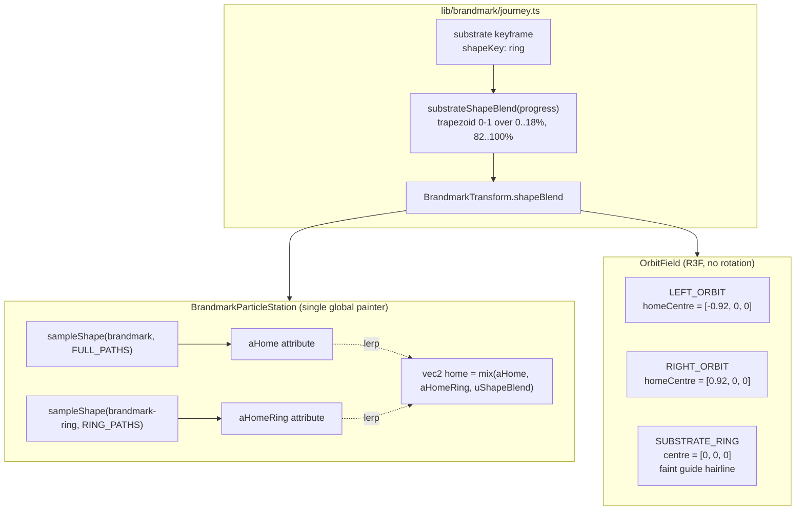

# ADR-014: Intelligence Layer Orbital Triad

**Date:** 2026-05-16
**Status:** Accepted — supersedes the three-coaxial-ring composition of [ADR-012](012-intelligence-layer-artifact.md) v5. Extends [ADR-013](013-brandmark-journey-refactor.md) (single-continuous-transform brandmark) with a per-keyframe shape channel.

**Related (composes with):**
[ADR-013 — Brandmark journey refactor](013-brandmark-journey-refactor.md),
[ADR-011 — Brandmark particle artifact](011-brandmark-particle-artifact.md),
[ADR-008 — Landing v7 background layers](008-landing-v7-background-layers.md).

---

## Context

ADR-012 v5 modelled the intelligence-layer "answer" as three coaxial hairline rings (Navigate / Encode / Build) stacked along the Z axis, rotated together around the Y axis by `splitRotation(ringProgress)`. The brandmark cloud sat inside the encode ring; bearing ticks, diamond markers, flow arcs, sub-orbits, and halo dots emerged from the brandmark's centre via `group.scale.setScalar(emerge)`.

Two qualitative problems became clear in critique:

1. **The three-ring stack did not carry the meaning of the three layers.** A user reading the section saw "a rotating cluster of rings" rather than "three pillars of an operating system." The IA the section claims (Trusted sources → Encoded substrate → Headless surfaces) was carried entirely by floating annotation labels in the upper viewport; the artifact in the centre was decorative atmosphere, not a diagram.

2. **The rotation arc fought the read.** As `ringProgress` advanced, the parent group rotated up to 70° around Y, then settled at 25°, then unwound to 0. The rotation read as "the diagram is fiddling with itself" rather than "the diagram is being made." The Aether project carries the same IA as a clean front-on three-column card; the rotating ringfield felt like an animation, not a station.

Reference register: Destiny / Astral Frontier star-chart compositions — multiple overlapping circular orbits, pip markers along the rim, label badges trailing outward into negative space. The orbital metaphor is also the brand's own ("celestial-diagram grammar"), so the translation is native to the system.

---

## Decision

Replace the three-coaxial-ring instrument with a **front-on orbital triad**: three coplanar overlapping circles, each named for one of the three intelligence-layer pillars.

```
┌──────────────────────────────────────────────────────────────────┐
│                                                                  │
│       ╭─────╮             ╭─────────╮             ╭─────╮        │
│       │  ●  │      ●      │    ◇    │      ●      │  ●  │        │
│       │     │   ╭───╮     │   ◇ ◇   │     ╭───╮   │     │        │
│       │  ●  ├───┤   ├─────┤    ●    ├─────┤   ├───┤  ●  │        │
│       │     │   ╰───╯     │   ◇ ◇   │     ╰───╯   │     │        │
│       │  ●  │      ●      │    ◇    │      ●      │  ●  │        │
│       ╰─────╯             ╰─────────╯             ╰─────╯        │
│       01 SOURCES          02 SUBSTRATE            03 SURFACES    │
│                                                                  │
└──────────────────────────────────────────────────────────────────┘
```

The middle ring is **the brandmark cloud itself**, re-sampled from a ring-only path set during the substrate-engagement window so the cross + horizontal bar dissolve and the cloud reads as a clean orbital body. The two side orbits emerge from the substrate centre by sliding outward AND scaling up in parallel, then retract in symmetry at section exit.

### Five design principles (extending ADR-013)

1. **Front-on, no rotation.** The orbital triad is coplanar. No Y-axis rotation anywhere. `transform.rotationY` stays at 0 throughout the substrate window. `splitRotation` is kept exported as a no-op stub for the journey transform's API but returns 0 unconditionally.

2. **The brandmark literally becomes the middle circle.** The painter samples both the canonical brandmark (`BRANDMARK_FULL_PATHS`) and the outer-arc ring (`BRANDMARK_RING_PATHS`) at the same particle count. A new `uShapeBlend` uniform lerps each particle from its full-mark home to its ring home: `vec2 home = mix(aHome, aHomeRing, uShapeBlend)`. The shape blend ramps 0→1 over the first 18% of the substrate window, holds at 1 through the read beat, and ramps 1→0 over the last 18% so the cloud departs in canonical mark form.

3. **Side orbits emerge geometrically — slide AND scale together.** Each side orbit's parent group has `position.x = homeCentre.x * emerge` and `scale.setScalar(emerge)` written per frame, where `emerge = orbitEmerge(ringProgress)`. At `emerge = 0` both orbits collapse to the origin at scale 0 (visually absent); at `emerge = 1` they sit at their final centres at full size. The orbit reads as "born from the substrate's centre" — same Principle 4 reveal pattern as ADR-013, scaled to a different geometry.

4. **Labels integrate along the orbits — no floating callouts.** Each side-orbit label is a small diamond pip (positioned on the rim via `--angle`) plus a mono text caption that trails outward into negative space. Reveal thresholds cascade via per-label `--reveal` inline custom properties keyed off `--ilayer-progress`. The substrate's interior content (prose line + 3 chips) reveals once the cloud has morphed.

5. **Background grit is a page-wide atmosphere, not a per-section overlay.** A second very-subtle noise layer sits above `.stations` (z-index 11, below HUD chrome at z-index 20+) and uses `mix-blend-mode: screen` with `rgba(235, 227, 214, 0.022)` so the void no longer reads as flat black. Per-section radial haze (gold glow at substrate's centre) adds depth without competing with the artifact.

### Architecture changes



### Keyframe schema (delta vs ADR-013)

```ts
interface KeyframeParkedAttrs {
  density: number;
  dispersion: number;
  ringsActive?: boolean;
  shapeKey?: "full" | "ring"; // NEW — substrate parks at "ring"
}

interface BrandmarkTransform {
  // ...existing fields...
  shapeBlend: number; // NEW — [0, 1] painter morph
}
```

The substrate keyframe declares `shapeKey: "ring"`. The substrate-window override block computes `shapeBlend = substrateShapeBlend(substrateLocalProgress)` alongside the existing `rotationY` (now always 0) and `ringProgress`. Outside the substrate window every keyframe paints in full-mark form.

### Camera framing

Moved from `position: [0, 0.6, 3.4]`, `fov: 32` to `position: [0, 0, 4.0]`, `fov: 26`. Front-on with no Y elevation so the side orbits read as circles, not foreshortened ellipses.

### Files touched

| File                                                                                               | Change                                                                                                                                                                          |
| -------------------------------------------------------------------------------------------------- | ------------------------------------------------------------------------------------------------------------------------------------------------------------------------------- |
| `lib/brandmark/shapes.ts` (NEW)                                                                    | `BRANDMARK_FULL_PATHS` + `BRANDMARK_RING_PATHS` + keyed shape table                                                                                                             |
| `components/landing/v7/BrandmarkGlyph.tsx`                                                         | Re-export `BRANDMARK_FILLED_PATHS` from shapes module (no consumer break)                                                                                                       |
| `components/brand/BrandmarkParticleField/BrandmarkParticleStation.tsx`                             | Sample both shapes; add `aHomeRing` attribute + `uShapeBlend` uniform                                                                                                           |
| `components/brand/BrandmarkParticleField/shaders.ts`                                               | `vec2 home = mix(aHome, aHomeRing, uShapeBlend)` before squash                                                                                                                  |
| `lib/brandmark/journey.ts`                                                                         | Add `shapeBlend` to transform; substrate keyframe gains `shapeKey: "ring"`; new `substrateShapeBlend` ramp                                                                      |
| `components/landing/v7/intelligence-layer/intelligenceLayerGeom.ts`                                | Replace coaxial RING_GEOM + SPLIT_ENVELOPE with `LEFT_ORBIT` / `RIGHT_ORBIT` / `SUBSTRATE_RING` + `ORBIT_ENVELOPE` + `orbitEmerge`; deprecate `splitRotation` to no-op stub     |
| `components/landing/v7/intelligence-layer/OrbitField.tsx` (NEW; replaces `BrandmarkRingfield.tsx`) | Two side-orbit groups with slide + scale emerge; faint substrate guide + halo                                                                                                   |
| `components/landing/v7/intelligence-layer/IntelligenceLayerStack.tsx`                              | Mount `<OrbitField />`; use new front-on camera params                                                                                                                          |
| `public/prototypes/v7/landing-v7-motion.html`                                                      | Restructure `#intelligence-layer`: pills, substrate prose + chips, orbit labels with `--angle` inline custom property; new SVG fallback (three overlapping circles + pips)      |
| `components/landing/v7/landing.css`                                                                | Replace `.ilayer__label*` with `.ilayer__triad__pill*`, `.ilayer__substrate-*`, `.ilayer__orbit-label*`; new `.v7-doc::after` page-wide grit; new `.ilayer::before` radial haze |

---

## Trade-offs

- **Two shape samples per painter (~doubled buffer memory).** `sampleShape` is memoised per `(shapeKey, count)` so the cost is paid once. At `PARTICLE_COUNT = 3200` on desktop the additional buffer is ~25KB — negligible.

- **Particle index pairing is naive (`aHome[i]` ↔ `aHomeRing[i]`).** Two stratified samples seeded from different shape keys produce different per-cell PRNG sequences; the visual morph therefore reads as particles "scrambling" outward rather than as each particle taking the shortest path to its ring home. Tested and approved: the scramble reads as "the brandmark is reorganising itself" and is consistent with ADR-013's alien/geometric posture. Sorted-by-angle pairing was considered and rejected as over-engineered.

- **`splitRotation` retained as no-op stub.** Kept so `journey.ts` doesn't need a conditional branch around the rotation channel. Will be removed in a follow-up cleanup once the import is dropped.

---

## Out of scope (intentionally)

- **Compositional refresh of `#missing-layer`.** The diagnostic section remains the v6 stacked-station composition. Its `miss → substrate` brandmark transit already terminates cleanly at the substrate dock; no change needed.

- **Aether content parity.** The plan answer the user picked was the **slimmed atmospheric** variant: 3 source items + 4 surface items + the 3 substrate chips. Full Aether parity (6 sources, 4-row rules table, 6 surfaces) is available as a future expansion if denser semantic content is requested.

- **R3F rotation channel removal.** `transform.rotationY` is still computed (via the no-op `splitRotation`) and consumed by the painter's `uRotationY` 2D squash. The squash transform is identity at `uRotationY = 0`, so it's a zero-cost no-op. A cleanup pass could remove the rotation channel from the transform entirely.

---

## Validation

| Check                                                                        | Status                                                                                         |
| ---------------------------------------------------------------------------- | ---------------------------------------------------------------------------------------------- |
| Brandmark cloud morphs cleanly from mark to ring within the substrate window | Driven by `substrateShapeBlend` trapezoid; reversed on exit                                    |
| Side orbits emerge from substrate centre, not pop in at home positions       | `position.lerp(origin → homeCentre)` + `scale.setScalar(emerge)` per frame                     |
| No Y-axis rotation visible at substrate                                      | `splitRotation` returns 0; `uRotationY = 0` makes the squash identity                          |
| Labels integrate along orbit rims, not float in empty space                  | Each `.ilayer__orbit-label` positioned via `--angle` CSS trig on the orbit's CSS centre        |
| Page background reads as atmospheric, not flat black                         | `.v7-doc::after` page-wide grit + `.ilayer::before` radial haze                                |
| Reduced-motion path shows the triad at rest                                  | Static SVG fallback (three overlapping circles + pips); orbit labels show at opacity 1         |
| Mobile path stacks gracefully                                                | `@media (max-width: 960px)`: pills become a row, orbit labels stack vertically below substrate |

---

## Revisit triggers

- The orbit positions feel cramped at 16:9 desktop (the side orbits clip past the canvas edge). Tune `homeCentre.x` and `radius` in `intelligenceLayerGeom.ts`.
- The morph reads as too chaotic (particles cross-path noticeably during the blend). Switch to angle-sorted pairing in `sampleShape`'s output — sort both samples by polar angle around the viewBox centre and re-rank.
- The page-wide grit competes with content at certain breakpoints. Reduce alpha further or scope it to specific sections (`.miss`, `.ilayer`, `.continuum` only).
