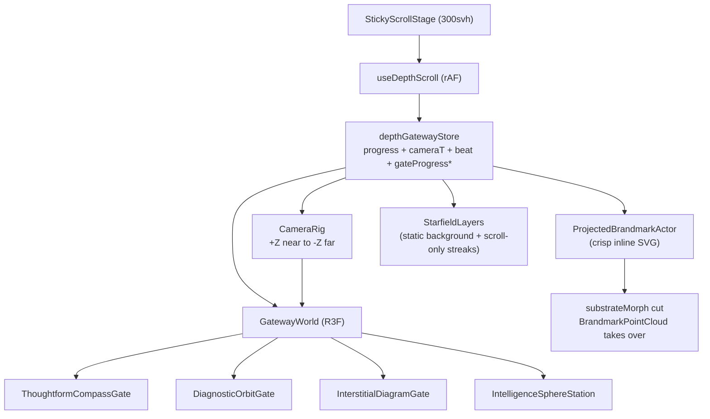

# ADR-018: Home V2 Depth Corridor

**Date:** 2026-05-21
**Status:** Proposed
**Scope:** `/test/home-v2` only — the production homepage (`/`) is untouched.
**Related:**
[ADR-008 — Landing v7 background layers](008-landing-v7-background-layers.md),
[ADR-013 — Brandmark journey refactor](013-brandmark-journey-refactor.md),
[ADR-015 — Brandmark vector-first](015-brandmark-vector-first.md),
[ADR-017 — Orbit journey + substrate-sphere morph](017-orbit-journey-and-substrate-morph.md).

---

## 2026-05-23 Revision — World-Owned Corridor

Status update: ADR-018 now prefers a stricter model than the first proposal below.

The `/test/home-v2` corridor is no longer a "v7 sections in a sticky stage" composition. It is a **world-owned 3D corridor**:

- One R3F canvas owns all diagram geometry: Thoughtform compass, Diagnostic orbits, interstitial gate, Intelligence substrate sphere, side bodies, and inter-gate ring debris.
- The camera follows one continuous path through fixed world-space stations. The X reframe from off-axis Thoughtform to centred Diagnostic is concentrated in passthrough-01.
- The brandmark is a pure world-projected vector actor. It does not DOM-pin to `.sigil__mark`, `.miss__brand-slot`, or `.ilayer__brandmark-anchor` on this route. Its parked positions are rigidly co-located with the active gate group.
- DOM content is copy only. `CopyAnchors` renders text elements with `data-world-anchor` IDs; `useWorldDomTracker` projects named world anchors through the same camera model and writes inline transforms/opacities each frame.
- v7 HTML remains the source for copy and HUD chrome. The corridor no longer renders sliced v7 section markup for diagram layout.

This revision intentionally trades pixel-identical v7 parked layout for **spirit fidelity plus structural depth**. The parked Thoughtform beat should still read as copy-left / compass-right / brandmark-inside-diamond, but the diagram is now a real 3D gate the camera can pass through.

The original proposal's hybrid language ("brandmark rest positions match production dock rects exactly", "sliced v7 sections mount inside the sticky stage") should be read as superseded for `/test/home-v2`.

## 2026-05-24 Revision — Camera-Space Depth Continuity

Status update: the world-owned corridor now uses **camera-space depth/focus opacity** as the default visibility model for 3D diagram geometry.

Star Atlas' reference behavior is not "fade this section out, fade the next section in." Its visual continuity comes from persistent WebGL objects spaced in world Z; opacity is governed by view-space depth/focus windows as the camera moves through them. `/test/home-v2` now follows that rule:

- `sceneGeom.ts` owns shared camera-space helpers: camera forward vector, signed camera-space depth, and focus-window opacity (`near`, `nearFade`, `far`, `farFade`).
- Thoughtform rings no longer hard-cut at flythrough window end. The flythrough window only controls Z travel; opacity comes from the ring's actual depth relative to the camera.
- Diagnostic, Interstitial, and inter-gate debris remain world-rigid objects whose optical presence comes from camera-space focus, not progress-only fade clips.
- The brandmark is a lead artifact during the Diagnostic → Intelligence transit. It stays several world units ahead of the camera and keeps a small, stable plate scale; the Intelligence substrate sphere owns the large scale-up moment.
- Progress windows still matter for narrative pacing, copy visibility, and scroll HUD state, but they should not be the primary way 3D geometry appears or disappears.

This revision preserves the world-owned model while tightening its depth contract: **geometry persists in world space; distance decides visibility.**

## 2026-05-25 Revision — Latent Depth Spacing

Status update: the first travel leg now gets enough physical and world-space distance to read as navigation through a latent field rather than an immediate section reveal.

The Thoughtform → Diagnostic leg keeps the world-owned contract above, but retimes the first corridor:

- `.home-v2-stage` grows from `360svh` to `460svh`.
- `passthrough-01` widens from `0.16 → 0.40` to `0.14 → 0.46`.
- Diagnostic starts at `0.46`, parks at `0.53`, and its station Z is now derived from `BEAT_PARK_CENTRES.diagnostic` instead of a stale literal in `sceneGeom.ts`.
- Thoughtform ring fly-through windows span the longer passthrough, and ring Z overshoot increases so the rings and supporting linework cross the camera plane before fading.
- Diagnostic DOM copy and labels use a camera-space `depthFade` multiplier in `useWorldDomTracker`, so they can register faintly at distance but do not jump to full opacity the moment passthrough begins.
- `LatentArtifactBands` adds world-fixed equation, token, and vector shards between Thoughtform and Diagnostic. These are not camera-relative atmosphere: each artifact has a fixed Z position, approaches via camera dolly, then passes/culls by depth.

This revision does **not** relax the idle-motion contract. `LatentFieldTunnel` remains camera-relative atmosphere with `AMBIENT_DRIFT = 0`; the new semantic artifacts are world-fixed landmarks that only appear to move because the user scrolls the camera through them.

## Context

`/test/home-v2` was first built as a "v7-fidelity inside a sticky depth stage" experiment ([home_v2_v7_fidelity](../../.cursor/plans/home_v2_v7_fidelity_58bbc2ce.plan.md)) and later iterated with the [z_axis_travel_feel](../../.cursor/plans/z_axis_travel_feel_cb3e7c19.plan.md) pass (streaming dust + two-station brandmark + sequenced fades). The route now:

- Stacks three sliced v7 sections (`#definition`, `#missing-layer`, `#intelligence-layer`) in one 300svh sticky stage.
- Cross-fades chamber DOM via `--chamber-{A,B,C}-section-opacity`.
- Renders a shallow R3F overlay (`camera z: 8 → 3`, streaming dust, two-station brandmark point cloud, intelligence L/R bodies).

User feedback after live review (Star Atlas reference: [experience.staratlas.com](https://experience.staratlas.com/)):

1. The brandmark is barely visible at the Thoughtform section and the centering does not match the homepage.
2. The transition from Thoughtform → Missing layer → Intelligence layer reads as fade between flat panels rather than travel through a depth corridor.
3. Background stars drift even when the user is not scrolling, which breaks the "moving through space" read.
4. There is no sense of foreground/midground geometry passing the camera between sections, so when chamber B's orbits appear they read as "another fade", not "you have arrived at a new gate".

The root cause is structural, not a polish issue: the diagram systems are still flat DOM layers. They never cross the camera plane. The only thing that actually moves in 3D is dust and the brandmark cloud, and both share a single shallow Z window.

## Decision

Rebuild the depth stage as a **3D depth corridor** where the diagram geometry itself is the depth content, and the v7 DOM is reduced to copy + HUD chrome overlay. The brandmark stays homepage-faithful at each rest station but travels through world space between them.

### Five principles (load-bearing for `/test/home-v2`)

1. **Diagram geometry lives in R3F.** Compass rings, diagnostic orbits, interstitial diagram linework, and the intelligence sphere are all world-space objects with a Z position. They scale up as the camera approaches, drift past the viewport edges as the camera passes through, and are replaced by the next gate at depth.
2. **Brandmark rest positions match the homepage.** At the parked beats (Thoughtform / Missing layer / Intelligence layer) the brandmark sits at the same on-screen position and at the same on-screen size as the production v7 docks (`.sigil__mark`, `.miss__brand-slot`, `.ilayer__brandmark-anchor`). In between, the mark is a world-space artefact projected back to viewport pixels — its travel path is a 3D arc, not a 2D lerp.
3. **Stars do not move when you are not scrolling.** A static background star layer paints constantly (so the void is not empty). A separate near-camera dust/streak layer is **scroll-velocity-only**: at idle it is invisible (or perfectly still); at scroll it produces a stream of particles crossing the camera, intensifying the travel read.
4. **Pass-through beats own the transitions.** Between each pair of diagram gates, the previous gate's geometry physically crosses the viewport edges before the next gate materialises. The user sees the rings/orbits stretch past the camera, then a new diagram appears in the distance and approaches. No DOM cross-fade between sections.
5. **The DOM is a copy + HUD overlay.** The sliced v7 sections still mount inside the sticky stage to provide titles, ledes, labels, and the HUD readouts the user trusts (depth diamond, sector text, % progress). But the diagram visuals are hidden in particle mode and rendered by R3F instead. CSS pins the existing reveal vars (`--miss-orbit-emerge`, `--ilayer-progress`, etc.) so the DOM copy is visible whenever its chamber is active, but the heavy SVG/orbital geometry is gated off.

### Architecture

The store exposes:

- `progress` — global 0..1 across the sticky stage (existing).
- `cameraT` — camera travel parameter (smoothstep'd progress) (new).
- `beat` — current narrative beat id: `thoughtform | passthrough-01 | diagnostic | passthrough-02 | intelligence` (new).
- `gateProgress` — per-gate local 0..1 with a small dead-band around the parked centre (new). Replaces the `chamberA/B/C` thirds that did not align with the cross-fade windows.
- `velocity` — signed per-second progress velocity (existing). Drives the scroll-only streaks.

### Beat layout

| Beat           | Global progress | Camera Z (world) | What is visible                                                                                                                                                                                                                              |
| -------------- | --------------- | ---------------- | -------------------------------------------------------------------------------------------------------------------------------------------------------------------------------------------------------------------------------------------- |
| thoughtform    | 0.00 → 0.18     | +8 → +4          | Thoughtform compass gate centred; brandmark parked at the right-of-centre sigil position. DOM: `#definition` lede.                                                                                                                           |
| passthrough-01 | 0.18 → 0.32     | +4 → 0           | Compass rings scale past viewport edges. Diagnostic gate appears in the distance ahead. Brandmark in transit.                                                                                                                                |
| diagnostic     | 0.32 → 0.50     | 0 → -4           | Diagnostic orbit gate centred; brandmark parked at viewport centre on the miss anchor. DOM: `#missing-layer` head + pills.                                                                                                                   |
| passthrough-02 | 0.50 → 0.70     | -4 → -8          | Diagnostic orbits drift past the camera. Interstitial diagram (celestial grammar — armature, rings, diamonds) approaches.                                                                                                                    |
| intelligence   | 0.70 → 1.00     | -8 → -12         | Brandmark settles at viewport centre on the ilayer anchor; under projected vector cover, the point cloud takes over and morphs into the substrate sphere. L/R intelligence bodies fade in. DOM: `#intelligence-layer` head + chamber labels. |

### Painters

- **`ProjectedBrandmarkActor`** (new) — a fixed `position: fixed` inline SVG mark (the canonical `BrandmarkGlyph`) whose rect/opacity is computed each frame from a world position projected through the R3F camera. Same vector geometry as production. Primary brandmark painter from beat 1 through the start of the intelligence beat.
- **`BrandmarkPointCloud`** (repurposed) — only paints during the intelligence beat's substrate morph window. Mirrors the v7 substrate cut pattern from ADR-017: when the morph engages, the projected vector cuts off (`display: none`) and the point cloud paints the same brandmark silhouette at the same screen position, then morphs into the Fibonacci sphere.
- **`GatewayWorld`** R3F components — Thoughtform compass, diagnostic orbits, interstitial linework, intelligence sphere station (+ L/R side bodies). Each owns its own world Z position. Visibility uses geometric distance from camera (frustum culling + alpha by depth), never a manual opacity fade between beats.
- **`StaticStarfield`** (new) — background `<points>` instanced at a fixed world position, painted always. No motion. Provides void texture.
- **`ScrollStreaks`** (refactored from `StreamingDust`) — near-camera streaks whose flow is **strictly proportional to `velocity`**. Zero velocity = no streaks. The streak count and length scale with `|velocity|`.

### What the DOM still does

- HUD chrome (gateway gradient, rails, ticks, nav). Unchanged from production.
- HUD readouts (`#depthIndicator`, `#hudProgress`, `#coordD`, `#coordT`, `#hudSector`). Written by `useDepthScroll`.
- Copy: section title, lede, label pills, chamber captions. Visible whenever the chamber's gate is the current beat (no opacity tween — show/hide with the beat boundary, optionally with a 200ms fade for legibility).
- `--miss-orbit-emerge`, `--miss-anchor-emerge`, `--miss-label-emerge`, `--ilayer-progress` pinned to `1` so the DOM doesn't gate the copy off.
- The heavy SVG geometry inside `.miss__system` (orbits + ghost orbits + particles + brand halo) is hidden by a `[data-home-v2-mode="corridor"]` CSS gate. The diagram geometry is owned by R3F instead.

## Consequences

### Positive

- The transition from Thoughtform to Intelligence becomes a single 3D camera path. No more "fade-between-screenshots" read.
- Brandmark rest positions match the homepage exactly because they are projected from world points calibrated to the production dock rects.
- Idle scenes are quiet — no ambient drift, no implied motion when the user is not scrolling.
- Pass-through beats give the route the gateway feel the user requested without changing the homepage architecture.

### Negative

- The route diverges from "v7 fidelity inside a sticky stage". If we ever want to roll the depth corridor back into the production homepage we will need a deeper architectural pass (new ADR).
- More R3F geometry to maintain — compass rings, diagnostic orbits, interstitial linework, intelligence sphere station — instead of reusing the homepage SVG.
- The store and scroll hook grow new fields. We keep `chamberA/B/C` and `chamberId` for backwards compatibility with the existing painters during the migration, then trim them in a follow-up.

### Out of scope

- Production homepage (`/`). Unaffected.
- Mobile fidelity beyond a graceful WebGL / reduced-motion fallback (existing fallback markup still paints).
- Performance budgets beyond "feels smooth at 60fps on a recent laptop". A dedicated perf pass can follow if needed.

## References

- Star Atlas reference: [experience.staratlas.com](https://experience.staratlas.com/) — depth corridor pattern (camera through persistent world).
- Production brandmark journey: [`lib/brandmark/journey.ts`](../../lib/brandmark/journey.ts), [`components/landing/v7/hooks/useBrandmarkJourney.ts`](../../components/landing/v7/hooks/useBrandmarkJourney.ts).
- Vector actor pattern: [`components/brand/BrandmarkVectorActor/BrandmarkVectorActor.tsx`](../../components/brand/BrandmarkVectorActor/BrandmarkVectorActor.tsx).
- Substrate morph cut pattern: ADR-017.
- Compositing rules (still apply): ADR-008.
