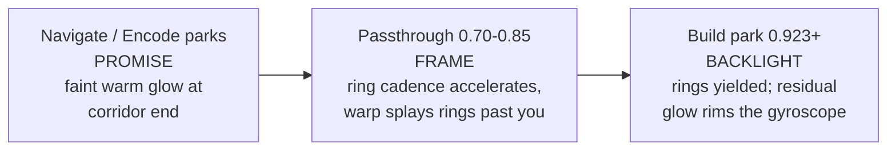
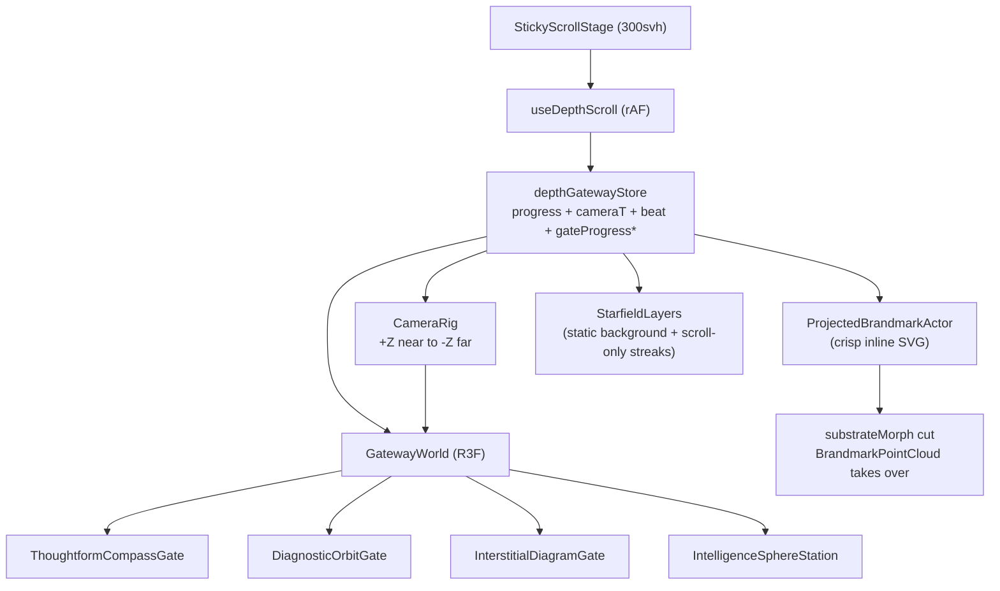

# ADR-018: Home V2 Depth Corridor

**Date:** 2026-05-21
**Status:** Proposed
**Scope:** `/test/home-v2` and the production homepage corridor mount (`/`).
**Related:**
[ADR-008 — Landing v7 background layers](008-landing-v7-background-layers.md),
[ADR-013 — Brandmark journey refactor](013-brandmark-journey-refactor.md),
[ADR-015 — Brandmark vector-first](015-brandmark-vector-first.md),
[ADR-017 — Orbit journey + substrate-sphere morph](017-orbit-journey-and-substrate-morph.md),
[ADR-021 — Corridor exit zoom-dissipate](021-corridor-exit-zoom-dissipate.md).

---

## 2026-06-15 Revision (v3.16) — Zoom-dissipate exit (supersedes v3.15)

The post-corridor cover-plane sweep (v3.15) is retired in production.
The corridor exit now plays a **zoom-dissipate**: the camera flies
INTO the docked sphere, the surface particles scatter radially
outward, the atmosphere blooms then fades, and the destination
`#services` section's own dark surface re-shields the viewport
within the first 100svh. See [ADR-021](021-corridor-exit-zoom-dissipate.md)
for the full rationale, the retired cover-plane sweep recipe, and
the new dissipate sub-band timing.

Mechanics inherited from v3.15:

- The single-writer rule still holds — the exit hook
  (`useCorridorExitScroll`) is the only writer of `docked` /
  `dockProgress`; the corridor's `useDepthScroll` remains the sole
  writer of `progress` / `paintProgress` / `epilogueProgress`. The
  same two-rAF-loops-fighting-the-same-channel hazard documented in
  v3.15 still applies.
- The dock still engages at `epilogueProgress >= 0.72` (`DOCK_ENGAGE_EP`)
  so the dwell at the landed sphere opens BEFORE the section enters
  the viewport. Engagement off the section's own rect would lose
  the dwell.
- The `data-corridor-docked` attribute still promotes
  `.home-v2-stage__canvas` to a fixed full-viewport backdrop while
  the seam plays. The retired CSS recede transform (`translate3d`
  - `scale` driven by `--handoff-cover`) is gone; the camera
    fly-in is the visible motion.
- Reduced motion, mobile, and WebGL-fallback paths keep a
  sequential dark editorial Services section with no fixed-canvas
  zoom (same `dockCapable` gate the cover-plane recipe used).

Mechanics that changed from v3.15:

- `dockProgress` is now interpreted as the **dissipate clock** by
  the painters. The substrate sphere reads it for shell scatter +
  particle fade + atmosphere bloom; the camera reads it via the
  new `getCorridorExitCameraPose(dissipate)` that pulls the docked
  camera toward `BRANDMARK_ANCHOR_INTELLIGENCE`. The clock value
  itself is unchanged (still `(vh - servicesRect.top) / vh`).
- `#services` is the destination, not a new `#buildQuote` lab
  section. The `getV7Content({ removeStations, relocateStationsToMount })`
  pipeline strips `#buildQuote` (and its now-empty
  `.build-quote-runway` wrapper) and relocates `#services`
  immediately after the corridor mount placeholder so the
  rhetorical setup of the BILLIONS epilogue hands directly into
  "Three ways to bring the practice in" without `#continuum` /
  `#practice` / `#build` intervening.
- The retired cover-plane sweep recipe is preserved in
  `components/landing/home-v2/handoff-lab/` + `/test/handoff-a|b|c`
  as a documented reusable pattern (ADR-021). Any future section
  that needs an Active Theory / Hashgraph-class cover sweep should
  import that recipe verbatim, not invent a third hybrid.

---

## 2026-06-14 Revision (v3.15) — One-viewport swipe cover (RETIRED, see v3.16)

The production handoff now uses the intended cover-swipe grammar instead
of opening directly on the services copy. The corridor through Navigate,
Encode, Build, and the "billions" epilogue remains native-scroll and
unchanged; only the post-corridor `#buildQuote` embed owns the swipe.

- `HandoffOrbitEmbed` renders a 100svh cover viewport before the
  practical services layer. The lower plane rises over the completed
  corridor scene, and the first-read "Make the layer useful" copy lives
  inside that cover plane so the replacement is visible during the sweep,
  before the Navigate / Encode / Build service readouts become primary.
- During the active cover window, the cover is promoted to a fixed
  viewport layer and the plane is clipped by `--handoff-cover`; the
  service grid is padded below the viewport until release. This prevents
  the handoff from degenerating into a padded document section scrolling
  over the sphere.
- `--handoff-cover` remains the transition clock, but the dock channel is
  now limited to the cover window (`cover < 1`). Once the plane has fully
  covered the viewport, `data-corridor-docked` clears so the R3F backdrop
  can release behind the opaque services surface.
- The docked canvas still uses the live corridor scene, not a duplicate
  lab scene. Its fixed-layer transform now includes a small upward
  push-back plus slight scale, but no opacity fade; the incoming opaque
  plane must do the covering. This matches the Active Theory / Hashgraph
  class of "incoming plane replaces receding scene" without introducing
  Lenis or a second scroll model.
- Mobile, reduced-motion, and WebGL fallback paths keep a sequential dark
  editorial services section with no fixed-canvas swipe.

---

## 2026-06-13 Revision (v3.14) — Docked instrument handoff

The production `#buildQuote` handoff now keeps the completed corridor
sphere alive as a fixed backdrop while the services copy scrolls over it.
This borrows the hashgraph-style composite pattern (persistent fixed
WebGL layer, DOM content above it) without replacing the existing
rect-based corridor scroll architecture.

- `depthGatewayStore` gains `docked` and `dockProgress`. The corridor
  stage still owns `progress` / `epilogueProgress`; the embedded
  `HandoffOrbitEmbed` owns the later dock channel while its services
  section is in view.
- `html[data-corridor-docked="true"]` promotes
  `.home-v2-stage__canvas` to `position: fixed; inset: 0` so the live
  R3F scene persists after the sticky stage releases.
- The substrate globe stays CENTERED as a persistent backdrop (with a
  slow in-place spin), and the camera EASES into a held orbital pose
  (`DOCKED_INSTRUMENT_EPILOGUE_POSE`) via a damped blend so docking never
  pops. An earlier lateral X-slide was removed — it read as the sphere
  "randomly moving right" and neither reference site translates its
  background.
- `HandoffOrbitEmbed` owns ONLY `docked` + `dockProgress`. It must NOT
  also write `epilogueProgress`/`paintProgress`: two rAF hooks writing
  the same channel fought every frame and made the sphere jitter/pulse.
  `useDepthScroll` stays the sole writer of the scrub; painters read
  `docked` and hold the fixed pose themselves.
- The signal block (billions title + ticker + CTA) stays viewport-fixed
  and CENTERED, cross-dissolving out (`titleIn * (1 - titleOut)`, keyed
  to the services rect) as the services intro climbs to the top — so the
  two text layers never overlap. The ticker arc is deepened to follow the
  centered globe; it is NOT re-anchored sideways.
- Reduced motion, mobile, and WebGL-fallback modes keep the previous
  sequential handoff: no fixed dock layer, no live-canvas backdrop.

**Rejected — global Lenis smooth scroll.** A global Lenis root was
trialed on the v7 `LandingPage` to chase the hashgraph "buttery" feel.
It introduced visible scroll stutter through the 3D corridor: Lenis runs
its own rAF + interpolation, and the corridor camera (`FlyingCameraRig`),
DOM copy tracker (`useWorldDomTracker`), and `useDepthScroll` each read
scroll in their own rAF, so the heavy R3F scrub desynced by 1–2 frames.
Measured on a high-refresh display across a 3.5s corridor scroll: p95
frame time 33ms / max 67ms / 9 frames >40ms WITH Lenis, versus p95 4.3ms
/ max 33ms / 0 frames >40ms WITHOUT. The fixed-canvas dock delivers the
hashgraph composite feel on its own, so Lenis was removed. Do NOT
reintroduce a global smooth-scroll wrapper over the corridor without
unifying it into a single rAF that drives the scroll read + R3F render
in order. (`useLenis` remains for the legacy cockpit/test routes only.)

---

## 2026-06-12 Revision (v3.13) — Crossing as diagram cascade

Live-review follow-up to v3.12c. Three notes:

1. **"The concentric ring feels like an asteroid field."** The dense
   circular dissipation band is retired. The Crossing remains a
   single GPU point layer, but its buffer now emits structured
   Thoughtform diagram geometry: ten staggered near-complete arc
   layers, 16 bearing ticks per layer, and 8 radial spoke chains per
   layer. The shader advances each layer through a double-smoothed
   radius ramp and keeps the layer visible longer, so the transition
   reads as a full-screen realm threshold rather than quiet detail or
   random debris.

2. **"It's unfolding too quickly."** `getSubstrateRealmEnvelope`
   widened from `[0.845, 0.925]` to `[0.825, 0.975]`. The front and
   terrain followers were slowed (`WAVE_FRONT_RESPONSE 7.0 → 4.4`,
   `WAVE_TERRAIN_RESPONSE 5.0 → 3.2`), and the terrain reveal/flash
   bands were widened (`0.13 → 0.18`, `0.11 → 0.14`) so the threshold
   has a slow-in / fast-middle / slow-out cadence instead of a snap.

3. **"The ground should unfold from the circle, not from the bottom."**
   The terrain ignition is no longer depth-from-camera. Each point's
   delay is keyed to its radial X/Z distance from the sphere's footprint
   at the near edge of the realm (`WAVE_ROLLOUT_ORIGIN_Z = REALM_Z_NEAR`),
   with a screen-normalized lateral term (`WAVE_ROLLOUT_X_WEIGHT 0.58`)
   so the topology rolls out like a carpet from the diagram circles.
   The lower-frame-first read is retired; the sphere/circle is now the
   visible source of both the crossing arcs and the ground.

4. **"Inside Build we should see a landscape."** The realm floor was
   lifted and brightened without moving the camera or sphere:
   `REALM_BASE_Y -3.4 → -2.75`, `REALM_HORIZON_LIFT 0.35 → 0.72`,
   `REALM_BOWL_RISE 0.9 → 1.12`, rows/samples increased to `38 × 164`,
   point size `6.5 → 8.2`, opacity `0.85 → 1.05`, and far haze
   extended to `74`. The Build park should now hold a visible latent
   topography under the artifact instead of a near-black floor.

### Same-day follow-up (v3.13b) — instrument rebalance

Live review of the full-screen pass: **"too intense — like a circus
carnival. The dots should be more subtle, with more different types."**
The cascade keeps its full-screen reach but the uniform loud
arcs+ticks+spokes vocabulary is replaced by four quiet layer
archetypes cycling across nine layers:

- **hairline** — a near-continuous ring of ~140 fine round dots
  (alpha ~0.4, dawn-soft/dawn), the structural stroke;
- **grain** — three loose dust arcs with radial jitter (alpha
  0.18–0.34), the atmospheric stroke;
- **ticks** — 14 sparse bearing diamonds, one gold cardinal per
  half-revolution (alpha ≤ 0.66);
- **anchors** — eight deliberate diamond pips, alternating gold/dawn.

Dotted filaments survive only on every third layer (5 × 9 quiet dots,
alpha ≤ 0.38) so the sphere stays causally connected to the rollout
without a starburst read. A per-particle `aShape` attribute splits the
fragment falloff between soft round grain and crisp diamond markers
(the HUD's existing split). Peak alpha `1.65 → 1.0`, marker sizes
roughly halved, point budget ~4,000 → ~900. Gold now appears only on
the few registration markers, restoring the dawn-dominant tier
balance. (First cut of this rebalance went too far — alphas 0.13–0.58
with peak 0.85 made the cascade vanish against the terrain; settled at
the values above so the layers stay legible without shouting.)

### Same-day follow-up (v3.13c) — legibility floor

Live review of v3.13b: **"the rings are literally invisible."** The
archetype split stays, but the legibility floor is raised and the radius
motion now reaches the viewport earlier:

- wave peak alpha `1.0 → 1.55`;
- radius remap changed from double smootherstep to `smoothstep(0, 0.58,
layerPhase)`, so the rings reach full-screen before the terrain fully
  resolves instead of arriving after the moment has passed;
- hairlines `140 → 180` dots, size `~2.4–3.4 → ~4.0–5.45`, alpha
  `~0.34–0.48 → ~0.72–0.9`;
- grain arcs `34 → 48` dots with alpha `0.35–0.6`;
- diamonds and anchors lifted to `0.72–0.95` / `0.74–0.9`, still sparse
  and gold-limited.

The first legibility bump was still too faint in a fresh forward sample,
so peak alpha settled at `1.55`. The target is now a visible threshold
layer with quiet variety: dawn hairlines and grain do the work, sparse
gold diamonds punctuate it.

### Same-day follow-up (v3.13d) — smoother speed graph

Live review after the rings became visible: **"make the speed graph
animation smoother."** Two changes:

- the diagram-front channel now uses the same cascaded two-stage chase
  pattern as the terrain (`target → frontMid → front`), with
  `WAVE_FRONT_RESPONSE 4.4 → 5.8`, giving the ring radius zero initial
  velocity instead of a single-exponential kick;
- the shader radius remap changed from cubic `smoothstep(0, 0.58,
layerPhase)` to a C2-continuous quintic `smootherstep01(layerPhase /
0.68)`, so the visible rings still reach full-screen early enough but
  have zero velocity and acceleration at the launch/settle boundaries.

### Same-day follow-up (v3.13e) — sphere occluder core

Live review: **"the sphere shouldn't be fully transparent — elements
behind it should be slightly dimmed."** Every element of the gimbal
instrument is additive-blended dots/lines, so the sphere had no body:
the terrain rollout, crossing rings, wormhole walls and stars passed
through it at full strength. `ShellSubstrateGyro` now mounts a smoky
occluder core — a NORMAL-blended void-ink (`COLOR_VOID`) sphere at
0.96x the dotted-shell radius:

- **Alpha = chord length.** The fragment shader shapes alpha with a
  normalized Beer–Lambert curve over `facing` (∝ the chord a view ray
  travels through the ball): peak `SUBSTRATE_GYRO_CORE_OPACITY = 0.52`
  at the disk centre, falling smoothly to zero at the rim — smoked
  glass, not a cut-out disc.
- **Three renderOrder buckets** (groupOrder is useless — every nested
  `THREE.Group` resets it): default scene content at 0, the core at 1
  (drawn after the scene, dimming it), and every other renderable of
  the instrument lifted to 2 by a structural-change-keyed traverse so
  the dots/rings/ticks stay bright on top. Sibling `ShellStack` lines
  stay at 0 on purpose: they dim as they plunge into the body — the
  absorption read the stack drain choreography wants.
- **Geometric emergence for free.** The core lives inside the
  globe-spin group, so the unfold's Y-bloom flattens it to a dark lens
  at reveal 0 and inflates it with the cage; opacity is anti-pop
  presence only. It solidifies a touch across the EPILOGUE APPROACH
  (`× (1 + approachT * 0.4)`, capped 0.78) so the planet reads more
  opaque than the parked instrument and properly occludes the
  starfield during the flyover.

True backdrop _blur_ was considered and rejected: the corridor canvas
renders in a single transparent pass, so blurring what's behind the
sphere would need a render-to-texture post pass (and could never reach
DOM content behind the canvas). The volumetric dim delivers the same
"body in front of the realm" read at zero extra passes.

### Same-day follow-up (v3.13f) — particle crispness pass

Live review: **"are the particles in our sphere low res?"** They were
not low-res in buffer terms (the DPR cap stays at 1.75 desktop) — they
were big, halo-dominant sprites. Every gyro dot spent only 10–18% of
its sprite radius on the crisp core with a half-strength halo
stretching to 50%, at base sizes up to ~20+ device px after the
distance boost. Few large soft blobs read as low resolution. Fix is
finer grain at the same coverage:

- **Sprite falloff** (`gyroParticleFragment` + `surfaceShellFragment`):
  solid core now spans 22–32% of the radius with a plateau, halo
  shortened `0.5 → 0.34` and dropped `0.5 → 0.26` intensity — each dot
  resolves as a point with a breath of glow.
- **Sizes down, counts up:** dotted shell `6.5px → 4.8px` at
  `6000 → 9600` dots (mobile `1200 → 1900`) across `28 → 32` latitude
  bands; globe lattice dots `5.0 → 4.0px` at `64 → 84` per meridian /
  `48 → 62` per parallel; sphere-cloud accents `6.0 → 5.0px`.
- **Near-camera blow-up trimmed:** per-vertex distance size factor cap
  `2.4 → 2.0` so parked close-ups don't balloon the sprites back into
  blobs.

The planet flyover inherits the density bump, so the APPROACH
point-size boost (×1.8) lands on smaller bases — the grown planet
surface now reads as fine grain rather than enlarged blur.

## 2026-06-12 Revision (v3.12c) — The Crossing: gravitational-wave threshold + valley reposition

Live-review follow-up to v3.12b. Two notes:

1. **"We need to be higher in the sky."** The v3.12b terrain read
   as a plain at eye level (near rows sweeping under the camera,
   horizon at mid-frame). Camera + sphere positions are untouched
   (corridor-owned); the TERRAIN dropped instead — base floor
   `-1.3 → -3.4` world units below the flight line, an explicit
   valley bowl (`REALM_BOWL_RISE 0.9 · edgeT^1.8` — deep floor
   under the optical axis, flanks rising at the periphery),
   relief amplitude raised for legibility from altitude, lateral
   jitter tightened (0.55 → 0.4) so the dotted rows read as crisp
   contour lines. Horizon now sits in the lower third; arriving at
   Build reads as hanging in the sky over a vast topology.

2. **"There's not really a transition — the topology suddenly
   appears."** The v3.12b distance-staggered fade was too soft to
   read as an event, and the exit glow's peak read as "the centre
   of the sphere lights up". Replaced by **the Crossing** — a
   gravitational-wave transition in
   [SubstrateTopography.tsx](../../components/landing/home-v2/DepthGatewayScene/SubstrateTopography.tsx):
   - **Wavefront ring train** — a dotted pearl-string front (the
     corridor's primary matter) + double line stroke in gold, with
     dawn / dawn-soft echo rings behind it, expanding out of the
     sphere's limb (`WAVE_R_LAUNCH 1.5`) across the entire frame
     (`WAVE_R_MAX 6.2`, past every corner at the park viewpoint).
     Ellipse aspect 1.6 matches the wormhole shell's oval grammar.
     Radius is LINEAR in phase — constant wave speed, physically
     gravitational-wave-true, and it keeps the front legible while
     crossing the mid-frame instead of racing to the edges.
   - **Screen-radius ignition coupling** — each terrain point's
     reveal delay equals its normalized screen radius from the
     sphere (pinhole-projected at build time from the parked
     camera), so the realm IGNITES exactly where the visible front
     passes: one cascade, two media. Points at the front carry a
     gold-lifted flash (×2.2 alpha, +50% size) and a 0.28-unit
     vertical swell — the ground literally ripples as the wave
     crosses it.
   - **Damped wave channel** — the progress envelope
     (`getSubstrateRealmEnvelope`, tightened to [0.845, 0.905])
     rides a critically-damped local follower (response 6.5), so a
     single fast wheel-flick across the threshold still plays the
     cascade as ~0.5 s of motion. Scroll-symmetric: reversing
     retracts the wave into the sphere and the realm dissolves
     with it.

   Glow rebalance (the "centre lights up" fix) in
   [LatentWormholeWalls.tsx](../../components/landing/home-v2/DepthGatewayScene/LatentWormholeWalls.tsx) +
   [sceneGeom.ts](../../components/landing/home-v2/DepthGatewayScene/sceneGeom.ts):
   peak 0.55 → 0.38, residual 0.18 → 0.12, disc half 3.0 → 4.0 and
   dropped 0.55 below the axis — an ambient wash on the valley
   horizon behind the artifact's lower limb, not a bulb inside it.
   The wave owns the exit event now; the glow is only its warm key.

### Same-day follow-up 2: dissipation wave + editorial speed ramps

Third live-review round. Three notes, three mechanisms:

1. **"The ripple needs the same shape as our sphere… maybe not
   concentric circles — a dissipation of particle effects."** The
   ring train (line loops + pearl string, oval) is RETIRED. The
   Crossing is now a **dissipating particle wave**: ~1,600 dots in
   a CIRCULAR band (the sphere's own silhouette expanding), dense
   spine with gaussian fringes (`aRadial·|aRadial|` scatter),
   trailing wake stretching back toward the sphere, tiered sizes
   with sparse bold pips (Colorpong "Cosmos" reference in dawn/
   gold), colour cooling toward dawn-soft and alpha spending
   itself (`dissipate · crest`) as the band travels — energy
   dissipating through the latent medium, never a stamped ring.
   All positions are computed in the vertex shader from one
   `uFrontPhase` uniform; static buffers, one draw call.
   Tuning lesson recorded: the first build spread the band to
   ±1.7 world units over its whole life and it thinned into
   unreadable specks — the spread must stay tight through the
   crossing (`pow(phase, 1.6)` growth to ±0.9) so the front stays
   coherent mid-frame and only dissolves at the exits.

2. **"Sources/surfaces animate too quickly — AE-style speed
   ramps."** Two mechanisms:
   - the stack's raw curve in `getBrandmarkAccretionLayers` is now
     QUINTIC (smootherstep — zero velocity and acceleration at
     both ends) instead of cubic;
   - the stack channel in `motionFollower.ts` now runs a CASCADED
     second-order chase (`target → stackMid → state.stack`,
     τ 0.17 s each). A single exponential has max velocity at
     onset (ease-out only); the cascade has zero initial velocity
     — true slow-in / fast-middle / slow-out, ~1 s settle,
     frame-rate independent, still converging exactly.

3. **"The topology appears really fast — jarring."** The unfurl
   now rides the same ramp architecture: wave window widened
   [0.845, 0.905] → **[0.845, 0.925]**, terrain channel runs a
   cascaded two-stage local follower + quintic remap (the particle
   front runs a snappier single-stage chase so the SHOCK leads and
   the unfurl follows), ignition band widened 0.075 → 0.13 and
   flash width 0.085 → 0.11 so each row breathes up instead of
   popping.

   Debug note: the first build read `state.clock.elapsedTime`
   deltas for the follower dt and silently received dt = 0 in this
   R3F setup — the followers never advanced (terrain stuck dark,
   wave invisible). Fixed by using the `useFrame` `delta` argument,
   the same pattern `MotionFollowerDriver` uses. Verify painter
   followers with the delta argument, not clock arithmetic.

### Same-day follow-up: unfurl cascade + stack re-sequencing

Live review of the first Crossing build asked for two refinements:

1. **Unfurl, don't radiate (terrain).** The terrain's per-point
   delay was re-keyed from screen-radius-from-sphere to DEPTH from
   the parked viewpoint (`WAVE_UNFURL_SPAN 0.72` across camera
   distance 7 → 58, plus a small `WAVE_LATERAL_FAN 0.1` screen-x
   term and jitter). The nearest ground now catches at the BOTTOM
   of the frame the instant the wave launches, then the front
   rolls away along the Z axis to the horizon — the realm unfurls
   beneath the visitor while the ring train sweeps the sky above
   it: one event, two motions.

2. **Stack waits for the realm.** `CORRIDOR_TIMELINE.accretion.stack`
   pushed `0.81/0.93 → 0.875/0.95` so the sources/surfaces streams
   begin docking only after the wave has launched and the valley
   is unfurling. Arrival sequence: wave fires → realm unfurls →
   sources/surfaces flow in over the resolved realm → full stack
   just after the park settles.

### Threshold sequence (verified 2094×1103)

| paintProgress | Read                                                                                                                    |
| ------------: | ----------------------------------------------------------------------------------------------------------------------- |
|         0.845 | Wave launches from the sphere's limb                                                                                    |
|     0.86–0.87 | Ring train sweeps the frame; ground catches at the bottom edge and unfurls away toward the horizon; NO stack chrome yet |
|         0.886 | Front clears the corners and dissipates; realm broadly unfurled                                                         |
|         0.895 | Sources begin fading in over the resolved realm                                                                         |
|         0.905 | Wave complete, realm fully resolved                                                                                     |
|    0.923–0.95 | Build park — stack docks over the valley; no ring residue; quiet glow key                                               |

---

## 2026-06-12 Revision (v3.12b) — Realm transition: mandala retirement + substrate topography

Same-day follow-up to the aperture grammar from live review. Two
complaints landed together:

1. **"Mandalas" in the pre-Build backdrop.** Nested concentric-ring
   decorations hovering ahead of the camera through the
   Encode→Build approach. Root cause: three ambient layers placed
   ring-shaped landmarks in the leg-2 / Build-backdrop Z band that
   the camera NEVER physically passes (it parks at Build short of
   their Z) — so instead of sweeping past like leg-1 debris, they
   hung static in the frame:
   - `LatentTopographyContours` leg-2 catalogue (nested contour
     basins = the literal mandala read);
   - `InterGateCorridor` bands 3 + 4 (slow-SPINNING concentric
     line-loop clusters between Diagnostic→Interstitial→Intelligence);
   - `CelestialMotes` scattered into the FAR_Z band, lingering
     until the shared 0.86–0.97 fade.

2. **The space outside the wormhole was void.** Exiting a wormhole
   should transport you to another realm; instead the Build park
   backdrop was starfield + leftovers. Reference: the ORIGINAL
   homepage's gateway topology (geometry extending into the
   distance) and nk.studio's full-screen section transitions
   (realm A → liquid mask → realm B with persistent foreground).

### Changes

**Mandala retirement:**

- [LatentTopographyContours.tsx](../../components/landing/home-v2/DepthGatewayScene/LatentTopographyContours.tsx)
  — leg-2 shard catalogue (5 contour + 3 ridge + 4 vector) deleted;
  layer is leg-1-only now. `legRevealForZ(z, p)` simplified to
  `legReveal(p)`.
- [InterGateCorridor.tsx](../../components/landing/home-v2/DepthGatewayScene/InterGateCorridor.tsx)
  — bands 3 + 4 (DG→Inter, Inter→IL) deleted; bands 1 + 2 on
  passthrough-01 unchanged (those ARE physically passed).
- [CelestialMotes.tsx](../../components/landing/home-v2/DepthGatewayScene/CelestialMotes.tsx)
  — build-approach clear pulled earlier: `min(getBuildApproachFade,
1 - smoothstep(0.76, 0.84, p))` so motes are gone before the
  threshold sequence instead of lingering to 0.97.

**Substrate realm (new layer):**

- [SubstrateTopography.tsx](../../components/landing/home-v2/DepthGatewayScene/SubstrateTopography.tsx)
  — a latent-topography particle landscape extending from under the
  parked camera's lower frame edge (`INT_Z + 3`) to `INT_Z − 52`:
  30 dotted terrain rows × 150 samples (~4.5k points, one draw
  call), full frustum width per row + margin, deterministic
  hash-seeded relief. Quiet basin under the optical axis (the
  Build composition floats over calm ground), ridges rising at the
  frame edges, base lifting toward a horizon band. Dawn-soft
  substrate, dawn accents, gold reserved for sparse crest pips on
  the outer ridges. Additive, `depthWrite: false`, mobile-narrow
  skipped, world-fixed, zero idle motion.
- `getSubstrateRealmEnvelope` (new in
  [sceneGeom.ts](../../components/landing/home-v2/DepthGatewayScene/sceneGeom.ts))
  — 0 for the whole corridor; ramps [0.848, 0.93].

### The threshold transition ("transported to another realm")

The realm is INVISIBLE during the entire corridor flight — no leak
of information while travelling. The reveal is choreographed into
the existing exit beats so the swap reads as one event:

| paintProgress | Beat                                                                                                                                                                                 |
| ------------: | ------------------------------------------------------------------------------------------------------------------------------------------------------------------------------------ |
|   0.78 → 0.86 | Exit glow builds to peak (brightest moment of the journey)                                                                                                                           |
|   0.85 → 0.92 | Mouth rings yield (`getMouthYieldFade`)                                                                                                                                              |
|  0.848 → 0.93 | Realm blooms in — per-point reveal staggered by distance from the threshold origin (Build station), so the topology resolves OUTWARD from the light: near ground first, horizon last |
|   0.86 → 0.93 | Glow dims to backlight residual — as the light yields, the realm is simply THERE                                                                                                     |

This is the Thoughtform answer to nk.studio's liquid realm
transitions: not a fluid mask — a **threshold of light** with the
new world's geometry blooming outward from it. Geometric, latent,
scroll-symmetric (reversing dissolves the realm back into the
light before the wormhole re-forms).

During the epilogue the realm recedes to a 0.4 luminance floor
(`REALM_EPILOGUE_FLOOR`) so the planet flyover + "billions" title
own the frame while the realm keeps the world's floor.

### Verification (2094×1103 desktop)

- 0.76 / 0.80: corner mandalas gone; corridor structure (aperture
  frame + rails + rim ring) carries the travel read; no realm leak.
- 0.858: threshold peak — glow brightest, rings yielding, Build
  chrome forming, realm not yet resolved.
- 0.885: realm mid-bloom — near rows sweeping in beneath the
  composition, horizon still resolving.
- 0.923 (Build park): full realm — particle topology extending to
  the horizon under the gyroscope + sources/surfaces columns;
  basin keeps the centre calm; caption readable.
- Epilogue mid + title: planet limb + clean sky; realm receded, no
  competition with the title.

---

## 2026-06-12 Revision (wormhole-walls v3.12) — Encode→Build exit: dust → aperture grammar

The leg-2 exit (Encode → Build mouth) was articulated by particle
DENSITY through three polish rounds (v3.9 → v3.11):
volumetric funnel field of 3,200 dots + 7-ring 8-petal flower
bloom + radial petal ribs. Even after density trims, color-cap
trims, and yield-window tuning, the mouth still read as busy from
the Navigate / Encode parks and visually competed with the
foreground gyroscope ("intelligence layer") that the corridor
exits onto. Three diagnoses landed simultaneously:

1. **Density-as-articulation creates a noise floor.** Three
   independently-tuned additive systems (funnel field 3.2k dots,
   ring bloom 7 rings × up to 88 dots × 8 petals + ribs, 520
   streaks) overlap in the same world Z band and sum into texture
   that no single tuning knob can calm — the mouth at distance
   reads as warm haze around the gyroscope's silhouette.

2. **Shape-language conflict.** The 8-petal radial-flower mouth
   is organic; the gyroscope is a precision-instrument grammar
   (gimbal rings + dotted shell). The two systems fight each
   other for the eye.

3. **Gold-on-gold.** The funnel rim ramped to brand gold; the
   gyroscope is the page's gold mass. Two competing accents.

### Aperture grammar (v3.12) — structure plus light, not dust

The mouth is now articulated as **structure** (clean dotted ring
cadence with geometric Z compression) plus **light** (a single
warm radial-gradient quad seated past the mouth). The dust is
gone.

**Three jobs across the journey, never more than one at a time:**



The light you travel toward becomes the light that backlights the
intelligence layer at the destination — the metaphor and the
geometry agree.

### Implementation

Files:
[components/landing/home-v2/DepthGatewayScene/LatentWormholeWalls.tsx](../../components/landing/home-v2/DepthGatewayScene/LatentWormholeWalls.tsx)
and
[components/landing/home-v2/DepthGatewayScene/sceneGeom.ts](../../components/landing/home-v2/DepthGatewayScene/sceneGeom.ts).

1. **Funnel field retired.** `buildExitFunnelField` and all
   `EXIT_FUNNEL_*` constants deleted. ~3,200 additive points
   removed at the moment of heaviest leg-2 overdraw.

2. **Ring cadence (rebuilt `buildExitMouthBloom`).**
   - Rings: 7 → **6**; max dots/ring: 88 → **64**.
   - Petal modulation (`EXIT_MOUTH_PETAL_*`) and petal ribs
     deleted. Rings are clean dotted ellipses — same vocabulary
     as the existing cross-rings and the gimbal rings of the
     intelligence layer. Shape grammar harmonised.
   - Linear ring spacing replaced with **geometric Z compression**
     (`EXIT_MOUTH_Z_CADENCE_POWER = 1.7`): inner rings widely
     spaced, outer rings clustered toward the rim. As the camera
     dollies into them, the rhythm of rings passing perceptibly
     accelerates — the runway-approach-light cadence
     communicating "exit approaching" kinesthetically, not by
     mass.
   - Palette discipline: dawn-soft → dawn ramp; gold tint capped
     at the absolute rim and limited to 0.25 mix. Gold belongs to
     the gyroscope.
   - The trumpet-bell flare under `uExitWarp` (high-`aMouth` rim
     particles splay outward at peak warp ≈ 0.85) is unchanged —
     the rebuild is about WHAT carries the static read, not the
     warp dynamics.

3. **Exit glow (new `<ExitGlow>` mesh).** A single
   `THREE.PlaneGeometry` quad seated `EXIT_GLOW_Z_BEHIND_MOUTH = 0.6`
   units past the leg-2 mouth Z (i.e., past the intelligence
   station anchor). Two-stage radial-gradient shader pattern
   reused from
   [`ThoughtformAtmosphere.tsx`](../../components/landing/home-v2/DepthGatewayScene/ThoughtformAtmosphere.tsx)
   `bootGlowFragmentShader`. Half-extent 3.0 world units —
   `2*3.0` plane reads as a tiny "light at end of tunnel" at
   Navigate-park distance (~32 units) and a warm fill at
   Build-park distance (~6.8 units). Same physical disk reads
   correctly at both beats; no progress-keyed scaling. Additive
   blending so the gyroscope silhouette gains a backlit rim
   where the two overlap.

4. **`getExitGlowEnvelope` (new in `sceneGeom.ts`).** Drives the
   glow opacity:
   - `0.30 → 0.30` promise plateau across `[0.30, 0.78]`
     (visible as a faint warm signature from Navigate / Encode
     parks)
   - `0.30 → 1.00` build across `[0.78, 0.86]` (peaks with the
     warp)
   - `1.00 → 0.18` yield across `[0.86, 0.93]` to a low residual
   - `0.18` thereafter (Build park + epilogue)

   Multiplied by `EXIT_GLOW_PEAK_OPACITY = 0.55` so the disk is
   ambient light, not a bright object.

5. **`getMouthYieldFade` (new in `sceneGeom.ts`).** Multiplied
   into `uRevealMouth` per frame. Rings clear over `[0.85, 0.92]`
   so they're invisible by the Build park (~0.923) — the
   gyroscope gets a clean stage. Distinct from
   `getBuildApproachFade` `[0.86, 0.97]` (which fades the
   surrounding ambient walls + latent field). The mouth needs to
   clear earlier and faster than the shell so it doesn't read as
   a halo competing with the hero.

6. **Streaks unchanged.** The 520 line streaks (velocity-gated,
   bell envelope `[0.64, 0.88]`) are exactly the travel energy
   that makes the passthrough feel kinetic and they don't
   compete with the gyroscope at any park. Kept verbatim.

### Why the earlier "reveal on approach" attempts failed

Several v3.x rounds tried tying the mouth to camera distance via
progress windows. They felt like a door spawning at the end of a
hallway — because they were progress-keyed pop-ins. The right
physical answer is **atmospheric perspective**: details emerge
around a light that was always there. The exit glow is that
always-there light; the rings are details that resolve out of
haze around it via the existing `aMouth` far-fade extension.
Nothing pops in.

### Verification (1440-class desktop, browser at 2094×1103)

Five-beat scrub on `/test/home-v2`:

| paintProgress | Beat               | Reads as                                                                                                                                                                                               |
| ------------: | ------------------ | ------------------------------------------------------------------------------------------------------------------------------------------------------------------------------------------------------ |
|          0.40 | Navigate park      | Faint warm signature behind the gyro at the corridor's vanishing point. No competing dust halo.                                                                                                        |
|         0.636 | Encode park        | **Stage is clean.** Gyroscope is the sole focal mass. Dramatic improvement vs. v3.11 which still showed dust spurs around the upper-right of the sphere and a diffuse warm haze over ~⅓ of the screen. |
|          0.70 | Leaving Encode     | Aperture frame visible behind gyro; first hints of rim ring above.                                                                                                                                     |
|          0.80 | Warp peak approach | Trumpet-bell splay clearly readable as a horizontal warm band passing through the brandmark — the rim ring opening.                                                                                    |
|          0.88 | Pre-park           | Build composition forming (sources/surfaces ports docking); rings yielding; no halo competition.                                                                                                       |
|         0.923 | Build park         | Walls fully faded; rings gone; **residual exit glow visible as backlight rim around the gyroscope's hub.** Light-at-end-of-tunnel becomes intelligence-layer backlight as designed.                    |

Mobile-narrow (`<760px`) gating on `LatentWormholeWalls` is
unchanged — the layer is skipped, so the new aperture has no
mobile surface to verify.

---

## 2026-06-10 Revision (v3.14) — Polish round 4: split cartouche + magnetic field streams

Same-day follow-up to v3.13 from live review:

### 1. Split cartouche (title above, caption below)

The single bottom-centre cartouche crowded the lower band (kicker
row collided with the Build kicker + CRAFT cardinal). The corridor
station headers now use a SPLIT layout
(`.home-v2-station-header--split` in
[home-v2.css](../../components/landing/home-v2/home-v2.css)):

- `__head` band (chrome eyebrow + title) sits ABOVE the sphere at
  `top: clamp(44px, 7vh, 96px)`.
- `__foot` band (support paragraph) sits BELOW at
  `bottom: clamp(32px, 5.5vh, 72px)`.
- Support font bumped `15/1.25/18 → 17/1.45/21`; colour `0.78 →
0.82` dawn — the caption reads with weight, not as a footnote.
- The epilogue signal block keeps the single top-centre stack
  (unchanged layout, `split` prop false).

### 2. Sentence-per-line caption breaks

Support copy now carries `<br>` separators
([corridorMap.ts](../../lib/home-v2/corridorMap.ts));
[CorridorStationHeaders.tsx](../../components/landing/home-v2/CorridorStationHeaders.tsx)
splits on them BEFORE tokenizing (the tokenizer drops unknown tags)
and renders each line as a block-level `__line` span. The flat
char registration is preserved so the typewriter machinery is
untouched; the cursor sits at the end of the last line. Mobile
`StationTitle` renders the raw HTML where `<br>` works natively.

### 3. Columns tightened + headers lowered

- `STACK_COLUMN_X_CAP` 2.16 → **1.92** — columns hug the sphere on
  wide viewports instead of drifting to the frame edges.
- `STACK_LANE_Y_RANGE` 1.05 → **0.95**, `STACK_FAN_HALF_HEIGHT`
  1.15 → **1.05** — compact manifest read.
- Column header anchors `Y +1.45 → +1.24` — the headers were
  sliding under the HUD top bar ("fall out of the interface").

### 4. Magnetic field streams (aperture ports retired)

The v3 aperture-port diamonds ("rotated squares inside the sphere")
are gone. [ShellStack.tsx](../../components/landing/home-v2/DepthGatewayScene/shell/ShellStack.tsx)
replaces the straight lane/fan lines with curved field-line streams:

- SOURCE streams: quadratic-bezier swoop from the pip toward the
  sphere, then a wrap of ~66° around the globe at orbit radius
  0.86 → 0.78 (just outside the dotted shell, inside the gimbal
  rings), fading to 5% colour along the wrap — the stream reads as
  absorbed into the substrate.
- SURFACE streams: the same in reverse — fading in from a wrap,
  emerging on the right hemisphere, straightening out to the tip.
- Upper rows wrap over the top of the sphere, lower rows under it;
  alternating ±0.26 Z-drift pushes successive wraps in front of /
  behind the globe — the bundle reads volumetric / organic.
- Per-vertex `vertexColors` carry the wrap fade
  (`LineBasicMaterial({ vertexColors: true })`); material opacity
  carries the reveal envelope. Rendered via `<threeLine>` strips
  (extend registered locally, idempotent with ShellSubstrateGyro's).
- Motes now ride the SAME sampled polylines (`advanceCurveMotes` /
  `samplePolyline`) so particle flow and field lines agree exactly.
  Sources flow pip → wrap (absorbed); surfaces flow wrap → tip
  (emitted). Distinct periods (5.2s / 6.4s) avoid metronome sync.
- `buildLaneLinesGeometry` / `buildFanLinesGeometry` /
  `buildLinearMotes` imports dropped from this module.

### Verification (1440x900)

- Build park: streams visibly curve into / out of the sphere and
  wrap around it; no port diamonds; columns + chips inside frame;
  eyebrow + title above, two-line caption below.
- Encode park: eyebrow + title clear of the JUDGMENT cardinal; two
  caption lines balanced ("…was stuck in heads." / "Now it's a
  brief…").
- Navigate park: clean instrument composition, sphere centre-stage.

---

## 2026-06-10 Revision (v3.13) — Polish round 3: stack v3 registry columns + bottom-centre cartouche

Hard course correction on the Build park. v3.12 ("polish round 2") shipped a
funnel stack that still cropped at typical desktop aspects: docked column
width was a fixed `±2.4` shell-local (`±2.83` world after `GYRO_ASSEMBLY_SCALE`)
while the frustum half-width at the Build park varies from ~3.20 (1.5:1) to
~3.79 (16:9), AND the per-row DOM chips grew OUTWARD from each pip — so on
narrow desktop aspects the labels were guaranteed to crop. The 1.45×
cluster `foldEmerge` overshoot threw the entire reveal outside the frame
mid-animation. Group labels floated in empty space below the streams and
broke the column flow.

Round 3 rebuilds the Build composition AND moves the three corridor station
headers to a bottom-centre instrument cartouche.

### 1. Aspect-adaptive registry columns

[ShellStack.tsx](../../components/landing/home-v2/DepthGatewayScene/shell/ShellStack.tsx) +
[sceneGeom.ts](../../components/landing/home-v2/DepthGatewayScene/sceneGeom.ts):

- New `getStackColumnLocalX(aspect)` helper reads the live camera
  frustum at the Build park distance (`STATION_INTELLIGENCE.parkDistance`,
  6.2) and returns a column X that fits inside the frame with a 0.4
  world margin, capped at 2.16 (the 16:9 ceiling) and floored at 1.4.
- ShellStack tracks the live aspect via a debounced resize listener,
  rebuilding lane / fan / pip geometry on resize. DOM anchor resolvers
  in `sceneGeom.COPY_ANCHORS` call the same helper inside their
  per-frame `position` callbacks (via `getLiveAspectForStack()`), so
  canvas pips and DOM chips share one source of truth even while the
  viewport is resizing.
- `STACK_LANE_Y_RANGE` 0.85 → 1.05; `STACK_FAN_HALF_HEIGHT` 1.05 →
  1.15 — the registry columns get a tighter, more-legible vertical
  rhythm.
- New `STACK_TIP_OUTLINE_SCALE` 0.78 / `STACK_TIP_INNER_SCALE` 0.50
  shrink the surface tip diamonds; previous full-`PYLON_CAP_SIZE`
  outline read as detached "giant diamonds".

### 2. Inward slide reveal

- Cluster-level `foldEmerge` removed entirely. Cluster groups stay at
  origin (no slide, no scale overshoot).
- Per-row docking: each pip slides inward from a small
  `STACK_ROW_SLIDE_LOCAL_X` 0.8 outer offset to its parked column X,
  driven by the existing `stackItemLock` stagger (with the 0.12
  scale overshoot retained). Lanes / fan are static channels; their
  opacity fades in with the cluster stagger so the channels appear
  ahead of the rows that dock into them.
- Every frame of the reveal stays inside the frame by construction.

### 3. Inward-growing chips + column-header group labels

[CopyAnchors.tsx](../../components/landing/home-v2/CopyAnchors.tsx) +
[home-v2.css](../../components/landing/home-v2/home-v2.css):

- Per-row chips flip origins: source chips `right-center` →
  `left-center` (text grows RIGHT, toward the sphere); surface chips
  `left-center` → `right-center` (text grows LEFT, toward the
  sphere). Combined with chip-then-leader / leader-then-chip DOM
  ordering, every label can only ever extend toward x = 0 (the
  sphere centre, always inside the frame). Cropping is structurally
  impossible.
- Group labels become COLUMN HEADERS hanging ABOVE each column at
  shell-local `Y = +1.45`, anchored with `bottom-left` (sources) /
  `bottom-right` (surfaces). New CSS class structure
  (`.home-v2-stack-label__rule` + `__body` + `__num` / `__name` /
  `__sub`) replaces the old `--group` modifier — the floating-below
  treatment is gone.

### 4. Bottom-centre cartouche for Navigate / Encode / Build

[CorridorStationHeaders.tsx](../../components/landing/home-v2/CorridorStationHeaders.tsx) +
[home-v2.css](../../components/landing/home-v2/home-v2.css):

- `.home-v2-station-header` moves from `top: 12vh` left-stack to
  `bottom: 5vh; left: 50%; translate3d(-50%,0,0)` centred. Width
  `min(86vw, 760px)`; title centred (`max-width min(72vw, 720px)`);
  support centred (`max-width min(64vw, 680px)`).
- New cartouche chrome row above the title: `__rule` hairline +
  `__diamond` + `__kicker` (PT Mono kicker from
  `corridorMap.content.kicker`) + `__diamond` + `__rule`. The
  `kicker` field already existed on every station's `content` —
  this is the first place that renders it. `StationContent`
  interface gains an optional `kicker` field.
- World-coupled parallax: each frame the rAF loop reads `gyroTilt`
  and writes a small `translate(±~8px)` offset on the three corridor
  cartouches so they bank with the rotating instrument while staying
  screen-aligned. Reduced-motion / non-gyro: parallax = 0 (gyroTilt
  is 0 in those modes anyway). The signal cartouche stays purely
  centred at top (it lives in the sky above the planet, not attached
  to the gimbal).
- `.home-v2-station-header--signal` explicitly overrides
  `bottom: auto; top: clamp(80px, 12vh, 156px)` so the epilogue
  title stays at top-centre.

### 5. Condensed support copy

[corridorMap.ts](../../lib/home-v2/corridorMap.ts) — three station
support strings tightened for the centred cartouche while preserving
each station's gold em + the strategy spine:

- Navigate: "Trained on us, but it doesn't think like us — so you
  stop commanding and start _navigating_: where it leads, and where
  you do."
- Encode: "The judgment that makes your work good was stuck in
  heads. Now it's a _brief_ the model inherits instead of guessing."
- Build: "Encoded once, it's _owned capability_ — running across
  chat, agents, and your own apps, surviving the next model."

### 6. Mobile

The desktop-calibrated registry columns clamp their column X inward
on portrait viewports (mobile aspect ~0.46 with widened FOV). At the
new floor the chips would project on top of the sphere. The mobile
composition uses `StationTitle` (world-anchored straddle) for all
three station headers, so the per-row chips and column headers are
hidden via `@media (max-width: 760px)` — the cartouche layer is
already hidden the same way.

### Verification (1440 + 1280 + 1920 desktop, 390 mobile)

- **Build park, 1440x900 (1.6):** all 5 source chips + 6 surface
  chips legible inside the frame; column headers above each column;
  cartouche `03 BUILD / BUILD ON THE SUBSTRATE / Encoded once, it's
owned capability — …` reads as a centred caption.
- **Build park, 1280x853 (1.5):** identical chip + cartouche
  composition; the column X clamps inward by ~2% but everything
  still fits.
- **Build park, 1920x1080 (1.78):** column X stays at the 2.16 cap;
  more breathing room around the sphere; cartouche still centred.
- **Navigate park (1440):** sphere fills upper-mid frame; cartouche
  reads as a clean instrument caption with no clutter.
- **Encode park (1440):** four cardinals visible above the
  cartouche; CRAFT cardinal sits just above the chrome row, tight
  but not overlapping.
- **Mobile 390:** stack chips/headers hidden; mobile straddle owns
  the title.

---

## 2026-06-10 Revision (v3.12) — Polish round 2: photons, sphere parity, funnel subtlety, stack v2, label depth, epilogue compression, mount hardening

Seven coupled passes responding to in-flight feedback after v3.11 shipped:

### 1. Corridor photon comets ([CorridorPhotons.tsx](../../components/landing/home-v2/DepthGatewayScene/CorridorPhotons.tsx))

New painter mounted in [DepthGatewayScene/index.tsx](../../components/landing/home-v2/DepthGatewayScene/index.tsx)
right after `LatentWormholeWalls`. Sparse fast comets (~24-photon pool)
fly along the dotted wormhole rails toward the corridor end as a
clock-driven life signal:

- Path math reuses `sampleRailPoint(leg, railIdx, t)` exported from
  [LatentWormholeWalls.tsx](../../components/landing/home-v2/DepthGatewayScene/LatentWormholeWalls.tsx)
  so comets trace the same rails the walls paint — no drift between
  rail and comet.
- Spawn cadence randomised in `[1.5s, 3.5s]`; per-photon traversal
  randomised in `[1.4s, 2.2s]`. The result reads as occasional
  punctuation, not a continuous stream.
- Gated by `LEG_*_REVEAL_*` and `active || armed` so comets never
  appear on a leg the user can't yet see. Disabled on narrow viewports
  and under reduced-motion preference. Same `VISIBLE_NEAR/FAR` depth
  fade as the rails.
- Birth/death alpha envelope on `aLife` so each comet fades in at the
  start of its rail and fades out at the end (no pop).
- Per-leg constant exports added to LatentWormholeWalls
  (`SHELL_RX/RY`, `RAIL_INWARD_PULL`, `RAIL_COUNT_PER_LEG`,
  `LEG_*_REVEAL_*`, `LEG_RAIL_*_FRAC`, `VISIBLE_NEAR/FAR`).

### 2. Navigate sphere apparent-size parity

The Navigate park sphere read ~29% smaller on screen than the Encode
gimbal. Two compounding causes (camera distance ~7.9 vs ~6.1; substrate
unfold only ~58% complete at park):

- `CORRIDOR_TIMELINE.accretion.substrate.peakAt` 0.48 → **0.42** in
  [sceneGeom.ts](../../components/landing/home-v2/DepthGatewayScene/sceneGeom.ts).
  The substrate is essentially fully unfolded at the Navigate park
  centre (~0.40); the per-ring stagger inside `gyroAssemblyUnfold`
  still plays the cascade.
- New helper `getNavigateApparentSizeBoost(paintProgress)` returns
  `1.30` at peak (camera-distance ratio between Navigate and Encode),
  ramping in `[0.30, 0.355]`, holding through the Navigate window,
  ramping out by `[0.445, 0.52]` — fully released before orbits begin.
- Applied multiplicatively to the gyro assembly scale in
  [BrandmarkAccretionShell.tsx](../../components/landing/home-v2/DepthGatewayScene/BrandmarkAccretionShell.tsx)
  AND mirrored identically in `gyroAssemblyWorldPosition` so DOM
  cardinal/group labels stay welded to the boosted geometry.
- Camera path, park distances, and brandmark travel are byte-identical
  outside `[0.30, 0.52]`.

### 3. Subtler exit funnel near the foreground sphere

The funnel was visually clashing with the gimbal sphere at the
Navigate park. Tuned six constants in
[LatentWormholeWalls.tsx](../../components/landing/home-v2/DepthGatewayScene/LatentWormholeWalls.tsx)
to keep the long-range "door at the end of the corridor" gradient
while quieting near the foreground:

- `EXIT_FUNNEL_INNER_R` 0.45 → **0.62** — quiet core extends past the
  gimbal outer ring.
- `EXIT_FUNNEL_DENSITY_BIAS` 0.85 → **0.6** — mass concentrates at
  the mouth, leg near the sphere thins.
- `EXIT_FUNNEL_LOBE_AMP` 0.55 → **0.4** — gentler angular density
  variation; less clumping.
- `EXIT_FUNNEL_COUNT` 6000 → **4600** — less mass, GPU win.
- Shader `mouthAlpha` ceiling `mix(0.78, 1.28)` →
  **`mix(0.72, 1.05)`** — peak rim brightness no longer competes with
  rail brightness.
- `MOUTH_LONGRANGE_ALPHA_CAP` 0.55 → **0.4** and
  `VISIBLE_FAR_MOUTH_EXTENSION` 14 → **11** — dimmer, shorter long-
  range glow.

### 4. Funnel stack v2 — contained framing, aperture ports, indexed labels

[ShellStack.tsx](../../components/landing/home-v2/DepthGatewayScene/shell/ShellStack.tsx):

- `STACK_SLOT_X_OFFSET` 8 → **3.0** and `STACK_SLOT_Z_OFFSET` 2.6 →
  **1.6**. Cluster slide-in starts just outside the parked frustum
  instead of way off-screen; the slide arc reads in-frame instead of
  as a final pop.
- New aperture port diamonds at `[STACK_SUBSTRATE_X ± 0.85, 0, 0]`
  (where lanes converge into / fan emerges from the sphere) — the
  funnel reads as `sources -> port -> sphere -> port -> surfaces`
  rather than lanes terminating in empty space. Sized
  `PYLON_CAP_SIZE * 1.5` outline + `PYLON_CAP_SIZE * 0.6` inner;
  green-tinted on the source side, dawn on the surface side; opacity
  tracks the cluster slide.
- Per-item label markup in
  [CopyAnchors.tsx](../../components/landing/home-v2/CopyAnchors.tsx)
  becomes `chip + leader` with a numeric index prefix (`01_`, `02_`,
  …). Colour-tinted to its side (green sources, dawn surfaces).
  Distinct visual class from cardinal callouts so provenance/output
  stream membership reads differently from wayfinding.

### 5. Cardinal label integration (depth-cued callouts)

The four Encode cardinals (Judgment / Taste / Craft / Voice) used to
read as flat black-box stickers latched on a 3D object. Replaced with
instrument-grade callouts in
[CopyAnchors.tsx](../../components/landing/home-v2/CopyAnchors.tsx) +
[home-v2.css](../../components/landing/home-v2/home-v2.css):

- Diamond marker (`__marker`) at the cardinal anchor — the label is
  visibly anchored to the gimbal node.
- Thin gold leader (`__leader`) between the marker and the caption
  chip; orientation handled by the parent flex direction.
- Hairline-frame caption replacing the heavy gold-bordered black box
  (`background: rgba(10, 9, 8, 0.62)` vs the old `0.94`; border
  `rgba(202, 165, 84, 0.4)` vs `0.72`).
- `gateEncodePrimitive` in
  [sceneGeom.ts](../../components/landing/home-v2/DepthGatewayScene/sceneGeom.ts)
  computes each cardinal's rotated Z (via `rotateGyroLocalOffset`)
  and dims/scales the chip when the cardinal swings to the back side
  of the sphere. The label visibly belongs to the rotating assembly.

### 6. Quicker, smoother Build → "billions" handoff

The epilogue tail used to be ~3 viewports of camera-only flight
before the title arrived. Compressed:

- `.home-v2-stage` height `920svh` → **`820svh`** in
  [home-v2.css](../../components/landing/home-v2/home-v2.css).
- `EPILOGUE_START` `620/920` → **`620/820`** in
  [useDepthScroll.ts](../../components/landing/home-v2/hooks/useDepthScroll.ts).
- Band retune in
  [epilogueTimeline.ts](../../lib/home-v2/epilogueTimeline.ts):
  `APPROACH.end` 0.62 → **0.56**, `LAND` 0.55/0.92 → **0.48/0.86**,
  `TITLE_IN` 0.7/0.9 → **0.52/0.74** — title fades in DURING the
  landing arc instead of after it.
- `EPILOGUE_FLIGHT_END` 0.9 → **0.86** in sceneGeom so camera
  resolves inside the new tail. Mobile stage stays 620svh; mobile
  epilogue is correspondingly tighter (intended).

### 7. Hardened corridor mount guard

[LandingPage.tsx](../../components/landing/v7/LandingPage.tsx):

- The `mount === corridorMountRef.current` early-return used to skip
  remount whenever the placeholder DOM identity matched, leaving an
  empty 820svh void if the nested React root died (HMR crash, bfcache
  restore that detached internals). New guard ALSO requires the
  cached root to be alive AND the mount to have children.
- Added a `pageshow` listener (`event.persisted`) that re-runs the
  mount check on bfcache restores explicitly.

### 8. r3f `<threeLine>` runtime registration

[ShellSubstrateGyro.tsx](../../components/landing/home-v2/DepthGatewayScene/shell/ShellSubstrateGyro.tsx):

- The trim-path sphere shipped in v3.11 used `<threeLine>` (the r3f
  TypeScript alias for `THREE.Line`) to dodge the `<line>` SVG
  collision. Build passed but the dev/prod runtime threw
  `R3F: ThreeLine is not part of the THREE namespace` whenever the
  gimbal first revealed — the auto-`extend(THREE)` inside `<Canvas>`
  registers the THREE namespace under its own keys (`Line`), not
  under r3f's typed alias (`ThreeLine`). Added one
  `extend({ ThreeLine: THREE.Line })` at module load so `<threeLine>`
  resolves correctly at runtime.

### Verification (1440 desktop)

- Navigate park (`paintProgress ~0.40`): sphere reads at the same
  apparent size as the Encode gimbal; cardinal labels not visible
  yet (orbits accretion at 0); funnel particles quiet around the
  sphere with a dim distant glow at the corridor end.
- Encode park (`~0.636`): all four cardinals visible with marker +
  leader + hairline-frame chips; sphere matches Navigate.
- Build park (`~0.923`): aperture ports visible at the sphere edges;
  per-item chips with `01_…` index prefixes legible on both sides;
  group labels (Sources, Surfaces) below their clusters.
- Build → "billions": title fades in around scrollY ~6800 (vs
  ~7500+ before the compression), with the planet horizon already
  composed below.
- Corridor section survives a hard reload + dev-server restart (mount
  guard exercised).

---

## 2026-06-09 Revision (v3.10) — Funnel stretched to the full leg; gradient flattened

Follow-up to v3.9. The funnel field still read as "concentrated at the
end" because it only began at leg-local 0.30 — from the Encode park
the first ~2.6 world units of tunnel were empty, then the density
arrived as a block. Spatial reasoning on the leg-2 frame: the Encode
gyro sphere parks at `dgZ ≈ -13.4`, and `leg2Start = lerp(dgZ, intZ,
0.06) ≈ -13.9` — i.e. **leg-local 0 is the sphere plane**. So starting
the funnel at 0.0 makes it softly begin exactly where the sphere sits
at "Encode the judgment", which is what the user asked for.

Three constant changes in
[`LatentWormholeWalls.tsx`](../../components/landing/home-v2/DepthGatewayScene/LatentWormholeWalls.tsx),
no shader or builder-logic changes:

- `EXIT_FUNNEL_START_FRAC` 0.30 → **0.0** — the funnel spans the full
  Encode → Build leg. Because the density power-law rises from ~zero
  at the start, the first stretch reads as a few stray dots, not a
  visible boundary.
- `EXIT_FUNNEL_DENSITY_BIAS` 0.55 → **0.68** — dots-per-unit-length
  along Z now grows as ~z^0.47 instead of ~z^0.82, so the mass creeps
  inward as a subtle gradient instead of stacking against the rim.
  Roughly a third of the field now lives in the front half of the leg.
- `EXIT_FUNNEL_COUNT` 3400 → **4800** — keeps the rim mass at v3.9
  levels while the ~1.4x longer span fills inward.

### Verification (1440-class viewport, static scrub)

- `paintProgress 0.64` (Encode park): sparse organic scatter already
  present around the gyro sphere — the funnel softly begins at the
  sphere, no clean void.
- `paintProgress 0.71-0.76`: continuous dotted funnel from the sphere
  outward to the frame edges, clearly graded — the "heading toward
  the end of the gates" read.
- `paintProgress 0.81-0.85`: peak warp; the far mass flares open with
  the mouth (intended iris-opening beat), velocity streaks own the
  motion read here.
- `paintProgress 0.92`: Build park clean (`getBuildApproachFade`
  has cleared the walls).

---

## 2026-06-09 Revision (v3.9) — Particle funnel field owns the exit; streaks become velocity-gated

Follow-up to v3.8. The side streaks finally landed in the right place,
but the user's references (the dotted black-hole funnel) clarified the
intended structure: the exit should read as a DENSITY GRADIENT of
small particles — sparse deep inside the tunnel, massing toward the
mouth rim — using the corridor's existing dotted particle language,
not line segments. Line streaks "only make sense when travelling
fast"; they are a motion accent, not the structure.

Two changes in
[`LatentWormholeWalls.tsx`](../../components/landing/home-v2/DepthGatewayScene/LatentWormholeWalls.tsx):

### a. Exit funnel field (new structural layer, dots)

`buildExitFunnelField()` scatters 3400 small dots on/around the leg-2
shell from leg-local 0.30 (well inside the tunnel — "extends further
in" than the mouth structures at 0.62) to the mouth at 0.995. Three
coordinated gradients:

- **Density** — sampling biased toward the mouth via
  `z = lerp(start, end, u^0.55)`, so dots-per-unit-length rises
  smoothly toward the rim. The density gradient itself reads as
  "this is the outer edge of the wormhole".
- **Size** — dots grow toward the rim (`0.32 + h*0.26 + rim*0.42`)
  so the rim gains luminance as well as count.
- **`aMouth`** — rim dots carry high mouth strength
  (`0.12 + rim*0.88`), inheriting the v3.5 flower-mouth machinery
  (radial opening + brightening under `uExitWarp`) for free via the
  existing walls shader. No new material.

Radial jitter (±16% of shell radius, widening toward the rim) keeps
the cloud organic — the black-hole-reference scatter, not ruled
rings. Gold reserved for the rim mass; dawn-soft carries the texture.
Static geometry, deterministic hashes, rides the existing walls draw
call.

### b. Streaks velocity-gated (motion accent only)

The line-streak layer's opacity is now multiplied by a damped scroll
velocity factor (`smoothstep(0.06, 0.32, velocityT)` tracked with the
same critically-damped k as the wall opacity): idle = no streaks,
deliberate scroll = partial, fast flick = full warp-speed lines. The
v3.7 bell envelope still gates WHERE streaks may appear (pre-Build
only). This matches the physical intuition — light streaks are a
speed phenomenon — and leaves the funnel field as the always-present
structure.

### Sequence verification at 1440x900 (static scrub; streaks

intentionally absent in stills since velocity ≈ 0)

- `paintProgress 0.70`: dense particle halo massing around/behind the
  judgment sphere — the exit visibly forming ahead.
- `paintProgress 0.76`: full organic funnel surrounds the corridor —
  scattered particle texture across the frame edges with the sphere
  clean in the centre; clearly the reference read.
- `paintProgress 0.82`: camera passing through the rim mass.
- `paintProgress 0.88`: funnel cleared with the ambient walls
  (`getBuildApproachFade`); Build composition forming cleanly.

### Tunables (v3.9)

- Funnel mass: `EXIT_FUNNEL_COUNT` (3400).
- Inward reach: `EXIT_FUNNEL_START_FRAC` (0.30).
- Density curve: `EXIT_FUNNEL_DENSITY_BIAS` (0.55; lower = more
  rim-heavy).
- Organic thickness: `EXIT_FUNNEL_THICKNESS` (0.16).
- Streak velocity gate: the `smoothstep(0.06, 0.32, velocityT)`
  edges in the `useFrame` block.

### v3.11 Revision — Butter-spread + early-reveal mouth (2026-06-09)

User feedback: the door at the end of the wormhole only appeared once
the user was already at Encode — like a hallway whose door materialises
at point-blank range. And the funnel was concentrated at the rim instead
of feeling tactile through the leg. Three coordinated changes inside
[`LatentWormholeWalls.tsx`](../../components/landing/home-v2/DepthGatewayScene/LatentWormholeWalls.tsx):

1. **Dedicated `uRevealMouth` channel.** Funnel + mouth-bloom points carry
   `aReveal = 2`; the shader selects `uRevealMouth` instead of mixing
   `uReveal1`/`uReveal2`. Window: `[MOUTH_REVEAL_START 0.16, MOUTH_REVEAL_END
0.32]` of paintProgress, so the mouth is fully revealed by the Navigate
   park. Leg-2 RAILS still gate on `uReveal2 [0.46, 0.57]` — the lattice
   the camera flies inside still fades up close, only the door at the end
   of the corridor appears early.
2. **Long-range visibility for high-`aMouth` points.** The shader extends
   `uVisibleFar` by `uMouthLongRangeAlphaCap * aMouth` (max +14 world units)
   and applies a long-range alpha cap (~0.55) so the rim glow is visible
   from Navigate park (~24 world units away from the mouth) as a quiet
   warm presence — not a bright cluster competing with the foreground
   gimbal sphere. Funnel particles also shrink slightly past the ordinary
   far plane so density carries the read at long range.
3. **Volumetric butter-spread.** `buildExitFunnelField` no longer scatters
   in a thin ±0.16 shell band; it scatters between
   `EXIT_FUNNEL_INNER_R 0.45` and `EXIT_FUNNEL_OUTER_R 1.08` of shell
   radius (with `EXIT_FUNNEL_WALL_BIAS 0.6` so most points sit toward
   the wall while ~30% sit inboard for tactile texture), with 3
   asymmetric angular density lobes (`EXIT_FUNNEL_LOBE_COUNT 3`,
   `EXIT_FUNNEL_LOBE_AMP 0.55`) whose phases drift along Z
   (`EXIT_FUNNEL_LOBE_PHASE_RATE 2.1`). The lobes drive a reject-sample so
   density actually MOVES (not just dims) — adjacent leg slices have
   visibly different angular density profiles. Density bias along Z
   softened (`EXIT_FUNNEL_DENSITY_BIAS 0.68 → 0.85`) so the dust is felt
   the entire way down the corridor instead of stacking at the rim.
   Count bumped 4800 → 6000 to keep the wider distribution dense.

Verification at 1440px:

- `paintProgress 0.20`: faint warm glow already visible at the end of
  the corridor (mouth reveal at ~30%) — the door is forming from a
  distance.
- `paintProgress 0.40` (Navigate park): mouth fully revealed, present
  but quiet at long range thanks to the alpha cap.
- `paintProgress 0.70` (mid passthrough-02): tactile asymmetric particle
  spread between the sphere and the corridor walls — distinct denser
  clusters at upper-left / lower right, not a ruled cylinder.

Backward-compat note: `EXIT_FUNNEL_THICKNESS` is retired — replaced by
`EXIT_FUNNEL_INNER_R` / `EXIT_FUNNEL_OUTER_R`. The v3.9 tunables list
above remains as the historical record of that revision; the live
constants are now the v3.11 set in `LatentWormholeWalls.tsx`.

---

## 2026-06-09 Revision (v3.8) — Streaks reweighted to the camera passing band

Follow-up to v3.7. The pre-Build timing was correct, but the streaks
were still hard to see. Browsing the live page revealed the spatial
bug: the streak distribution and the shader reveal both leaned toward
the FAR end of leg 2 (the mouth), which in screen space sat directly
behind the gyroscope sphere at the Encode park. Streaks were visually
there; they just lived where the sphere occluded them. Streaks that
WOULD have been visible at the frame edges (near-camera, projected to
the side walls as long perspective-stretched lines) were nearly
transparent because their `aStreamStrength` was low.

Net read in the prior version: a faint flutter behind the sphere, then
the streaks "appear" right as Build forms. The user's expected read is
warp-speed light streaming past the side walls throughout the
Encode-to-Build exit.

Three coordinated changes in
[`LatentWormholeWalls.tsx`](../../components/landing/home-v2/DepthGatewayScene/LatentWormholeWalls.tsx):

### a. Camera-passing-band reveal (streak shader)

`streakVertex` now drives `streamReveal` from each streak's distance
ahead of the camera in world Z, not from its rim weight:

- `ahead = uCameraPos.z - position.z`
- `passBand = (1 - smoothstep(4, 9, ahead)) * smoothstep(-1, 0.3, ahead)`
- `farHint = 0.22 * (1 - passBand)`
- `streamReveal = (passBand + farHint) * aStreamStrength * uExitWarp`

Effect: streaks brighten as they approach the camera and are
brightest right as they pass within ~0-4 units ahead. At that point a
streak on the shell projects to the frame edges as a long, bright,
perspective-stretched line — the warp-speed read. Streaks deep in the
tunnel (behind the gyro sphere) stay faint as anticipation only.
`aStreamStrength` is repurposed as a per-streak VARIETY hash (0.55-1.0)
so neighbouring streaks differ in intensity without re-imposing a
spatial gradient.

### b. Uniform distribution along the exit span (geometry)

`buildExitMouthStreaks` drops the `Math.pow(u, 1.6)` rim bias and
distributes 520 streaks (was 360) uniformly across the exit span.
Combined with the passing-band shader, this guarantees there are
ALWAYS streaks inside the camera's bright band as the camera dollies
forward — continuous flow past the viewer, not a one-shot cluster at
the mouth.

Length now scales with leg-Z near-to-far (1.4 -> 3.6 world units) so
near-camera streaks are longer (the perspective-stretched warp-speed
line) and far-mouth streaks stay short. Colour tiering driven by the
same variety hash so gold punctuation distributes evenly across the
span (the prior version concentrated gold at the rim).

### c. Side-wall densify under `uExitWarp` (wall shader)

`wallsVertex` lifts leg-2 wall dot alpha by up to 1.3x during the
exit warp:

```
exitWallLift = mix(1.0, 1.3, uExitWarp * aReveal * (1.0 - aMouth));
```

`aReveal` gates this to leg 2 only; the `(1 - aMouth)` factor skips
the mouth-particle subset (those already have their own brightness
curve). One-line change, no new geometry, addresses the "corridors on
the sides should become a bit denser" note.

### Sequence verification at 1440x900

- `paintProgress 0.70`: walls visibly denser around the gyro sphere
  (the densify lift is engaged); streaks beginning to register at the
  frame edges as the camera leaves the Encode park.
- `paintProgress 0.78`: peak warp — long bright streaks radiating
  outward from the sphere into all four corners of the viewport,
  reading as light streaming past the side walls.
- `paintProgress 0.86`: streaks largely cleared; HUD flips to
  INTELLIGENCE; sources/surfaces begin docking.
- `paintProgress 0.92`: Build park clean — gyro sphere + sources +
  surfaces composed, no streak residue.

The v3.7 bell envelope (`getWormholeExitStreak`) still owns WHEN;
v3.8 only fixed WHERE.

---

## 2026-06-09 Revision (v3.7) — Streaks retimed to a pre-Build event

Follow-up to v3.6. The acceleration streaks were correct in concept but
mistimed: they shared `getWormholeExitWarp` (peak 0.91, i.e. right at
the Build park ~0.923) for their reveal and `getBuildApproachFade`
(fade 0.86 -> 0.97) for their opacity. Net effect — the streaks peaked
and lingered exactly as the Build-on-the-Substrate composition formed,
so they read as a Build-section event. The user's mental model is the
opposite: the streaks are the "exiting the wormhole" moment that fires
as you LEAVE Encode, and must be gone before Build.

Two changes in
[`sceneGeom.ts`](../../components/landing/home-v2/DepthGatewayScene/sceneGeom.ts):

- New `getWormholeExitStreak(paintProgress)` — a dedicated BELL
  envelope for the streaks: ramp `smoothstep(0.64, 0.76)`, fade
  `1 - smoothstep(0.80, 0.88)`. Peaks across the mid-passthrough
  (~0.76-0.80) and returns to 0 by ~0.88, before the Build stack
  accretion (`[0.84, 0.91]`) and the Build park. 0 through the
  epilogue (paintProgress pinned at 1).
- `getWormholeExitWarp` peak pulled `0.91 -> 0.85` so the mouth
  finishes morphing during the passthrough and dissolves into Build
  rather than peaking on top of it.

In
[`LatentWormholeWalls.tsx`](../../components/landing/home-v2/DepthGatewayScene/LatentWormholeWalls.tsx):

- The streak material's `uExitWarp` is now driven by
  `getWormholeExitStreak` (not the shared wall warp), so the streak
  `streamReveal` rises and falls on the bell.
- The streak `uOpacity` rides the velocity-lifted base only (no
  `getBuildApproachFade`) — the bell owns the pre-Build timing, so the
  streaks fully clear by ~0.88 regardless of the slower wall fade.
- Streak distribution pulled back from the substrate
  (`STREAK_START_FRAC 0.46 -> 0.42`, `STREAK_END_FRAC 0.99 -> 0.93`) so
  the densest rim streaks no longer sit exactly where the camera parks
  at Build.

Sequence now reads as requested: exit Encode -> streaks stream past
(peak mid-passthrough) -> wormhole mouth warps + dissolves -> enter
Build on the Substrate.

Verification at 1440x900:

- `paintProgress 0.70`: "ENCODE THE JUDGMENT" still up; streaks rising
  (~50%) as the camera leaves the Encode park.
- `paintProgress 0.78`: PASSTHROUGH; streaks at peak streaming flow,
  Build not yet formed.
- `paintProgress 0.86`: HUD on INTELLIGENCE/Build; streaks ~16% and
  clearing as sources/surfaces begin to dock.
- `paintProgress 0.92`: Build park clean — no streaks, sources +
  surfaces docked.

---

## 2026-06-09 Revision (v3.6) — Wormhole acceleration field

Follow-up to v3.5.1. The graded mouth density read as a static
gradient — beautiful, but it did not feel like the camera was
accelerating into the gateway. The user wanted the event-horizon
sensation: light/material streaming past as the corridor end
approaches.

The fix is a NEW lightweight layer alongside the existing point shell:
short directional STREAKS on the inner surface of leg 2, distributed
inward toward the mouth with both density and length gradients. The
streaks are world-rigid line segments; "motion" comes from the camera
dollying past them while `uExitWarp` brightens them — no per-frame
position updates needed.

[`LatentWormholeWalls.tsx`](../../components/landing/home-v2/DepthGatewayScene/LatentWormholeWalls.tsx)
gains:

- A `StreakBuffers` interface + `buildExitMouthStreaks()` builder
  generating 360 axial line segments across the last ~53% of leg 2.
  Each streak sits slightly inboard of the dotted shell
  (`STREAK_INNER_RADIUS = 0.86`) so it reads as inner-surface flow,
  not as another rail dot.
- Per-streak `aStreamStrength` (0..1) eased on leg-local Z so the
  field starts faint at the throat and accumulates density and
  length toward the rim (`STREAK_LENGTH_MIN 0.7 -> MAX 3.2`).
- A second `ShaderMaterial` (`streakVertex`/`streakFragment`) on a
  `<lineSegments>` mount with uniforms mirroring the wall shader:
  `uCameraPos`, `uVisibleNear/Far`, `uOpacity`, `uExitWarp`. Additive
  blending so streaks read as light over the wall, not solid lines.
- Per-frame: streak `uExitWarp` shares
  `getWormholeExitWarp(paintProgress)` with the wall material, and
  the streak `uOpacity` shares the wall's velocity-lift + Build-fade
  envelope so streaks brighten with active scroll and dissolve with
  the ambient walls.

The "streaks" are NOT particles dragged in real time — that would
violate the world-rigid corridor invariant from ADR-018. They are
static segments; the camera dolly + warp ramp create the perception
of light flowing past. This keeps the cost flat (one extra
`<lineSegments>` draw call, no per-frame vertex shuffling) while
delivering the requested wormhole-acceleration read.

Sequence as scrubbed at 1440x900:

- `paintProgress 0.64`: Encode park clean, streaks not yet visible
  (warp ramp begins here).
- `paintProgress 0.72`: streaks emerge as faint horizontal dashes on
  the upper/lower wall bands, density building inward.
- `paintProgress 0.78`: clear inner-surface flow reading across the
  corridor, with the streak field accumulating density toward the
  Build-side rim.
- `paintProgress 0.82`: peak warp; streaks read as accelerated light
  flow against the static rail lattice while the mouth flowers open.
- `paintProgress 0.88`: Build dock; streaks dissolve with the ambient
  walls via the shared `getBuildApproachFade` envelope.

### Tunables (v3.6)

- Field density: `STREAK_COUNT` (360).
- Length ramp: `STREAK_LENGTH_MIN/MAX` (0.7 / 3.2).
- Coverage range: `STREAK_START_FRAC/END_FRAC` (0.46 / 0.99).
- Inner-surface offset: `STREAK_INNER_RADIUS` (0.86).
- Rim radial flare: `STREAK_RADIAL_FLARE` (0.22).
- Opacity ceiling vs walls: `streakMaterial.uOpacity` multiplier
  (currently 1.05x of the wall envelope, capped at 1.0).

### Architecture invariants kept

- No per-frame geometry edits — both wall + streak buffers are built
  once at mount.
- All progress-driven behaviour comes from existing helpers
  (`getWormholeExitWarp`, `getBuildApproachFade`) so the broader
  corridor cadence is byte-stable.
- Streaks gated by the same `enabled` viewport check that hides the
  walls on narrow viewports, so mobile remains untouched.

---

## 2026-06-09 Revision (v3.5.1) — Mouth density becomes a gradient, not a particle cloud

Follow-up to v3.5. The dense flower-mouth fixed legibility, but the
first version made every mouth particle equally strong (`aMouth = 1`),
so it read as a separate cloud at the edge of the opening. The desired
read is that the wormhole material itself becomes denser as it approaches
the rim: sparse throat -> denser rim -> fade/clear as Build lands.

[`LatentWormholeWalls.tsx`](../../components/landing/home-v2/DepthGatewayScene/LatentWormholeWalls.tsx)
now treats `aMouth` as a continuous 0..1 strength:

- `EXIT_MOUTH_RING_COUNT` increased `6 -> 9`, but each ring's dot count
  ramps from `28 -> 132` based on eased rim progress.
- The mouth starts earlier in leg-local Z (`0.62`) with low-size,
  low-opacity throat dots, then builds density toward the rim.
- Petal/rib particles now fade their own `aMouth`, size, and colour
  along the same gradient instead of appearing as full-strength strokes.
- Shader response softened: mouth particles expand `1.9 -> 2.75` at the
  rim (was `1.9 -> 3.4` everywhere), brighten only near the rim, and
  keep throat particles close to ordinary wall behaviour.

Verification at 1440x900:

- `paintProgress 0.65`: Encode remains dominant; the mouth is only a
  subtle density buildup inside/behind the judgment shell.
- `paintProgress 0.78`: particles now build toward the rim in a graded
  way rather than as an even floating halo.
- `paintProgress 0.88`: Build docks cleanly; the mouth density has
  cleared with the ambient walls.

---

## 2026-06-09 Revision (v3.5) — Dense flower-mouth at the Build end of the Encode wormhole

Follow-up to v3.4. Extending the post-Encode runway made the timing
correct, but the mouth was still built from the same sparse wall lattice
as the rest of the tunnel. The user asked for the gateway mouth itself to
gain density and open outward like a flower: as we leave Encode,
Judgment should visibly open in the background before landing into
Build.

[`LatentWormholeWalls.tsx`](../../components/landing/home-v2/DepthGatewayScene/LatentWormholeWalls.tsx)
now adds a dedicated exit-mouth particle structure near the Build end of
leg 2 (Encode -> Build):

- `buildExitMouthBloom()` creates six layered rings across the final
  ~30% of leg 2 (`EXIT_MOUTH_START_FRAC = 0.70`, `END = 0.995`).
- Each ring uses 96 dots (vs ordinary cross-rings at 32) and an
  8-petal radial modulation, so the mouth reads as an iris/flower rather
  than a plain oval.
- Eight sparse petal ribs connect the throat to the outer opening,
  giving the eye a clear outward-unfolding direction while preserving
  the dotted wormhole language.
- Mouth particles carry a new `aMouth` attribute. The shader uses it to
  brighten and enlarge mouth particles under `uExitWarp`, and to expand
  them harder than ordinary wall particles (`mix(1.9, 3.4, aMouth)`).

The result keeps the same world-rigid particle architecture (no SVG or
separate portal mesh), but the end of the gateway now has enough local
density to be read as a specific object in the background. The sequence
is now:

1. Exit Encode: dense dotted iris appears behind/around the judgment
   sphere.
2. Mid-transition: the iris petals/ribs open outward while the corridor
   remains visible.
3. Build approach: trusted sources + headless surfaces dock into the
   substrate as the flower-mouth clears.

Verification at 1440x900:

- `paintProgress 0.65`: Encode copy still dominant; a denser iris is
  visible behind/inside the judgment sphere.
- `paintProgress 0.78`: petal/rib particles have expanded outward across
  the frame while Encode still lingers.
- `paintProgress 0.88`: Build is landing; sources/surfaces dock as the
  mouth structure fades with the ambient walls.

---

## 2026-06-09 Revision (v3.4) — Longer post-Encode runway for the wormhole exit

Follow-up to v3.3.1. Pulling `getWormholeExitWarp` earlier made the
mouth start at the Encode exit, but the user still read the effect as
too quick because the underlying physical corridor span was too short:
even a wide progress window (`0.66 -> 0.90`) still happened inside the
same compressed scroll distance. The fix is structural, not shader-only:
the calibrated corridor now gets more physical scroll budget before the
epilogue takes over.

In
[`home-v2.css`](../../components/landing/home-v2/home-v2.css)
and
[`useDepthScroll.ts`](../../components/landing/home-v2/hooks/useDepthScroll.ts):

- Stage height changed `760svh -> 920svh`.
- Calibrated corridor span changed `460svh -> 620svh`.
- Epilogue span remains `300svh`.
- `EPILOGUE_START` changed `460 / 760 -> 620 / 920`.

This keeps every normalized corridor constant byte-stable while slowing
the whole calibrated corridor physically. The practical win is the
post-Encode leg: the same Encode-exit -> Build progress interval now
has ~35% more scroll runway, so the mouth can be witnessed rather than
arriving as a near-instant transition.

The mouth timing was then retuned in
[`sceneGeom.ts`](../../components/landing/home-v2/DepthGatewayScene/sceneGeom.ts):

- `getWormholeExitWarp` changed `[0.66, 0.90] -> [0.64, 0.91]`.
- Start just after the Encode park centre, while the Encode readout is
  still present.
- End just before the ambient dissolve completes, so the sequence still
  reads: **Encode exits -> mouth widens -> sources/surfaces dock -> walls
  dissolve -> Build is parked**.

Verification at 1440x900:

- `paintProgress 0.65`: Encode copy still dominant; mouth only just
  begins to loosen around the substrate.
- `paintProgress 0.78`: user is still in the transition, but the
  enclosing rings have visibly expanded into a much larger aperture.
- `paintProgress 0.88`: Build is arriving; sources/surfaces are docking
  while the corridor has had time to open around them.

Result: the wormhole now feels physically longer after Encode. The
effect is no longer just "the shader starts earlier"; there is actual
scroll distance to perceive the tunnel widening before the Build park.

---

## 2026-06-09 Revision (v3.3.1) — Wormhole mouth starts widening at the Encode exit

Follow-up to v3.3. The mouth-funnel widen read as "too quick": its
window was `[0.74, 0.92]` of paintProgress, but the Encode→Build
passthrough is short (Encode beat window `[0.573, 0.700]`, passthrough-02
`[0.700, 0.846]`, Build park ≈0.923), so 0.74 only began the dilation a
third of the way through the passthrough — by the time the mouth opened
the camera was almost at Build.

`getWormholeExitWarp` in
[`sceneGeom.ts`](../../components/landing/home-v2/DepthGatewayScene/sceneGeom.ts)
window pulled back to `[0.66, 0.90]`: 0.66 begins the dilation right as
the camera pulls OUT of the Encode park (centre ≈0.636, window end
≈0.700), so the tunnel ahead starts morphing open the moment you leave
Encode and widens gradually across the entire Encode-exit → Build leg.
End held at 0.90 so the mouth is fully open just before the ambient
walls dissolve (`getBuildApproachFade` `[0.86, 0.97]`). Verified by
scrubbing pp 0.67 → 0.78 → 0.86: the mouth begins at the Encode exit
(header still up) and opens progressively into Build. The forward-bias

- 1.9 magnitude from v3.3 are unchanged; only the timing moved.

---

## 2026-06-09 Revision (v3.3) — Curved landing arc, mouth-funnel exit, sources fly in from outside

Three follow-up refinements on the v3.2 corridor-exit + planet landing,
in response to user feedback:

> "When I fly to the Build section, I don't see the end of the core
> morphing into a wider thing. We need to fly into that with the
> trusted sources and then the headless surfaces — they don't come
> from inside the wormhole, they come from outside it, from the new
> space you enter when you exit. And when we move into the planet
> phase the camera should fly with a curve so we land in one elegant
> move — like an airplane, they don't go straight for the middle of
> the earth, they fly above it."

### a. Camera: one curved landing arc (was "straight in, then up")

The v3.2 epilogue camera drove DISTANCE on the `APPROACH` band and the
bank TILT on the `LAND` band — two nearly-sequential windows. Because
the parked distance (≈5.6) and the landing distance (planetRadius +
standoff ≈6.0) are almost equal (the planet GROWS rather than the
camera closing much), almost all the visible motion was the late tilt
swing on `LAND` — it read as "hold facing the sphere, then pitch up
over the pole."

`getEpilogueCameraPose` in
[`sceneGeom.ts`](../../components/landing/home-v2/DepthGatewayScene/sceneGeom.ts)
now drives the whole descent off ONE continuous flight curve:

- `EPILOGUE_FLIGHT_START/END` = `[0.12, 0.90]` — a single flight window
  spanning the whole descent. The `LAND` band is no longer read by the
  camera (it was the camera's only consumer).
- `flightRaw` = `smoothstep(START, END, epi)`; `flight` adds a second
  smoothing pass (smootherstep) for kink-free accel/decel.
- **Bank angle LEADS**: `arc = sin(flightRaw · π/2)` — an ease-OUT, so
  the camera gains ALTITUDE early (already ~13° tilted by epi 0.30)
  and is looking DOWN at the planet from above as it closes in, like
  an aircraft on a glide slope. `theta = LANDING_TILT · arc`.
- **Distance follows** on the gentler double-smoothed `flight`, with a
  mid-flight `EPILOGUE_SWOOP_DEPTH` (0.9 world units) sin-bump dip —
  the landing flare. Altitude bows up first, the approach curves in
  under it: one continuous arc, never an L.
- The `lookAt` blends parked→land on the SAME leading `arc` so the
  gaze tracks where the camera is banking.

Endpoint pose is essentially unchanged from the v3.2-approved framing
(big planet, gold atmosphere limb across the upper frame, surface
below, title top-centre) — only the PATH to it changed.

### b. Wormhole exit: forward mouth-funnel (was a near-camera blowout)

The v3.2 `uExitWarp` pushed rail points radially out with a weight that
PEAKED at the camera — so the near rails blew off the frame edges and
left a thin flat ellipse (the "I don't see the core morphing into a
wider thing" complaint). v3.3 reverses the bias in
[`LatentWormholeWalls.tsx`](../../components/landing/home-v2/DepthGatewayScene/LatentWormholeWalls.tsx):
the warp now dilates points AHEAD of the camera (`ahead = max(0, camZ −
position.z)`, `mouth = 1 − exp(−ahead/4)`, `expand = uExitWarp · mouth ·
1.9`). The throat right in front of us stays tight while the far rim
flares to ~3× radius — a trumpet-bell / iris the camera flies THROUGH,
framing the substrate in a widening opening rather than ballooning the
whole shell into a ring. `getWormholeExitWarp` window pulled earlier +
wider (`[0.80,0.93]` → `[0.74,0.92]`) so the opening is gradual and
visible while the walls are still opaque (the ambient dissolve starts
at 0.86).

### c. Sources + surfaces fly in from OUTSIDE the wormhole

[`ShellStack.tsx`](../../components/landing/home-v2/DepthGatewayScene/shell/ShellStack.tsx)
previously slid the trusted-sources and headless-surfaces clusters in
purely laterally (X = ±`STACK_SLOT_X_OFFSET`) in the substrate plane —
it read as wings sliding in, not as arrivals from the new space. A new
`STACK_SLOT_Z_OFFSET` (2.6, local) adds a FORWARD (toward-camera) start
offset, so each cluster begins off to the side AND out in front of the
substrate — in the space the camera has just emerged into — and flies
back-and-inward to dock on the substrate plane (z=0). With the existing
per-item lock-snap + fold-emerge landing this reads as the sources and
surfaces converging onto the substrate from the surrounding space as
the wormhole opens. Sources still lead, surfaces follow (cluster
stagger unchanged).

### Verification

Drove the corridor directly (CDP scroll helpers, 1440×900) and read the
frames first-hand (a prior verification subagent misread the gold
dotted-wireframe planet as "starfield"):

- **Camera arc**: epi 0.30 — planet large, camera already above the
  equator (equator line bows downward); epi 0.55 — camera high, far
  limb arcing across the upper frame; epi 1.0 — settled landing (big
  planet, gold atmosphere limb top, surface dots below, title
  top-centre). A single continuous rising curve, not an L.
- **Wormhole mouth**: rawP≈0.50 — the aperture frame dilates and rails
  spread outward around the substrate (flying through an opening), no
  flat-ring blowout.
- **Sources/surfaces**: rawP≈0.53 — green source pips strung along
  lanes flying in from the front-left with depth, surfaces forming
  front-right, then docking at the Build park.
- `npm run build` + `npm run lint` clean (0 errors).

### Tunables (v3.3)

- Arc altitude lead: the `arc` exponent / `sin` shaping in
  `getEpilogueCameraPose`. Landing flare: `EPILOGUE_SWOOP_DEPTH`.
  Flight pacing: `EPILOGUE_FLIGHT_START/END`.
- Mouth flare: the `· 1.9` magnitude + `exp(−ahead/4)` decay in the
  `uExitWarp` block; opening timing: `getWormholeExitWarp` window.
- Fly-in depth: `STACK_SLOT_Z_OFFSET` (paired with `STACK_SLOT_X_OFFSET`).

---

## 2026-06-09 Revision (v3.2) — Wormhole exit widen, Build starfield boost, Earth-reference horizon planet

Three independent polish passes on the corridor-to-Build transition
and the epilogue planet flyover, in response to user feedback:

> "Right now the fading out of the corridor is quite harsh; can't we
> do it so it feels like you're moving out of the corridor when you
> enter the build phase as if you're exiting the wormhole — so the
> end (mouth) of the corridor can organically widen as you exit. I
> still want a starfield in the background, which becomes a bit
> clearer when you enter the Build on the Substrate page, otherwise
> the background is very empty. And then that shot afterwards I want
> the perspective to be like the two Earth screenshots — a simple
> perspective; let's also increase the pixel density count as you
> move into this perspective because right now it's barely visible."

### a. Wormhole mouth widens on exit

The v3.1 declutter pass faded the ambient corridor layers
(`LatentWormholeWalls`, `LatentFieldTunnel`, `LatentTopographyContours`,
`InterGateCorridor`, `CelestialMotes`) via a plain opacity ramp
(`getBuildApproachFade`, window `[0.80, 0.915]`). The user read this
as a hard cut — the corridor just "stopped existing." v3.2 keeps the
opacity fade for the AMBIENT layers, but replaces it for the
`LatentWormholeWalls` rails with a radial expansion that opens the
tube mouth around the camera as it emerges into Build.

In
[`LatentWormholeWalls.tsx`](../../components/landing/home-v2/DepthGatewayScene/LatentWormholeWalls.tsx)
the vertex shader gained a `uExitWarp` uniform driven from
`getWormholeExitWarp(paintProgress)` in
[`sceneGeom.ts`](../../components/landing/home-v2/DepthGatewayScene/sceneGeom.ts)
(`smoothstep(0.80, 0.93, paintProgress)`). At peak warp each point's
world-space `xy` is multiplied by `1 + uExitWarp * nearWeight * aheadBias * 1.6`,
where `nearWeight = exp(-|relZ| / 4)` and `relZ = position.z - uCameraPos.z`.
Net behaviour:

- The tube opens MOST at the camera's immediate vicinity (peak
  `nearWeight = 1`).
- The opening biases toward "ahead of the camera" via `aheadBias`,
  so the mouth WE'RE FLYING THROUGH splays open rather than the
  tube behind us.
- Far down the tube and far behind the camera, the warp decays to
  zero — the rest of the corridor doesn't deform.

The ambient opacity fade was retimed from `[0.80, 0.915]` to
`[0.86, 0.97]` so the rails splay open BEFORE they dissolve — first
the mouth widens, then it dissolves. Reads as "we just flew out the
end of the wormhole into the Build station."

### b. Background starfield, boosted at Build

`StaticStarfield` originally sat at `uOpacity = 0.6` baseline with a
Thoughtform-boot additive lift only — once the boot fade ended, the
field returned to baseline for the rest of the corridor and the
Build/epilogue background read empty. v3.2 adds a Build-approach
boost in
[`StaticStarfield.tsx`](../../components/landing/home-v2/DepthGatewayScene/StaticStarfield.tsx):

- `uOpacity` ramps `0.6 + bootLift` → `~1.0` (additive lift `0.45`,
  capped at `1.0`) across `smoothstep(0.78, 0.92, paintProgress)`.
- `uPointSize` ramps `2.0 → 3.2` across the same window so the dots
  read as more substantial stars at low FOV.
- Desktop `starCount` bumped `2400 → 3200` so the boosted field
  still resolves as discrete points rather than a uniform glow.

The boost is driven off `paintProgress` (not `epilogueProgress`).
Since `paintProgress` saturates at 1 throughout the epilogue, the
boosted starfield AUTOMATICALLY carries through the planet flyover
— the sky stays bright behind the orbital horizon view without any
epilogue-specific code.

### c. Earth-reference horizon planet

The v3.1 bird's-eye flyover (camera tilt 70deg) gave the user "we're
flying over the top" but the planet read as a faint wireframe almost
below the viewport. The user pointed at two Earth-from-orbit
reference screenshots and asked for that simpler horizon framing
plus more density.

Two coordinated changes in
[`sceneGeom.ts`](../../components/landing/home-v2/DepthGatewayScene/sceneGeom.ts)
and [`shellGeom.ts`](../../components/landing/home-v2/DepthGatewayScene/shell/shellGeom.ts):

**Horizon camera retune** in `getEpilogueCameraPose`:

- `EPILOGUE_LANDING_TILT` `70deg → 28deg` — the camera drops from
  high-above to a near-level orbital perspective, slightly above
  the planet's centre and well in front of it.
- `EPILOGUE_LANDING_STANDOFF` `4.5 → 3.5` — pulls the camera in so
  the planet reads BIG (combined with the grow below it still fits
  safely outside the planet's surface).
- `EPILOGUE_PLANET_GROW` `2.5 → 3.0` — planet ends up 3x the
  parked-corridor scale at peak LAND. Combined with the tighter
  standoff the planet's curved limb arcs across the lower 30-50%
  of the frame.
- `EPILOGUE_LOOK_DOWN_Y` `2.0 → 1.2` and `EPILOGUE_LOOK_FWD_Z`
  `0 → 0.5` — gaze sits just above the planet pole with a slight
  forward bias, dropping the planet's silhouette into the lower
  portion of the frame with sky + title above. Matches the Earth
  reference composition.

**Planet density + atmosphere** in
[`ShellSubstrateGyro.tsx`](../../components/landing/home-v2/DepthGatewayScene/shell/ShellSubstrateGyro.tsx)
and [`shellGeom.ts`](../../components/landing/home-v2/DepthGatewayScene/shell/shellGeom.ts):

- `SUBSTRATE_GYRO_DOTTED_SHELL_COUNT_DESKTOP` `3600 → 6000` — the
  surface stays dense at 3x grow.
- Per-frame, as the EPILOGUE APPROACH band ramps `0 → 1`:
  - `mats.globeDots`, `mats.particle`, `mats.dottedShell`
    `uPointSize` scales `1.0 → 1.8x` (combined with the 3x grow,
    surface dots end up ~5.4x as large in screen space at peak).
  - Same materials' `uOpacity` scales `1.0 → 1.55x` (capped at 1).
- A new `mats.atmosphere` material (fresnel rim-glow on a
  back-faced sphere at `1.15x` the dotted-shell radius, additive
  blending, gold tint) fades in `uOpacity 0 → 0.6` across the
  APPROACH band. The shader uses `pow(1 - dot(n, viewDir), 2.5)`
  so the glow is brightest at the silhouette and transparent
  through the planet's "front face" — the Earth-from-orbit
  atmospheric halo.

### Architecture

- All four refinements are independent. Wormhole warp lives in the
  walls' vertex shader; starfield boost lives in `StaticStarfield`;
  camera retune is param-only in `getEpilogueCameraPose`; planet
  density + atmosphere live entirely inside `ShellSubstrateGyro`.
  No coupling between them.
- The wormhole warp and the ambient opacity fade are driven off the
  SAME `paintProgress` channel, but with offset windows
  (`[0.80, 0.93]` warp vs `[0.86, 0.97]` opacity) so the rails
  visibly splay open BEFORE they dissolve. Net feel: exiting the
  wormhole mouth, not a cut.
- Starfield boost intentionally rides `paintProgress` (not
  `epilogueProgress`) so the boosted state propagates into the
  epilogue without an explicit handoff.
- Atmosphere lives INSIDE `ShellSubstrateGyro`'s `rootRef`, so it
  inherits the gyro assembly's parking position, rotation, AND the
  `getEpiloguePlanetScale` grow — the halo scales with the planet
  exactly as it should.

### Verification

Dev scrub at 1440x900 with `block_until_ms: 0` background:

- **Wormhole exit (paintProgress ≈ 0.85)**: rails clearly splayed
  outward into a wide ellipse rather than the parked tight tube;
  starting to fade. Reads as "the mouth is opening" instead of a
  flat cut.
- **Build park (paintProgress ≈ 0.92)**: substrate gimbal + cardinal
  bezel + sources/surfaces stack visible against a markedly DENSER
  starfield — hundreds of small star dots clearly visible in the
  background vs the corridor's quieter baseline.
- **Epilogue peak LAND (`epiScroll(0.95)`)**: BIG planet with a
  clear curved limb across the lower ~40% of the frame, soft GOLD
  fresnel halo at the silhouette, dense starfield visible in the
  upper "sky," "THE LABS JUST BET BILLIONS ON THE SAME LAYER." at
  top-centre. Matches the Earth-reference brief.
- **No console errors**. Lint + build clean.

### Tunables (`getEpilogueCameraPose` + `ShellSubstrateGyro`)

- Camera horizon angle: `EPILOGUE_LANDING_TILT`. Lower = more
  level; higher = more overhead.
- Planet size: `EPILOGUE_PLANET_GROW` + `EPILOGUE_LANDING_STANDOFF`
  (paired — increase grow / decrease standoff to push the planet
  bigger in frame).
- Planet/sky split: `EPILOGUE_LOOK_DOWN_Y`. Lower = more sky above;
  higher = more planet below.
- Atmosphere intensity: peak `uOpacity` multiplier (currently 0.6)
  and the fresnel `uPower` (currently 2.5 → tighter ring at higher
  power).
- Density boost: `pointSizeBoost` peak (currently 1.8) and
  `opacityBoost` peak (currently 1.55) in `ShellSubstrateGyro`'s
  `useFrame`.

---

## 2026-06-09 Revision (v3.1) — Bird's-eye flyover, Build declutter, smoother section-2 pan

Three polish refinements on top of v3:

### a. Bird's-eye planet flyover

The v3 landing tilted the camera ~60deg and lifted the gaze to a
mid-screen horizon, so the planet's limb sat across the middle of
the viewport. The user asked for "we're about to fly over the top"
— only the upper portion of the sphere visible, sky+title above.

In [`sceneGeom.ts`](../../components/landing/home-v2/DepthGatewayScene/sceneGeom.ts)
`getEpilogueCameraPose`:

- `EPILOGUE_LANDING_TILT`: 60deg -> 70deg (camera lifts higher
  above the planet's pole).
- `EPILOGUE_LANDING_STANDOFF`: kept at 4.5 (a closer 2.5 pushed the
  planet to fill the entire FOV).
- `EPILOGUE_LOOK_DOWN_Y`: 0.65 -> 2.0 (lookAt now at 2 planet-radii
  above the planet centre — well above the pole at +1R — which
  shifts the planet's silhouette into the LOWER portion of the
  viewport at peak).
- `EPILOGUE_LOOK_FWD_Z`: kept at 0 (lookAt at planet centre Z, not
  past it). The v2 epilogue v2 used a "look past" value which
  pointed the camera AWAY from the planet — confirmed wrong, never
  used in v3 because the parameter never existed there.

At peak (tilt=70deg, distance=R+4.5=6.625, planet centre at angle
~29deg below forward, half-angular = 18.7deg) the planet's top rim
arcs across the middle of the viewport (~53% down from centre) and
its body fills the lower portion. Starfield + "billions" title fill
the upper portion. Matches the user brief.

### b. Build-approach ambient fade

The corridor's ambient framing (wormhole rail walls, latent-field
dots, contour shards, intergate debris, celestial motes) crowded
the left/right edges of the frame at the Build park where the
substrate gimbal + sources/surfaces stack should be the centre of
attention.

New helper in
[`sceneGeom.ts`](../../components/landing/home-v2/DepthGatewayScene/sceneGeom.ts):

```ts
export function getBuildApproachFade(paintProgress: number): number {
  return 1 - smoothstep(0.8, 0.915, paintProgress);
}
```

Returns 1 across the early corridor, ramps to 0 by the Build park
centre (paintProgress ~0.915). Bonus: `paintProgress` is pinned at
1 throughout the epilogue, so the ambient stays gone — the
bird's-eye flyover gets a clean stage.

Applied as a per-frame multiplier to the final opacity of:

- [`LatentWormholeWalls.tsx`](../../components/landing/home-v2/DepthGatewayScene/LatentWormholeWalls.tsx)
  — multiplies `uOpacity` uniform
- [`LatentFieldTunnel.tsx`](../../components/landing/home-v2/DepthGatewayScene/LatentFieldTunnel.tsx)
  — multiplies points / vectors / tokens targets
- [`LatentTopographyContours.tsx`](../../components/landing/home-v2/DepthGatewayScene/LatentTopographyContours.tsx)
  — multiplies the three shard variants' final material opacities
- [`InterGateCorridor.tsx`](../../components/landing/home-v2/DepthGatewayScene/InterGateCorridor.tsx)
  — multiplies the band material opacity
- [`CelestialMotes.tsx`](../../components/landing/home-v2/DepthGatewayScene/CelestialMotes.tsx)
  — multiplies the alpha target

Untouched (intentionally): `StaticStarfield` (the background sky
should stay), `ShellStack` (sources/surfaces — the Build story
itself), the substrate gimbal.

### c. Smoother section-2 centering pan

The Thoughtform centering pan (`getThoughtformCenterOffsetX`)
slides the rectangular compass gate + brandmark + copy to the
optical axis as the corridor enters. v3.1 found this read as
"harsh" — short window with `smoothstep` easing and hard plateaus
at both ends, so scroll-back through `progress = 0.075` snapped the
composition off-axis.

Two changes:

- `CORRIDOR_TIMELINE.thoughtformPan.start` 0.075 -> 0.035 — twice
  as long. END unchanged at 0.109 so the camera dolly hold,
  thoughtform boot ramp, and inner compass-ring flythrough (start
  at 0.13) stay byte-identical.
- Curve `smoothstep` -> `smootherstep` (Ken Perlin's
  6t^5-15t^4+10t^3) — C2-continuous with zero velocity AND zero
  acceleration at both ends, so the scroll-back at `start` is a
  smooth deceleration rather than a hard stop.

The pan still drives the four square compass loops, the brandmark,
the left copy block, the phase labels, the Thoughtform atmosphere,
and the boot glow — all one function call, all in lockstep.

### Files touched in v3.1

| File                                                                        | Change                                                                                                                                                                                                                                                |
| --------------------------------------------------------------------------- | ----------------------------------------------------------------------------------------------------------------------------------------------------------------------------------------------------------------------------------------------------- |
| `components/landing/home-v2/DepthGatewayScene/sceneGeom.ts`                 | Retuned `EPILOGUE_LANDING_TILT` / `EPILOGUE_LANDING_STANDOFF` / `EPILOGUE_LOOK_DOWN_Y` / `EPILOGUE_LOOK_FWD_Z`; added `getBuildApproachFade`; widened `thoughtformPan.start` 0.075 -> 0.035; `getThoughtformCenterOffsetX` smoothstep -> smootherstep |
| `components/landing/home-v2/DepthGatewayScene/LatentWormholeWalls.tsx`      | Multiply `uOpacity` by `getBuildApproachFade`                                                                                                                                                                                                         |
| `components/landing/home-v2/DepthGatewayScene/LatentFieldTunnel.tsx`        | Multiply points/vectors/tokens targets by `getBuildApproachFade`                                                                                                                                                                                      |
| `components/landing/home-v2/DepthGatewayScene/LatentTopographyContours.tsx` | Multiply the 3 shard variants' opacities by `getBuildApproachFade`                                                                                                                                                                                    |
| `components/landing/home-v2/DepthGatewayScene/InterGateCorridor.tsx`        | Multiply band material opacity by `getBuildApproachFade`                                                                                                                                                                                              |
| `components/landing/home-v2/DepthGatewayScene/CelestialMotes.tsx`           | Multiply alpha target by `getBuildApproachFade`                                                                                                                                                                                                       |

### Verified (v3.1)

- `npm run build` clean (57 routes, no new errors).
- Section-2 centering: rectangular gate scrolls smoothly to the
  axis with the new wider window + smootherstep; scroll-back
  through the new start (0.035) no longer snaps the composition
  off-axis.
- Build park (corridor progress 0.92, rawP 0.557): substrate
  gimbal + sources/surfaces stack + Build header all read with NO
  ambient corridor crowding the edges. Clean composition.
- Bird's-eye peak (epilogueProgress 0.98): title at top-centre
  full opacity, planet's wireframe silhouette in the lower portion
  of the viewport (sparse but present — the wireframe globe
  becomes faint at planet scale; densifying the globe on grow is
  an optional polish for future iteration).
- No console errors.

### Known polish for follow-up (not blocking)

- The substrate wireframe globe is sparse at planet scale (grow
  2.5x) — the planet reads as a faint arc rather than a solid
  surface. Could be densified during APPROACH by scaling up
  `SUBSTRATE_GYRO_DOTS_PER_MERIDIAN` / `_PARALLEL` (or by adding a
  surface particle boost) so the planet feels more "real" at
  flyover scale. Not blocking — the composition geometry is right.

---

## 2026-06-08 Revision (v3) — Substrate planet landing (cards + gateway + topology morph removed)

The user reviewed v2 and called the orbiting news cards "not elegant", was
unsure about the emerging gateway + background topology morph, and pitched a
much stronger climactic ending:

> we end with built on the substrate. that intelligence layer IS the
> substrate. fly towards the sphere and land on top of it. the camera
> angle also tilts so we are walking on a planet, so we see the curvature
> in the distance of the sphere... like navigating with a spaceship to the
> sphere, which is a planet in the distance. We fly towards it, and as we
> land, the camera tilts upwards so that the bottom of the viewport just
> sees the upper half or a quarter of the top of the sphere.

This is on-brand in a way v2 wasn't: the substrate sphere IS the world
you build on, so flying to it and landing on it makes the metaphor
literal. v3 removes everything from v2 except the corridor itself + the
billions title (now top-centre) and replaces the post-Build vista with a
cinematic camera landing.

### a. Removed v2 theatrics

- Deleted `ShellNewsOrbit.tsx` and `lib/home-v2/signalCards.ts`.
- Deleted `EpilogueGateway.tsx` and unmounted it from
  `DepthGatewayScene/index.tsx`.
- Reverted the per-vertex landscape morph in `LatentWormholeWalls.tsx`
  (the `aMorphTarget` attribute, `uMorph`/`uMorphCameraZ`/
  `uGatewayCenter`/`uGoldColor` uniforms, the front-to-back stagger,
  and the gold horizon tint are all gone — the wormhole walls are
  back to their corridor-only form).
- Reverted the MORPH-band dims from `LatentTopographyContours.tsx` and
  `LatentFieldTunnel.tsx`. These layers stay as the corridor/space we
  fly through and recede naturally as the camera flies in.
- The v2 epilogue helpers `epilogueShellOffsetX` and
  `epilogueGyroShrinkFactor` and the v2 shellGeom constants
  `EPILOGUE_SHELL_X`, `EPILOGUE_GYRO_SHRINK`,
  `EPILOGUE_NEWS_RING_RADIUS`, `EPILOGUE_NEWS_RING_TILT_X`,
  `EPILOGUE_NEWS_SPIN_SPEED` are gone.

### b. New v3 epilogue bands

[`lib/home-v2/epilogueTimeline.ts`](../../lib/home-v2/epilogueTimeline.ts)
replaces v2's six bands with four:

| Band        | Window       | Drives                                                                                                                                         |
| ----------- | ------------ | ---------------------------------------------------------------------------------------------------------------------------------------------- |
| `BUILD_OUT` | 0.00 -> 0.22 | Build header + ShellStack + ShellEncode orbits/cardinals + gimbal armillary rings/ticks/symbols fade out (only the wireframe globe remains)    |
| `APPROACH`  | 0.10 -> 0.62 | Camera flies in toward the substrate; the substrate scales up to planet size; gyro pointer-bank and drift calm to 0; projected brandmark fades |
| `LAND`      | 0.55 -> 0.92 | Camera orbits up over the planet's pole and tilts so the limb sits across the middle of the viewport with sky above                            |
| `TITLE_IN`  | 0.70 -> 0.90 | "The labs just bet billions on the same layer." title fades in at TOP-CENTRE (the closing chord of the 3D space)                               |

New shared helper `getEpiloguePlanetScale(epilogueProgress)` ramps the
gimbal assembly from `GYRO_ASSEMBLY_SCALE` to
`GYRO_ASSEMBLY_SCALE * EPILOGUE_PLANET_GROW` across APPROACH.
`EPILOGUE_PLANET_GROW = 2.5` (tuned against the 38deg FOV so the planet
fits in the lower portion of the viewport rather than filling the
whole frame).

### c. Camera fly-in + landing tilt

New [`getEpilogueCameraPose(epilogueProgress)`](../../components/landing/home-v2/DepthGatewayScene/sceneGeom.ts)
returns the camera's epilogue-mode position + lookAt. Math:

- planet centre P = `BRANDMARK_ANCHOR_INTELLIGENCE` (the parked
  substrate centre, ~[0, 0, -22.6]);
- planet radius = `SUBSTRATE_GYRO_GLOBE_RADIUS * GYRO_ASSEMBLY_SCALE *
getEpiloguePlanetScale(ep)`;
- camera UP direction from planet centre: `(0, sin(theta), cos(theta))`
  where theta ramps 0 -> `EPILOGUE_LANDING_TILT = 60deg` across LAND
  (parked frame at theta=0 is identical to `getCameraLookAt(1)`);
- camera distance from planet centre: `lerp(parked_distance,
planet_radius + EPILOGUE_LANDING_STANDOFF, approachT)` (standoff
  = 4.5 so the camera ends comfortably above the surface with the
  FOV not pinned to it);
- lookAt blends from the corridor's parked lookAt (landT=0) to a
  point lifted `EPILOGUE_HORIZON_LIFT = 0.65` planet radii ABOVE the
  centre (landT=1) — pulls the gaze up so the planet drops into the
  lower portion of the viewport.

[`FlyingCameraRig.tsx`](../../components/landing/home-v2/DepthGatewayScene/FlyingCameraRig.tsx)
short-circuits to `getEpilogueCameraPose` whenever
`epilogueProgress > 0`. At `epilogueProgress = 0` the pose returns
the parked CAMERA_END frame, so the corridor -> epilogue handoff is
seamless at the seam.

### d. Instrument vocabulary fades

- [`ShellSubstrateGyro.tsx`](../../components/landing/home-v2/DepthGatewayScene/shell/ShellSubstrateGyro.tsx)
  multiplies `ring`/`tick`/`graduation`/`symbol`/`pivot`/`cardinalRing`
  material opacities by `(1 - epilogueBand("BUILD_OUT"))` so the
  gimbal sheds its instrument affordances. The globe materials
  (`globeDots`, `equator`, `particle`, `dottedShell`) stay — those
  ARE the planet surface grid as it grows.
- [`ShellEncode.tsx`](../../components/landing/home-v2/DepthGatewayScene/shell/ShellEncode.tsx)
  hides the whole orbit/cartridge group on the same band, and
  individual arc/bracket opacities are multiplied by the fade for a
  clean dissolve before the geometry is hidden.
- `ShellStack`, source/surface DOM labels, and the Build station
  header retain their existing BUILD_OUT fades from v2.

### e. Brandmark fade across APPROACH

`ProjectedBrandmarkActor` multiplies its DOM opacity by
`(1 - epilogueBand("APPROACH"))`. By LAND peak the guiding-star
brandmark is invisible — it'd otherwise sit at the centre of the
planet we just landed on, breaking the read.

### f. Title at top-centre

`.home-v2-station-header--signal` repositioned from vertical-centre-
left (v2) to top-centre, with `text-align: center` and a wider width
clamp. It lands in the sky above the planet's horizon line. Driven
by the new `TITLE_IN` band in
[`CorridorStationHeaders.tsx`](../../components/landing/home-v2/CorridorStationHeaders.tsx).

### Files touched in v3

| File                                                                        | Change                                                                                                                               |
| --------------------------------------------------------------------------- | ------------------------------------------------------------------------------------------------------------------------------------ |
| Deleted                                                                     | `components/landing/home-v2/DepthGatewayScene/shell/ShellNewsOrbit.tsx`                                                              |
| Deleted                                                                     | `lib/home-v2/signalCards.ts`                                                                                                         |
| Deleted                                                                     | `components/landing/home-v2/DepthGatewayScene/EpilogueGateway.tsx`                                                                   |
| `lib/home-v2/epilogueTimeline.ts`                                           | Replaced 6 v2 bands with BUILD_OUT/APPROACH/LAND/TITLE_IN; added `getEpiloguePlanetScale`                                            |
| `components/landing/home-v2/DepthGatewayScene/sceneGeom.ts`                 | New `getEpilogueCameraPose`; restored `gyroAssemblyWorldPosition` (planet-scale only, no slide/shrink); removed v2 helpers + imports |
| `components/landing/home-v2/DepthGatewayScene/shell/shellGeom.ts`           | Replaced 5 v2 constants with `EPILOGUE_PLANET_GROW = 2.5`                                                                            |
| `components/landing/home-v2/DepthGatewayScene/FlyingCameraRig.tsx`          | Short-circuit to `getEpilogueCameraPose` when `epilogueProgress > 0`                                                                 |
| `components/landing/home-v2/DepthGatewayScene/BrandmarkAccretionShell.tsx`  | Removed slide+shrink; added planet-grow via `getEpiloguePlanetScale`; calmed gyro bank + drift across APPROACH                       |
| `components/landing/home-v2/DepthGatewayScene/shell/ShellSubstrateGyro.tsx` | Multiplied instrument material opacities by BUILD_OUT fade (keep globe materials)                                                    |
| `components/landing/home-v2/DepthGatewayScene/shell/ShellEncode.tsx`        | Whole group hides on BUILD_OUT; per-arc opacity multiplied by fade                                                                   |
| `components/landing/home-v2/DepthGatewayScene/LatentWormholeWalls.tsx`      | Reverted v2 per-vertex landscape morph (shader, uniforms, morphTargets attribute)                                                    |
| `components/landing/home-v2/DepthGatewayScene/LatentTopographyContours.tsx` | Reverted v2 MORPH-band dim                                                                                                           |
| `components/landing/home-v2/DepthGatewayScene/LatentFieldTunnel.tsx`        | Reverted v2 MORPH-band dim                                                                                                           |
| `components/landing/home-v2/DepthGatewayScene/index.tsx`                    | Unmounted `<EpilogueGateway />`                                                                                                      |
| `components/landing/home-v2/ProjectedBrandmarkActor.tsx`                    | Multiplied DOM opacity by `(1 - epilogueBand("APPROACH"))`                                                                           |
| `components/landing/home-v2/home-v2.css`                                    | `.home-v2-station-header--signal` repositioned to top-centre, `text-align: center`                                                   |
| `components/landing/home-v2/CorridorStationHeaders.tsx`                     | Repointed `sig` block from v2 `SIGNAL_IN` -> v3 `TITLE_IN`                                                                           |

### Verified (v3)

- `npm run build` clean (57 routes, no new errors).
- Browser scrub at 1440x900 across 5 epilogueProgress checkpoints
  (0.05 / 0.30 / 0.55 / 0.78 / 0.95):
  - Build park composition unchanged (no regression).
  - Substrate sheds its instrument vocabulary by tgt=0.30 (gimbal
    rings + cardinals + sources/interfaces all gone).
  - Substrate visibly grows between tgt=0.05 (centred small) and
    tgt=0.55 (filling the viewport as a wireframe planet).
  - Camera tilts up by tgt=0.78 — the substrate's curved equator
    moves into the lower portion of the viewport with sky above.
  - At tgt=0.95 the planet's curvature reads clearly: the gold
    equator arcs across the middle/lower viewport, "THE LABS JUST
    BET BILLIONS ON THE SAME LAYER." sits at top-centre with full
    opacity, and the closing chord of the 3D space is in place.
- No console errors.

### Known polish for follow-up (not blocking)

- The four DOM cardinals (`JUDGMENT` / `CRAFT` / `VOICE` / `TASTE`)
  still ride the substrate at LAND because they're positioned by
  `gyroAssemblyWorldPosition` (which now scales with planet-grow).
  They read as compass points on the planet, which is OK — but if
  the user wants a cleaner sky/planet split they should fade with
  BUILD_OUT or APPROACH.

---

## 2026-06-08 Revision (v2) — Epilogue choreography polish + landscape warp + emerging gateway

The first epilogue pass (below) shipped sphere-slides-right + orbiting news
cards + bottom-left title, but the user's feedback identified three issues:

1. The title was anchored to the BOTTOM of the viewport; should sit at
   the **vertical centre** to mirror section 2's "AI collapsed the
   distance" copy position.
2. The Build header and the billions title were **co-existing on
   screen** during the cross-fade — violates the corridor's handoff
   "rule" (Navigate/Encode/Build never share the viewport with the
   next title; same length + style fade should apply here).
3. Once the user passed the Build park the **camera + background sat
   completely still** — the corridor's depth/motion vocabulary
   evaporated. The user asked for the background to MORPH into a
   **landscape with a gateway emerging in the distance** — visually,
   the original homepage gateway grammar (gold portal rings + glow
   over a topology floor).

Fixes shipped together as "epilogue v2".

### a. Sub-band timeline — single source of truth

The epilogue is no longer a single 0..1 ramp driving everything in
lockstep. New module
[`lib/home-v2/epilogueTimeline.ts`](../../lib/home-v2/epilogueTimeline.ts)
declares six **sub-bands** (start/end in epilogueProgress 0..1) and a
shared `band(p, a, b)` smoothstep helper that every consumer reads:

| Band        | Window      | Drives                                                          |
| ----------- | ----------- | --------------------------------------------------------------- |
| `BUILD_OUT` | 0.00 → 0.22 | Build header + ShellStack + source/surface DOM labels fade out  |
| `SPHERE`    | 0.08 → 0.55 | Gimbal slides right AND shrinks                                 |
| `MORPH`     | 0.06 → 0.70 | Wormhole topology warps into landscape; contour shards dissolve |
| `GATEWAY`   | 0.20 → 0.85 | Gold portal scales 0.25 → 1.0 + opacity 0 → 0.85                |
| `SIGNAL_IN` | 0.52 → 0.74 | "Billions" title fades / types in                               |
| `CARDS_IN`  | 0.54 → 0.84 | News cards orbit in + deploy                                    |

The empty window **`[0.22, 0.52]`** between `BUILD_OUT.end` and
`SIGNAL_IN.start` is the corridor cadence rule made literal — no
title is on screen there. It's pure background morph + gateway
emergence (where the camera-static "warp reality" beat lives).

The stage grew from `640svh` to `760svh` to give that gap room
(epilogue length 180 → 300svh). `useDepthScroll` `EPILOGUE_START`
recomputes to `460 / 760 ≈ 0.6053`.

### b. Title at vertical centre

[`home-v2.css`](../../components/landing/home-v2/home-v2.css)
`.home-v2-station-header--signal` now uses
`top: 50%; transform: translateY(-50%)` (was
`bottom: clamp(80px, 14vh, 160px)`). Mirrors the on-screen Y of
`.home-v2-copy-block--thoughtform-left` so the closing chapter is
the symmetric bookend to the opening copy. Camera is parked through
the entire epilogue, so a fixed-position anchor is pixel-stable.

### c. Sphere shrinks (cards keep their size)

New `EPILOGUE_GYRO_SHRINK = 0.7` in
[`shellGeom.ts`](../../components/landing/home-v2/DepthGatewayScene/shell/shellGeom.ts).
[`BrandmarkAccretionShell`](../../components/landing/home-v2/DepthGatewayScene/BrandmarkAccretionShell.tsx)
writes `gyroAssembly.scale.setScalar(GYRO_ASSEMBLY_SCALE * epShrink)`
per frame off the SPHERE band, so the gimbal contracts toward the
news-card ring radius as the user scrolls in. The news cards are a
**sibling** of `gyroAssemblyRef` (not a child), so they keep their
own size as the gimbal shrinks. The DOM-anchored cardinal labels
(JUDGMENT / CRAFT / VOICE / TASTE) shrink in lockstep via
`epilogueGyroShrinkFactor` inside `sceneGeom.gyroAssemblyWorldPosition`.

### d. Topology → landscape warp (the centerpiece)

The camera holds at `CAMERA_END = [0, 0, -17]` throughout the
epilogue, so the sensation of "moving through space again" comes
from the **geometry warping around the parked camera**, not from
camera dolly. The user described it as "warping reality" — that's
exactly what the shader does.

[`LatentWormholeWalls`](../../components/landing/home-v2/DepthGatewayScene/LatentWormholeWalls.tsx)
is one `Points` mesh (~thousands of dots: longitudinal rails, cross
rings, aperture frames, shelf rows). At build time we now compute a
per-point **`aMorphTarget`** that says "where does this tube point
LAND on the landscape." Mapping:

- bottom-of-tube points (`yNorm < 0`) become **ground heightfield**
  — X expands ~3.4×, Y descends to `-1.55` + a low-amplitude two-
  sine heightfield, Z preserved → an open ground plane;
- top-of-tube points (`yNorm > 0`) descend toward the **horizon
  line** — X stays close to the optical axis (distant), Y settles
  near `LANDSCAPE_GATEWAY_Y`;
- side points form the **ridges** between ground and horizon.

The vertex shader lerps `position` → `aMorphTarget` per point with
a **front-to-back stagger** — points nearer the camera morph FIRST,
so a wave of bending reality sweeps OUTWARD into the distance
rather than the whole tube cross-fading at once:

```glsl
float ahead = max(0.0, uMorphCameraZ - position.z);
float zNorm = clamp(ahead / 20.0, 0.0, 1.0);
float perPointMorph = smoothstep(uMorph - 0.30, uMorph + 0.10, 1.0 - zNorm);
perPointMorph = min(perPointMorph, uMorph);
vec3 warped = mix(position, aMorphTarget, perPointMorph);
```

A **gold tint** blooms toward the horizon gateway centre as the
morph completes — points landing near `LANDSCAPE_GATEWAY_Z = -30`
get a soft lift so the gateway feels "lit by something beyond" the
camera rather than painted on top.

The corridor's other topology — `LatentTopographyContours` shards
and the ambient `LatentFieldTunnel` field — dissolve during the
MORPH band so the new landscape reads cleanly. (Multipliers on
each material.opacity; the layers don't disappear, they recede
underneath the warped wall lattice.)

### e. Emerging gateway

New
[`EpilogueGateway.tsx`](../../components/landing/home-v2/DepthGatewayScene/EpilogueGateway.tsx).
Three concentric gold `RingGeometry` discs + one outer dawn ring +
an additive radial-glow shader plane behind them at world `[0,
-0.2, -30]` (behind Intelligence station ~-22.6, in front of the
starfield -26..-46, comfortably inside Canvas `far: 100`). Mounted
right after `<StaticStarfield />` so it composites as deep
background.

GATEWAY band drives scale (`0.25 → 1.0`) and opacity (`0 → 0.85`)
with a faint breathing pulse on `clock.elapsedTime`. The portal
**emerges** rather than fades on — the geometry literally grows
out of nothing on the horizon.

### Files touched in v2

| File                                                                        | Change                                                                                     |
| --------------------------------------------------------------------------- | ------------------------------------------------------------------------------------------ |
| New: `lib/home-v2/epilogueTimeline.ts`                                      | Sub-band table + helpers                                                                   |
| New: `components/landing/home-v2/DepthGatewayScene/EpilogueGateway.tsx`     | Gold portal                                                                                |
| `components/landing/home-v2/home-v2.css`                                    | Stage 640 → 760svh; signal block top:50%                                                   |
| `components/landing/home-v2/hooks/useDepthScroll.ts`                        | `EPILOGUE_START = 460/760`                                                                 |
| `components/landing/home-v2/CorridorStationHeaders.tsx`                     | Build header → BUILD_OUT; signal → SIGNAL_IN                                               |
| `components/landing/home-v2/DepthGatewayScene/BrandmarkAccretionShell.tsx`  | Sphere slide+shrink on SPHERE band                                                         |
| `components/landing/home-v2/DepthGatewayScene/shell/shellGeom.ts`           | `EPILOGUE_GYRO_SHRINK = 0.7`                                                               |
| `components/landing/home-v2/DepthGatewayScene/shell/ShellStack.tsx`         | Fade on BUILD_OUT                                                                          |
| `components/landing/home-v2/DepthGatewayScene/shell/ShellNewsOrbit.tsx`     | Reveal on CARDS_IN                                                                         |
| `components/landing/home-v2/DepthGatewayScene/LatentWormholeWalls.tsx`      | `aMorphTarget` attribute + `uMorph` uniform; per-vertex warp + gold horizon tint           |
| `components/landing/home-v2/DepthGatewayScene/LatentTopographyContours.tsx` | Fade on MORPH                                                                              |
| `components/landing/home-v2/DepthGatewayScene/LatentFieldTunnel.tsx`        | Dim on MORPH                                                                               |
| `components/landing/home-v2/DepthGatewayScene/sceneGeom.ts`                 | `epilogueShellOffsetX` and `epilogueGyroShrinkFactor` band-keyed; gateStackLabel BUILD_OUT |
| `components/landing/home-v2/DepthGatewayScene/index.tsx`                    | Mount `<EpilogueGateway />` after `<StaticStarfield />`                                    |

### Verified (v2)

- `npm run build` clean (57 routes, no new errors).
- Five-checkpoint browser scrub at 1440×900 — Build park, gap,
  mid-SIGNAL_IN, late SIGNAL_IN, near-end — all PASS:
  - title at vertical centre 450px throughout the SIGNAL_IN band;
  - GAP at ep=0.35 shows no title (both Build and billions at 0);
  - SIGNAL_IN opacity ramps 0.634 → 1.0 → 1.0 across 0.65→0.78→0.92;
  - gateway rings visible from ~0.65, fully emerged by 0.92;
  - wormhole walls warping visibly throughout the epilogue;
- No console errors.

---

## 2026-06-08 Revision — "Billions on the same layer" epilogue (orbiting news cards)

User asked for a NEW final beat AFTER "Build on the substrate": when the
user keeps scrolling past Build the gimbal sphere should glide right, the
trusted-sources / interfaces stack and the Build header should fade out,
a new bottom-left title + paragraph appear, and four 3D news cards
(Palantir, Stripe, OpenAI, Anthropic — ported from the Aether
`signalSection`) should orbit the sphere, each clickable to its source
article. Reference: `activetheory.net/work`-style truly-3D card gallery,
with Atlas's dark gold-HUD card grammar.

### Key architectural choice — EPILOGUE channel, not a new map beat

The corridor's `corridorMap.ts` normalizes every beat into `[0,1]` by
weight, and its own comments stress that adding a beat **re-tiles every
window** and forces hand-recalibration of every `CORRIDOR_TIMELINE`
constant, the `CorridorStationHeaders` fade bands, and the brandmark /
camera phases. Adding the receipts beat as a 5th beat would have
silently shifted every Navigate/Encode/Build window by ~15-20% and
required re-tuning the whole back-half choreography.

Instead, the epilogue is a SECOND, INDEPENDENT progress channel on top
of the same sticky stage:

- `home-v2.css` grows `.home-v2-stage` from `460svh` to `640svh`.
- `useDepthScroll.ts` splits raw progress at
  `EPILOGUE_START = 460/640 = 0.71875`:
  - `corridorProgress = clamp01(raw / EPILOGUE_START)` — feeds every
    existing consumer (`paintProgress`, `resolveBeat`, HUD readouts).
    Saturates at `1` for the entire epilogue, so the corridor reads
    "fully parked at Build" throughout.
  - `epilogueProgress = clamp01((raw - EPILOGUE_START) / (1 - EPILOGUE_START))`
    — new channel exposed on `DepthGatewayTransform.epilogueProgress`.
- Engagement is rect-based (not progress-based), so the corridor stays
  `active` through the entire taller stage — no other gating needed.
- The brandmark journey hand-off only fires once the tail sections are
  live in the DOM (`useBrandmarkJourney` ~L420), so a taller sticky
  stage just keeps the corridor in control. No regression.

`CORRIDOR_TIMELINE`, `BEAT_WINDOWS`, `BEAT_PARK_CENTRES`, and every
calibrated constant are byte-identical.

### Painters that read the epilogue channel

- **`BrandmarkAccretionShell`** — `shell.position.x` adds
  `smoothstep(epilogueProgress) * EPILOGUE_SHELL_X` so the parked
  sphere glides right.
- **`sceneGeom.gyroAssemblyWorldPosition`** — same X offset added at
  the DOM-projection step so cardinal labels (JUDGMENT / CRAFT / VOICE
  / TASTE) and source/surface item labels follow the sphere.
- **`ShellStack`** — every material opacity multiplied by
  `(1 - epilogue)`, hidden entirely below epsilon. Stack lanes, pips,
  surface fan all clear.
- **`sceneGeom.gateStackLabel`** — DOM labels for sources/surfaces
  multiplied by the same fade so the canvas and DOM clear in lockstep.
- **`CorridorStationHeaders`** — Build header multiplied by
  `(1 - epilogue)`; a NEW `sig` block (bottom-left, `.home-v2-station-
header--signal`) uses the same typewriter machinery with opacity =
  `epilogue`. Title `The labs just bet <em>billions</em> on the same
layer.`, paragraph `Not a model problem. A deployment problem. Both
labs just said so out loud.`

### New 3D component — `ShellNewsOrbit`

Mounted as a sibling of `gyroAssemblyRef` inside
`BrandmarkAccretionShell`, so the cards inherit the shell's epilogue
X-slide but are NOT subject to the gyro's pointer tilt — they orbit at
their own steady rate.

- **Geometry:** four `THREE.PlaneGeometry(0.95, 1.27)` planes on a
  tilted ring (`EPILOGUE_NEWS_RING_RADIUS = 1.35`,
  `EPILOGUE_NEWS_RING_TILT_X = 0.32 rad`). True 3D, so cards correctly
  occlude behind the sphere as they swing through.
- **Material:** `THREE.CanvasTexture` painted once per card from an
  offscreen 2D canvas (`drawCardFace`). Dark void fill, 1px gold-dim
  outline, 30px gold corner brackets, PT Mono mark + corner badge,
  PT Mono kicker, PP Neue Montreal headline, gold under-rule + PT Mono
  byline. Matches the Atlas Entity Card grammar in the Thoughtform
  palette (`COLOR_GOLD = #CAA554`, `COLOR_DAWN = #ECE3D6`).
- **Motion:** per-frame `theta = (i / 4) * 2π + epilogue*π + t * 0.085`
  — half-turn deploy across the epilogue plus a slow steady spin.
  Each card billboards toward the camera each frame (`mesh.lookAt(cam)`)
  so text always reads upright. Reduced-motion / mobile drop the spin
  and bob but cards still fade in via `epilogueProgress` so the visual
  landing still reads.
- **Interaction:** pointer-events on the canvas are gated by
  `html[data-corridor-epilogue="true"]` (written by `useDepthScroll`),
  so the raycaster is only live inside the epilogue. Hover boosts
  opacity + scale via per-card smoothed lerp; click opens
  `card.href` in a new tab.
- **Card data:** `lib/home-v2/signalCards.ts` (4 entries, ported
  verbatim from the Aether `signalSection`).

### Files touched

- New: `lib/home-v2/signalCards.ts`,
  `components/landing/home-v2/DepthGatewayScene/shell/ShellNewsOrbit.tsx`
- Modified:
  `lib/stores/depthGatewayStore.ts` (added `epilogueProgress`),
  `components/landing/home-v2/hooks/useDepthScroll.ts` (split raw progress,
  toggle `data-corridor-epilogue`),
  `components/landing/home-v2/home-v2.css` (stage `640svh`, pointer-events
  gate, `--signal` variant),
  `components/landing/home-v2/DepthGatewayScene/BrandmarkAccretionShell.tsx`
  (shell X offset + orbit mount),
  `components/landing/home-v2/DepthGatewayScene/shell/shellGeom.ts`
  (`EPILOGUE_SHELL_X`, `EPILOGUE_NEWS_RING_RADIUS`, etc.),
  `components/landing/home-v2/DepthGatewayScene/shell/ShellStack.tsx`
  (epilogue fade),
  `components/landing/home-v2/DepthGatewayScene/sceneGeom.ts`
  (`epilogueShellOffsetX` in `gyroAssemblyWorldPosition`,
  `gateStackLabel` epilogue fade),
  `components/landing/home-v2/CorridorStationHeaders.tsx`
  (new `sig` block, Build header epilogue fade).

### Verified

- `npm run build` clean (57 routes, no new errors).
- Production homepage scrub verified at 1440x900: corridor unchanged
  through Build park, sphere slides right + sources/Build header fade
  - title + cards orbit during epilogue, BuildQuote hand-off clean.
- Mobile (390x844): station-headers layer hidden as designed; R3F
  cards still render in reduced-motion mode (no spin, no bob).
- No console errors. `data-corridor-epilogue` toggles correctly.

---

## 2026-06-06 Revision — Wrap-around shell + traveling brandmark + brain artifact

User feedback after the lab-match shell landed: the cage + orbits feel
like they "fight through the brand mark" instead of "wrapping around"
it; the substrate dodecahedron should be one solid abstract artifact
(a brain) rather than a generic geodesic; the constellation should
appear a tad sooner; and the brandmark should be a particle cloud the
moment 3D travel starts, not a DOM glyph that hands off only at the
Build climax. Five-phase revision, all landing in one pass:

### Phase 1 — Encode constellation: wrap + arrive sooner

- `CORRIDOR_TIMELINE.accretion.sources` shifted earlier from
  `{ start: 0.55, peakAt: 0.62 }` to `{ start: 0.47, peakAt: 0.57 }`
  so the orbits begin folding inward BEFORE the Encode park arrival
  rather than landing simultaneously with it. By the time the
  "Encode the judgment." title settles, the constellation is already
  wrapping the mark.
- `ShellSources` swapped from `petalEmerge` to the new `foldEmerge`
  (see Phase 3) so each orbit sub-group's scale starts at
  `FOLD_OVERSHOOT` (1.45x) and closes in to 1.0 — orbits arrive from
  beyond the mark and seat onto their final radii rather than
  inflating through the mark from its centre.

### Phase 2 — Drop the dawn inner geodesic

The faint dawn inner geodesic inside the gold cage was competing for
attention with the brand mark + substrate morph at the centre.
Removed from `ShellSubstrate`; `SUBSTRATE_INNER_RADIUS` retired from
`shellGeom.ts`. (Superseded by Phase 5's brain swap anyway, but the
intermediate state is buildable on its own.)

### Phase 3 — `foldEmerge` (wrap-around envelope)

New `foldEmerge(reveal): { scale, positionFactor }` helper in
`shellGeom.ts`. Each element appears at scale `FOLD_OVERSHOOT = 1.45`
(clearly outside its final radius) and closes in to scale 1.0 via
smootherstep, with a brief 12% entry ramp from 0 → 1.45 so the
oversized state is visible but doesn't pop. Material opacity stays
constant throughout — brandmark Principle 4 (`brandmark-choreography`
skill) honoured by keeping every transition geometric.

Applied to:

- `ShellSubstrate` cage group (uniform scale).
- `ShellSources` per-orbit sub-groups (uniform scale).
- `ShellSurfaces` outer geodesic (uniform scale) and per-port
  sub-groups (positionFactor multiplier on final ring position, so
  ports overshoot beyond the ring radius and settle inward).

### Phase 4 — Traveling brandmark cloud (REVERTED on user feedback)

Phase 4 originally promoted the substrate `SubstrateMorphCloud` to a
TRAVELING brandmark cloud mounted at scene root, with a tight cut
from the DOM glyph at corridor entry so the mark travelled as
particles end-to-end. Shipped, but reverted on user feedback the
same day — the brandmark belongs on the DOM layer across travel and
only hands off to particles at the Build substrate morph (the
original ADR-017 pattern). State of the world after revert:

- `SubstrateMorphCloud` lives inside `IntelligenceGate` again,
  anchored at `STATION_INTELLIGENCE.position + [0,0,0.1]`. Drives
  `uPresence` + `uShapeMorph` from `getIntelligenceSubstratePresence`
  (depth-approach during late passthrough-02, morph envelope during
  the intelligence beat).
- `ProjectedBrandmarkActor` consumes
  `getIntelligenceSubstratePresence(transform).morph` for its DOM
  fade-out — fade engages only when the substrate cloud is actively
  losing the brandmark silhouette for the Fibonacci sphere.
- `TravelingBrandmarkCloud.tsx` is deleted; the
  `BRANDMARK_PARTICLE_CUT_START/END` constants and
  `getBrandmarkParticlePresence` were removed from `sceneGeom.ts`.
- Phases 1, 2, 3, 5 of this revision (constellation timing, dropped
  dawn inner geodesic, `foldEmerge` envelope, brain artifact) are
  retained.

### Phase 5 — Brain artifact (replaces the geodesic substrate cage)

The gold geodesic cage was the most generic piece of the shell — at
parked viewing distance it reads as "a wireframe sphere", not as
"the intelligence". Replaced with a procedural BRAIN ARTIFACT:

- New `lib/brandmark/sampleBrain.ts` samples two ellipsoidal
  hemispheres (separated by a longitudinal-fissure gap along X) on
  a Fibonacci-spiral lattice and displaces each point along the
  ellipsoid normal by multi-frequency 3D pseudo-noise to produce a
  roughened sulci surface. Returns ~1800 desktop / 900 mobile
  surface points + 480 / 220 nearest-neighbour synapse links.
- New `shaders/brainCloud.ts` paints soft additive gold dots with
  per-particle twinkle (same dot family as `brandmarkCloud`, minus
  the brandmark/sphere morph machinery).
- `ShellSubstrate` re-implemented to render `<points>` for the
  brain cloud + `<lineSegments>` for the synapse links. Folds in
  via `foldEmerge` on the same `accretion.substrate` reveal window,
  with the synapse hairlines ramping their opacity over the first
  40% of reveal so they don't pop in at scale 1.45 (the brain
  silhouette POINTS stay at constant alpha — Principle 4; the
  synapse decoration is outside the silhouette so a brief opacity
  ramp on them is the readable surface).
- `SUBSTRATE_CAGE_RADIUS` (0.7) is retained as the source-orbit
  CLEARANCE radius — the brain's max extent is ~0.55 so the
  constellation still has the documented breathing room.

NOTE: the brain is a SUBSTRATE-LAYER ARTIFACT, not a brandmark
painter. The "three painters max" rule from the `brandmark-particle`
skill counts atmosphere + silhouette + substrate-morph as the
brandmark's painters; the brain is part of the accretion shell
around the mark, the same way the source orbits and surfaces ports
are. It does not count against the brandmark painter cap.

### Phase 5 follow-ups (2026-06-06, same day)

- **Larger + smoother first pass.** Ellipsoid radii bumped and sulci
  amplitude + jitter reduced so the point-cloud brain read less
  noisy.
- **Shell-wrap emerge.** The brain originally used `foldEmerge`,
  which starts at scale 0 (a point at the mark centre that balloons
  outward) — it read as "appears from the back and grows through the
  mark." Replaced with `shellWrapEmerge` (`shellGeom.ts`): the shell
  starts LARGE (`SHELL_WRAP_START_SCALE` 1.85x, already surrounding
  the mark) and only ever CONTRACTS inward to scale 1.0, faded in via
  a `presence` (opacity) ramp so the large starting shell doesn't
  pop. Reads as a shell closing around the mark from outside in 3D.
  `foldEmerge` is retained for the source orbits + surfaces ports.
- **Low-poly mesh (final).** The dense point cloud + synapse web
  still read as busy; the request was for a minimalist "reduce the
  polygon count in Cinema 4D" look. `sampleBrain.ts` was rewritten
  from `sampleBrainPoints` / `buildSynapseLinks` to `buildLowPolyBrain`,
  which deforms an icosahedron (detail 1 desktop / 0 mobile) into a
  brain (ellipsoid + central fissure + lobing noise) and returns
  `faces` / `edges` / `nodes` geometries. `ShellSubstrate` renders a
  gold wireframe (primary) + faint facet fills + small vertex nodes,
  sized a touch larger (radii 0.62 / 0.52 / 0.8, max extent ~0.85
  still inside the 0.88 nearest-orbit clearance). The `brainCloud`
  shader was deleted.

- **Substrate particle morph removed at Build (2026-06-06).** The
  Build beat previously cross-faded the DOM brandmark to an in-canvas
  `SubstrateMorphCloud` (brandmark silhouette → Fibonacci particle
  sphere → particle logo) inside `IntelligenceGate`. Removed on user
  feedback: the brandmark should stay the SAME 2D SVG mark
  (`ProjectedBrandmarkActor`) across all three phases — Navigate,
  Encode, AND Build — and never turn into a particle sphere or a
  particle version of the logo. `IntelligenceGate` is now an empty
  null placeholder; `ProjectedBrandmarkActor` dropped its
  `getIntelligenceSubstratePresence`-driven fade (the only opacity
  ramp left is the post-corridor tail bookend). The Build climax is
  now the assembled accretion shell (brain + orbits + surfaces)
  wrapping the persistent DOM brandmark. `getIntelligenceSubstratePresence`
  / `getSubstrateMorph` / `SUBSTRATE_CROSSFADE_END` remain exported in
  `sceneGeom.ts` but have no live consumers.

### Phase 5 production revert — Shell substrate restored (2026-06-06)

After comparing the low-poly brain against the Shell variant in
`/test/intelligence-artifact`, the homepage substrate returned to the
Shell variant's cleaner read:

- `ShellSubstrate` now renders only the outer gold geodesic
  icosphere: `buildGeodesicEdges(SUBSTRATE_CAGE_RADIUS, 1)`.
- The dawn / white inner geodesic stays removed.
- The low-poly brain remains available in the lab variants for
  exploration, but it is no longer the production home substrate.
- `shellWrapEmerge` is retained for the production geodesic so it
  still appears as a shell already surrounding the mark and contracts
  inward to its final radius.
- `SUBSTRATE_CAGE_RADIUS` was tightened from `0.70` to `0.42` after
  the particle substrate was removed. The shell is now sized against
  the persistent DOM/SVG brandmark, matching the lab Shell proportion
  more closely instead of wrapping an absent 0.55 particle sphere.

This gives the homepage three clearer roles without two competing
"brain-like" reads: gold Shell substrate at Navigate, source orbits at
Encode, and the Build/interface layer to be chosen from the lab.

---

## 2026-06-05 Revision — Lab-match shell (icosphere substrate + per-station parkDistance)

User direction after reviewing both the corridor and the standalone lab
`/test/intelligence-artifact` Shell variant: "I really want to be as
close as possible to this. The corridor substrate cage suddenly reads
busy / less elegant than the lab's, and the corridor artifact is too
zoomed in." Two changes land it:

- **Substrate cage swap: dodecahedron -> geodesic icosphere.**
  `ShellSubstrate` previously decomposed a 12-face dodecahedron into
  per-face pentagonal petals that unfolded one-at-a-time. Replaced with
  the standalone shell artifact's exact composition: a single
  `buildGeodesicEdges(SUBSTRATE_CAGE_RADIUS, 1)` icosphere (80 fine
  triangular faces, gold) + a fainter `buildGeodesicEdges(SUBSTRATE_INNER_RADIUS,
2)` dawn inner geodesic. Emerges as ONE CLEAN BODY via
  `splitEmerge(reveal)` — no per-face petals (the source orbits + port
  pips keep their per-element unfold so the accretion narrative still
  reads). `shellGeom.ts` lost `buildDodecahedronFaces`,
  `DodecahedronFace`, and `SUBSTRATE_DODEC_DETAIL`; `SUBSTRATE_DODEC_RADIUS`
  was renamed to `SUBSTRATE_CAGE_RADIUS` (value unchanged at 0.7 so the
  1.27x wrap around the 0.55 morph sphere holds).

- **Per-station `parkDistance` for shell oversight.** New optional
  `parkDistance?: number` field on `StationNode` + `TransitionWaypoint`
  in `corridorMap.ts`, defaulting to `GATE_PARK_DISTANCE` (4.5). The
  shell parks (`navigate`, `diagnostic`, `intelligence`) set it to 6.2,
  which pushes their gates ~1.7 deeper in world Z. The camera path is
  unchanged, so the camera ends up further from the parked gates — the
  composition reads with breathing room instead of filling the
  viewport. The setup beat (`thoughtform`) + waypoint (`interstitial`)
  keep 4.5 so the opening compass composition stays tight.

  `gateZAtParkProgress(parkProgress, parkDistance = GATE_PARK_DISTANCE)`
  takes the distance; `STATIONS` passes each node's value through; the
  resolved `GateStation` carries `parkDistance` as a first-class field
  so downstream consumers (brand-mark lead math, copy anchor reference
  distances) don't hardcode 4.5. Specific ripples in `sceneGeom.ts`:
  - `PARK_LEAD` in `getBrandmarkLeadWorldPosition` re-based on
    `STATION_DIAGNOSTIC.parkDistance - 0.1` so the brand mark still
    coincides with the orbital field plane at the Encode park centre.
  - `navigate.*`, `diagnostic.*`, `intelligence.*` copy anchors:
    `perspectiveScale.referenceDistance` + `depthFade.far` now derive
    from each station's `parkDistance` so titles keep their parked
    apparent size and don't clip at the deeper gates.

- **`AstrogationField` deep extension.** The Build station moves from
  Z≈-17.85 to Z≈-19.55 after the pull-back, and the previous deepest
  seed sat at Z=-12.5 — two additional seeds at Z=-16 and Z=-19 keep
  the deep flight from reading as a void. (Same ADR-018 absolute-Z
  caveat documented in earlier revisions: `AstrogationField` is the
  only consumer keyed to absolute Z, all other layers derive station
  positions from `STATIONS` and follow automatically.)

Walls / wormhole rails / corridor environment / camera path / brand
mark journey / lab `NestedShellSphere` are untouched. Only the
corridor's substrate cage + per-shell-park camera framing change.

---

## 2026-06-05 Revision — Petal-unfold accretion (per-element origami emerge)

The first shell-into-corridor pass below uniformly scaled each layer
from a single point during the preceding transit (substrate started
emerging at progress 0.22 mid-pass-01a). Combined with the camera
dolly, this read as "the cage is coming from a distance" — the layer
appeared to fly in from afar instead of forming around the mark.
Follow-up pass replaces the uniform scale with **per-element petal
unfold** at each park arrival:

- **Per-element decomposition.** `ShellSubstrate` decomposes the
  dodecahedron into 12 pentagonal face sub-groups (new
  `buildDodecahedronFaces(radius)` helper in `shellGeom.ts` — sources
  the canonical vertex set from `THREE.DodecahedronGeometry`, clusters
  triangles by face normal, angle-sorts the 5 pentagon vertices around
  each centroid). `ShellSources` wraps each of its 6 orbits (ring +
  pip) in its own sub-group. `ShellSurfaces` keeps the outer geodesic
  - equator as a uniform-scale backdrop but wraps each of the 6 port
    pips in its own sub-group.

- **Origami unfold per element.** At reveal 0 every sub-group sits at
  the brand mark center collapsed (position 0, scale 0). As its
  per-element reveal ramps, the sub-group's position lerps from
  `(0,0,0)` to its final outward centroid / ring position AND its
  scale lerps 0 → 1, both on the same smootherstep curve. Reads as
  origami petals opening around the mark.

- **Staggered cascade.** Per-element reveals are STAGGERED inside the
  parent layer reveal window via new `petalStagger(reveal, idx, total,
overlap)` helper. With `overlap = 0.55` and 12 faces, each face's
  window spans ~17% of the parent reveal and neighbours overlap by
  ~55% — reads as a cascade through all 12 faces, not a slow
  one-at-a-time parade or a uniform burst.

- **Reveal windows late-bound to park arrival.** `CORRIDOR_TIMELINE.accretion`
  windows tightened to deploy AT each phase park instead of during
  the preceding transit: `substrate: 0.28→0.36` (Navigate park 0.34),
  `sources: 0.55→0.62` (Encode park 0.60), `surfaces: 0.84→0.91`
  (Build park 0.92). Each layer now snaps open as the mark arrives
  at its phase, while the camera has stabilised around the parked
  composition.

- **Inner geodesic + outer geodesic** stay on the legacy uniform
  smootherstep scale (`splitEmerge`, kept as an alias of
  `petalEmerge(reveal).scale`) — they are faint structural backdrops
  and decomposing 20 icosahedron faces would read as visually busy
  at the corridor's read distance.

**Companion NavigateGate cleanup** (same pass): the outer rotated
square armature + corner bearing ticks were removed because they
read as a competing frame around the brand mark + accreted shell
dodecahedron, which together already give the eye plenty of
structure to anchor on. The gate keeps its compass cross + tilted
mid-ring + centre diamond as its Navigate signature.

**New tuning knobs (`shell/shellGeom.ts`):**

| Knob                                                                                     | Effect                                                                                                                                                     |
| ---------------------------------------------------------------------------------------- | ---------------------------------------------------------------------------------------------------------------------------------------------------------- |
| `petalStagger`'s `overlap` arg                                                           | 0 = strict round-robin (faces unfold one at a time), 1 = uniform (all faces unfold together). Current values: substrate 0.55, sources 0.60, surfaces 0.55. |
| `CORRIDOR_TIMELINE.accretion.{layer}.start`/`peakAt`                                     | The parent window each layer's per-element stagger lives inside. Tighter = snappier deploy.                                                                |
| Per-element `localVertices` / `centroid` (substrate) and `portFinalPositions` (surfaces) | Final outward positions the petals travel to. Element index also controls stagger order — earlier indices unfold first.                                    |

---

## 2026-06-05 Revision — Shell-into-corridor (intelligence-layer artifact as the climax)

The brandmark accretion shell that wrapped the travelling mark with
generic decorative layers (`navigateHalo` ring + `encodeNodes` point
cloud + `buildSurfaces` interface planes) is replaced with an
**inside-out reconstruction of the intelligence-layer `shell` artifact**
prototyped at `/test/intelligence-artifact`. Each flywheel phase adds
the next layer of the shell around the guiding-star brandmark, and at
the Build landing the shell is fully assembled around the substrate
sphere — the climax of the corridor is the same artifact the
intelligence-layer lab presents in isolation.

**Three layers, inside-out:**

1. **Substrate core** (`ShellSubstrate`, Navigate adds) — a true 12-face
   golden `DodecahedronGeometry` cage (radius 0.95) + a fainter dawn
   icosahedron-edge geodesic (radius 0.74) sitting in the gap between
   the substrate sphere and the cage. Wraps the brandmark from the
   Navigate park onward.
2. **Source orbits** (`ShellSources`, Encode adds) — a solar-system of
   six 3D-inclined elliptical orbits (`SHELL_ORBITS` in
   `shell/shellGeom.ts`; rx 0.95..1.50, eccentricity 0.4..0.95, XYZ
   Euler tilts spread across every axis so the orbits visibly cross
   when viewed face-on). Each carries a green/gold/dawn diamond pip
   that revolves at its own period + direction + phase. Replaces the
   four flat coplanar ellipses of the retired `DiagnosticOrbitGate`
   _and_ the single Saturn-style band of the lab's `NestedShellSphere`
   sources.
3. **Surfaces skin** (`ShellSurfaces`, Build adds) — the dawn outer
   geodesic (radius 1.85, fits the gate `halfExtent` 2.0) + a faint
   equator hairline + 6 port-pip diamonds. Mirrors the standalone
   `NestedShellSphere`'s surfaces composition.

**Single carrier.** All three layers live inside the existing
`BrandmarkAccretionShell` — its parent group still tracks
`getBrandmarkWorldPosition(paintProgress)` per frame, so the whole
shell follows the mark through Lead mode. Each layer reads the depth
store + accretion helper inside its own `useFrame` (the established
gate-component pattern), and applies geometric **scale-emerge** via
`splitEmerge(reveal)` — brandmark Principle 4 (`brandmark-choreography`
skill): decorations emerge geometrically via scale, NEVER via opacity.
Once revealed, every layer **persists** so the assembled shell stays
present at landing and the `SubstrateMorphCloud` (substrate sphere)
takes over the silhouette at the centre without losing the
surrounding cage / orbits / skin.

**Wiring deltas:**

- `CORRIDOR_TIMELINE.accretion` re-keyed `{ navigateHalo, encodeNodes,
buildSurfaces, buildSubstrateBlend }` → `{ substrate, sources,
surfaces }`. `getBrandmarkAccretionLayers` returns the new triple.
  The previous `buildSubstrateBlend` fade-out is gone — the outer
  surfaces skin sits at radius 1.85, well outside the 0.55 substrate
  sphere, so no fade is needed at the morph handoff.
- `DiagnosticOrbitGate` retired (deleted). The Encode station's
  constellation is now the accreted `ShellSources` — the brandmark
  coincides with the Diagnostic gate plane at park
  (`getBrandmarkLeadWorldPosition`) so the orbits read as centred on
  Encode.
- `BuildArtifact` + `EncodeToBuildStreams` retired (deleted). The
  holographic grid pedestal + descending streams were a placeholder
  for the climax; the assembled shell wrapping the substrate sphere
  IS the climax now. `IntelligenceGate` keeps `SubstrateMorphCloud`
  alone as the centre.
- `GatewayWorld` updated to omit `DiagnosticOrbitGate`; remaining
  gates unchanged.

**Geometry / colour reuse.** The new `shell/` components reuse the
dependency-free geometry + material builders + colour tokens from the
standalone lab (`components/landing/intelligence-artifact/artifactPrimitives.ts`

- `artifactGeom.ts`) so the lab page stays the canonical reference
  for the artifact's vocabulary. The standalone `NestedShellSphere`
  intentionally still uses its single-Saturn-ring sources composition
  — the corridor's solar-system table is corridor-tuned; both share the
  same `buildTiltedRingLineLoop` helper from
  `components/landing/v7/intelligence-layer/celestialRingUtils.ts`.

**Untouched contracts.** Camera path, corridor topology
(`corridorMap.ts`), wormhole walls + apertures + topographic shelves +
intergate debris + latent field tunnel + celestial motes + scroll
streaks + thoughtform atmosphere + static starfield are all
**byte-identical** — the walls / environment the user explicitly
called out as the part they love stay exactly as they were. Only the
accreted shell + the two retired gate-side composites change.

---

## 2026-06-02 Revision — Corridor world expansion (walls / orbit-capture / Build artifact)

A creative expansion that deepens the corridor's narrative architecture
on top of the Navigate / Encode / Build remap. Five moves:

1. **Spatial extension.** `CAMERA_END` deepened `-8 → -11.5`
   (`corridorMap.ts`). Because every gate Z re-solves from
   `gateZAtParkProgress` and all choreography is **progress-keyed**
   (`CORRIDOR_TIMELINE` windows in 0..1), deepening the dolly only
   stretches the _world_ spacing between beats — timing stays valid.
   The front Navigate legs were re-split `12/12/8 → 10/11/11` (sum still 32) to widen the Navigate→Encode approach **without touching any
   `diagnostic`-onward window**, preserving the timeline invariant
   exactly (the load-bearing constraint documented in the 2026-06-01
   declarative-map revision). **Caveat:** `AstrogationField`'s seed
   positions are the one corridor consumer keyed to **absolute Z** (not
   the map) — two deep seeds (~-7, -9) were added by hand so the new
   deep Build run isn't an empty void. Any future `CAMERA_END` change
   must re-check those seeds.

2. **Navigate copy** → "AI isn't software. It's intelligence that sits
   between _tool_ and _collaborator_." The em-tinted _tool_ /
   _collaborator_ tie structurally into move 3.

3. **Tool / Collaborator wormhole walls.** `LatentWormholeWalls` now
   diverges by hemisphere end-to-end: the LEFT (−X) is a rigid cool-steel
   "Tool" lattice (straight rails + horizontal cross-rungs), the RIGHT
   (+X) an organic warm "Collaborator" flow (curved, jittered rails). A
   new `aSide` attribute (0=tool, 1=collab) + `uTime` uniform drive a
   small radial **breathing** displacement on the right side only. The
   brandmark + copy travel the X≈0 seam between the two walls, so the
   metaphor is structural, not labelled.

   **Contract note — narrows the 2026-05-25 "Wormhole wall topology"
   idle-motion clause.** That revision stated the walls "do not rotate,
   pulse, or drift on their own; only the camera moves them." This
   revision deliberately makes a **scoped exception**: the Collaborator
   (right) hemisphere breathes (~0.045 world units, shader-only) to
   express the organic metaphor. The Tool (left) hemisphere, apertures,
   and shelves remain perfectly rigid / camera-only. Idle motion at
   _gates_ (orbiting pips, rotating side bodies) was already established
   precedent; this extends a small, intentional pulse to one wall.

4. **Tacit-knowledge orbit capture** (`TacitKnowledgeOrbits`, new, mounted
   after `GatewayWorld`). Tacit words (judgment, taste, instinct, …) drift
   in along the Navigate→Encode leg and are captured into three tilted
   orbits around the Encode station via a per-fragment capture factor `c`
   (from camera forward-depth to the station) with a decaying tangential
   swirl so they spiral in rather than slide. Words render as per-word
   billboard sprites (tightly-sized canvas textures — the square token
   atlas would squish them). Fades out once the camera passes Encode.

5. **Build artifact + Encode→Build streams** (`BuildArtifact`, new). A
   wireframe grid pedestal + floating panels + sphere→grid descending
   streams boot up around the substrate sphere as it forms (grid/panels
   ∝ substrate `presence`, streams ∝ `morph` from
   `getIntelligenceSubstratePresence`); mounted **local** to the
   Intelligence gate group. Separately, `EncodeToBuildStreams` (world-
   space, top-level mount) drifts gold/dawn motes from the Encode station
   to the Build station across passthrough-02 so the encoded examples
   visibly stream into the artifact, with a depth-focus window on the
   stream midpoint for emerge/dissolve. All artifact alpha ceilings are
   low so the substrate sphere stays the focal point.

All new layers honour the world-fixed model (geometry generated once;
visibility from progress + camera-space depth) except the single scoped
wall-breathing exception noted in move 3. Mobile-narrow viewports skip
the walls, orbit-capture, and Build artifact (matching the existing
`LatentTopographyContours` gate).

**Follow-up (same revision) — user-review cleanup.** On first preview the
expansion read as cluttered and overboard. Per user direction:

- **Move 3 (walls) REVERTED.** `LatentWormholeWalls` was restored to its
  pre-revision state — the original uniform dawn/gold wormhole. The
  tool/collaborator hemisphere divergence + the `aSide`/`uTime` breathing
  are gone, so the 2026-05-25 "Wormhole wall topology" idle-motion clause
  is **fully back in force** (no self-motion; camera-only). The Navigate
  copy (move 2) stays, but `tool`/`collaborator` no longer have a wall to
  tie into — purely a copy emphasis now.
- **Move 4 (tacit words) REMOVED.** `TacitKnowledgeOrbits` deleted — the
  big legible word sprites overwhelmed the Encode read and bled to other
  stations.
- **Side bodies REMOVED.** The pre-existing flanking Fibonacci-sphere
  "side bodies" (`IntelligenceGate` `SideBody`, + `getIntelligenceSideBodyPresence`
  usage) were deleted; they competed with the substrate sphere and were
  unwanted.
- **Move 5 (Build artifact) PARED BACK.** The floating wireframe panels
  read as ugly empty rectangles and were removed; the grid pedestal +
  descending streams + `EncodeToBuildStreams` remain. Proper holographic
  panels (matching shared reference images) are a pending rebuild in
  `BuildArtifact`.

Net surviving from this revision: the deeper `CAMERA_END` + front-leg
reweight (move 1), the Navigate copy (move 2), and a pared-back Build
artifact (grid + streams, panels pending).

---

## 2026-06-01 Revision — Declarative corridor map + Navigate / Encode / Build remap

Two changes: a structural refactor (the corridor topology becomes
data-driven) and a content remap onto the strategy's Navigate → Encode
→ Build spine. The opening "AI collapsed the distance between thought
and form" setup beat — spine copy, brandmark-to-center pan, compass —
is **unchanged**.

**Declarative corridor map (`lib/home-v2/corridorMap.ts`).** The
corridor is now a single ordered list of `station` / `transition`
nodes. Everything structural DERIVES from it: the `Beat` union,
`BEAT_WINDOWS`, `BEAT_PARK_CENTRES`, `SECTOR_LABELS`, the solved gate
`STATIONS` (world-Z via `gateZAtParkProgress`), `DOLLY_HOLD_END`, and
`resolveBeat`. The camera-path constants + math helpers moved into this
kernel so the store (which re-exports the beat symbols for back-compat)
and `sceneGeom` (whose `STATION_*` are now aliases of the solved
stations) both consume it without a cycle. Adding / moving / reweighting
a landmark is a data edit. The extraction reproduced the prior 5-beat
topology byte-for-byte (weights `[14,32,14,16,24]` → windows
`[0,.14,.46,.6,.76,1]`; parks `.07/.53/.88`; interstitial `.63`).

**Navigate / Encode / Build.** Encode = the former Diagnostic gate,
Build = the former Intelligence gate; section copy (kicker / title /
support) now lives on the map nodes (`NodeContent`), drawn concise and
executive from the `thoughtform-strategy` skill. The four "same pattern,
four ways" orbit labels and the "Trusted sources / Headless surfaces"
chamber labels are dropped (gate GEOMETRY kept as the visuals). Navigate
gets a **place**: a fly-through landmark gate (`NavigateGate` — armature

- tilted ring + compass cross, interstitial-gate family) parked at a Z
  inside `passthrough-01`, carrying the "01 · Navigate" copy. It is a map
  **waypoint**, not a re-tiling parked beat, so it adds zero weight and
  the brandmark / camera / opening choreography stay byte-identical. HUD
  sector labels map to the phases.

**Deferred (needs preview tuning):** promoting the Navigate landmark to
a true parked beat and lengthening the corridor — that re-tiles the
normalized windows (shrinking the setup window below the hardcoded
`0.14`-based opening constants) and requires re-expressing
`CORRIDOR_TIMELINE` window-relatively + recalibrating the brandmark lead
arc and camera chase. The landmark `parkBias` is the primary placement
knob.

## 2026-06-01 Revision — Engagement-gated render loop + corridor-grammar reference

A perf-hardening pass (no behaviour change) plus skill documentation.

- **Engagement-gated `frameloop`** (`DepthGatewayScene/index.tsx`). The
  Canvas is mounted for the whole page but previously ran
  `frameloop="always"`, so it rendered ~60fps even while the corridor
  was scrolled fully off-screen (a large share of the page, especially
  on the 620svh mobile stage). It now runs
  `frameloop={engaged ? "always" : "demand"}` where
  `engaged = active || armed` (subscribed via a boolean selector on the
  store, so it re-renders only on the engage/disengage edge, not per
  scroll frame — the same signal `HomeCorridor` already uses for the
  brandmark-mode handoff). Disengaged ⇔ off-screen, so the GPU idles
  with nothing visible frozen.
- **Why engagement-gated, not velocity-gated.** Four layers animate on
  continuous `clock` time and must keep moving while the user is
  parked-and-reading: `ThoughtformAtmosphere` star twinkle + boot-glow
  breathing (`:339,:393`), `LatentFieldTunnel` embedding-vector twinkle
  (`:722,:737`), `InterGateCorridor` debris-ring rotation (`:145`). A
  velocity-gate would freeze these on-screen the moment scrolling stops.
  Engagement-gating keeps `"always"` for the entire time the corridor is
  visible (including parked dwell) and only stops when off-screen — zero
  visible regression. This supersedes the base-plan "v1.1 deferred"
  note about on-demand rendering; it does **not** relax the idle-motion
  contract (no new idle drift — those four are pre-existing ambient
  animations, now simply paused only when off-screen). `dpr`, MSAA, and
  the context-loss `key` are unchanged and orthogonal.
- **Corridor-grammar reference** (`.claude/skills/thoughtform-design/references/depth-corridor-grammar.md`,
  linked from `SKILL.md`). Captures the invariants this and prior
  revisions depend on: the `paintProgress` timeline law, mirror-camera
  world-space anchoring, aspect-aware FOV, device tiers/capability gate,
  the two-moment mobile composition, and the render-gating contract
  (any `useFrame` animating on `clock` time is allowed only because the
  loop runs while engaged, and must tolerate being paused off-screen).

## 2026-05-29 Revision — Mobile corridor

The corridor was previously gated off for any viewport `< 760px`
(`HomeCorridor.tsx`), so phones fell back to the static text
`FallbackCorridor` — losing both the flythrough and the section-2
brandmark composition. This revision runs the real 3D corridor on
**capable phones** ("corridor-lite") and stacks the Thoughtform copy
above the brandmark in portrait. Plan: `plans/mobile-3d-corridor.md`.

Changes:

- **Capability gate, not a phone block.** The `smallViewport < 760`
  fallback condition is replaced by `corridorCapable()`
  (`lib/hooks/useDeviceTier.ts`): the corridor runs unless WebGL is
  unavailable, reduced-motion is set, or the device is genuinely
  low-end (≤2 cores **and** ≤2 GiB RAM, or a touch device `< 360px`).
  `useDeviceTier()` / `getDeviceTier(width)` centralise the
  `mobile < 760 / tablet < 1280` thresholds the per-layer `pickCount`
  helpers already use.
- **Mobile performance tier** (`DepthGatewayScene/index.tsx`):
  drawing-buffer pixel ratio capped to `[1, 1.4]` on mobile (the
  dominant GPU lever — phones report DPR ~3) and MSAA dropped
  (`antialias: !isMobile`). The two heaviest layers
  (`LatentWormholeWalls`, `LatentTopographyContours`) and
  `CelestialMotes` remain culled on mobile; the existing per-layer
  mobile particle budget (dead until now) carries the rest.
- **WebGL context-loss handling** (new): `webglcontextlost` is
  `preventDefault`-ed and `webglcontextrestored` bumps a Canvas `key`
  so all `useMemo` geometry rebuilds — phones drop contexts under
  memory pressure / backgrounding.
- **Aspect-aware FOV** (`sceneGeom.ts` `getCameraFov(aspect)`): the
  vertical FOV widens on portrait (`aspect < 1`) toward a ~60°
  horizontal target, capped at 70° to avoid fish-eye, so the
  landscape-tuned gate/copy layout keeps horizontal coverage. BOTH
  the live camera (`FlyingCameraRig`) and the DOM mirror camera
  (`useWorldDomTracker`) read the same function + update on resize, so
  canvas geometry and projected copy/brandmark stay in sync.
- **Section-2 stacked layout.** On mobile the Thoughtform composition
  is pre-centred (`getThoughtformCenterOffsetX` returns the centred
  offset for the whole beat instead of panning), the `thoughtform.leftCopy`
  world anchor sits ABOVE the mark with a `bottom-center` origin
  (`CopyAnchors.tsx`), the brandmark world half-extent is bumped to
  compensate for the wider FOV, and the decorative phase labels are
  dropped (`home-v2.css` `@media (max-width: 760px)`).

Known follow-up (R1): the portrait FOV widening can leave gates
slightly under-filled vertically or expose seams tuned for 38°. A
tier-scoped `GATE_PARK_DISTANCE` is the next lever if on-device
testing shows gates overflowing the narrow frame; this revision keeps
the FOV widening modest and leans on the stacked layout. Per-gate
particle budgets for `ThoughtformAtmosphere` / `InterGateCorridor` /
`GatewayWorld` on mobile are unaudited and may need a `pickCount` tier.

**Follow-up (same revision) — split copy + immediate fly-in.** The
first pass put the whole copy block above the mark and held the desktop
pan/dolly window on mobile (dead time, since the mark is already
centred). Two mobile-only refinements:

- **Title above / body below.** The Thoughtform copy splits around the
  mark: `thoughtform.leftCopy` carries only the bridge + title (above,
  `bottom-center`), and a new `thoughtform.lowerCopy` anchor carries the
  two body lines + CTA (below, `top-center`). `CopyAnchors.tsx` branches
  on `useDeviceTier() === "mobile"`; desktop renders the single
  two-column block and has no `lowerCopy` DOM element, so the tracker's
  missing-anchor `continue` skips it.
- **Immediate fly-in.** `getMobilePaintProgress(progress)` (`sceneGeom.ts`)
  remaps the PAINT channel on mobile only: the parked read `[0, park]`
  stretches onto the camera-hold span `[0, dollyHoldEnd]` (nothing moves
  there) and everything past the park is rescaled to run the dolly + ring
  flythrough to completion at `progress = 1`. Applied in `useDepthScroll`
  behind `active && isMobileComposition()`; `progress`/`beat`/`gateProgress`
  stay raw. The remap is continuous + monotonic at the park seam and
  `cameraZDollyT` is 0 across `[0, dollyHoldEnd]`, so the camera Z is
  identical on both sides — no pop. Because every visual reads
  `paintProgress` (scene camera, mirror camera, rings, brandmark, copy),
  the whole timeline shifts coherently with no DOM/canvas desync.

Both are gated behind `isMobileComposition()` / `useDeviceTier`, so
desktop (and tablet ≥ 769px) keep the original two-column layout and the
pan-to-centre scroll motion. Verified at 390×844 (split layout + rings
sweeping immediately past the park) and 1440×900 (unchanged).

**Follow-up (same revision) — two scroll moments + chevron scroll cue.**
The split-around-the-mark layout still crammed copy and brandmark into one
frame. Mobile now sequences the Thoughtform beat into two scroll moments
(the camera held across both), then the fly:

- **Moment 1 — copy:** copy alone fills the viewport as ONE vertically-
  centred column (bridge + title + body + chevron cue) with a harmonised
  type scale, reading as a single cohesive paragraph; brandmark, compass,
  and phase labels are at opacity 0. (Supersedes the earlier title-above /
  body-below split — copy and mark never share the frame, so the split was
  unnecessary; the `thoughtform.lowerCopy` anchor was removed.)
- **Moment 2 — diagram:** the copy fades out and the brandmark slides up
  into centre with the compass rings + NAVIGATE/ENCODE/BUILD labels —
  the same detail desktop shows when its mark pans to centre.
- **Moment 3 — fly:** the existing corridor flythrough.

Mechanism (all mobile-only, desktop = identity):

- **Scroll budget.** Mobile stage height 460→**620svh** (`home-v2.css`);
  `getMobilePaintProgress` reshaped to map the whole `[0, MOBILE_THOUGHTFORM_END=0.38]`
  raw dwell into the camera-hold span `[0, dollyHoldEnd]` (camera still
  through both moments), then fly over `[0.38, 1]`. Continuous + monotonic
  at the seam (`cameraZDollyT(hold)=0`, no pop).
- **Sub-phase helper** `getThoughtformMobilePhase(rawProgress)` → `{copyFactor,
diagramFactor, slideY}` (desktop short-circuits to `{1,1,0}`). Consumers
  multiply it in: copy anchors (`onPaint × copyFactor`), brandmark
  (`ProjectedBrandmarkActor` onPaint `× diagramFactor`), compass
  (`ThoughtformCompassGate` `bootBoost × diagramFactor`, `group.position.y
+= slideY`), phase labels (`onPaint × diagramFactor`, world offsets +slideY).
  Brandmark slide is world-space (`getBrandmarkWorldPosition(progress, rawProgress)`)
  so the mark and rings stay co-located.
- **Beat from paintProgress on mobile** (`useDepthScroll`): with the larger
  remap, `beat`/`gateProgress` are resolved from the painted value so
  cosmetics (brandmark `isParkedBeat`, HUD sector) stay aligned. Note:
  phase-label/copy _visibility_ is keyed off `paintProgress` against
  `BEAT_WINDOWS` (`useWorldDomTracker:283`), and the remap pins paintProgress
  into the thoughtform window across the dwell — so no `BEAT_WINDOWS` change
  is needed.
- **Phase labels restored on mobile** (un-hidden; gated by `diagramFactor`),
  offsets pulled inward by `MOBILE_PHASE_SCALE` (0.7) to fit portrait FOV.
- **Chevron CTA** (`CopyAnchors` + `home-v2.css`): mobile replaces "See the
  thesis →" with three down-pointing chevrons glowing in sequence (launch-pad
  runway) as a scroll-down cue; tapping scrolls ~1 viewport. `prefers-reduced-motion`
  → static all-lit. Desktop keeps the text link.

Verified 390×844 on `/test/home-v2` and prod `/` (Moment 1 copy-only →
transition crossfade+slide → Moment 2 brandmark+rings+labels centred → fly)
and 1440×900 desktop unchanged.

## 2026-05-23 Revision — World-Owned Corridor

Status update: ADR-018 now prefers a stricter model than the first proposal below.

The `/test/home-v2` corridor is no longer a "v7 sections in a sticky stage" composition. It is a **world-owned 3D corridor**:

- One R3F canvas owns all diagram geometry: Thoughtform compass, Diagnostic orbits, interstitial gate, Intelligence substrate sphere, side bodies, and inter-gate ring debris.
- The camera follows one continuous path through fixed world-space stations. The X reframe from off-axis Thoughtform to centred Diagnostic is concentrated in passthrough-01.
- The brandmark is a pure world-projected vector actor. It does not DOM-pin to `.sigil__mark`, `.miss__brand-slot`, or `.ilayer__brandmark-anchor` on this route. Its parked positions are rigidly co-located with the active gate group.
- DOM content is copy only. `CopyAnchors` renders text elements with `data-world-anchor` IDs; `useWorldDomTracker` projects named world anchors through the same camera model and writes inline transforms/opacities each frame.
- v7 HTML remains the source for copy and HUD chrome. The corridor no longer renders sliced v7 section markup for diagram layout.

This revision intentionally trades pixel-identical v7 parked layout for **spirit fidelity plus structural depth**. The parked Thoughtform beat should still read as copy-left / compass-right / brandmark-inside-diamond, but the diagram is now a real 3D gate the camera can pass through.

The original proposal's hybrid language ("brandmark rest positions match production dock rects exactly", "sliced v7 sections mount inside the sticky stage") should be read as superseded for `/test/home-v2`.

## 2026-05-24 Revision — Camera-Space Depth Continuity

Status update: the world-owned corridor now uses **camera-space depth/focus opacity** as the default visibility model for 3D diagram geometry.

Star Atlas' reference behavior is not "fade this section out, fade the next section in." Its visual continuity comes from persistent WebGL objects spaced in world Z; opacity is governed by view-space depth/focus windows as the camera moves through them. `/test/home-v2` now follows that rule:

- `sceneGeom.ts` owns shared camera-space helpers: camera forward vector, signed camera-space depth, and focus-window opacity (`near`, `nearFade`, `far`, `farFade`).
- Thoughtform rings no longer hard-cut at flythrough window end. The flythrough window only controls Z travel; opacity comes from the ring's actual depth relative to the camera.
- Diagnostic, Interstitial, and inter-gate debris remain world-rigid objects whose optical presence comes from camera-space focus, not progress-only fade clips.
- The brandmark is a lead artifact during the Diagnostic → Intelligence transit. It stays several world units ahead of the camera and keeps a small, stable plate scale; the Intelligence substrate sphere owns the large scale-up moment.
- Progress windows still matter for narrative pacing, copy visibility, and scroll HUD state, but they should not be the primary way 3D geometry appears or disappears.

This revision preserves the world-owned model while tightening its depth contract: **geometry persists in world space; distance decides visibility.**

## 2026-05-25 Revision — Latent Depth Spacing

Status update: the first travel leg now gets enough physical and world-space distance to read as navigation through a latent field rather than an immediate section reveal.

The Thoughtform → Diagnostic leg keeps the world-owned contract above, but retimes the first corridor:

- `.home-v2-stage` grows from `360svh` to `460svh`.
- `passthrough-01` widens from `0.16 → 0.40` to `0.14 → 0.46`.
- Diagnostic starts at `0.46`, parks at `0.53`, and its station Z is now derived from `BEAT_PARK_CENTRES.diagnostic` instead of a stale literal in `sceneGeom.ts`.
- Thoughtform ring fly-through windows span the longer passthrough, and ring Z overshoot increases so the rings and supporting linework cross the camera plane before fading.
- Diagnostic DOM copy and labels use a camera-space `depthFade` multiplier in `useWorldDomTracker`, so they can register faintly at distance but do not jump to full opacity the moment passthrough begins.
- `LatentArtifactBands` adds world-fixed equation, token, and vector shards between Thoughtform and Diagnostic. These are not camera-relative atmosphere: each artifact has a fixed Z position, approaches via camera dolly, then passes/culls by depth.

This revision does **not** relax the idle-motion contract. `LatentFieldTunnel` remains camera-relative atmosphere with `AMBIENT_DRIFT = 0`; the new semantic artifacts are world-fixed landmarks that only appear to move because the user scrolls the camera through them.

Follow-up tuning from the same review: future gates and semantic artifacts should be discoverable, not pre-visible. Diagnostic orbit geometry now uses a tighter far focus window so it does not sit behind the parked Thoughtform gate as a faint backdrop, then constructs by drawing each ellipse on as the camera approaches instead of appearing through opacity alone. `LatentArtifactBands` begins deeper into the corridor and multiplies depth opacity by a small progress reveal after the Thoughtform dolly starts, preserving fixed-world-Z fly-past behavior without showing the whole latent corridor at rest. The camera-relative `LatentFieldTunnel` keeps its static point field, but its legible token/vector layers are near-silent at idle so notation belongs to travel rather than the parked read.

## 2026-05-25 Revision — Wormhole wall topology

Status update: the world-owned corridor adds a new world-fixed particle layer that gives each passthrough leg an enclosing topology — the "walls of the wormhole" — without changing the gate geometry, camera path, or copy projection.

The earlier corridor between gates was visually open: dust, ring debris, contour shards, and gate construction were the only things the camera passed. The Star Atlas / WorldQuant Foundry reference reads as flying through a tunnel because there is a coherent dotted shell, longitudinal rails, and aperture/depth-gate frames around the corridor — the walls are felt continuously even when sparse. `/test/home-v2` now mirrors that contract on its own terms (Thoughtform palette, no idle drift, world-fixed positions) via a new R3F layer.

- `LatentWormholeWalls` paints two travel-leg shells made of particle dots:
  - Longitudinal dotted rails around an oval cross-section that pulls inward with depth so the shell visibly converges on the optical axis as it recedes — the strongest single cue that the user is flying through a tunnel rather than past a flat scene.
  - Three sparse aperture depth-gate frames per leg with gold corner anchors, dashed rectangular outlines, and short inward arms. The camera passes physically through each frame, reading the gates as stations inside the wormhole.
  - A low-alpha dawn-soft topographic shelf below the optical axis, deterministically waved across X+Z so the latent floor reads as receding terrain instead of a ruled grid.
- The layer is WORLD-FIXED. Positions are generated once in `useMemo` from the gate stations; no per-frame motion. Apparent flow comes entirely from the camera dolly.
- Each leg has its own `smoothstep` reveal envelope tied to global progress. Leg 1 lifts inside passthrough-01 and resolves before the Diagnostic park; leg 2 lifts inside passthrough-02 and resolves before the Intelligence park. Parked beats stay clean because the originating leg is fully off and the destination leg hasn't started.
- Per-point camera-space depth fade is computed in the vertex shader so dots ahead of the camera fade in as they approach and clip out as they cross the near plane. Same depth-focus pattern used by every other world-rigid layer on this route — visibility is a function of distance, not progress windows.
- Baseline opacity stays subtle by design: peak center-of-dot final alpha sits around 0.42 once the soft-disk falloff is applied, with a small velocity lift on top during active scroll. The lattice reads as architectural depth but never competes with the gate diagrams or the brandmark for centre attention.
- The layer is skipped on viewports below 760px, matching `LatentTopographyContours`, so the compact composition is not crowded.
- Paint order is fixed: `LatentFieldTunnel` (camera-relative ambient field) is BEHIND the walls, `LatentTopographyContours` (world-fixed contour shards) is IN FRONT so contours register on top of the rail lattice. The shells enclose the same Z bands that already host `InterGateCorridor` ring debris.

The revision does NOT relax the idle-motion contract from the 2026-05-25 latent depth spacing revision. The walls do not rotate, pulse, or drift on their own; only the camera moves them.

## 2026-05-25 Revision — Migration scar tissue purge

Cleanup pass; no contract change. The corridor accumulated several pieces of dead/duplicated machinery from earlier revisions; they have been removed without behaviour change:

- Legacy `chamberA / chamberB / chamberC` fields, `chamberId`, and `deriveChambers` are gone from `depthGatewayStore`. No painter ever consumed them under the world-owned model. HUD sector text is now derived from `beat` inline in `useDepthScroll`.
- `cameraT` field + `cameraTravelT()` are gone. The live camera path is driven by `paintProgress` through `getCameraPosition`; the smoothstep'd `cameraT` channel was written to the store and CSS but never read. The store also drops the unused `reset()` method.
- The X-reframe envelope (`REFRAME_*`, `reframeT`) and camera roll subsystem (`ROLL_MAX`, `getCameraRoll`) are gone from `sceneGeom.ts`. Both were no-ops (`CAMERA_START[0] = 0`, `LOOK_AT_X_*` both 0, `ROLL_MAX = 0`). The camera path is documented as axial end-to-end; any future off-axis beat will need to re-introduce these deliberately. The `ProjectedBrandmarkActor` inner shell now applies only the dolly-driven Y tilt (no Z roll).
- Dead sceneGeom exports purged: `getSideBodyOpacity`, `LEFT_BODY_POSITION`, `RIGHT_BODY_POSITION`, `BRANDMARK_ANCHOR_DIAGNOSTIC`, the `STATIONS` array, and the `MISS_ORBITS / MISS_LABELS / MISS_VIEWBOX / pointOnEllipse` re-exports. Consumers import station constants individually and pull orbit symbols directly from `@/lib/celestial/orbits`.
- `CopyAnchor` / `CopyAnchorPosition` types are unified with `WorldAnchor` / `WorldAnchorPosition` from `useWorldDomTracker`. The two were structurally identical; the cast in `CopyAnchors.tsx` is gone.
- `SUBSTRATE_CROSSFADE_END = 0.2` is exported once from `sceneGeom.ts` and imported by both `getIntelligenceSubstratePresence` and `ProjectedBrandmarkActor`. Previously duplicated.
- `CelestialMotes` now uses the canonical `getThoughtformBootEnvelope` instead of an inline copy. The inline copy had drifted (`0.04 / 0.16 / 0.24` vs canonical `0.03 / 0.14 / 0.22`); the gateway-lit painters now share one beat.
- The duplicate WebGL probe inside `DepthGatewayScene` is removed. `HomeV2Page` already gates the canvas on its own probe + reduced-motion check.
- Orphaned CSS rules `.home-v2-copy-northstar*` deleted (no matching DOM). Unused CSS-var defaults `--depth-progress`, `--camera-t`, `--beat-gate-progress`, `--velocity-mag` removed from `.home-v2-stage` (no `var(--…)` consumers).
- Local `clamp01` helpers in `sceneGeom.ts` and `useDepthScroll.ts` removed in favour of the exported helper from `depthGatewayStore.ts`.

The follow-up note in the original "Consequences" section about trimming `chamberA/B/C` in a later pass is now actioned. The supersession lines about `cameraT` being a camera driver and DOM-dock pinning the brandmark in the original "Decision" body remain accurate as historical context; current behaviour matches the 2026-05-23 + 2026-05-24 + 2026-05-25 revisions above.

## Context

`/test/home-v2` was first built as a "v7-fidelity inside a sticky depth stage" experiment ([home_v2_v7_fidelity](../../.cursor/plans/home_v2_v7_fidelity_58bbc2ce.plan.md)) and later iterated with the [z_axis_travel_feel](../../.cursor/plans/z_axis_travel_feel_cb3e7c19.plan.md) pass (streaming dust + two-station brandmark + sequenced fades). The route now:

- Stacks three sliced v7 sections (`#definition`, `#missing-layer`, `#intelligence-layer`) in one 300svh sticky stage.
- Cross-fades chamber DOM via `--chamber-{A,B,C}-section-opacity`.
- Renders a shallow R3F overlay (`camera z: 8 → 3`, streaming dust, two-station brandmark point cloud, intelligence L/R bodies).

User feedback after live review (Star Atlas reference: [experience.staratlas.com](https://experience.staratlas.com/)):

1. The brandmark is barely visible at the Thoughtform section and the centering does not match the homepage.
2. The transition from Thoughtform → Missing layer → Intelligence layer reads as fade between flat panels rather than travel through a depth corridor.
3. Background stars drift even when the user is not scrolling, which breaks the "moving through space" read.
4. There is no sense of foreground/midground geometry passing the camera between sections, so when chamber B's orbits appear they read as "another fade", not "you have arrived at a new gate".

The root cause is structural, not a polish issue: the diagram systems are still flat DOM layers. They never cross the camera plane. The only thing that actually moves in 3D is dust and the brandmark cloud, and both share a single shallow Z window.

## Decision

Rebuild the depth stage as a **3D depth corridor** where the diagram geometry itself is the depth content, and the v7 DOM is reduced to copy + HUD chrome overlay. The brandmark stays homepage-faithful at each rest station but travels through world space between them.

### Five principles (load-bearing for `/test/home-v2`)

1. **Diagram geometry lives in R3F.** Compass rings, diagnostic orbits, interstitial diagram linework, and the intelligence sphere are all world-space objects with a Z position. They scale up as the camera approaches, drift past the viewport edges as the camera passes through, and are replaced by the next gate at depth.
2. **Brandmark rest positions match the homepage.** At the parked beats (Thoughtform / Missing layer / Intelligence layer) the brandmark sits at the same on-screen position and at the same on-screen size as the production v7 docks (`.sigil__mark`, `.miss__brand-slot`, `.ilayer__brandmark-anchor`). In between, the mark is a world-space artefact projected back to viewport pixels — its travel path is a 3D arc, not a 2D lerp.
3. **Stars do not move when you are not scrolling.** A static background star layer paints constantly (so the void is not empty). A separate near-camera dust/streak layer is **scroll-velocity-only**: at idle it is invisible (or perfectly still); at scroll it produces a stream of particles crossing the camera, intensifying the travel read.
4. **Pass-through beats own the transitions.** Between each pair of diagram gates, the previous gate's geometry physically crosses the viewport edges before the next gate materialises. The user sees the rings/orbits stretch past the camera, then a new diagram appears in the distance and approaches. No DOM cross-fade between sections.
5. **The DOM is a copy + HUD overlay.** The sliced v7 sections still mount inside the sticky stage to provide titles, ledes, labels, and the HUD readouts the user trusts (depth diamond, sector text, % progress). But the diagram visuals are hidden in particle mode and rendered by R3F instead. CSS pins the existing reveal vars (`--miss-orbit-emerge`, `--ilayer-progress`, etc.) so the DOM copy is visible whenever its chamber is active, but the heavy SVG/orbital geometry is gated off.

### Architecture



The store exposes:

- `progress` — global 0..1 across the sticky stage (existing).
- `cameraT` — camera travel parameter (smoothstep'd progress) (new).
- `beat` — current narrative beat id: `thoughtform | passthrough-01 | diagnostic | passthrough-02 | intelligence` (new).
- `gateProgress` — per-gate local 0..1 with a small dead-band around the parked centre (new). Replaces the `chamberA/B/C` thirds that did not align with the cross-fade windows.
- `velocity` — signed per-second progress velocity (existing). Drives the scroll-only streaks.

### Beat layout

| Beat           | Global progress | Camera Z (world) | What is visible                                                                                                                                                                                                                              |
| -------------- | --------------- | ---------------- | -------------------------------------------------------------------------------------------------------------------------------------------------------------------------------------------------------------------------------------------- |
| thoughtform    | 0.00 → 0.18     | +8 → +4          | Thoughtform compass gate centred; brandmark parked at the right-of-centre sigil position. DOM: `#definition` lede.                                                                                                                           |
| passthrough-01 | 0.18 → 0.32     | +4 → 0           | Compass rings scale past viewport edges. Diagnostic gate appears in the distance ahead. Brandmark in transit.                                                                                                                                |
| diagnostic     | 0.32 → 0.50     | 0 → -4           | Diagnostic orbit gate centred; brandmark parked at viewport centre on the miss anchor. DOM: `#missing-layer` head + pills.                                                                                                                   |
| passthrough-02 | 0.50 → 0.70     | -4 → -8          | Diagnostic orbits drift past the camera. Interstitial diagram (celestial grammar — armature, rings, diamonds) approaches.                                                                                                                    |
| intelligence   | 0.70 → 1.00     | -8 → -12         | Brandmark settles at viewport centre on the ilayer anchor; under projected vector cover, the point cloud takes over and morphs into the substrate sphere. L/R intelligence bodies fade in. DOM: `#intelligence-layer` head + chamber labels. |

### Painters

- **`ProjectedBrandmarkActor`** (new) — a fixed `position: fixed` inline SVG mark (the canonical `BrandmarkGlyph`) whose rect/opacity is computed each frame from a world position projected through the R3F camera. Same vector geometry as production. Primary brandmark painter from beat 1 through the start of the intelligence beat.
- **`BrandmarkPointCloud`** (repurposed) — only paints during the intelligence beat's substrate morph window. Mirrors the v7 substrate cut pattern from ADR-017: when the morph engages, the projected vector cuts off (`display: none`) and the point cloud paints the same brandmark silhouette at the same screen position, then morphs into the Fibonacci sphere.
- **`GatewayWorld`** R3F components — Thoughtform compass, diagnostic orbits, interstitial linework, intelligence sphere station (+ L/R side bodies). Each owns its own world Z position. Visibility uses geometric distance from camera (frustum culling + alpha by depth), never a manual opacity fade between beats.
- **`StaticStarfield`** (new) — background `<points>` instanced at a fixed world position, painted always. No motion. Provides void texture.
- **`ScrollStreaks`** (refactored from `StreamingDust`) — near-camera streaks whose flow is **strictly proportional to `velocity`**. Zero velocity = no streaks. The streak count and length scale with `|velocity|`.

### What the DOM still does

- HUD chrome (gateway gradient, rails, ticks, nav). Unchanged from production.
- HUD readouts (`#depthIndicator`, `#hudProgress`, `#coordD`, `#coordT`, `#hudSector`). Written by `useDepthScroll`.
- Copy: section title, lede, label pills, chamber captions. Visible whenever the chamber's gate is the current beat (no opacity tween — show/hide with the beat boundary, optionally with a 200ms fade for legibility).
- `--miss-orbit-emerge`, `--miss-anchor-emerge`, `--miss-label-emerge`, `--ilayer-progress` pinned to `1` so the DOM doesn't gate the copy off.
- The heavy SVG geometry inside `.miss__system` (orbits + ghost orbits + particles + brand halo) is hidden by a `[data-home-v2-mode="corridor"]` CSS gate. The diagram geometry is owned by R3F instead.

## Consequences

### Positive

- The transition from Thoughtform to Intelligence becomes a single 3D camera path. No more "fade-between-screenshots" read.
- Brandmark rest positions match the homepage exactly because they are projected from world points calibrated to the production dock rects.
- Idle scenes are quiet — no ambient drift, no implied motion when the user is not scrolling.
- Pass-through beats give the route the gateway feel the user requested without changing the homepage architecture.

### Negative

- The route diverges from "v7 fidelity inside a sticky stage". If we ever want to roll the depth corridor back into the production homepage we will need a deeper architectural pass (new ADR).
- More R3F geometry to maintain — compass rings, diagnostic orbits, interstitial linework, intelligence sphere station — instead of reusing the homepage SVG.
- The store and scroll hook grow new fields. `chamberA/B/C` and `chamberId` were kept temporarily for backwards compatibility with the existing painters during the migration and have since been removed — see the **2026-05-25 Migration scar tissue purge** revision above.

### Out of scope

- Production homepage (`/`). Unaffected.
- ~~Mobile fidelity beyond a graceful WebGL / reduced-motion fallback (existing fallback markup still paints).~~ **Superseded by the 2026-05-29 Mobile corridor revision** — capable phones now run the corridor with a stacked section-2 layout; only no-WebGL / reduced-motion / genuinely low-end devices get the static fallback.
- Performance budgets beyond "feels smooth at 60fps on a recent laptop". A first perf pass landed in the **2026-06-01 revision** (engagement-gated render loop so the GPU idles when the corridor is off-screen); deeper budgeting can still follow if needed.

## 2026-06-07 revision — stack dock (layer vs stack naming)

**Conceptual fix:** the **intelligence layer** is the middle only (substrate geodesic + Encode judgment orbits). The **stack** is the full three-tier assembly: trusted sources (left) → layer (centre) → headless surfaces (right). Build docks the layer into the stack; it no longer adds another outer geodesic cage.

**Accretion keys renamed:** `{ substrate, sources, surfaces }` → `{ substrate, orbits, stack }`.

**Components:**

- `ShellSubstrate` (Navigate) — migrated compass instrument (4 rings + bearings + eight-ball horizon); replaces gold geodesic.
- `ShellEncode` (Encode, was `ShellOrbits` / `ShellSources`) — four cardinal judgment primitives + compared notes; not trusted sources.
- `ShellStack` (Build, replaces `ShellSurfaces`) — FUNNEL lab composition: green source lanes converging from the left, dawn surface fan diverging right. No spin. Reuses `buildLaneLinesGeometry` / `buildFanLinesGeometry` from `artifactPrimitives.ts`.

**Retired:** outer dawn geodesic + port ring at Build (`SURFACES_OUTER_RADIUS` etc.).

**Labels:** `COPY_ANCHORS` restores Sources / Surfaces tier labels at the stack funnel extents, gated on the `stack` accretion envelope. Build centre label remains the existing `StationTitle` readout.

**Copy:** Build support line names the stack assembly; v7 prototype lede distinguishes layer (middle) from stack (full dock).

## 2026-06-07 revision — compass migrate + gateway portal

**Conceptual fix:** the elegant circular compass (4 rings + bearings + ticks) is the Navigate instrument — it belongs on the brandmark at the Navigate park, not duplicated at the opening Thoughtform beat. The opening beat becomes an angular **gateway** (nested square portal loops) so the visitor reads "portal" first and "compass" when they arrive at Navigate.

**Opening beat (`ThoughtformCompassGate`):** the 4 concentric circular rings become axis-aligned square loops at the same half-sides (inscribed in the former ring radii). Flythrough timing, inner-first stagger, depth opacity, lateral pan, phase dots, and bearing chrome are unchanged.

**Navigate substrate (`ShellSubstrate`):** the gold geodesic icosphere is retired. Replaced by the migrated compass read — 4 concentric rings sized to the opening-beat compass (`0.75 / 0.63 / 0.52 / 0.39`, gold/dawn + dash), bearing crosshair + ticks, cardinal markers, and atmosphere orbit dots. The whole compass is flat / camera-facing with a slow breath spin. Ring opacities are pushed above the opening beat (no boot boost here) so they read as present. Constants live in `SUBSTRATE_COMPASS_*` in `shellGeom.ts`.

**Organic unfold (2026-06-07):** the compass deploys as a staggered geometric cascade across the substrate reveal window rather than fading in — each ring (outer → inner) then the reticle (crosshair + ticks + cardinals + dots) wraps in via `foldEmerge` on its own slot (`petalStagger`), at full opacity (Principle 4).

**Eight-ball attitude read removed (2026-06-07):** an earlier pass added a gimbal-tilted eight-ball horizon + pitch-ladder behind the rings (reference `thoughtform-navigate-eightball.html`). The tilting ellipses competed with the flat compass, so they were removed; only the flat compass + cardinal markers remain. `SUBSTRATE_COMPASS_HORIZON_*` / `_PITCH_LADDER_*` / `_TILT_*` constants were dropped from `shellGeom.ts`.

**Radar sweep + contact blip (2026-06-07):** the compass gained a subtle rotating radar arm (leading line + faint additive trailing wedge, `RADAR_SWEEP_RATE = 0.32` rad/s) and an occasional "contact" blip — a small gold dot that lights up and fades out at a random point inside the rings every ~2.6–5.8s (`ShellSubstrate`, reference `thoughtform-flythrough.html` Navigate shell). Both ride the reticle unfold slot and are frozen under reduced motion.

**Encode orbits restored (2026-06-07):** the tightened four-orbit table (from the stack-dock commit) was reverted to the previous **six-orbit** solar-system constellation (`SHELL_ORBITS`, mixed green/gold/dawn, rx 1.0–1.6) per user preference. `ShellOrbits` returned to the single additive-ring + pip render (no dual-pass / emphasis band). The wider orbits (min radius ~0.88) sit cleanly outside the Navigate compass (0.75).

**Encode orbit unfold timing (2026-06-07):** the `accretion.orbits` window (`0.47 → 0.57`) completed the cascade during the fast pass-01b transit, so the orbits read as already-formed ("just appear") on arrival. Re-aligned to `0.54 → 0.62` so the staggered unfold is witnessed AS the camera enters Encode — mirroring the compass at Navigate (window straddles the park arrival). `ORBITS_OVERLAP` lowered `0.6 → 0.5` for a clearer sequential cascade. This supersedes the 2026-06-06 "appear a tad sooner" tuning.

**Encode orbit trim-path unfold (2026-06-07):** the orbits previously deployed via `foldEmerge` (each ring scaled from oversized → settle), which read as the orbit "flying toward the mark". Replaced with an After Effects **trim-paths** draw: each orbit holds its FINAL size + position and the ring line draws itself along its path via `geometry.setDrawRange(0, n)`, `n` growing `0 → vertexCount` on the orbit's staggered (`petalStagger`) + smootherstep reveal. Rings are now open `THREE.Line` primitives (a `lineLoop` chord-closes a partial trim); the ellipse's last vertex coincides with the first, so a full draw range closes the loop. Each pip grows in place (scale `0 → 1`) as its orbit draws, then revolves. `foldEmerge` is no longer used by `ShellOrbits` (still used by `ShellStack`).

**AstrogationField removed (2026-06-07):** the ambient off-axis "astrogation" orbit systems were removed from the scene — they read as competing/jiggling circles next to the Navigate compass. (`AstrogationField.tsx` is no longer mounted in `DepthGatewayScene/index.tsx`.)

**Encode cardinal primitives (2026-06-07):** the ~18-plug ornament ring (`SHELL_PLUGS`) is replaced by **four labeled compass cardinals** (`SHELL_PRIMITIVES`: Judgment/N, Taste/E, Way of working/S, Voice/W) plus **~6 asymmetric captured notes** (`SHELL_NOTES`) that slide from an outer capture radius toward their target primitive and seat with a brief additive light-up. Stems draw rim → `PRIMITIVE_NODE_R` (1.15) via trim-path; notes compare against the nearest axis. Framed gold DOM tags (`encode.primitive.*` in `COPY_ANCHORS` / `CopyAnchors.tsx`) tie labels to nodes without competing with the station title. Lab corridor keeps legacy orbits in `corridor/labOrbits.ts`.

## 2026-06-09 revision — temporal motion follower (elegance pass)

**Principle change:** the corridor was 100% scroll-scrubbed — every reveal a pure function of `paintProgress`. A fast flick therefore compressed an entire unfold (gimbal bloom, cardinal fly-in, stack dock) into a couple of frames and the layers "just appeared". The corridor now layers **temporal smoothing on a small set of reveal channels** while the camera + beat topology stay pure scrub.

**New module — `DepthGatewayScene/motionFollower.ts`:** a dependency-free mutable singleton (mirrors the `gyroTilt` pattern) holding four smoothed channels: `panOffsetX` (Thoughtform centering pan) + `substrate` / `orbits` / `stack` (accretion reveals). `MotionFollowerDriver` in `DepthGatewayScene/index.tsx` (useFrame priority -10, so it ticks before every painter) computes the raw scrubbed targets via `getThoughtformCenterOffsetX` / `getBrandmarkAccretionLayers` and chases them with an exponential damper (`tau = 0.2s`, ~95% settle in 0.6s, frame-rate independent). Rules:

- **Snap while not `active`** — the armed/parked entry state stays byte-identical to the un-smoothed corridor.
- **Snap on teleport** — `|Δ paintProgress| > 0.25` in one frame (hash nav, scroll restore) snaps instead of easing across half the corridor.
- **Reverse scroll** simply chases backwards — the corridor remains fully reversible (the follower converges to the exact scrubbed value whenever the user parks).

**Consumers swapped to the smoothed getters** (`getSmoothedThoughtformOffsetX()` / `getSmoothedAccretionLayers()`): `getBrandmarkWorldPosition`, `ThoughtformCompassGate`, `ThoughtformAtmosphere` (cluster + shockwave pan), `BrandmarkAccretionShell`, `ShellSubstrateGyro`, `ShellSubstrate`, `ShellEncode`, `ShellStack`, and the DOM gates `gateNavigateReadout` / `gateEncodeReadout` / `gateEncodePrimitive` / `gateStackLabel` / `getGyroPrimitiveLabelLocal` + the Thoughtform copy/phase anchors. The raw pure functions remain in `sceneGeom.ts` and are now consumed only by the driver. `CorridorStationHeaders` keeps its own scrubbed bands (text may lead the geometry by a beat — intentional).

**Window retune:** `accretion.orbits` widened `0.54/0.62 → 0.52/0.64`, `accretion.stack` `0.84/0.91 → 0.81/0.93` so slow deliberate scrolls also witness the staggered deploys; both still straddle their park centres.

**Epilogue framing + smoothness:** `EPILOGUE_LANDING_TILT` `28° → 32°` and `EPILOGUE_LOOK_DOWN_Y` `1.2 → 1.45` (planet limb sits lower in frame — more sky under the billions title; standoff untouched). The bank `arc` was `sin(flightRaw·π/2)` — maximum angular velocity at flight start, a visible kick as the full-sphere view began tilting. Now `sin(smoothstep(flightRaw)·π/2)`: zero velocity at the start, still leads the double-smoothed approach distance (glide-slope preserved). `EPILOGUE_SWOOP_DEPTH` `0.9 → 0.6`.

**Hero cover bug fix (v7 side, `useLandingScroll.ts`):** `--hero-cover` was computed from `#definition`, which the production homepage strips (replaced by `#home-corridor-mount`) — so the hero video never zoomed/receded on `/`. The query now falls back to `[data-home-corridor-mount]`, and the cover value is smootherstep-eased before the CSS var write so the video zoom starts and lands gently.

**Tuning knobs:** `MOTION_FOLLOWER_TAU_S` (0.2s) and `TELEPORT_PROGRESS_DELTA` (0.25) in `motionFollower.ts`.

## 2026-06-10 revision — epilogue v4 "the flywheel in practice" (replaces planet landing + billions title)

User direction: after "Build on the substrate", do NOT fly into the
sphere and land on "The labs just bet billions on the same layer."
Instead, **dock the whole Build composition (sphere + sources +
surfaces) to the right side, shrunk**, and bring three
retro-futuristic HUD frames into view on the **left** — Navigate /
Encode / Build applied practically (adapted from the Loop flywheel
deck, not copied verbatim) — accumulating as the user scrolls. The
billions title is cut entirely.

### a. World docks, camera parks

The v3 planet-landing camera flight is **gone** — `FlyingCameraRig`
reads `paintProgress` end-to-end (pinned at 1 across the epilogue)
and `getEpilogueCameraPose` was deleted from `sceneGeom.ts`. The
motion is now a **dock transform on the gyro assembly**: new
`getEpilogueDockTransform(epilogueProgress, aspect)` returns
`{ offsetX, offsetY, scale }` and every consumer composes it:

- `BrandmarkAccretionShell` — shell group position `+offsetX/+offsetY`,
  assembly scale `GYRO_ASSEMBLY_SCALE * dock.scale * navBoost`;
- `gyroAssemblyWorldPosition` — DOM chips / cardinal labels / column
  headers ride the same offset + scale so the composition docks as
  one rigid body;
- `ProjectedBrandmarkActor` — position rides the dock offset AND the
  projected half-extent rides `dock.scale`, so the glyph shrinks
  with the sphere instead of reading ~2x oversized at the dock.

Landscape docks RIGHT (`offsetX = EPILOGUE_DOCK_OFFSET_NDC (0.28) ×
frustum half-width`, scale → `EPILOGUE_DOCK_SCALE (0.54)`); portrait
docks UP (`offsetY = 0.55 × half-height`, scale → 0.42) so the
flywheel panel claims the lower band as a full-width column. Both
tunables live in `epilogueTimeline.ts`; the frustum math mirrors
`getStackColumnLocalX` so the docked seat is aspect-stable. The
camera-parked + DOM-mirror-camera contract means
`useWorldDomTracker` needed **zero changes**.

### b. Band table v4

`EPILOGUE_BANDS` replaced wholesale (planet bands BUILD_OUT /
APPROACH / LAND / TITLE_IN-billions deleted, `getEpiloguePlanetScale`

- `EPILOGUE_PLANET_GROW` removed):

| Band         | Window      | Drives                                                         |
| ------------ | ----------- | -------------------------------------------------------------- |
| `HEADER_OUT` | 0.00 → 0.10 | Build station header out (desktop 2D header + mobile straddle) |
| `DOCK`       | 0.04 → 0.24 | Assembly offset + shrink; portrait cardinal-label fade         |
| `TITLE_IN`   | 0.14 → 0.28 | Flywheel panel kicker + title                                  |
| `FRAME_1`    | 0.28 → 0.46 | 01 NAVIGATE frame scrolls in, persists                         |
| `FRAME_2`    | 0.48 → 0.66 | 02 ENCODE frame, persists                                      |
| `FRAME_3`    | 0.68 → 0.86 | 03 BUILD frame, persists                                       |

Everything else that used to clear on BUILD_OUT now **stays
visible** for the whole epilogue: `ShellStack` lanes/pips/motes,
`ShellEncode` slot arcs, `ShellSubstrateGyro` instrument materials
(armillary rings, ticks, graduations, symbols, pivots, cardinal
ring), the source/surface DOM chips (`gateStackLabel` epFade
removed), and the `CorridorProgressRail` breadcrumb (the rail IS the
flywheel — it reads beside the docked artifact). The pointer bank
quiets to ~60% at peak DOCK (was zeroed across APPROACH) so the
docked instrument still feels alive.

The DOM brandmark's exit bookend (`TAIL_FADE_OUT_START = 0.97`)
re-keyed from `paintProgress` (which pins at 1 for the entire
epilogue and would zero the glyph through the whole flywheel beat)
to `epilogueProgress` — the glyph stays docked and only fades on the
last slice before the stage unpins.

### c. New left column — `CorridorFlywheelPanel`

New `components/landing/home-v2/CorridorFlywheelPanel.tsx`, mounted
in `HomeCorridor` beside `CorridorStationHeaders`. Same rAF
pattern: reads `epilogueProgress` per frame, writes inline opacity +
translate (no React churn). Content is a single `FRAMES` const
(easy copy edits): 01 NAVIGATE workshop manifest (LEGAL/FINANCE/
STUDIO/PRODUCT DESIGN `DONE`, CRO · EXPANSION `QUEUED`), 02 ENCODE
record pipeline (MEETING/SKILL/LIBRARY/GITHUB), 03 BUILD pattern
detector (three `BRIEFING` rows → `MARKETING INTELLIGENCE` output
tile). Frames slide up 60px + fade on their band and persist;
dotted connectors (`ONE RECORD`, `ONE LAYER`) bridge them.

Visual grammar (thoughtform-design): zero border-radius, gold corner
L-brackets (4 positioned spans per frame), **1px dotted hairline
borders** (terminal/particle read, no solid boxes), PT Mono
cartouches + telemetry codes (LOG-22 / REC-01 / PAT-03), PP Neue
Montreal headings/captions, status chips on the colour tiers (gold =
active, Atreides green = provenance `DONE`, dawn = neutral). The
Build output tile uses green dotted enclosure + green corner
brackets (provenance: "you made this").

The old `SIGNAL_CONTENT` billions block + `sig` typewriter machinery

- `--signal` CSS were deleted from `CorridorStationHeaders`.

### d. Stage + mobile + fallback

- Stage `820svh → 1060svh` (epilogue tail 200 → 440svh, ~1 viewport
  per frame); `EPILOGUE_START = 620/1060 ≈ 0.5849`. Mobile stage
  `620svh → 760svh`.
- Portrait (≤760px): sphere docks UP as a compact emblem (brandmark
  glyph at centre, cardinal labels fade on DOCK — 9px labels around
  a ~90px sphere are clutter), panel renders bottom-anchored
  full-width with captions hidden + tightened type so title + all
  three frames fit ~62vh with NO inner scroll (panel stays
  `pointer-events: none`).
- Hide-fix: the portrait `display: none` on `.home-v2-stack-item` /
  `.home-v2-stack-label` never actually won — the base
  `.home-v2-stack-item { display: flex }` sits LATER in the
  stylesheet at equal specificity. Now scoped under
  `.home-v2-copy-layer` so the chips genuinely hide on portrait.
- Mobile straddle: new `gateBuildReadout` onPaint fades
  `intelligence.title` / `intelligence.support` on HEADER_OUT (on
  desktop these anchors have no DOM element; on mobile they were
  painting "Build on the substrate." over the flywheel panel).
- Static fallback: `FallbackFlywheelSummary` (exported from the
  panel module) appends the three frames as plain stacked sections
  in `FallbackCorridor`.

### Files touched in v4

| File                                                                        | Change                                                                                                                                       |
| --------------------------------------------------------------------------- | -------------------------------------------------------------------------------------------------------------------------------------------- |
| `lib/home-v2/epilogueTimeline.ts`                                           | v4 band table; `EPILOGUE_DOCK_OFFSET_NDC` / `EPILOGUE_DOCK_SCALE`; planet helpers removed                                                    |
| New: `components/landing/home-v2/CorridorFlywheelPanel.tsx`                 | Flywheel panel + `FallbackFlywheelSummary`                                                                                                   |
| `components/landing/home-v2/DepthGatewayScene/sceneGeom.ts`                 | `getEpilogueDockTransform`; dock composed into `gyroAssemblyWorldPosition`; `gateBuildReadout`; epilogue camera removed; chip epFade removed |
| `components/landing/home-v2/DepthGatewayScene/FlyingCameraRig.tsx`          | Epilogue branch removed (camera parks)                                                                                                       |
| `components/landing/home-v2/DepthGatewayScene/BrandmarkAccretionShell.tsx`  | Dock offset + scale on the assembly; `dockCalm` replaces `planetCalm`                                                                        |
| `components/landing/home-v2/DepthGatewayScene/shell/ShellStack.tsx`         | BUILD_OUT clear removed                                                                                                                      |
| `components/landing/home-v2/DepthGatewayScene/shell/ShellEncode.tsx`        | BUILD_OUT clear removed                                                                                                                      |
| `components/landing/home-v2/DepthGatewayScene/shell/ShellSubstrateGyro.tsx` | Instrument fades + APPROACH planet boosts removed                                                                                            |
| `components/landing/home-v2/DepthGatewayScene/shell/shellGeom.ts`           | `EPILOGUE_PLANET_GROW` removed                                                                                                               |
| `components/landing/home-v2/ProjectedBrandmarkActor.tsx`                    | Dock position + scaled half-extent; APPROACH fade removed; bookend re-keyed to epilogue                                                      |
| `components/landing/home-v2/CorridorStationHeaders.tsx`                     | SIGNAL block + sig machinery removed; Build header → HEADER_OUT                                                                              |
| `components/landing/home-v2/CorridorProgressRail.tsx`                       | Rail persists through the epilogue                                                                                                           |
| `components/landing/home-v2/HomeCorridor.tsx`                               | Panel mounted; fallback summary appended                                                                                                     |
| `components/landing/home-v2/hooks/useDepthScroll.ts`                        | `EPILOGUE_START = 620/1060`                                                                                                                  |
| `components/landing/home-v2/home-v2.css`                                    | Stage 1060svh (mobile 760svh); flywheel panel/frame/connector styles; `--signal` CSS removed; portrait chip hide-fix                         |

### Verified (v4)

- `npm run build` clean; `npm run lint` clean on all touched files.
- Browser scrub at 1440×832 (test route + production `/`): Build
  park byte-identical at ep=0 (brandmark centred, full-size, header
  in); mid-DOCK shows assembly sliding right + shrinking as one
  rigid body with title fading in; end state shows all three frames
  stacked + dotted connectors + docked artifact with chips clear of
  both the panel (65px gap) and the right depth gauge (~75px), frame
  3 inside the viewport.
- Scroll-back fully reversible (brandmark returns to centre at
  720px, panel disengages).
- 390×844 portrait: sphere docks up as compact emblem (no cardinal
  clutter, no chip overlap, no station-title bleed), title + three
  frames fit without inner scroll.
- Console clean except the pre-existing `PPNeueMontreal-Italic.otf`
  404 (documented unrelated).

## Epilogue v4.1 — flywheel in practice, Glyphic grid (2026-06-10)

Iteration on v4: the post-Build "flywheel in practice" surface stayed,
but the chip-grid frames + connectors were too dense. Vince called for
a calmer, clearer layout drawing on Glyphic
([glyphic.bio](https://www.glyphic.bio)) — left-half sticky 3D
artifact, right-half three-step grid where each step is a single
hairline rule + small numbered square + big heading + one short body
sentence, with right-edge ticks aligning the rows to a column rail.

### Composition flip + simpler choreography

- **Mirrored dock**: `EPILOGUE_DOCK_OFFSET_NDC` flipped from `+0.28`
  to `-0.42` so the gyro assembly docks LEFT (≈29% viewport width)
  instead of right. The flywheel panel claims the right column,
  grid-locked to the right HUD rail. Dock scale stayed `0.54`.
- **Static grid replaces accumulating frames**: `FRAME_1/2/3` bands
  collapsed into one `GRID_IN` (`[0.42, 0.62]`) plus
  `GRID_IN_STAGGER = 0.02` applied per-card by the panel. The three
  cards arrive together (~6svh apart) instead of cascading; once
  landed they rest. The motion reads as one settle, not a reveal.
- **Stage shortens 1060svh → 900svh** (mobile 760svh → 660svh).
  `EPILOGUE_START = 620 / 900 ≈ 0.6889`. DOCK keeps its ~88svh
  physical runway (now `[0.06, 0.38]` of a 280svh epilogue), so the
  dock animation feels identical to v4. The trail after `GRID_IN`
  ends (~84svh of stable rest) is read time before the next section.

### Card model (`CorridorFlywheelPanel`)

The chip / telemetry / output-tile / connector vocabulary is gone.
Each card carries only: ordinal (`01` / `02` / `03`) inside a small
1px square box, phase name (`NAVIGATE` / `ENCODE` / `BUILD`) in PT
Mono, one PP Neue Montreal headline, and one short supporting
sentence. Evergreen copy:

| Phase       | Headline                                     | Support                                                                                                         |
| ----------- | -------------------------------------------- | --------------------------------------------------------------------------------------------------------------- |
| 01 NAVIGATE | Work with the intelligence inside real work. | Hands-on sessions in your own workflows, not demos. Each one ends with a workflow worth keeping.                |
| 02 ENCODE   | Encode the judgment that makes work good.    | That judgment becomes substrate — skills any model can inherit, versioned and shared. The asset that compounds. |
| 03 BUILD    | Build tools on the layer.                    | When several teams need the same thing, the substrate becomes a tool. Agents, automations, capabilities.        |

### Soft Encode highlight

Encode is the Thoughtform claim — the encoded judgment is the asset
that compounds — so it carries the resting visual emphasis without
shouting:

- **Ordinal box**: filled gold with ink-coloured digit (Navigate /
  Build keep an outlined box with a dawn digit).
- **Phase label**: gold + 600 weight (vs muted dawn + 500 on the
  others).
- **Top hairline**: brighter gold dotted rule vs the dawn-alpha rule
  on Navigate / Build.
- **Background**: faint left-to-right gold wash
  (`rgba(202, 165, 84, 0.04)` → `0.06` → transparent) so the card
  reads as the anchor of the column.
- Soft horizontal inset (`clamp(12px, 1.2vw, 18px)`) so the wash
  doesn't bleed into the right-edge pip rhythm.

### Right-rail grid lock

Each card's top hairline rule terminates at a 4×4px gold diamond
pip pinned at the rule's right end. The pips visually continue the
right HUD rail's tick column at major rail ticks (`.hud__rail--r
.hud__rail__tick--major` in v7 `landing.css`), so the panel reads as
"three rows of one grid" rather than three free-floating cards. The
panel's `right` is anchored as
`calc(var(--hud-margin) + var(--hud-rail-width) + clamp(12px, 1.4vw, 22px))`
so the pip → rail gap stays ~13px on 1280–1680 viewports; width is
`min(34vw, 500px)` so the panel column sits comfortably inside the
horizontal envelope between sphere surfaces (~55% width) and rail
(~93%).

### Dock scale + offset trade-off

Tested at 1440×900:

- Sphere centre after dock: ~29% width.
- SOURCE chips (anchored right-of-tip, extending LEFT) end at ~16%
  width — clear of the left depth gauge (~7%).
- SURFACE chips (anchored left-of-tip, extending RIGHT) end at ~55%
  width — clear of the panel's left edge (~57%) by ~25px.
- Right-edge pips at ~91% width — ~13px gap to the right HUD rail
  ticks (~92.5%).

If a future tweak narrows the gap further, push `EPILOGUE_DOCK_OFFSET_NDC`
slightly more negative before changing the panel — the sphere has
plenty of room on the left before sources crowd the rail.

### Mobile (≤760px)

Portrait dock unchanged (sphere lifts via `EPILOGUE_DOCK_LIFT_NDC =
0.55`, scale `EPILOGUE_DOCK_SCALE_PORTRAIT = 0.42`). Panel collapses
to a bottom-anchored content-height column under the lifted sphere:
`top: auto`, `bottom: clamp(20px, 3vh, 36px)`, full-width
(`left/right: clamp(20px, 5vw, 36px)`), `max-height: 62vh`.

The grid loses `flex: 1 1 0` on cells — cards stack at intrinsic
content height because there is no fixed parent height to distribute
across. Headlines and support text scale down (`clamp(15px, 4.4vw,
18px)` and `clamp(12px, 3.4vw, 14px)`); support text stays since each
card now carries only one short sentence.

### Files touched in v4.1

| File                                                   | Change                                                                                               |
| ------------------------------------------------------ | ---------------------------------------------------------------------------------------------------- |
| `lib/home-v2/epilogueTimeline.ts`                      | v4.1 band table (`HEADER_OUT` / `DOCK` / `TITLE_IN` / `GRID_IN` + `GRID_IN_STAGGER`); offset → -0.42 |
| `components/landing/home-v2/CorridorFlywheelPanel.tsx` | Rewrote model (FlywheelCard with ordinal/phase/headline/support); static-grid choreography; copy     |
| `components/landing/home-v2/home-v2.css`               | Stage 900svh (mobile 660svh); panel anchored right; Glyphic-grid card styles; old chip CSS removed   |
| `components/landing/home-v2/hooks/useDepthScroll.ts`   | `EPILOGUE_START = 620/900`                                                                           |

No changes needed in the R3F shell, scene geometry, brandmark actor,
station headers, or progress rail — `getEpilogueDockTransform` reads
the new (negative) offset transparently and the rest of the dock
plumbing was already sign-agnostic.

### Verified (v4.1)

- `npm run build` clean; `npm run lint` clean (0 errors on all
  touched files).
- 1440×900 desktop: Build park byte-identical at ep=0; mid-DOCK
  shows assembly sliding LEFT and shrinking with sources clearing
  the left rail; end-state shows three cards as a calm grid with
  Encode softly highlighted, surfaces ending ~25px clear of the
  panel column, right pips reading as one row with the right HUD
  rail tick column.
- 390×844 portrait: sphere lifts to upper third; panel renders as
  a stacked column below with Encode highlighted; all three cards
  visible without inner scroll.
- Scroll-back fully reversible (panel disengages, sphere returns to
  centre, "Build on the substrate." header re-paints).

## Epilogue v4.2 — dock RIGHT + centred grid (2026-06-11)

Design direction (per the Glyphic Bio reference): mirror the v4.1
layout so the substrate artifact docks on the **right** and the
flywheel cards sit on the **left, pulled toward centre** rather than
hugging a HUD rail.

The dock direction is a single sign on `EPILOGUE_DOCK_OFFSET_NDC`, and
the whole assembly (sphere + lanes + fan + chips + cardinals +
projected brandmark) composes through `getEpilogueDockTransform`, so
flipping the constant mirrors the choreography coherently — no plumbing
changes. The naive `+0.42` mirror, however, shoved the **surface fan**
(which extends right, toward the rail) off the right edge. Two coupled
tunables fixed it:

- `EPILOGUE_DOCK_OFFSET_NDC = +0.24` (screen shift ≈ `offset · vw/2`):
  docked sphere centre lands at ~67% viewport width — clearly "on the
  right" yet the surface fan clears the right HUD rail.
- `EPILOGUE_DOCK_SCALE = 0.48` (was 0.54): a slightly more compact
  docked diagram so it fits the slot between the centred panel (left)
  and the right rail without either fan crowding.

Panel re-anchored in CSS from `right:` to `left: clamp(56px, 10.5vw,
175px)`, `width: min(33vw, 470px)` — right edge near centre (~43% at
1440), left edge off the rail. The right-edge card pip now marks each
card's **inner** edge, gesturing across the gap toward the docked
diagram. Mobile is unchanged: portrait docks UP via the Y-lift, so the
left/right swap doesn't apply, and the panel stays a full-width
bottom-anchored column.

### Files touched in v4.2

| File                                                   | Change                                                                                                    |
| ------------------------------------------------------ | --------------------------------------------------------------------------------------------------------- |
| `lib/home-v2/epilogueTimeline.ts`                      | `EPILOGUE_DOCK_OFFSET_NDC` -0.42 → +0.24; `EPILOGUE_DOCK_SCALE` 0.54 → 0.48; directional comments flipped |
| `components/landing/home-v2/home-v2.css`               | Panel re-anchored left-of-centre; pip + mobile comments updated                                           |
| `components/landing/home-v2/CorridorFlywheelPanel.tsx` | Doc comment flipped (LEFT panel, dock RIGHT)                                                              |

### Verified (v4.2)

- Measured at 1440×900 (epilogueProgress 0.80): sphere centre ~971px
  (67%); surface fan right edge 1295px, **37px** clear of the right
  rail (left edge 1332px); source lanes left edge 646px, **25px** clear
  of the panel (right edge 621px); cards left-of-centre, off the rail.
- Mid-DOCK (ep ≈ 0.26): assembly slides RIGHT and shrinks, title fades
  up on the left — clean transition.
- 390×844 portrait: unchanged — sphere lifts to upper third, three
  cards stack full-width below (no collapse).
- Scroll-back reversible: Build park re-centres, panel disengages.
- `npm run lint` clean (0 errors on touched files).

## 2026-06-11 revision — epilogue v4 family REMOVED; v3.x planet-landing flyover restored

User direction: the docked-right artifact + three-card flywheel panel
read as a detour. Remove the entire v4/v4.1/v4.2 epilogue and restore
the v3.x camera flyover — only the upper half of the sphere in frame,
"as if a spaceship flying over it", with the billions title landing
top-centre as the closing chord.

### What was restored (from `9272549`, the last pre-v4 commit)

Wholesale: `epilogueTimeline.ts` (BUILD_OUT / APPROACH / LAND /
TITLE_IN bands; `getEpiloguePlanetScale`), `sceneGeom.ts`
(`getEpilogueCameraPose` back; `getEpilogueDockTransform` gone),
`FlyingCameraRig`, `BrandmarkAccretionShell`, `ShellEncode`,
`ShellStack`, `ShellSubstrateGyro`, `shellGeom`, `HomeCorridor`,
`ProjectedBrandmarkActor`, `useDepthScroll` (820svh stage /
`EPILOGUE_START` 620/820), `CorridorProgressRail`.

Deleted: `CorridorFlywheelPanel.tsx` (+ its `FallbackFlywheelSummary`
mount in the fallback corridor) and all `home-v2-flywheel-*` CSS.

### Surgical merges (files that gained unrelated work after v4)

- `CorridorStationHeaders.tsx` — SIGNAL block ("The labs just bet
  billions on the same layer.") re-added with its BUILD_OUT/TITLE_IN
  drivers, ON TOP of the 2026-06-11 V8 console chrome (TitleConsole /
  SupportConsole + `is-armed` unfold). The sig block is not `split`,
  so it renders without consoles — `is-armed` on it is a no-op.
- `home-v2.css` — restored to the v3.x base (820svh stage history,
  `--signal` styles, `data-corridor-epilogue` rule) then the V8
  console block re-applied (`__head` top `clamp(48px, 6.8vh, 84px)`,
  `__foot` bottom `clamp(28px, 5svh, 64px)`, console/frame/bracket/
  telemetry styles, 920px console width).

The v4 sections above stay as history; this revision supersedes them.

## References

- Star Atlas reference: [experience.staratlas.com](https://experience.staratlas.com/) — depth corridor pattern (camera through persistent world).
- Production brandmark journey: [`lib/brandmark/journey.ts`](../../lib/brandmark/journey.ts), [`components/landing/v7/hooks/useBrandmarkJourney.ts`](../../components/landing/v7/hooks/useBrandmarkJourney.ts).
- Vector actor pattern: [`components/brand/BrandmarkVectorActor/BrandmarkVectorActor.tsx`](../../components/brand/BrandmarkVectorActor/BrandmarkVectorActor.tsx).
- Substrate morph cut pattern: ADR-017.
- Compositing rules (still apply): ADR-008.
