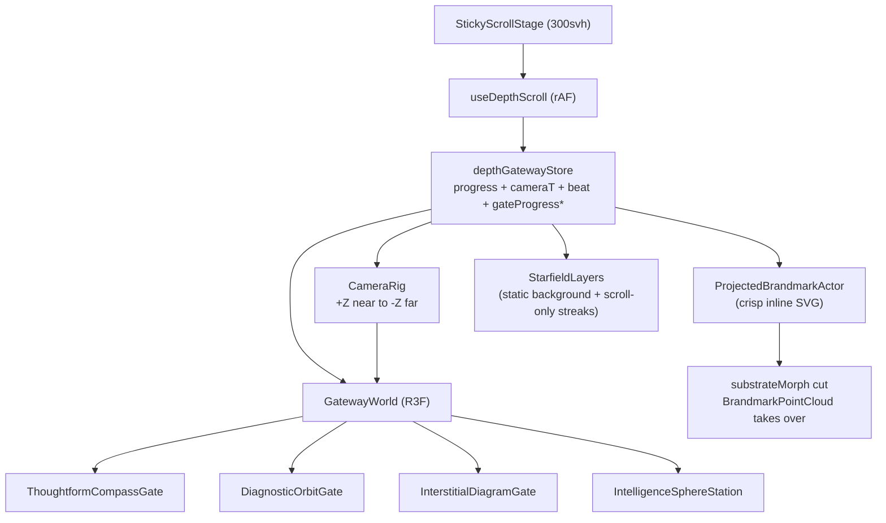

# ADR-018: Home V2 Depth Corridor

**Date:** 2026-05-21
**Status:** Proposed
**Scope:** `/test/home-v2` only — the production homepage (`/`) is untouched.
**Related:**
[ADR-008 — Landing v7 background layers](008-landing-v7-background-layers.md),
[ADR-013 — Brandmark journey refactor](013-brandmark-journey-refactor.md),
[ADR-015 — Brandmark vector-first](015-brandmark-vector-first.md),
[ADR-017 — Orbit journey + substrate-sphere morph](017-orbit-journey-and-substrate-morph.md).

---

## 2026-06-09 Revision (v3.3) — Curved landing arc, mouth-funnel exit, sources fly in from outside

Three follow-up refinements on the v3.2 corridor-exit + planet landing,
in response to user feedback:

> "When I fly to the Build section, I don't see the end of the core
> morphing into a wider thing. We need to fly into that with the
> trusted sources and then the headless surfaces — they don't come
> from inside the wormhole, they come from outside it, from the new
> space you enter when you exit. And when we move into the planet
> phase the camera should fly with a curve so we land in one elegant
> move — like an airplane, they don't go straight for the middle of
> the earth, they fly above it."

### a. Camera: one curved landing arc (was "straight in, then up")

The v3.2 epilogue camera drove DISTANCE on the `APPROACH` band and the
bank TILT on the `LAND` band — two nearly-sequential windows. Because
the parked distance (≈5.6) and the landing distance (planetRadius +
standoff ≈6.0) are almost equal (the planet GROWS rather than the
camera closing much), almost all the visible motion was the late tilt
swing on `LAND` — it read as "hold facing the sphere, then pitch up
over the pole."

`getEpilogueCameraPose` in
[`sceneGeom.ts`](../../components/landing/home-v2/DepthGatewayScene/sceneGeom.ts)
now drives the whole descent off ONE continuous flight curve:

- `EPILOGUE_FLIGHT_START/END` = `[0.12, 0.90]` — a single flight window
  spanning the whole descent. The `LAND` band is no longer read by the
  camera (it was the camera's only consumer).
- `flightRaw` = `smoothstep(START, END, epi)`; `flight` adds a second
  smoothing pass (smootherstep) for kink-free accel/decel.
- **Bank angle LEADS**: `arc = sin(flightRaw · π/2)` — an ease-OUT, so
  the camera gains ALTITUDE early (already ~13° tilted by epi 0.30)
  and is looking DOWN at the planet from above as it closes in, like
  an aircraft on a glide slope. `theta = LANDING_TILT · arc`.
- **Distance follows** on the gentler double-smoothed `flight`, with a
  mid-flight `EPILOGUE_SWOOP_DEPTH` (0.9 world units) sin-bump dip —
  the landing flare. Altitude bows up first, the approach curves in
  under it: one continuous arc, never an L.
- The `lookAt` blends parked→land on the SAME leading `arc` so the
  gaze tracks where the camera is banking.

Endpoint pose is essentially unchanged from the v3.2-approved framing
(big planet, gold atmosphere limb across the upper frame, surface
below, title top-centre) — only the PATH to it changed.

### b. Wormhole exit: forward mouth-funnel (was a near-camera blowout)

The v3.2 `uExitWarp` pushed rail points radially out with a weight that
PEAKED at the camera — so the near rails blew off the frame edges and
left a thin flat ellipse (the "I don't see the core morphing into a
wider thing" complaint). v3.3 reverses the bias in
[`LatentWormholeWalls.tsx`](../../components/landing/home-v2/DepthGatewayScene/LatentWormholeWalls.tsx):
the warp now dilates points AHEAD of the camera (`ahead = max(0, camZ −
position.z)`, `mouth = 1 − exp(−ahead/4)`, `expand = uExitWarp · mouth ·
1.9`). The throat right in front of us stays tight while the far rim
flares to ~3× radius — a trumpet-bell / iris the camera flies THROUGH,
framing the substrate in a widening opening rather than ballooning the
whole shell into a ring. `getWormholeExitWarp` window pulled earlier +
wider (`[0.80,0.93]` → `[0.74,0.92]`) so the opening is gradual and
visible while the walls are still opaque (the ambient dissolve starts
at 0.86).

### c. Sources + surfaces fly in from OUTSIDE the wormhole

[`ShellStack.tsx`](../../components/landing/home-v2/DepthGatewayScene/shell/ShellStack.tsx)
previously slid the trusted-sources and headless-surfaces clusters in
purely laterally (X = ±`STACK_SLOT_X_OFFSET`) in the substrate plane —
it read as wings sliding in, not as arrivals from the new space. A new
`STACK_SLOT_Z_OFFSET` (2.6, local) adds a FORWARD (toward-camera) start
offset, so each cluster begins off to the side AND out in front of the
substrate — in the space the camera has just emerged into — and flies
back-and-inward to dock on the substrate plane (z=0). With the existing
per-item lock-snap + fold-emerge landing this reads as the sources and
surfaces converging onto the substrate from the surrounding space as
the wormhole opens. Sources still lead, surfaces follow (cluster
stagger unchanged).

### Verification

Drove the corridor directly (CDP scroll helpers, 1440×900) and read the
frames first-hand (a prior verification subagent misread the gold
dotted-wireframe planet as "starfield"):

- **Camera arc**: epi 0.30 — planet large, camera already above the
  equator (equator line bows downward); epi 0.55 — camera high, far
  limb arcing across the upper frame; epi 1.0 — settled landing (big
  planet, gold atmosphere limb top, surface dots below, title
  top-centre). A single continuous rising curve, not an L.
- **Wormhole mouth**: rawP≈0.50 — the aperture frame dilates and rails
  spread outward around the substrate (flying through an opening), no
  flat-ring blowout.
- **Sources/surfaces**: rawP≈0.53 — green source pips strung along
  lanes flying in from the front-left with depth, surfaces forming
  front-right, then docking at the Build park.
- `npm run build` + `npm run lint` clean (0 errors).

### Tunables (v3.3)

- Arc altitude lead: the `arc` exponent / `sin` shaping in
  `getEpilogueCameraPose`. Landing flare: `EPILOGUE_SWOOP_DEPTH`.
  Flight pacing: `EPILOGUE_FLIGHT_START/END`.
- Mouth flare: the `· 1.9` magnitude + `exp(−ahead/4)` decay in the
  `uExitWarp` block; opening timing: `getWormholeExitWarp` window.
- Fly-in depth: `STACK_SLOT_Z_OFFSET` (paired with `STACK_SLOT_X_OFFSET`).

---

## 2026-06-09 Revision (v3.2) — Wormhole exit widen, Build starfield boost, Earth-reference horizon planet

Three independent polish passes on the corridor-to-Build transition
and the epilogue planet flyover, in response to user feedback:

> "Right now the fading out of the corridor is quite harsh; can't we
> do it so it feels like you're moving out of the corridor when you
> enter the build phase as if you're exiting the wormhole — so the
> end (mouth) of the corridor can organically widen as you exit. I
> still want a starfield in the background, which becomes a bit
> clearer when you enter the Build on the Substrate page, otherwise
> the background is very empty. And then that shot afterwards I want
> the perspective to be like the two Earth screenshots — a simple
> perspective; let's also increase the pixel density count as you
> move into this perspective because right now it's barely visible."

### a. Wormhole mouth widens on exit

The v3.1 declutter pass faded the ambient corridor layers
(`LatentWormholeWalls`, `LatentFieldTunnel`, `LatentTopographyContours`,
`InterGateCorridor`, `CelestialMotes`) via a plain opacity ramp
(`getBuildApproachFade`, window `[0.80, 0.915]`). The user read this
as a hard cut — the corridor just "stopped existing." v3.2 keeps the
opacity fade for the AMBIENT layers, but replaces it for the
`LatentWormholeWalls` rails with a radial expansion that opens the
tube mouth around the camera as it emerges into Build.

In
[`LatentWormholeWalls.tsx`](../../components/landing/home-v2/DepthGatewayScene/LatentWormholeWalls.tsx)
the vertex shader gained a `uExitWarp` uniform driven from
`getWormholeExitWarp(paintProgress)` in
[`sceneGeom.ts`](../../components/landing/home-v2/DepthGatewayScene/sceneGeom.ts)
(`smoothstep(0.80, 0.93, paintProgress)`). At peak warp each point's
world-space `xy` is multiplied by `1 + uExitWarp * nearWeight * aheadBias * 1.6`,
where `nearWeight = exp(-|relZ| / 4)` and `relZ = position.z - uCameraPos.z`.
Net behaviour:

- The tube opens MOST at the camera's immediate vicinity (peak
  `nearWeight = 1`).
- The opening biases toward "ahead of the camera" via `aheadBias`,
  so the mouth WE'RE FLYING THROUGH splays open rather than the
  tube behind us.
- Far down the tube and far behind the camera, the warp decays to
  zero — the rest of the corridor doesn't deform.

The ambient opacity fade was retimed from `[0.80, 0.915]` to
`[0.86, 0.97]` so the rails splay open BEFORE they dissolve — first
the mouth widens, then it dissolves. Reads as "we just flew out the
end of the wormhole into the Build station."

### b. Background starfield, boosted at Build

`StaticStarfield` originally sat at `uOpacity = 0.6` baseline with a
Thoughtform-boot additive lift only — once the boot fade ended, the
field returned to baseline for the rest of the corridor and the
Build/epilogue background read empty. v3.2 adds a Build-approach
boost in
[`StaticStarfield.tsx`](../../components/landing/home-v2/DepthGatewayScene/StaticStarfield.tsx):

- `uOpacity` ramps `0.6 + bootLift` → `~1.0` (additive lift `0.45`,
  capped at `1.0`) across `smoothstep(0.78, 0.92, paintProgress)`.
- `uPointSize` ramps `2.0 → 3.2` across the same window so the dots
  read as more substantial stars at low FOV.
- Desktop `starCount` bumped `2400 → 3200` so the boosted field
  still resolves as discrete points rather than a uniform glow.

The boost is driven off `paintProgress` (not `epilogueProgress`).
Since `paintProgress` saturates at 1 throughout the epilogue, the
boosted starfield AUTOMATICALLY carries through the planet flyover
— the sky stays bright behind the orbital horizon view without any
epilogue-specific code.

### c. Earth-reference horizon planet

The v3.1 bird's-eye flyover (camera tilt 70deg) gave the user "we're
flying over the top" but the planet read as a faint wireframe almost
below the viewport. The user pointed at two Earth-from-orbit
reference screenshots and asked for that simpler horizon framing
plus more density.

Two coordinated changes in
[`sceneGeom.ts`](../../components/landing/home-v2/DepthGatewayScene/sceneGeom.ts)
and [`shellGeom.ts`](../../components/landing/home-v2/DepthGatewayScene/shell/shellGeom.ts):

**Horizon camera retune** in `getEpilogueCameraPose`:

- `EPILOGUE_LANDING_TILT` `70deg → 28deg` — the camera drops from
  high-above to a near-level orbital perspective, slightly above
  the planet's centre and well in front of it.
- `EPILOGUE_LANDING_STANDOFF` `4.5 → 3.5` — pulls the camera in so
  the planet reads BIG (combined with the grow below it still fits
  safely outside the planet's surface).
- `EPILOGUE_PLANET_GROW` `2.5 → 3.0` — planet ends up 3x the
  parked-corridor scale at peak LAND. Combined with the tighter
  standoff the planet's curved limb arcs across the lower 30-50%
  of the frame.
- `EPILOGUE_LOOK_DOWN_Y` `2.0 → 1.2` and `EPILOGUE_LOOK_FWD_Z`
  `0 → 0.5` — gaze sits just above the planet pole with a slight
  forward bias, dropping the planet's silhouette into the lower
  portion of the frame with sky + title above. Matches the Earth
  reference composition.

**Planet density + atmosphere** in
[`ShellSubstrateGyro.tsx`](../../components/landing/home-v2/DepthGatewayScene/shell/ShellSubstrateGyro.tsx)
and [`shellGeom.ts`](../../components/landing/home-v2/DepthGatewayScene/shell/shellGeom.ts):

- `SUBSTRATE_GYRO_DOTTED_SHELL_COUNT_DESKTOP` `3600 → 6000` — the
  surface stays dense at 3x grow.
- Per-frame, as the EPILOGUE APPROACH band ramps `0 → 1`:
  - `mats.globeDots`, `mats.particle`, `mats.dottedShell`
    `uPointSize` scales `1.0 → 1.8x` (combined with the 3x grow,
    surface dots end up ~5.4x as large in screen space at peak).
  - Same materials' `uOpacity` scales `1.0 → 1.55x` (capped at 1).
- A new `mats.atmosphere` material (fresnel rim-glow on a
  back-faced sphere at `1.15x` the dotted-shell radius, additive
  blending, gold tint) fades in `uOpacity 0 → 0.6` across the
  APPROACH band. The shader uses `pow(1 - dot(n, viewDir), 2.5)`
  so the glow is brightest at the silhouette and transparent
  through the planet's "front face" — the Earth-from-orbit
  atmospheric halo.

### Architecture

- All four refinements are independent. Wormhole warp lives in the
  walls' vertex shader; starfield boost lives in `StaticStarfield`;
  camera retune is param-only in `getEpilogueCameraPose`; planet
  density + atmosphere live entirely inside `ShellSubstrateGyro`.
  No coupling between them.
- The wormhole warp and the ambient opacity fade are driven off the
  SAME `paintProgress` channel, but with offset windows
  (`[0.80, 0.93]` warp vs `[0.86, 0.97]` opacity) so the rails
  visibly splay open BEFORE they dissolve. Net feel: exiting the
  wormhole mouth, not a cut.
- Starfield boost intentionally rides `paintProgress` (not
  `epilogueProgress`) so the boosted state propagates into the
  epilogue without an explicit handoff.
- Atmosphere lives INSIDE `ShellSubstrateGyro`'s `rootRef`, so it
  inherits the gyro assembly's parking position, rotation, AND the
  `getEpiloguePlanetScale` grow — the halo scales with the planet
  exactly as it should.

### Verification

Dev scrub at 1440x900 with `block_until_ms: 0` background:

- **Wormhole exit (paintProgress ≈ 0.85)**: rails clearly splayed
  outward into a wide ellipse rather than the parked tight tube;
  starting to fade. Reads as "the mouth is opening" instead of a
  flat cut.
- **Build park (paintProgress ≈ 0.92)**: substrate gimbal + cardinal
  bezel + sources/surfaces stack visible against a markedly DENSER
  starfield — hundreds of small star dots clearly visible in the
  background vs the corridor's quieter baseline.
- **Epilogue peak LAND (`epiScroll(0.95)`)**: BIG planet with a
  clear curved limb across the lower ~40% of the frame, soft GOLD
  fresnel halo at the silhouette, dense starfield visible in the
  upper "sky," "THE LABS JUST BET BILLIONS ON THE SAME LAYER." at
  top-centre. Matches the Earth-reference brief.
- **No console errors**. Lint + build clean.

### Tunables (`getEpilogueCameraPose` + `ShellSubstrateGyro`)

- Camera horizon angle: `EPILOGUE_LANDING_TILT`. Lower = more
  level; higher = more overhead.
- Planet size: `EPILOGUE_PLANET_GROW` + `EPILOGUE_LANDING_STANDOFF`
  (paired — increase grow / decrease standoff to push the planet
  bigger in frame).
- Planet/sky split: `EPILOGUE_LOOK_DOWN_Y`. Lower = more sky above;
  higher = more planet below.
- Atmosphere intensity: peak `uOpacity` multiplier (currently 0.6)
  and the fresnel `uPower` (currently 2.5 → tighter ring at higher
  power).
- Density boost: `pointSizeBoost` peak (currently 1.8) and
  `opacityBoost` peak (currently 1.55) in `ShellSubstrateGyro`'s
  `useFrame`.

---

## 2026-06-09 Revision (v3.1) — Bird's-eye flyover, Build declutter, smoother section-2 pan

Three polish refinements on top of v3:

### a. Bird's-eye planet flyover

The v3 landing tilted the camera ~60deg and lifted the gaze to a
mid-screen horizon, so the planet's limb sat across the middle of
the viewport. The user asked for "we're about to fly over the top"
— only the upper portion of the sphere visible, sky+title above.

In [`sceneGeom.ts`](../../components/landing/home-v2/DepthGatewayScene/sceneGeom.ts)
`getEpilogueCameraPose`:

- `EPILOGUE_LANDING_TILT`: 60deg -> 70deg (camera lifts higher
  above the planet's pole).
- `EPILOGUE_LANDING_STANDOFF`: kept at 4.5 (a closer 2.5 pushed the
  planet to fill the entire FOV).
- `EPILOGUE_LOOK_DOWN_Y`: 0.65 -> 2.0 (lookAt now at 2 planet-radii
  above the planet centre — well above the pole at +1R — which
  shifts the planet's silhouette into the LOWER portion of the
  viewport at peak).
- `EPILOGUE_LOOK_FWD_Z`: kept at 0 (lookAt at planet centre Z, not
  past it). The v2 epilogue v2 used a "look past" value which
  pointed the camera AWAY from the planet — confirmed wrong, never
  used in v3 because the parameter never existed there.

At peak (tilt=70deg, distance=R+4.5=6.625, planet centre at angle
~29deg below forward, half-angular = 18.7deg) the planet's top rim
arcs across the middle of the viewport (~53% down from centre) and
its body fills the lower portion. Starfield + "billions" title fill
the upper portion. Matches the user brief.

### b. Build-approach ambient fade

The corridor's ambient framing (wormhole rail walls, latent-field
dots, contour shards, intergate debris, celestial motes) crowded
the left/right edges of the frame at the Build park where the
substrate gimbal + sources/surfaces stack should be the centre of
attention.

New helper in
[`sceneGeom.ts`](../../components/landing/home-v2/DepthGatewayScene/sceneGeom.ts):

```ts
export function getBuildApproachFade(paintProgress: number): number {
  return 1 - smoothstep(0.8, 0.915, paintProgress);
}
```

Returns 1 across the early corridor, ramps to 0 by the Build park
centre (paintProgress ~0.915). Bonus: `paintProgress` is pinned at
1 throughout the epilogue, so the ambient stays gone — the
bird's-eye flyover gets a clean stage.

Applied as a per-frame multiplier to the final opacity of:

- [`LatentWormholeWalls.tsx`](../../components/landing/home-v2/DepthGatewayScene/LatentWormholeWalls.tsx)
  — multiplies `uOpacity` uniform
- [`LatentFieldTunnel.tsx`](../../components/landing/home-v2/DepthGatewayScene/LatentFieldTunnel.tsx)
  — multiplies points / vectors / tokens targets
- [`LatentTopographyContours.tsx`](../../components/landing/home-v2/DepthGatewayScene/LatentTopographyContours.tsx)
  — multiplies the three shard variants' final material opacities
- [`InterGateCorridor.tsx`](../../components/landing/home-v2/DepthGatewayScene/InterGateCorridor.tsx)
  — multiplies the band material opacity
- [`CelestialMotes.tsx`](../../components/landing/home-v2/DepthGatewayScene/CelestialMotes.tsx)
  — multiplies the alpha target

Untouched (intentionally): `StaticStarfield` (the background sky
should stay), `ShellStack` (sources/surfaces — the Build story
itself), the substrate gimbal.

### c. Smoother section-2 centering pan

The Thoughtform centering pan (`getThoughtformCenterOffsetX`)
slides the rectangular compass gate + brandmark + copy to the
optical axis as the corridor enters. v3.1 found this read as
"harsh" — short window with `smoothstep` easing and hard plateaus
at both ends, so scroll-back through `progress = 0.075` snapped the
composition off-axis.

Two changes:

- `CORRIDOR_TIMELINE.thoughtformPan.start` 0.075 -> 0.035 — twice
  as long. END unchanged at 0.109 so the camera dolly hold,
  thoughtform boot ramp, and inner compass-ring flythrough (start
  at 0.13) stay byte-identical.
- Curve `smoothstep` -> `smootherstep` (Ken Perlin's
  6t^5-15t^4+10t^3) — C2-continuous with zero velocity AND zero
  acceleration at both ends, so the scroll-back at `start` is a
  smooth deceleration rather than a hard stop.

The pan still drives the four square compass loops, the brandmark,
the left copy block, the phase labels, the Thoughtform atmosphere,
and the boot glow — all one function call, all in lockstep.

### Files touched in v3.1

| File                                                                        | Change                                                                                                                                                                                                                                                |
| --------------------------------------------------------------------------- | ----------------------------------------------------------------------------------------------------------------------------------------------------------------------------------------------------------------------------------------------------- |
| `components/landing/home-v2/DepthGatewayScene/sceneGeom.ts`                 | Retuned `EPILOGUE_LANDING_TILT` / `EPILOGUE_LANDING_STANDOFF` / `EPILOGUE_LOOK_DOWN_Y` / `EPILOGUE_LOOK_FWD_Z`; added `getBuildApproachFade`; widened `thoughtformPan.start` 0.075 -> 0.035; `getThoughtformCenterOffsetX` smoothstep -> smootherstep |
| `components/landing/home-v2/DepthGatewayScene/LatentWormholeWalls.tsx`      | Multiply `uOpacity` by `getBuildApproachFade`                                                                                                                                                                                                         |
| `components/landing/home-v2/DepthGatewayScene/LatentFieldTunnel.tsx`        | Multiply points/vectors/tokens targets by `getBuildApproachFade`                                                                                                                                                                                      |
| `components/landing/home-v2/DepthGatewayScene/LatentTopographyContours.tsx` | Multiply the 3 shard variants' opacities by `getBuildApproachFade`                                                                                                                                                                                    |
| `components/landing/home-v2/DepthGatewayScene/InterGateCorridor.tsx`        | Multiply band material opacity by `getBuildApproachFade`                                                                                                                                                                                              |
| `components/landing/home-v2/DepthGatewayScene/CelestialMotes.tsx`           | Multiply alpha target by `getBuildApproachFade`                                                                                                                                                                                                       |

### Verified (v3.1)

- `npm run build` clean (57 routes, no new errors).
- Section-2 centering: rectangular gate scrolls smoothly to the
  axis with the new wider window + smootherstep; scroll-back
  through the new start (0.035) no longer snaps the composition
  off-axis.
- Build park (corridor progress 0.92, rawP 0.557): substrate
  gimbal + sources/surfaces stack + Build header all read with NO
  ambient corridor crowding the edges. Clean composition.
- Bird's-eye peak (epilogueProgress 0.98): title at top-centre
  full opacity, planet's wireframe silhouette in the lower portion
  of the viewport (sparse but present — the wireframe globe
  becomes faint at planet scale; densifying the globe on grow is
  an optional polish for future iteration).
- No console errors.

### Known polish for follow-up (not blocking)

- The substrate wireframe globe is sparse at planet scale (grow
  2.5x) — the planet reads as a faint arc rather than a solid
  surface. Could be densified during APPROACH by scaling up
  `SUBSTRATE_GYRO_DOTS_PER_MERIDIAN` / `_PARALLEL` (or by adding a
  surface particle boost) so the planet feels more "real" at
  flyover scale. Not blocking — the composition geometry is right.

---

## 2026-06-08 Revision (v3) — Substrate planet landing (cards + gateway + topology morph removed)

The user reviewed v2 and called the orbiting news cards "not elegant", was
unsure about the emerging gateway + background topology morph, and pitched a
much stronger climactic ending:

> we end with built on the substrate. that intelligence layer IS the
> substrate. fly towards the sphere and land on top of it. the camera
> angle also tilts so we are walking on a planet, so we see the curvature
> in the distance of the sphere... like navigating with a spaceship to the
> sphere, which is a planet in the distance. We fly towards it, and as we
> land, the camera tilts upwards so that the bottom of the viewport just
> sees the upper half or a quarter of the top of the sphere.

This is on-brand in a way v2 wasn't: the substrate sphere IS the world
you build on, so flying to it and landing on it makes the metaphor
literal. v3 removes everything from v2 except the corridor itself + the
billions title (now top-centre) and replaces the post-Build vista with a
cinematic camera landing.

### a. Removed v2 theatrics

- Deleted `ShellNewsOrbit.tsx` and `lib/home-v2/signalCards.ts`.
- Deleted `EpilogueGateway.tsx` and unmounted it from
  `DepthGatewayScene/index.tsx`.
- Reverted the per-vertex landscape morph in `LatentWormholeWalls.tsx`
  (the `aMorphTarget` attribute, `uMorph`/`uMorphCameraZ`/
  `uGatewayCenter`/`uGoldColor` uniforms, the front-to-back stagger,
  and the gold horizon tint are all gone — the wormhole walls are
  back to their corridor-only form).
- Reverted the MORPH-band dims from `LatentTopographyContours.tsx` and
  `LatentFieldTunnel.tsx`. These layers stay as the corridor/space we
  fly through and recede naturally as the camera flies in.
- The v2 epilogue helpers `epilogueShellOffsetX` and
  `epilogueGyroShrinkFactor` and the v2 shellGeom constants
  `EPILOGUE_SHELL_X`, `EPILOGUE_GYRO_SHRINK`,
  `EPILOGUE_NEWS_RING_RADIUS`, `EPILOGUE_NEWS_RING_TILT_X`,
  `EPILOGUE_NEWS_SPIN_SPEED` are gone.

### b. New v3 epilogue bands

[`lib/home-v2/epilogueTimeline.ts`](../../lib/home-v2/epilogueTimeline.ts)
replaces v2's six bands with four:

| Band        | Window       | Drives                                                                                                                                         |
| ----------- | ------------ | ---------------------------------------------------------------------------------------------------------------------------------------------- |
| `BUILD_OUT` | 0.00 -> 0.22 | Build header + ShellStack + ShellEncode orbits/cardinals + gimbal armillary rings/ticks/symbols fade out (only the wireframe globe remains)    |
| `APPROACH`  | 0.10 -> 0.62 | Camera flies in toward the substrate; the substrate scales up to planet size; gyro pointer-bank and drift calm to 0; projected brandmark fades |
| `LAND`      | 0.55 -> 0.92 | Camera orbits up over the planet's pole and tilts so the limb sits across the middle of the viewport with sky above                            |
| `TITLE_IN`  | 0.70 -> 0.90 | "The labs just bet billions on the same layer." title fades in at TOP-CENTRE (the closing chord of the 3D space)                               |

New shared helper `getEpiloguePlanetScale(epilogueProgress)` ramps the
gimbal assembly from `GYRO_ASSEMBLY_SCALE` to
`GYRO_ASSEMBLY_SCALE * EPILOGUE_PLANET_GROW` across APPROACH.
`EPILOGUE_PLANET_GROW = 2.5` (tuned against the 38deg FOV so the planet
fits in the lower portion of the viewport rather than filling the
whole frame).

### c. Camera fly-in + landing tilt

New [`getEpilogueCameraPose(epilogueProgress)`](../../components/landing/home-v2/DepthGatewayScene/sceneGeom.ts)
returns the camera's epilogue-mode position + lookAt. Math:

- planet centre P = `BRANDMARK_ANCHOR_INTELLIGENCE` (the parked
  substrate centre, ~[0, 0, -22.6]);
- planet radius = `SUBSTRATE_GYRO_GLOBE_RADIUS * GYRO_ASSEMBLY_SCALE *
getEpiloguePlanetScale(ep)`;
- camera UP direction from planet centre: `(0, sin(theta), cos(theta))`
  where theta ramps 0 -> `EPILOGUE_LANDING_TILT = 60deg` across LAND
  (parked frame at theta=0 is identical to `getCameraLookAt(1)`);
- camera distance from planet centre: `lerp(parked_distance,
planet_radius + EPILOGUE_LANDING_STANDOFF, approachT)` (standoff
  = 4.5 so the camera ends comfortably above the surface with the
  FOV not pinned to it);
- lookAt blends from the corridor's parked lookAt (landT=0) to a
  point lifted `EPILOGUE_HORIZON_LIFT = 0.65` planet radii ABOVE the
  centre (landT=1) — pulls the gaze up so the planet drops into the
  lower portion of the viewport.

[`FlyingCameraRig.tsx`](../../components/landing/home-v2/DepthGatewayScene/FlyingCameraRig.tsx)
short-circuits to `getEpilogueCameraPose` whenever
`epilogueProgress > 0`. At `epilogueProgress = 0` the pose returns
the parked CAMERA_END frame, so the corridor -> epilogue handoff is
seamless at the seam.

### d. Instrument vocabulary fades

- [`ShellSubstrateGyro.tsx`](../../components/landing/home-v2/DepthGatewayScene/shell/ShellSubstrateGyro.tsx)
  multiplies `ring`/`tick`/`graduation`/`symbol`/`pivot`/`cardinalRing`
  material opacities by `(1 - epilogueBand("BUILD_OUT"))` so the
  gimbal sheds its instrument affordances. The globe materials
  (`globeDots`, `equator`, `particle`, `dottedShell`) stay — those
  ARE the planet surface grid as it grows.
- [`ShellEncode.tsx`](../../components/landing/home-v2/DepthGatewayScene/shell/ShellEncode.tsx)
  hides the whole orbit/cartridge group on the same band, and
  individual arc/bracket opacities are multiplied by the fade for a
  clean dissolve before the geometry is hidden.
- `ShellStack`, source/surface DOM labels, and the Build station
  header retain their existing BUILD_OUT fades from v2.

### e. Brandmark fade across APPROACH

`ProjectedBrandmarkActor` multiplies its DOM opacity by
`(1 - epilogueBand("APPROACH"))`. By LAND peak the guiding-star
brandmark is invisible — it'd otherwise sit at the centre of the
planet we just landed on, breaking the read.

### f. Title at top-centre

`.home-v2-station-header--signal` repositioned from vertical-centre-
left (v2) to top-centre, with `text-align: center` and a wider width
clamp. It lands in the sky above the planet's horizon line. Driven
by the new `TITLE_IN` band in
[`CorridorStationHeaders.tsx`](../../components/landing/home-v2/CorridorStationHeaders.tsx).

### Files touched in v3

| File                                                                        | Change                                                                                                                               |
| --------------------------------------------------------------------------- | ------------------------------------------------------------------------------------------------------------------------------------ |
| Deleted                                                                     | `components/landing/home-v2/DepthGatewayScene/shell/ShellNewsOrbit.tsx`                                                              |
| Deleted                                                                     | `lib/home-v2/signalCards.ts`                                                                                                         |
| Deleted                                                                     | `components/landing/home-v2/DepthGatewayScene/EpilogueGateway.tsx`                                                                   |
| `lib/home-v2/epilogueTimeline.ts`                                           | Replaced 6 v2 bands with BUILD_OUT/APPROACH/LAND/TITLE_IN; added `getEpiloguePlanetScale`                                            |
| `components/landing/home-v2/DepthGatewayScene/sceneGeom.ts`                 | New `getEpilogueCameraPose`; restored `gyroAssemblyWorldPosition` (planet-scale only, no slide/shrink); removed v2 helpers + imports |
| `components/landing/home-v2/DepthGatewayScene/shell/shellGeom.ts`           | Replaced 5 v2 constants with `EPILOGUE_PLANET_GROW = 2.5`                                                                            |
| `components/landing/home-v2/DepthGatewayScene/FlyingCameraRig.tsx`          | Short-circuit to `getEpilogueCameraPose` when `epilogueProgress > 0`                                                                 |
| `components/landing/home-v2/DepthGatewayScene/BrandmarkAccretionShell.tsx`  | Removed slide+shrink; added planet-grow via `getEpiloguePlanetScale`; calmed gyro bank + drift across APPROACH                       |
| `components/landing/home-v2/DepthGatewayScene/shell/ShellSubstrateGyro.tsx` | Multiplied instrument material opacities by BUILD_OUT fade (keep globe materials)                                                    |
| `components/landing/home-v2/DepthGatewayScene/shell/ShellEncode.tsx`        | Whole group hides on BUILD_OUT; per-arc opacity multiplied by fade                                                                   |
| `components/landing/home-v2/DepthGatewayScene/LatentWormholeWalls.tsx`      | Reverted v2 per-vertex landscape morph (shader, uniforms, morphTargets attribute)                                                    |
| `components/landing/home-v2/DepthGatewayScene/LatentTopographyContours.tsx` | Reverted v2 MORPH-band dim                                                                                                           |
| `components/landing/home-v2/DepthGatewayScene/LatentFieldTunnel.tsx`        | Reverted v2 MORPH-band dim                                                                                                           |
| `components/landing/home-v2/DepthGatewayScene/index.tsx`                    | Unmounted `<EpilogueGateway />`                                                                                                      |
| `components/landing/home-v2/ProjectedBrandmarkActor.tsx`                    | Multiplied DOM opacity by `(1 - epilogueBand("APPROACH"))`                                                                           |
| `components/landing/home-v2/home-v2.css`                                    | `.home-v2-station-header--signal` repositioned to top-centre, `text-align: center`                                                   |
| `components/landing/home-v2/CorridorStationHeaders.tsx`                     | Repointed `sig` block from v2 `SIGNAL_IN` -> v3 `TITLE_IN`                                                                           |

### Verified (v3)

- `npm run build` clean (57 routes, no new errors).
- Browser scrub at 1440x900 across 5 epilogueProgress checkpoints
  (0.05 / 0.30 / 0.55 / 0.78 / 0.95):
  - Build park composition unchanged (no regression).
  - Substrate sheds its instrument vocabulary by tgt=0.30 (gimbal
    rings + cardinals + sources/interfaces all gone).
  - Substrate visibly grows between tgt=0.05 (centred small) and
    tgt=0.55 (filling the viewport as a wireframe planet).
  - Camera tilts up by tgt=0.78 — the substrate's curved equator
    moves into the lower portion of the viewport with sky above.
  - At tgt=0.95 the planet's curvature reads clearly: the gold
    equator arcs across the middle/lower viewport, "THE LABS JUST
    BET BILLIONS ON THE SAME LAYER." sits at top-centre with full
    opacity, and the closing chord of the 3D space is in place.
- No console errors.

### Known polish for follow-up (not blocking)

- The four DOM cardinals (`JUDGMENT` / `CRAFT` / `VOICE` / `TASTE`)
  still ride the substrate at LAND because they're positioned by
  `gyroAssemblyWorldPosition` (which now scales with planet-grow).
  They read as compass points on the planet, which is OK — but if
  the user wants a cleaner sky/planet split they should fade with
  BUILD_OUT or APPROACH.

---

## 2026-06-08 Revision (v2) — Epilogue choreography polish + landscape warp + emerging gateway

The first epilogue pass (below) shipped sphere-slides-right + orbiting news
cards + bottom-left title, but the user's feedback identified three issues:

1. The title was anchored to the BOTTOM of the viewport; should sit at
   the **vertical centre** to mirror section 2's "AI collapsed the
   distance" copy position.
2. The Build header and the billions title were **co-existing on
   screen** during the cross-fade — violates the corridor's handoff
   "rule" (Navigate/Encode/Build never share the viewport with the
   next title; same length + style fade should apply here).
3. Once the user passed the Build park the **camera + background sat
   completely still** — the corridor's depth/motion vocabulary
   evaporated. The user asked for the background to MORPH into a
   **landscape with a gateway emerging in the distance** — visually,
   the original homepage gateway grammar (gold portal rings + glow
   over a topology floor).

Fixes shipped together as "epilogue v2".

### a. Sub-band timeline — single source of truth

The epilogue is no longer a single 0..1 ramp driving everything in
lockstep. New module
[`lib/home-v2/epilogueTimeline.ts`](../../lib/home-v2/epilogueTimeline.ts)
declares six **sub-bands** (start/end in epilogueProgress 0..1) and a
shared `band(p, a, b)` smoothstep helper that every consumer reads:

| Band        | Window      | Drives                                                          |
| ----------- | ----------- | --------------------------------------------------------------- |
| `BUILD_OUT` | 0.00 → 0.22 | Build header + ShellStack + source/surface DOM labels fade out  |
| `SPHERE`    | 0.08 → 0.55 | Gimbal slides right AND shrinks                                 |
| `MORPH`     | 0.06 → 0.70 | Wormhole topology warps into landscape; contour shards dissolve |
| `GATEWAY`   | 0.20 → 0.85 | Gold portal scales 0.25 → 1.0 + opacity 0 → 0.85                |
| `SIGNAL_IN` | 0.52 → 0.74 | "Billions" title fades / types in                               |
| `CARDS_IN`  | 0.54 → 0.84 | News cards orbit in + deploy                                    |

The empty window **`[0.22, 0.52]`** between `BUILD_OUT.end` and
`SIGNAL_IN.start` is the corridor cadence rule made literal — no
title is on screen there. It's pure background morph + gateway
emergence (where the camera-static "warp reality" beat lives).

The stage grew from `640svh` to `760svh` to give that gap room
(epilogue length 180 → 300svh). `useDepthScroll` `EPILOGUE_START`
recomputes to `460 / 760 ≈ 0.6053`.

### b. Title at vertical centre

[`home-v2.css`](../../components/landing/home-v2/home-v2.css)
`.home-v2-station-header--signal` now uses
`top: 50%; transform: translateY(-50%)` (was
`bottom: clamp(80px, 14vh, 160px)`). Mirrors the on-screen Y of
`.home-v2-copy-block--thoughtform-left` so the closing chapter is
the symmetric bookend to the opening copy. Camera is parked through
the entire epilogue, so a fixed-position anchor is pixel-stable.

### c. Sphere shrinks (cards keep their size)

New `EPILOGUE_GYRO_SHRINK = 0.7` in
[`shellGeom.ts`](../../components/landing/home-v2/DepthGatewayScene/shell/shellGeom.ts).
[`BrandmarkAccretionShell`](../../components/landing/home-v2/DepthGatewayScene/BrandmarkAccretionShell.tsx)
writes `gyroAssembly.scale.setScalar(GYRO_ASSEMBLY_SCALE * epShrink)`
per frame off the SPHERE band, so the gimbal contracts toward the
news-card ring radius as the user scrolls in. The news cards are a
**sibling** of `gyroAssemblyRef` (not a child), so they keep their
own size as the gimbal shrinks. The DOM-anchored cardinal labels
(JUDGMENT / CRAFT / VOICE / TASTE) shrink in lockstep via
`epilogueGyroShrinkFactor` inside `sceneGeom.gyroAssemblyWorldPosition`.

### d. Topology → landscape warp (the centerpiece)

The camera holds at `CAMERA_END = [0, 0, -17]` throughout the
epilogue, so the sensation of "moving through space again" comes
from the **geometry warping around the parked camera**, not from
camera dolly. The user described it as "warping reality" — that's
exactly what the shader does.

[`LatentWormholeWalls`](../../components/landing/home-v2/DepthGatewayScene/LatentWormholeWalls.tsx)
is one `Points` mesh (~thousands of dots: longitudinal rails, cross
rings, aperture frames, shelf rows). At build time we now compute a
per-point **`aMorphTarget`** that says "where does this tube point
LAND on the landscape." Mapping:

- bottom-of-tube points (`yNorm < 0`) become **ground heightfield**
  — X expands ~3.4×, Y descends to `-1.55` + a low-amplitude two-
  sine heightfield, Z preserved → an open ground plane;
- top-of-tube points (`yNorm > 0`) descend toward the **horizon
  line** — X stays close to the optical axis (distant), Y settles
  near `LANDSCAPE_GATEWAY_Y`;
- side points form the **ridges** between ground and horizon.

The vertex shader lerps `position` → `aMorphTarget` per point with
a **front-to-back stagger** — points nearer the camera morph FIRST,
so a wave of bending reality sweeps OUTWARD into the distance
rather than the whole tube cross-fading at once:

```glsl
float ahead = max(0.0, uMorphCameraZ - position.z);
float zNorm = clamp(ahead / 20.0, 0.0, 1.0);
float perPointMorph = smoothstep(uMorph - 0.30, uMorph + 0.10, 1.0 - zNorm);
perPointMorph = min(perPointMorph, uMorph);
vec3 warped = mix(position, aMorphTarget, perPointMorph);
```

A **gold tint** blooms toward the horizon gateway centre as the
morph completes — points landing near `LANDSCAPE_GATEWAY_Z = -30`
get a soft lift so the gateway feels "lit by something beyond" the
camera rather than painted on top.

The corridor's other topology — `LatentTopographyContours` shards
and the ambient `LatentFieldTunnel` field — dissolve during the
MORPH band so the new landscape reads cleanly. (Multipliers on
each material.opacity; the layers don't disappear, they recede
underneath the warped wall lattice.)

### e. Emerging gateway

New
[`EpilogueGateway.tsx`](../../components/landing/home-v2/DepthGatewayScene/EpilogueGateway.tsx).
Three concentric gold `RingGeometry` discs + one outer dawn ring +
an additive radial-glow shader plane behind them at world `[0,
-0.2, -30]` (behind Intelligence station ~-22.6, in front of the
starfield -26..-46, comfortably inside Canvas `far: 100`). Mounted
right after `<StaticStarfield />` so it composites as deep
background.

GATEWAY band drives scale (`0.25 → 1.0`) and opacity (`0 → 0.85`)
with a faint breathing pulse on `clock.elapsedTime`. The portal
**emerges** rather than fades on — the geometry literally grows
out of nothing on the horizon.

### Files touched in v2

| File                                                                        | Change                                                                                     |
| --------------------------------------------------------------------------- | ------------------------------------------------------------------------------------------ |
| New: `lib/home-v2/epilogueTimeline.ts`                                      | Sub-band table + helpers                                                                   |
| New: `components/landing/home-v2/DepthGatewayScene/EpilogueGateway.tsx`     | Gold portal                                                                                |
| `components/landing/home-v2/home-v2.css`                                    | Stage 640 → 760svh; signal block top:50%                                                   |
| `components/landing/home-v2/hooks/useDepthScroll.ts`                        | `EPILOGUE_START = 460/760`                                                                 |
| `components/landing/home-v2/CorridorStationHeaders.tsx`                     | Build header → BUILD_OUT; signal → SIGNAL_IN                                               |
| `components/landing/home-v2/DepthGatewayScene/BrandmarkAccretionShell.tsx`  | Sphere slide+shrink on SPHERE band                                                         |
| `components/landing/home-v2/DepthGatewayScene/shell/shellGeom.ts`           | `EPILOGUE_GYRO_SHRINK = 0.7`                                                               |
| `components/landing/home-v2/DepthGatewayScene/shell/ShellStack.tsx`         | Fade on BUILD_OUT                                                                          |
| `components/landing/home-v2/DepthGatewayScene/shell/ShellNewsOrbit.tsx`     | Reveal on CARDS_IN                                                                         |
| `components/landing/home-v2/DepthGatewayScene/LatentWormholeWalls.tsx`      | `aMorphTarget` attribute + `uMorph` uniform; per-vertex warp + gold horizon tint           |
| `components/landing/home-v2/DepthGatewayScene/LatentTopographyContours.tsx` | Fade on MORPH                                                                              |
| `components/landing/home-v2/DepthGatewayScene/LatentFieldTunnel.tsx`        | Dim on MORPH                                                                               |
| `components/landing/home-v2/DepthGatewayScene/sceneGeom.ts`                 | `epilogueShellOffsetX` and `epilogueGyroShrinkFactor` band-keyed; gateStackLabel BUILD_OUT |
| `components/landing/home-v2/DepthGatewayScene/index.tsx`                    | Mount `<EpilogueGateway />` after `<StaticStarfield />`                                    |

### Verified (v2)

- `npm run build` clean (57 routes, no new errors).
- Five-checkpoint browser scrub at 1440×900 — Build park, gap,
  mid-SIGNAL_IN, late SIGNAL_IN, near-end — all PASS:
  - title at vertical centre 450px throughout the SIGNAL_IN band;
  - GAP at ep=0.35 shows no title (both Build and billions at 0);
  - SIGNAL_IN opacity ramps 0.634 → 1.0 → 1.0 across 0.65→0.78→0.92;
  - gateway rings visible from ~0.65, fully emerged by 0.92;
  - wormhole walls warping visibly throughout the epilogue;
- No console errors.

---

## 2026-06-08 Revision — "Billions on the same layer" epilogue (orbiting news cards)

User asked for a NEW final beat AFTER "Build on the substrate": when the
user keeps scrolling past Build the gimbal sphere should glide right, the
trusted-sources / interfaces stack and the Build header should fade out,
a new bottom-left title + paragraph appear, and four 3D news cards
(Palantir, Stripe, OpenAI, Anthropic — ported from the Aether
`signalSection`) should orbit the sphere, each clickable to its source
article. Reference: `activetheory.net/work`-style truly-3D card gallery,
with Atlas's dark gold-HUD card grammar.

### Key architectural choice — EPILOGUE channel, not a new map beat

The corridor's `corridorMap.ts` normalizes every beat into `[0,1]` by
weight, and its own comments stress that adding a beat **re-tiles every
window** and forces hand-recalibration of every `CORRIDOR_TIMELINE`
constant, the `CorridorStationHeaders` fade bands, and the brandmark /
camera phases. Adding the receipts beat as a 5th beat would have
silently shifted every Navigate/Encode/Build window by ~15-20% and
required re-tuning the whole back-half choreography.

Instead, the epilogue is a SECOND, INDEPENDENT progress channel on top
of the same sticky stage:

- `home-v2.css` grows `.home-v2-stage` from `460svh` to `640svh`.
- `useDepthScroll.ts` splits raw progress at
  `EPILOGUE_START = 460/640 = 0.71875`:
  - `corridorProgress = clamp01(raw / EPILOGUE_START)` — feeds every
    existing consumer (`paintProgress`, `resolveBeat`, HUD readouts).
    Saturates at `1` for the entire epilogue, so the corridor reads
    "fully parked at Build" throughout.
  - `epilogueProgress = clamp01((raw - EPILOGUE_START) / (1 - EPILOGUE_START))`
    — new channel exposed on `DepthGatewayTransform.epilogueProgress`.
- Engagement is rect-based (not progress-based), so the corridor stays
  `active` through the entire taller stage — no other gating needed.
- The brandmark journey hand-off only fires once the tail sections are
  live in the DOM (`useBrandmarkJourney` ~L420), so a taller sticky
  stage just keeps the corridor in control. No regression.

`CORRIDOR_TIMELINE`, `BEAT_WINDOWS`, `BEAT_PARK_CENTRES`, and every
calibrated constant are byte-identical.

### Painters that read the epilogue channel

- **`BrandmarkAccretionShell`** — `shell.position.x` adds
  `smoothstep(epilogueProgress) * EPILOGUE_SHELL_X` so the parked
  sphere glides right.
- **`sceneGeom.gyroAssemblyWorldPosition`** — same X offset added at
  the DOM-projection step so cardinal labels (JUDGMENT / CRAFT / VOICE
  / TASTE) and source/surface item labels follow the sphere.
- **`ShellStack`** — every material opacity multiplied by
  `(1 - epilogue)`, hidden entirely below epsilon. Stack lanes, pips,
  surface fan all clear.
- **`sceneGeom.gateStackLabel`** — DOM labels for sources/surfaces
  multiplied by the same fade so the canvas and DOM clear in lockstep.
- **`CorridorStationHeaders`** — Build header multiplied by
  `(1 - epilogue)`; a NEW `sig` block (bottom-left, `.home-v2-station-
header--signal`) uses the same typewriter machinery with opacity =
  `epilogue`. Title `The labs just bet <em>billions</em> on the same
layer.`, paragraph `Not a model problem. A deployment problem. Both
labs just said so out loud.`

### New 3D component — `ShellNewsOrbit`

Mounted as a sibling of `gyroAssemblyRef` inside
`BrandmarkAccretionShell`, so the cards inherit the shell's epilogue
X-slide but are NOT subject to the gyro's pointer tilt — they orbit at
their own steady rate.

- **Geometry:** four `THREE.PlaneGeometry(0.95, 1.27)` planes on a
  tilted ring (`EPILOGUE_NEWS_RING_RADIUS = 1.35`,
  `EPILOGUE_NEWS_RING_TILT_X = 0.32 rad`). True 3D, so cards correctly
  occlude behind the sphere as they swing through.
- **Material:** `THREE.CanvasTexture` painted once per card from an
  offscreen 2D canvas (`drawCardFace`). Dark void fill, 1px gold-dim
  outline, 30px gold corner brackets, PT Mono mark + corner badge,
  PT Mono kicker, PP Neue Montreal headline, gold under-rule + PT Mono
  byline. Matches the Atlas Entity Card grammar in the Thoughtform
  palette (`COLOR_GOLD = #CAA554`, `COLOR_DAWN = #ECE3D6`).
- **Motion:** per-frame `theta = (i / 4) * 2π + epilogue*π + t * 0.085`
  — half-turn deploy across the epilogue plus a slow steady spin.
  Each card billboards toward the camera each frame (`mesh.lookAt(cam)`)
  so text always reads upright. Reduced-motion / mobile drop the spin
  and bob but cards still fade in via `epilogueProgress` so the visual
  landing still reads.
- **Interaction:** pointer-events on the canvas are gated by
  `html[data-corridor-epilogue="true"]` (written by `useDepthScroll`),
  so the raycaster is only live inside the epilogue. Hover boosts
  opacity + scale via per-card smoothed lerp; click opens
  `card.href` in a new tab.
- **Card data:** `lib/home-v2/signalCards.ts` (4 entries, ported
  verbatim from the Aether `signalSection`).

### Files touched

- New: `lib/home-v2/signalCards.ts`,
  `components/landing/home-v2/DepthGatewayScene/shell/ShellNewsOrbit.tsx`
- Modified:
  `lib/stores/depthGatewayStore.ts` (added `epilogueProgress`),
  `components/landing/home-v2/hooks/useDepthScroll.ts` (split raw progress,
  toggle `data-corridor-epilogue`),
  `components/landing/home-v2/home-v2.css` (stage `640svh`, pointer-events
  gate, `--signal` variant),
  `components/landing/home-v2/DepthGatewayScene/BrandmarkAccretionShell.tsx`
  (shell X offset + orbit mount),
  `components/landing/home-v2/DepthGatewayScene/shell/shellGeom.ts`
  (`EPILOGUE_SHELL_X`, `EPILOGUE_NEWS_RING_RADIUS`, etc.),
  `components/landing/home-v2/DepthGatewayScene/shell/ShellStack.tsx`
  (epilogue fade),
  `components/landing/home-v2/DepthGatewayScene/sceneGeom.ts`
  (`epilogueShellOffsetX` in `gyroAssemblyWorldPosition`,
  `gateStackLabel` epilogue fade),
  `components/landing/home-v2/CorridorStationHeaders.tsx`
  (new `sig` block, Build header epilogue fade).

### Verified

- `npm run build` clean (57 routes, no new errors).
- Production homepage scrub verified at 1440x900: corridor unchanged
  through Build park, sphere slides right + sources/Build header fade
  - title + cards orbit during epilogue, BuildQuote hand-off clean.
- Mobile (390x844): station-headers layer hidden as designed; R3F
  cards still render in reduced-motion mode (no spin, no bob).
- No console errors. `data-corridor-epilogue` toggles correctly.

---

## 2026-06-06 Revision — Wrap-around shell + traveling brandmark + brain artifact

User feedback after the lab-match shell landed: the cage + orbits feel
like they "fight through the brand mark" instead of "wrapping around"
it; the substrate dodecahedron should be one solid abstract artifact
(a brain) rather than a generic geodesic; the constellation should
appear a tad sooner; and the brandmark should be a particle cloud the
moment 3D travel starts, not a DOM glyph that hands off only at the
Build climax. Five-phase revision, all landing in one pass:

### Phase 1 — Encode constellation: wrap + arrive sooner

- `CORRIDOR_TIMELINE.accretion.sources` shifted earlier from
  `{ start: 0.55, peakAt: 0.62 }` to `{ start: 0.47, peakAt: 0.57 }`
  so the orbits begin folding inward BEFORE the Encode park arrival
  rather than landing simultaneously with it. By the time the
  "Encode the judgment." title settles, the constellation is already
  wrapping the mark.
- `ShellSources` swapped from `petalEmerge` to the new `foldEmerge`
  (see Phase 3) so each orbit sub-group's scale starts at
  `FOLD_OVERSHOOT` (1.45x) and closes in to 1.0 — orbits arrive from
  beyond the mark and seat onto their final radii rather than
  inflating through the mark from its centre.

### Phase 2 — Drop the dawn inner geodesic

The faint dawn inner geodesic inside the gold cage was competing for
attention with the brand mark + substrate morph at the centre.
Removed from `ShellSubstrate`; `SUBSTRATE_INNER_RADIUS` retired from
`shellGeom.ts`. (Superseded by Phase 5's brain swap anyway, but the
intermediate state is buildable on its own.)

### Phase 3 — `foldEmerge` (wrap-around envelope)

New `foldEmerge(reveal): { scale, positionFactor }` helper in
`shellGeom.ts`. Each element appears at scale `FOLD_OVERSHOOT = 1.45`
(clearly outside its final radius) and closes in to scale 1.0 via
smootherstep, with a brief 12% entry ramp from 0 → 1.45 so the
oversized state is visible but doesn't pop. Material opacity stays
constant throughout — brandmark Principle 4 (`brandmark-choreography`
skill) honoured by keeping every transition geometric.

Applied to:

- `ShellSubstrate` cage group (uniform scale).
- `ShellSources` per-orbit sub-groups (uniform scale).
- `ShellSurfaces` outer geodesic (uniform scale) and per-port
  sub-groups (positionFactor multiplier on final ring position, so
  ports overshoot beyond the ring radius and settle inward).

### Phase 4 — Traveling brandmark cloud (REVERTED on user feedback)

Phase 4 originally promoted the substrate `SubstrateMorphCloud` to a
TRAVELING brandmark cloud mounted at scene root, with a tight cut
from the DOM glyph at corridor entry so the mark travelled as
particles end-to-end. Shipped, but reverted on user feedback the
same day — the brandmark belongs on the DOM layer across travel and
only hands off to particles at the Build substrate morph (the
original ADR-017 pattern). State of the world after revert:

- `SubstrateMorphCloud` lives inside `IntelligenceGate` again,
  anchored at `STATION_INTELLIGENCE.position + [0,0,0.1]`. Drives
  `uPresence` + `uShapeMorph` from `getIntelligenceSubstratePresence`
  (depth-approach during late passthrough-02, morph envelope during
  the intelligence beat).
- `ProjectedBrandmarkActor` consumes
  `getIntelligenceSubstratePresence(transform).morph` for its DOM
  fade-out — fade engages only when the substrate cloud is actively
  losing the brandmark silhouette for the Fibonacci sphere.
- `TravelingBrandmarkCloud.tsx` is deleted; the
  `BRANDMARK_PARTICLE_CUT_START/END` constants and
  `getBrandmarkParticlePresence` were removed from `sceneGeom.ts`.
- Phases 1, 2, 3, 5 of this revision (constellation timing, dropped
  dawn inner geodesic, `foldEmerge` envelope, brain artifact) are
  retained.

### Phase 5 — Brain artifact (replaces the geodesic substrate cage)

The gold geodesic cage was the most generic piece of the shell — at
parked viewing distance it reads as "a wireframe sphere", not as
"the intelligence". Replaced with a procedural BRAIN ARTIFACT:

- New `lib/brandmark/sampleBrain.ts` samples two ellipsoidal
  hemispheres (separated by a longitudinal-fissure gap along X) on
  a Fibonacci-spiral lattice and displaces each point along the
  ellipsoid normal by multi-frequency 3D pseudo-noise to produce a
  roughened sulci surface. Returns ~1800 desktop / 900 mobile
  surface points + 480 / 220 nearest-neighbour synapse links.
- New `shaders/brainCloud.ts` paints soft additive gold dots with
  per-particle twinkle (same dot family as `brandmarkCloud`, minus
  the brandmark/sphere morph machinery).
- `ShellSubstrate` re-implemented to render `<points>` for the
  brain cloud + `<lineSegments>` for the synapse links. Folds in
  via `foldEmerge` on the same `accretion.substrate` reveal window,
  with the synapse hairlines ramping their opacity over the first
  40% of reveal so they don't pop in at scale 1.45 (the brain
  silhouette POINTS stay at constant alpha — Principle 4; the
  synapse decoration is outside the silhouette so a brief opacity
  ramp on them is the readable surface).
- `SUBSTRATE_CAGE_RADIUS` (0.7) is retained as the source-orbit
  CLEARANCE radius — the brain's max extent is ~0.55 so the
  constellation still has the documented breathing room.

NOTE: the brain is a SUBSTRATE-LAYER ARTIFACT, not a brandmark
painter. The "three painters max" rule from the `brandmark-particle`
skill counts atmosphere + silhouette + substrate-morph as the
brandmark's painters; the brain is part of the accretion shell
around the mark, the same way the source orbits and surfaces ports
are. It does not count against the brandmark painter cap.

### Phase 5 follow-ups (2026-06-06, same day)

- **Larger + smoother first pass.** Ellipsoid radii bumped and sulci
  amplitude + jitter reduced so the point-cloud brain read less
  noisy.
- **Shell-wrap emerge.** The brain originally used `foldEmerge`,
  which starts at scale 0 (a point at the mark centre that balloons
  outward) — it read as "appears from the back and grows through the
  mark." Replaced with `shellWrapEmerge` (`shellGeom.ts`): the shell
  starts LARGE (`SHELL_WRAP_START_SCALE` 1.85x, already surrounding
  the mark) and only ever CONTRACTS inward to scale 1.0, faded in via
  a `presence` (opacity) ramp so the large starting shell doesn't
  pop. Reads as a shell closing around the mark from outside in 3D.
  `foldEmerge` is retained for the source orbits + surfaces ports.
- **Low-poly mesh (final).** The dense point cloud + synapse web
  still read as busy; the request was for a minimalist "reduce the
  polygon count in Cinema 4D" look. `sampleBrain.ts` was rewritten
  from `sampleBrainPoints` / `buildSynapseLinks` to `buildLowPolyBrain`,
  which deforms an icosahedron (detail 1 desktop / 0 mobile) into a
  brain (ellipsoid + central fissure + lobing noise) and returns
  `faces` / `edges` / `nodes` geometries. `ShellSubstrate` renders a
  gold wireframe (primary) + faint facet fills + small vertex nodes,
  sized a touch larger (radii 0.62 / 0.52 / 0.8, max extent ~0.85
  still inside the 0.88 nearest-orbit clearance). The `brainCloud`
  shader was deleted.

- **Substrate particle morph removed at Build (2026-06-06).** The
  Build beat previously cross-faded the DOM brandmark to an in-canvas
  `SubstrateMorphCloud` (brandmark silhouette → Fibonacci particle
  sphere → particle logo) inside `IntelligenceGate`. Removed on user
  feedback: the brandmark should stay the SAME 2D SVG mark
  (`ProjectedBrandmarkActor`) across all three phases — Navigate,
  Encode, AND Build — and never turn into a particle sphere or a
  particle version of the logo. `IntelligenceGate` is now an empty
  null placeholder; `ProjectedBrandmarkActor` dropped its
  `getIntelligenceSubstratePresence`-driven fade (the only opacity
  ramp left is the post-corridor tail bookend). The Build climax is
  now the assembled accretion shell (brain + orbits + surfaces)
  wrapping the persistent DOM brandmark. `getIntelligenceSubstratePresence`
  / `getSubstrateMorph` / `SUBSTRATE_CROSSFADE_END` remain exported in
  `sceneGeom.ts` but have no live consumers.

### Phase 5 production revert — Shell substrate restored (2026-06-06)

After comparing the low-poly brain against the Shell variant in
`/test/intelligence-artifact`, the homepage substrate returned to the
Shell variant's cleaner read:

- `ShellSubstrate` now renders only the outer gold geodesic
  icosphere: `buildGeodesicEdges(SUBSTRATE_CAGE_RADIUS, 1)`.
- The dawn / white inner geodesic stays removed.
- The low-poly brain remains available in the lab variants for
  exploration, but it is no longer the production home substrate.
- `shellWrapEmerge` is retained for the production geodesic so it
  still appears as a shell already surrounding the mark and contracts
  inward to its final radius.
- `SUBSTRATE_CAGE_RADIUS` was tightened from `0.70` to `0.42` after
  the particle substrate was removed. The shell is now sized against
  the persistent DOM/SVG brandmark, matching the lab Shell proportion
  more closely instead of wrapping an absent 0.55 particle sphere.

This gives the homepage three clearer roles without two competing
"brain-like" reads: gold Shell substrate at Navigate, source orbits at
Encode, and the Build/interface layer to be chosen from the lab.

---

## 2026-06-05 Revision — Lab-match shell (icosphere substrate + per-station parkDistance)

User direction after reviewing both the corridor and the standalone lab
`/test/intelligence-artifact` Shell variant: "I really want to be as
close as possible to this. The corridor substrate cage suddenly reads
busy / less elegant than the lab's, and the corridor artifact is too
zoomed in." Two changes land it:

- **Substrate cage swap: dodecahedron -> geodesic icosphere.**
  `ShellSubstrate` previously decomposed a 12-face dodecahedron into
  per-face pentagonal petals that unfolded one-at-a-time. Replaced with
  the standalone shell artifact's exact composition: a single
  `buildGeodesicEdges(SUBSTRATE_CAGE_RADIUS, 1)` icosphere (80 fine
  triangular faces, gold) + a fainter `buildGeodesicEdges(SUBSTRATE_INNER_RADIUS,
2)` dawn inner geodesic. Emerges as ONE CLEAN BODY via
  `splitEmerge(reveal)` — no per-face petals (the source orbits + port
  pips keep their per-element unfold so the accretion narrative still
  reads). `shellGeom.ts` lost `buildDodecahedronFaces`,
  `DodecahedronFace`, and `SUBSTRATE_DODEC_DETAIL`; `SUBSTRATE_DODEC_RADIUS`
  was renamed to `SUBSTRATE_CAGE_RADIUS` (value unchanged at 0.7 so the
  1.27x wrap around the 0.55 morph sphere holds).

- **Per-station `parkDistance` for shell oversight.** New optional
  `parkDistance?: number` field on `StationNode` + `TransitionWaypoint`
  in `corridorMap.ts`, defaulting to `GATE_PARK_DISTANCE` (4.5). The
  shell parks (`navigate`, `diagnostic`, `intelligence`) set it to 6.2,
  which pushes their gates ~1.7 deeper in world Z. The camera path is
  unchanged, so the camera ends up further from the parked gates — the
  composition reads with breathing room instead of filling the
  viewport. The setup beat (`thoughtform`) + waypoint (`interstitial`)
  keep 4.5 so the opening compass composition stays tight.

  `gateZAtParkProgress(parkProgress, parkDistance = GATE_PARK_DISTANCE)`
  takes the distance; `STATIONS` passes each node's value through; the
  resolved `GateStation` carries `parkDistance` as a first-class field
  so downstream consumers (brand-mark lead math, copy anchor reference
  distances) don't hardcode 4.5. Specific ripples in `sceneGeom.ts`:
  - `PARK_LEAD` in `getBrandmarkLeadWorldPosition` re-based on
    `STATION_DIAGNOSTIC.parkDistance - 0.1` so the brand mark still
    coincides with the orbital field plane at the Encode park centre.
  - `navigate.*`, `diagnostic.*`, `intelligence.*` copy anchors:
    `perspectiveScale.referenceDistance` + `depthFade.far` now derive
    from each station's `parkDistance` so titles keep their parked
    apparent size and don't clip at the deeper gates.

- **`AstrogationField` deep extension.** The Build station moves from
  Z≈-17.85 to Z≈-19.55 after the pull-back, and the previous deepest
  seed sat at Z=-12.5 — two additional seeds at Z=-16 and Z=-19 keep
  the deep flight from reading as a void. (Same ADR-018 absolute-Z
  caveat documented in earlier revisions: `AstrogationField` is the
  only consumer keyed to absolute Z, all other layers derive station
  positions from `STATIONS` and follow automatically.)

Walls / wormhole rails / corridor environment / camera path / brand
mark journey / lab `NestedShellSphere` are untouched. Only the
corridor's substrate cage + per-shell-park camera framing change.

---

## 2026-06-05 Revision — Petal-unfold accretion (per-element origami emerge)

The first shell-into-corridor pass below uniformly scaled each layer
from a single point during the preceding transit (substrate started
emerging at progress 0.22 mid-pass-01a). Combined with the camera
dolly, this read as "the cage is coming from a distance" — the layer
appeared to fly in from afar instead of forming around the mark.
Follow-up pass replaces the uniform scale with **per-element petal
unfold** at each park arrival:

- **Per-element decomposition.** `ShellSubstrate` decomposes the
  dodecahedron into 12 pentagonal face sub-groups (new
  `buildDodecahedronFaces(radius)` helper in `shellGeom.ts` — sources
  the canonical vertex set from `THREE.DodecahedronGeometry`, clusters
  triangles by face normal, angle-sorts the 5 pentagon vertices around
  each centroid). `ShellSources` wraps each of its 6 orbits (ring +
  pip) in its own sub-group. `ShellSurfaces` keeps the outer geodesic
  - equator as a uniform-scale backdrop but wraps each of the 6 port
    pips in its own sub-group.

- **Origami unfold per element.** At reveal 0 every sub-group sits at
  the brand mark center collapsed (position 0, scale 0). As its
  per-element reveal ramps, the sub-group's position lerps from
  `(0,0,0)` to its final outward centroid / ring position AND its
  scale lerps 0 → 1, both on the same smootherstep curve. Reads as
  origami petals opening around the mark.

- **Staggered cascade.** Per-element reveals are STAGGERED inside the
  parent layer reveal window via new `petalStagger(reveal, idx, total,
overlap)` helper. With `overlap = 0.55` and 12 faces, each face's
  window spans ~17% of the parent reveal and neighbours overlap by
  ~55% — reads as a cascade through all 12 faces, not a slow
  one-at-a-time parade or a uniform burst.

- **Reveal windows late-bound to park arrival.** `CORRIDOR_TIMELINE.accretion`
  windows tightened to deploy AT each phase park instead of during
  the preceding transit: `substrate: 0.28→0.36` (Navigate park 0.34),
  `sources: 0.55→0.62` (Encode park 0.60), `surfaces: 0.84→0.91`
  (Build park 0.92). Each layer now snaps open as the mark arrives
  at its phase, while the camera has stabilised around the parked
  composition.

- **Inner geodesic + outer geodesic** stay on the legacy uniform
  smootherstep scale (`splitEmerge`, kept as an alias of
  `petalEmerge(reveal).scale`) — they are faint structural backdrops
  and decomposing 20 icosahedron faces would read as visually busy
  at the corridor's read distance.

**Companion NavigateGate cleanup** (same pass): the outer rotated
square armature + corner bearing ticks were removed because they
read as a competing frame around the brand mark + accreted shell
dodecahedron, which together already give the eye plenty of
structure to anchor on. The gate keeps its compass cross + tilted
mid-ring + centre diamond as its Navigate signature.

**New tuning knobs (`shell/shellGeom.ts`):**

| Knob                                                                                     | Effect                                                                                                                                                     |
| ---------------------------------------------------------------------------------------- | ---------------------------------------------------------------------------------------------------------------------------------------------------------- |
| `petalStagger`'s `overlap` arg                                                           | 0 = strict round-robin (faces unfold one at a time), 1 = uniform (all faces unfold together). Current values: substrate 0.55, sources 0.60, surfaces 0.55. |
| `CORRIDOR_TIMELINE.accretion.{layer}.start`/`peakAt`                                     | The parent window each layer's per-element stagger lives inside. Tighter = snappier deploy.                                                                |
| Per-element `localVertices` / `centroid` (substrate) and `portFinalPositions` (surfaces) | Final outward positions the petals travel to. Element index also controls stagger order — earlier indices unfold first.                                    |

---

## 2026-06-05 Revision — Shell-into-corridor (intelligence-layer artifact as the climax)

The brandmark accretion shell that wrapped the travelling mark with
generic decorative layers (`navigateHalo` ring + `encodeNodes` point
cloud + `buildSurfaces` interface planes) is replaced with an
**inside-out reconstruction of the intelligence-layer `shell` artifact**
prototyped at `/test/intelligence-artifact`. Each flywheel phase adds
the next layer of the shell around the guiding-star brandmark, and at
the Build landing the shell is fully assembled around the substrate
sphere — the climax of the corridor is the same artifact the
intelligence-layer lab presents in isolation.

**Three layers, inside-out:**

1. **Substrate core** (`ShellSubstrate`, Navigate adds) — a true 12-face
   golden `DodecahedronGeometry` cage (radius 0.95) + a fainter dawn
   icosahedron-edge geodesic (radius 0.74) sitting in the gap between
   the substrate sphere and the cage. Wraps the brandmark from the
   Navigate park onward.
2. **Source orbits** (`ShellSources`, Encode adds) — a solar-system of
   six 3D-inclined elliptical orbits (`SHELL_ORBITS` in
   `shell/shellGeom.ts`; rx 0.95..1.50, eccentricity 0.4..0.95, XYZ
   Euler tilts spread across every axis so the orbits visibly cross
   when viewed face-on). Each carries a green/gold/dawn diamond pip
   that revolves at its own period + direction + phase. Replaces the
   four flat coplanar ellipses of the retired `DiagnosticOrbitGate`
   _and_ the single Saturn-style band of the lab's `NestedShellSphere`
   sources.
3. **Surfaces skin** (`ShellSurfaces`, Build adds) — the dawn outer
   geodesic (radius 1.85, fits the gate `halfExtent` 2.0) + a faint
   equator hairline + 6 port-pip diamonds. Mirrors the standalone
   `NestedShellSphere`'s surfaces composition.

**Single carrier.** All three layers live inside the existing
`BrandmarkAccretionShell` — its parent group still tracks
`getBrandmarkWorldPosition(paintProgress)` per frame, so the whole
shell follows the mark through Lead mode. Each layer reads the depth
store + accretion helper inside its own `useFrame` (the established
gate-component pattern), and applies geometric **scale-emerge** via
`splitEmerge(reveal)` — brandmark Principle 4 (`brandmark-choreography`
skill): decorations emerge geometrically via scale, NEVER via opacity.
Once revealed, every layer **persists** so the assembled shell stays
present at landing and the `SubstrateMorphCloud` (substrate sphere)
takes over the silhouette at the centre without losing the
surrounding cage / orbits / skin.

**Wiring deltas:**

- `CORRIDOR_TIMELINE.accretion` re-keyed `{ navigateHalo, encodeNodes,
buildSurfaces, buildSubstrateBlend }` → `{ substrate, sources,
surfaces }`. `getBrandmarkAccretionLayers` returns the new triple.
  The previous `buildSubstrateBlend` fade-out is gone — the outer
  surfaces skin sits at radius 1.85, well outside the 0.55 substrate
  sphere, so no fade is needed at the morph handoff.
- `DiagnosticOrbitGate` retired (deleted). The Encode station's
  constellation is now the accreted `ShellSources` — the brandmark
  coincides with the Diagnostic gate plane at park
  (`getBrandmarkLeadWorldPosition`) so the orbits read as centred on
  Encode.
- `BuildArtifact` + `EncodeToBuildStreams` retired (deleted). The
  holographic grid pedestal + descending streams were a placeholder
  for the climax; the assembled shell wrapping the substrate sphere
  IS the climax now. `IntelligenceGate` keeps `SubstrateMorphCloud`
  alone as the centre.
- `GatewayWorld` updated to omit `DiagnosticOrbitGate`; remaining
  gates unchanged.

**Geometry / colour reuse.** The new `shell/` components reuse the
dependency-free geometry + material builders + colour tokens from the
standalone lab (`components/landing/intelligence-artifact/artifactPrimitives.ts`

- `artifactGeom.ts`) so the lab page stays the canonical reference
  for the artifact's vocabulary. The standalone `NestedShellSphere`
  intentionally still uses its single-Saturn-ring sources composition
  — the corridor's solar-system table is corridor-tuned; both share the
  same `buildTiltedRingLineLoop` helper from
  `components/landing/v7/intelligence-layer/celestialRingUtils.ts`.

**Untouched contracts.** Camera path, corridor topology
(`corridorMap.ts`), wormhole walls + apertures + topographic shelves +
intergate debris + latent field tunnel + celestial motes + scroll
streaks + thoughtform atmosphere + static starfield are all
**byte-identical** — the walls / environment the user explicitly
called out as the part they love stay exactly as they were. Only the
accreted shell + the two retired gate-side composites change.

---

## 2026-06-02 Revision — Corridor world expansion (walls / orbit-capture / Build artifact)

A creative expansion that deepens the corridor's narrative architecture
on top of the Navigate / Encode / Build remap. Five moves:

1. **Spatial extension.** `CAMERA_END` deepened `-8 → -11.5`
   (`corridorMap.ts`). Because every gate Z re-solves from
   `gateZAtParkProgress` and all choreography is **progress-keyed**
   (`CORRIDOR_TIMELINE` windows in 0..1), deepening the dolly only
   stretches the _world_ spacing between beats — timing stays valid.
   The front Navigate legs were re-split `12/12/8 → 10/11/11` (sum still 32) to widen the Navigate→Encode approach **without touching any
   `diagnostic`-onward window**, preserving the timeline invariant
   exactly (the load-bearing constraint documented in the 2026-06-01
   declarative-map revision). **Caveat:** `AstrogationField`'s seed
   positions are the one corridor consumer keyed to **absolute Z** (not
   the map) — two deep seeds (~-7, -9) were added by hand so the new
   deep Build run isn't an empty void. Any future `CAMERA_END` change
   must re-check those seeds.

2. **Navigate copy** → "AI isn't software. It's intelligence that sits
   between _tool_ and _collaborator_." The em-tinted _tool_ /
   _collaborator_ tie structurally into move 3.

3. **Tool / Collaborator wormhole walls.** `LatentWormholeWalls` now
   diverges by hemisphere end-to-end: the LEFT (−X) is a rigid cool-steel
   "Tool" lattice (straight rails + horizontal cross-rungs), the RIGHT
   (+X) an organic warm "Collaborator" flow (curved, jittered rails). A
   new `aSide` attribute (0=tool, 1=collab) + `uTime` uniform drive a
   small radial **breathing** displacement on the right side only. The
   brandmark + copy travel the X≈0 seam between the two walls, so the
   metaphor is structural, not labelled.

   **Contract note — narrows the 2026-05-25 "Wormhole wall topology"
   idle-motion clause.** That revision stated the walls "do not rotate,
   pulse, or drift on their own; only the camera moves them." This
   revision deliberately makes a **scoped exception**: the Collaborator
   (right) hemisphere breathes (~0.045 world units, shader-only) to
   express the organic metaphor. The Tool (left) hemisphere, apertures,
   and shelves remain perfectly rigid / camera-only. Idle motion at
   _gates_ (orbiting pips, rotating side bodies) was already established
   precedent; this extends a small, intentional pulse to one wall.

4. **Tacit-knowledge orbit capture** (`TacitKnowledgeOrbits`, new, mounted
   after `GatewayWorld`). Tacit words (judgment, taste, instinct, …) drift
   in along the Navigate→Encode leg and are captured into three tilted
   orbits around the Encode station via a per-fragment capture factor `c`
   (from camera forward-depth to the station) with a decaying tangential
   swirl so they spiral in rather than slide. Words render as per-word
   billboard sprites (tightly-sized canvas textures — the square token
   atlas would squish them). Fades out once the camera passes Encode.

5. **Build artifact + Encode→Build streams** (`BuildArtifact`, new). A
   wireframe grid pedestal + floating panels + sphere→grid descending
   streams boot up around the substrate sphere as it forms (grid/panels
   ∝ substrate `presence`, streams ∝ `morph` from
   `getIntelligenceSubstratePresence`); mounted **local** to the
   Intelligence gate group. Separately, `EncodeToBuildStreams` (world-
   space, top-level mount) drifts gold/dawn motes from the Encode station
   to the Build station across passthrough-02 so the encoded examples
   visibly stream into the artifact, with a depth-focus window on the
   stream midpoint for emerge/dissolve. All artifact alpha ceilings are
   low so the substrate sphere stays the focal point.

All new layers honour the world-fixed model (geometry generated once;
visibility from progress + camera-space depth) except the single scoped
wall-breathing exception noted in move 3. Mobile-narrow viewports skip
the walls, orbit-capture, and Build artifact (matching the existing
`LatentTopographyContours` gate).

**Follow-up (same revision) — user-review cleanup.** On first preview the
expansion read as cluttered and overboard. Per user direction:

- **Move 3 (walls) REVERTED.** `LatentWormholeWalls` was restored to its
  pre-revision state — the original uniform dawn/gold wormhole. The
  tool/collaborator hemisphere divergence + the `aSide`/`uTime` breathing
  are gone, so the 2026-05-25 "Wormhole wall topology" idle-motion clause
  is **fully back in force** (no self-motion; camera-only). The Navigate
  copy (move 2) stays, but `tool`/`collaborator` no longer have a wall to
  tie into — purely a copy emphasis now.
- **Move 4 (tacit words) REMOVED.** `TacitKnowledgeOrbits` deleted — the
  big legible word sprites overwhelmed the Encode read and bled to other
  stations.
- **Side bodies REMOVED.** The pre-existing flanking Fibonacci-sphere
  "side bodies" (`IntelligenceGate` `SideBody`, + `getIntelligenceSideBodyPresence`
  usage) were deleted; they competed with the substrate sphere and were
  unwanted.
- **Move 5 (Build artifact) PARED BACK.** The floating wireframe panels
  read as ugly empty rectangles and were removed; the grid pedestal +
  descending streams + `EncodeToBuildStreams` remain. Proper holographic
  panels (matching shared reference images) are a pending rebuild in
  `BuildArtifact`.

Net surviving from this revision: the deeper `CAMERA_END` + front-leg
reweight (move 1), the Navigate copy (move 2), and a pared-back Build
artifact (grid + streams, panels pending).

---

## 2026-06-01 Revision — Declarative corridor map + Navigate / Encode / Build remap

Two changes: a structural refactor (the corridor topology becomes
data-driven) and a content remap onto the strategy's Navigate → Encode
→ Build spine. The opening "AI collapsed the distance between thought
and form" setup beat — spine copy, brandmark-to-center pan, compass —
is **unchanged**.

**Declarative corridor map (`lib/home-v2/corridorMap.ts`).** The
corridor is now a single ordered list of `station` / `transition`
nodes. Everything structural DERIVES from it: the `Beat` union,
`BEAT_WINDOWS`, `BEAT_PARK_CENTRES`, `SECTOR_LABELS`, the solved gate
`STATIONS` (world-Z via `gateZAtParkProgress`), `DOLLY_HOLD_END`, and
`resolveBeat`. The camera-path constants + math helpers moved into this
kernel so the store (which re-exports the beat symbols for back-compat)
and `sceneGeom` (whose `STATION_*` are now aliases of the solved
stations) both consume it without a cycle. Adding / moving / reweighting
a landmark is a data edit. The extraction reproduced the prior 5-beat
topology byte-for-byte (weights `[14,32,14,16,24]` → windows
`[0,.14,.46,.6,.76,1]`; parks `.07/.53/.88`; interstitial `.63`).

**Navigate / Encode / Build.** Encode = the former Diagnostic gate,
Build = the former Intelligence gate; section copy (kicker / title /
support) now lives on the map nodes (`NodeContent`), drawn concise and
executive from the `thoughtform-strategy` skill. The four "same pattern,
four ways" orbit labels and the "Trusted sources / Headless surfaces"
chamber labels are dropped (gate GEOMETRY kept as the visuals). Navigate
gets a **place**: a fly-through landmark gate (`NavigateGate` — armature

- tilted ring + compass cross, interstitial-gate family) parked at a Z
  inside `passthrough-01`, carrying the "01 · Navigate" copy. It is a map
  **waypoint**, not a re-tiling parked beat, so it adds zero weight and
  the brandmark / camera / opening choreography stay byte-identical. HUD
  sector labels map to the phases.

**Deferred (needs preview tuning):** promoting the Navigate landmark to
a true parked beat and lengthening the corridor — that re-tiles the
normalized windows (shrinking the setup window below the hardcoded
`0.14`-based opening constants) and requires re-expressing
`CORRIDOR_TIMELINE` window-relatively + recalibrating the brandmark lead
arc and camera chase. The landmark `parkBias` is the primary placement
knob.

## 2026-06-01 Revision — Engagement-gated render loop + corridor-grammar reference

A perf-hardening pass (no behaviour change) plus skill documentation.

- **Engagement-gated `frameloop`** (`DepthGatewayScene/index.tsx`). The
  Canvas is mounted for the whole page but previously ran
  `frameloop="always"`, so it rendered ~60fps even while the corridor
  was scrolled fully off-screen (a large share of the page, especially
  on the 620svh mobile stage). It now runs
  `frameloop={engaged ? "always" : "demand"}` where
  `engaged = active || armed` (subscribed via a boolean selector on the
  store, so it re-renders only on the engage/disengage edge, not per
  scroll frame — the same signal `HomeCorridor` already uses for the
  brandmark-mode handoff). Disengaged ⇔ off-screen, so the GPU idles
  with nothing visible frozen.
- **Why engagement-gated, not velocity-gated.** Four layers animate on
  continuous `clock` time and must keep moving while the user is
  parked-and-reading: `ThoughtformAtmosphere` star twinkle + boot-glow
  breathing (`:339,:393`), `LatentFieldTunnel` embedding-vector twinkle
  (`:722,:737`), `InterGateCorridor` debris-ring rotation (`:145`). A
  velocity-gate would freeze these on-screen the moment scrolling stops.
  Engagement-gating keeps `"always"` for the entire time the corridor is
  visible (including parked dwell) and only stops when off-screen — zero
  visible regression. This supersedes the base-plan "v1.1 deferred"
  note about on-demand rendering; it does **not** relax the idle-motion
  contract (no new idle drift — those four are pre-existing ambient
  animations, now simply paused only when off-screen). `dpr`, MSAA, and
  the context-loss `key` are unchanged and orthogonal.
- **Corridor-grammar reference** (`.claude/skills/thoughtform-design/references/depth-corridor-grammar.md`,
  linked from `SKILL.md`). Captures the invariants this and prior
  revisions depend on: the `paintProgress` timeline law, mirror-camera
  world-space anchoring, aspect-aware FOV, device tiers/capability gate,
  the two-moment mobile composition, and the render-gating contract
  (any `useFrame` animating on `clock` time is allowed only because the
  loop runs while engaged, and must tolerate being paused off-screen).

## 2026-05-29 Revision — Mobile corridor

The corridor was previously gated off for any viewport `< 760px`
(`HomeCorridor.tsx`), so phones fell back to the static text
`FallbackCorridor` — losing both the flythrough and the section-2
brandmark composition. This revision runs the real 3D corridor on
**capable phones** ("corridor-lite") and stacks the Thoughtform copy
above the brandmark in portrait. Plan: `plans/mobile-3d-corridor.md`.

Changes:

- **Capability gate, not a phone block.** The `smallViewport < 760`
  fallback condition is replaced by `corridorCapable()`
  (`lib/hooks/useDeviceTier.ts`): the corridor runs unless WebGL is
  unavailable, reduced-motion is set, or the device is genuinely
  low-end (≤2 cores **and** ≤2 GiB RAM, or a touch device `< 360px`).
  `useDeviceTier()` / `getDeviceTier(width)` centralise the
  `mobile < 760 / tablet < 1280` thresholds the per-layer `pickCount`
  helpers already use.
- **Mobile performance tier** (`DepthGatewayScene/index.tsx`):
  drawing-buffer pixel ratio capped to `[1, 1.4]` on mobile (the
  dominant GPU lever — phones report DPR ~3) and MSAA dropped
  (`antialias: !isMobile`). The two heaviest layers
  (`LatentWormholeWalls`, `LatentTopographyContours`) and
  `CelestialMotes` remain culled on mobile; the existing per-layer
  mobile particle budget (dead until now) carries the rest.
- **WebGL context-loss handling** (new): `webglcontextlost` is
  `preventDefault`-ed and `webglcontextrestored` bumps a Canvas `key`
  so all `useMemo` geometry rebuilds — phones drop contexts under
  memory pressure / backgrounding.
- **Aspect-aware FOV** (`sceneGeom.ts` `getCameraFov(aspect)`): the
  vertical FOV widens on portrait (`aspect < 1`) toward a ~60°
  horizontal target, capped at 70° to avoid fish-eye, so the
  landscape-tuned gate/copy layout keeps horizontal coverage. BOTH
  the live camera (`FlyingCameraRig`) and the DOM mirror camera
  (`useWorldDomTracker`) read the same function + update on resize, so
  canvas geometry and projected copy/brandmark stay in sync.
- **Section-2 stacked layout.** On mobile the Thoughtform composition
  is pre-centred (`getThoughtformCenterOffsetX` returns the centred
  offset for the whole beat instead of panning), the `thoughtform.leftCopy`
  world anchor sits ABOVE the mark with a `bottom-center` origin
  (`CopyAnchors.tsx`), the brandmark world half-extent is bumped to
  compensate for the wider FOV, and the decorative phase labels are
  dropped (`home-v2.css` `@media (max-width: 760px)`).

Known follow-up (R1): the portrait FOV widening can leave gates
slightly under-filled vertically or expose seams tuned for 38°. A
tier-scoped `GATE_PARK_DISTANCE` is the next lever if on-device
testing shows gates overflowing the narrow frame; this revision keeps
the FOV widening modest and leans on the stacked layout. Per-gate
particle budgets for `ThoughtformAtmosphere` / `InterGateCorridor` /
`GatewayWorld` on mobile are unaudited and may need a `pickCount` tier.

**Follow-up (same revision) — split copy + immediate fly-in.** The
first pass put the whole copy block above the mark and held the desktop
pan/dolly window on mobile (dead time, since the mark is already
centred). Two mobile-only refinements:

- **Title above / body below.** The Thoughtform copy splits around the
  mark: `thoughtform.leftCopy` carries only the bridge + title (above,
  `bottom-center`), and a new `thoughtform.lowerCopy` anchor carries the
  two body lines + CTA (below, `top-center`). `CopyAnchors.tsx` branches
  on `useDeviceTier() === "mobile"`; desktop renders the single
  two-column block and has no `lowerCopy` DOM element, so the tracker's
  missing-anchor `continue` skips it.
- **Immediate fly-in.** `getMobilePaintProgress(progress)` (`sceneGeom.ts`)
  remaps the PAINT channel on mobile only: the parked read `[0, park]`
  stretches onto the camera-hold span `[0, dollyHoldEnd]` (nothing moves
  there) and everything past the park is rescaled to run the dolly + ring
  flythrough to completion at `progress = 1`. Applied in `useDepthScroll`
  behind `active && isMobileComposition()`; `progress`/`beat`/`gateProgress`
  stay raw. The remap is continuous + monotonic at the park seam and
  `cameraZDollyT` is 0 across `[0, dollyHoldEnd]`, so the camera Z is
  identical on both sides — no pop. Because every visual reads
  `paintProgress` (scene camera, mirror camera, rings, brandmark, copy),
  the whole timeline shifts coherently with no DOM/canvas desync.

Both are gated behind `isMobileComposition()` / `useDeviceTier`, so
desktop (and tablet ≥ 769px) keep the original two-column layout and the
pan-to-centre scroll motion. Verified at 390×844 (split layout + rings
sweeping immediately past the park) and 1440×900 (unchanged).

**Follow-up (same revision) — two scroll moments + chevron scroll cue.**
The split-around-the-mark layout still crammed copy and brandmark into one
frame. Mobile now sequences the Thoughtform beat into two scroll moments
(the camera held across both), then the fly:

- **Moment 1 — copy:** copy alone fills the viewport as ONE vertically-
  centred column (bridge + title + body + chevron cue) with a harmonised
  type scale, reading as a single cohesive paragraph; brandmark, compass,
  and phase labels are at opacity 0. (Supersedes the earlier title-above /
  body-below split — copy and mark never share the frame, so the split was
  unnecessary; the `thoughtform.lowerCopy` anchor was removed.)
- **Moment 2 — diagram:** the copy fades out and the brandmark slides up
  into centre with the compass rings + NAVIGATE/ENCODE/BUILD labels —
  the same detail desktop shows when its mark pans to centre.
- **Moment 3 — fly:** the existing corridor flythrough.

Mechanism (all mobile-only, desktop = identity):

- **Scroll budget.** Mobile stage height 460→**620svh** (`home-v2.css`);
  `getMobilePaintProgress` reshaped to map the whole `[0, MOBILE_THOUGHTFORM_END=0.38]`
  raw dwell into the camera-hold span `[0, dollyHoldEnd]` (camera still
  through both moments), then fly over `[0.38, 1]`. Continuous + monotonic
  at the seam (`cameraZDollyT(hold)=0`, no pop).
- **Sub-phase helper** `getThoughtformMobilePhase(rawProgress)` → `{copyFactor,
diagramFactor, slideY}` (desktop short-circuits to `{1,1,0}`). Consumers
  multiply it in: copy anchors (`onPaint × copyFactor`), brandmark
  (`ProjectedBrandmarkActor` onPaint `× diagramFactor`), compass
  (`ThoughtformCompassGate` `bootBoost × diagramFactor`, `group.position.y
+= slideY`), phase labels (`onPaint × diagramFactor`, world offsets +slideY).
  Brandmark slide is world-space (`getBrandmarkWorldPosition(progress, rawProgress)`)
  so the mark and rings stay co-located.
- **Beat from paintProgress on mobile** (`useDepthScroll`): with the larger
  remap, `beat`/`gateProgress` are resolved from the painted value so
  cosmetics (brandmark `isParkedBeat`, HUD sector) stay aligned. Note:
  phase-label/copy _visibility_ is keyed off `paintProgress` against
  `BEAT_WINDOWS` (`useWorldDomTracker:283`), and the remap pins paintProgress
  into the thoughtform window across the dwell — so no `BEAT_WINDOWS` change
  is needed.
- **Phase labels restored on mobile** (un-hidden; gated by `diagramFactor`),
  offsets pulled inward by `MOBILE_PHASE_SCALE` (0.7) to fit portrait FOV.
- **Chevron CTA** (`CopyAnchors` + `home-v2.css`): mobile replaces "See the
  thesis →" with three down-pointing chevrons glowing in sequence (launch-pad
  runway) as a scroll-down cue; tapping scrolls ~1 viewport. `prefers-reduced-motion`
  → static all-lit. Desktop keeps the text link.

Verified 390×844 on `/test/home-v2` and prod `/` (Moment 1 copy-only →
transition crossfade+slide → Moment 2 brandmark+rings+labels centred → fly)
and 1440×900 desktop unchanged.

## 2026-05-23 Revision — World-Owned Corridor

Status update: ADR-018 now prefers a stricter model than the first proposal below.

The `/test/home-v2` corridor is no longer a "v7 sections in a sticky stage" composition. It is a **world-owned 3D corridor**:

- One R3F canvas owns all diagram geometry: Thoughtform compass, Diagnostic orbits, interstitial gate, Intelligence substrate sphere, side bodies, and inter-gate ring debris.
- The camera follows one continuous path through fixed world-space stations. The X reframe from off-axis Thoughtform to centred Diagnostic is concentrated in passthrough-01.
- The brandmark is a pure world-projected vector actor. It does not DOM-pin to `.sigil__mark`, `.miss__brand-slot`, or `.ilayer__brandmark-anchor` on this route. Its parked positions are rigidly co-located with the active gate group.
- DOM content is copy only. `CopyAnchors` renders text elements with `data-world-anchor` IDs; `useWorldDomTracker` projects named world anchors through the same camera model and writes inline transforms/opacities each frame.
- v7 HTML remains the source for copy and HUD chrome. The corridor no longer renders sliced v7 section markup for diagram layout.

This revision intentionally trades pixel-identical v7 parked layout for **spirit fidelity plus structural depth**. The parked Thoughtform beat should still read as copy-left / compass-right / brandmark-inside-diamond, but the diagram is now a real 3D gate the camera can pass through.

The original proposal's hybrid language ("brandmark rest positions match production dock rects exactly", "sliced v7 sections mount inside the sticky stage") should be read as superseded for `/test/home-v2`.

## 2026-05-24 Revision — Camera-Space Depth Continuity

Status update: the world-owned corridor now uses **camera-space depth/focus opacity** as the default visibility model for 3D diagram geometry.

Star Atlas' reference behavior is not "fade this section out, fade the next section in." Its visual continuity comes from persistent WebGL objects spaced in world Z; opacity is governed by view-space depth/focus windows as the camera moves through them. `/test/home-v2` now follows that rule:

- `sceneGeom.ts` owns shared camera-space helpers: camera forward vector, signed camera-space depth, and focus-window opacity (`near`, `nearFade`, `far`, `farFade`).
- Thoughtform rings no longer hard-cut at flythrough window end. The flythrough window only controls Z travel; opacity comes from the ring's actual depth relative to the camera.
- Diagnostic, Interstitial, and inter-gate debris remain world-rigid objects whose optical presence comes from camera-space focus, not progress-only fade clips.
- The brandmark is a lead artifact during the Diagnostic → Intelligence transit. It stays several world units ahead of the camera and keeps a small, stable plate scale; the Intelligence substrate sphere owns the large scale-up moment.
- Progress windows still matter for narrative pacing, copy visibility, and scroll HUD state, but they should not be the primary way 3D geometry appears or disappears.

This revision preserves the world-owned model while tightening its depth contract: **geometry persists in world space; distance decides visibility.**

## 2026-05-25 Revision — Latent Depth Spacing

Status update: the first travel leg now gets enough physical and world-space distance to read as navigation through a latent field rather than an immediate section reveal.

The Thoughtform → Diagnostic leg keeps the world-owned contract above, but retimes the first corridor:

- `.home-v2-stage` grows from `360svh` to `460svh`.
- `passthrough-01` widens from `0.16 → 0.40` to `0.14 → 0.46`.
- Diagnostic starts at `0.46`, parks at `0.53`, and its station Z is now derived from `BEAT_PARK_CENTRES.diagnostic` instead of a stale literal in `sceneGeom.ts`.
- Thoughtform ring fly-through windows span the longer passthrough, and ring Z overshoot increases so the rings and supporting linework cross the camera plane before fading.
- Diagnostic DOM copy and labels use a camera-space `depthFade` multiplier in `useWorldDomTracker`, so they can register faintly at distance but do not jump to full opacity the moment passthrough begins.
- `LatentArtifactBands` adds world-fixed equation, token, and vector shards between Thoughtform and Diagnostic. These are not camera-relative atmosphere: each artifact has a fixed Z position, approaches via camera dolly, then passes/culls by depth.

This revision does **not** relax the idle-motion contract. `LatentFieldTunnel` remains camera-relative atmosphere with `AMBIENT_DRIFT = 0`; the new semantic artifacts are world-fixed landmarks that only appear to move because the user scrolls the camera through them.

Follow-up tuning from the same review: future gates and semantic artifacts should be discoverable, not pre-visible. Diagnostic orbit geometry now uses a tighter far focus window so it does not sit behind the parked Thoughtform gate as a faint backdrop, then constructs by drawing each ellipse on as the camera approaches instead of appearing through opacity alone. `LatentArtifactBands` begins deeper into the corridor and multiplies depth opacity by a small progress reveal after the Thoughtform dolly starts, preserving fixed-world-Z fly-past behavior without showing the whole latent corridor at rest. The camera-relative `LatentFieldTunnel` keeps its static point field, but its legible token/vector layers are near-silent at idle so notation belongs to travel rather than the parked read.

## 2026-05-25 Revision — Wormhole wall topology

Status update: the world-owned corridor adds a new world-fixed particle layer that gives each passthrough leg an enclosing topology — the "walls of the wormhole" — without changing the gate geometry, camera path, or copy projection.

The earlier corridor between gates was visually open: dust, ring debris, contour shards, and gate construction were the only things the camera passed. The Star Atlas / WorldQuant Foundry reference reads as flying through a tunnel because there is a coherent dotted shell, longitudinal rails, and aperture/depth-gate frames around the corridor — the walls are felt continuously even when sparse. `/test/home-v2` now mirrors that contract on its own terms (Thoughtform palette, no idle drift, world-fixed positions) via a new R3F layer.

- `LatentWormholeWalls` paints two travel-leg shells made of particle dots:
  - Longitudinal dotted rails around an oval cross-section that pulls inward with depth so the shell visibly converges on the optical axis as it recedes — the strongest single cue that the user is flying through a tunnel rather than past a flat scene.
  - Three sparse aperture depth-gate frames per leg with gold corner anchors, dashed rectangular outlines, and short inward arms. The camera passes physically through each frame, reading the gates as stations inside the wormhole.
  - A low-alpha dawn-soft topographic shelf below the optical axis, deterministically waved across X+Z so the latent floor reads as receding terrain instead of a ruled grid.
- The layer is WORLD-FIXED. Positions are generated once in `useMemo` from the gate stations; no per-frame motion. Apparent flow comes entirely from the camera dolly.
- Each leg has its own `smoothstep` reveal envelope tied to global progress. Leg 1 lifts inside passthrough-01 and resolves before the Diagnostic park; leg 2 lifts inside passthrough-02 and resolves before the Intelligence park. Parked beats stay clean because the originating leg is fully off and the destination leg hasn't started.
- Per-point camera-space depth fade is computed in the vertex shader so dots ahead of the camera fade in as they approach and clip out as they cross the near plane. Same depth-focus pattern used by every other world-rigid layer on this route — visibility is a function of distance, not progress windows.
- Baseline opacity stays subtle by design: peak center-of-dot final alpha sits around 0.42 once the soft-disk falloff is applied, with a small velocity lift on top during active scroll. The lattice reads as architectural depth but never competes with the gate diagrams or the brandmark for centre attention.
- The layer is skipped on viewports below 760px, matching `LatentTopographyContours`, so the compact composition is not crowded.
- Paint order is fixed: `LatentFieldTunnel` (camera-relative ambient field) is BEHIND the walls, `LatentTopographyContours` (world-fixed contour shards) is IN FRONT so contours register on top of the rail lattice. The shells enclose the same Z bands that already host `InterGateCorridor` ring debris.

The revision does NOT relax the idle-motion contract from the 2026-05-25 latent depth spacing revision. The walls do not rotate, pulse, or drift on their own; only the camera moves them.

## 2026-05-25 Revision — Migration scar tissue purge

Cleanup pass; no contract change. The corridor accumulated several pieces of dead/duplicated machinery from earlier revisions; they have been removed without behaviour change:

- Legacy `chamberA / chamberB / chamberC` fields, `chamberId`, and `deriveChambers` are gone from `depthGatewayStore`. No painter ever consumed them under the world-owned model. HUD sector text is now derived from `beat` inline in `useDepthScroll`.
- `cameraT` field + `cameraTravelT()` are gone. The live camera path is driven by `paintProgress` through `getCameraPosition`; the smoothstep'd `cameraT` channel was written to the store and CSS but never read. The store also drops the unused `reset()` method.
- The X-reframe envelope (`REFRAME_*`, `reframeT`) and camera roll subsystem (`ROLL_MAX`, `getCameraRoll`) are gone from `sceneGeom.ts`. Both were no-ops (`CAMERA_START[0] = 0`, `LOOK_AT_X_*` both 0, `ROLL_MAX = 0`). The camera path is documented as axial end-to-end; any future off-axis beat will need to re-introduce these deliberately. The `ProjectedBrandmarkActor` inner shell now applies only the dolly-driven Y tilt (no Z roll).
- Dead sceneGeom exports purged: `getSideBodyOpacity`, `LEFT_BODY_POSITION`, `RIGHT_BODY_POSITION`, `BRANDMARK_ANCHOR_DIAGNOSTIC`, the `STATIONS` array, and the `MISS_ORBITS / MISS_LABELS / MISS_VIEWBOX / pointOnEllipse` re-exports. Consumers import station constants individually and pull orbit symbols directly from `@/lib/celestial/orbits`.
- `CopyAnchor` / `CopyAnchorPosition` types are unified with `WorldAnchor` / `WorldAnchorPosition` from `useWorldDomTracker`. The two were structurally identical; the cast in `CopyAnchors.tsx` is gone.
- `SUBSTRATE_CROSSFADE_END = 0.2` is exported once from `sceneGeom.ts` and imported by both `getIntelligenceSubstratePresence` and `ProjectedBrandmarkActor`. Previously duplicated.
- `CelestialMotes` now uses the canonical `getThoughtformBootEnvelope` instead of an inline copy. The inline copy had drifted (`0.04 / 0.16 / 0.24` vs canonical `0.03 / 0.14 / 0.22`); the gateway-lit painters now share one beat.
- The duplicate WebGL probe inside `DepthGatewayScene` is removed. `HomeV2Page` already gates the canvas on its own probe + reduced-motion check.
- Orphaned CSS rules `.home-v2-copy-northstar*` deleted (no matching DOM). Unused CSS-var defaults `--depth-progress`, `--camera-t`, `--beat-gate-progress`, `--velocity-mag` removed from `.home-v2-stage` (no `var(--…)` consumers).
- Local `clamp01` helpers in `sceneGeom.ts` and `useDepthScroll.ts` removed in favour of the exported helper from `depthGatewayStore.ts`.

The follow-up note in the original "Consequences" section about trimming `chamberA/B/C` in a later pass is now actioned. The supersession lines about `cameraT` being a camera driver and DOM-dock pinning the brandmark in the original "Decision" body remain accurate as historical context; current behaviour matches the 2026-05-23 + 2026-05-24 + 2026-05-25 revisions above.

## Context

`/test/home-v2` was first built as a "v7-fidelity inside a sticky depth stage" experiment ([home_v2_v7_fidelity](../../.cursor/plans/home_v2_v7_fidelity_58bbc2ce.plan.md)) and later iterated with the [z_axis_travel_feel](../../.cursor/plans/z_axis_travel_feel_cb3e7c19.plan.md) pass (streaming dust + two-station brandmark + sequenced fades). The route now:

- Stacks three sliced v7 sections (`#definition`, `#missing-layer`, `#intelligence-layer`) in one 300svh sticky stage.
- Cross-fades chamber DOM via `--chamber-{A,B,C}-section-opacity`.
- Renders a shallow R3F overlay (`camera z: 8 → 3`, streaming dust, two-station brandmark point cloud, intelligence L/R bodies).

User feedback after live review (Star Atlas reference: [experience.staratlas.com](https://experience.staratlas.com/)):

1. The brandmark is barely visible at the Thoughtform section and the centering does not match the homepage.
2. The transition from Thoughtform → Missing layer → Intelligence layer reads as fade between flat panels rather than travel through a depth corridor.
3. Background stars drift even when the user is not scrolling, which breaks the "moving through space" read.
4. There is no sense of foreground/midground geometry passing the camera between sections, so when chamber B's orbits appear they read as "another fade", not "you have arrived at a new gate".

The root cause is structural, not a polish issue: the diagram systems are still flat DOM layers. They never cross the camera plane. The only thing that actually moves in 3D is dust and the brandmark cloud, and both share a single shallow Z window.

## Decision

Rebuild the depth stage as a **3D depth corridor** where the diagram geometry itself is the depth content, and the v7 DOM is reduced to copy + HUD chrome overlay. The brandmark stays homepage-faithful at each rest station but travels through world space between them.

### Five principles (load-bearing for `/test/home-v2`)

1. **Diagram geometry lives in R3F.** Compass rings, diagnostic orbits, interstitial diagram linework, and the intelligence sphere are all world-space objects with a Z position. They scale up as the camera approaches, drift past the viewport edges as the camera passes through, and are replaced by the next gate at depth.
2. **Brandmark rest positions match the homepage.** At the parked beats (Thoughtform / Missing layer / Intelligence layer) the brandmark sits at the same on-screen position and at the same on-screen size as the production v7 docks (`.sigil__mark`, `.miss__brand-slot`, `.ilayer__brandmark-anchor`). In between, the mark is a world-space artefact projected back to viewport pixels — its travel path is a 3D arc, not a 2D lerp.
3. **Stars do not move when you are not scrolling.** A static background star layer paints constantly (so the void is not empty). A separate near-camera dust/streak layer is **scroll-velocity-only**: at idle it is invisible (or perfectly still); at scroll it produces a stream of particles crossing the camera, intensifying the travel read.
4. **Pass-through beats own the transitions.** Between each pair of diagram gates, the previous gate's geometry physically crosses the viewport edges before the next gate materialises. The user sees the rings/orbits stretch past the camera, then a new diagram appears in the distance and approaches. No DOM cross-fade between sections.
5. **The DOM is a copy + HUD overlay.** The sliced v7 sections still mount inside the sticky stage to provide titles, ledes, labels, and the HUD readouts the user trusts (depth diamond, sector text, % progress). But the diagram visuals are hidden in particle mode and rendered by R3F instead. CSS pins the existing reveal vars (`--miss-orbit-emerge`, `--ilayer-progress`, etc.) so the DOM copy is visible whenever its chamber is active, but the heavy SVG/orbital geometry is gated off.

### Architecture



The store exposes:

- `progress` — global 0..1 across the sticky stage (existing).
- `cameraT` — camera travel parameter (smoothstep'd progress) (new).
- `beat` — current narrative beat id: `thoughtform | passthrough-01 | diagnostic | passthrough-02 | intelligence` (new).
- `gateProgress` — per-gate local 0..1 with a small dead-band around the parked centre (new). Replaces the `chamberA/B/C` thirds that did not align with the cross-fade windows.
- `velocity` — signed per-second progress velocity (existing). Drives the scroll-only streaks.

### Beat layout

| Beat           | Global progress | Camera Z (world) | What is visible                                                                                                                                                                                                                              |
| -------------- | --------------- | ---------------- | -------------------------------------------------------------------------------------------------------------------------------------------------------------------------------------------------------------------------------------------- |
| thoughtform    | 0.00 → 0.18     | +8 → +4          | Thoughtform compass gate centred; brandmark parked at the right-of-centre sigil position. DOM: `#definition` lede.                                                                                                                           |
| passthrough-01 | 0.18 → 0.32     | +4 → 0           | Compass rings scale past viewport edges. Diagnostic gate appears in the distance ahead. Brandmark in transit.                                                                                                                                |
| diagnostic     | 0.32 → 0.50     | 0 → -4           | Diagnostic orbit gate centred; brandmark parked at viewport centre on the miss anchor. DOM: `#missing-layer` head + pills.                                                                                                                   |
| passthrough-02 | 0.50 → 0.70     | -4 → -8          | Diagnostic orbits drift past the camera. Interstitial diagram (celestial grammar — armature, rings, diamonds) approaches.                                                                                                                    |
| intelligence   | 0.70 → 1.00     | -8 → -12         | Brandmark settles at viewport centre on the ilayer anchor; under projected vector cover, the point cloud takes over and morphs into the substrate sphere. L/R intelligence bodies fade in. DOM: `#intelligence-layer` head + chamber labels. |

### Painters

- **`ProjectedBrandmarkActor`** (new) — a fixed `position: fixed` inline SVG mark (the canonical `BrandmarkGlyph`) whose rect/opacity is computed each frame from a world position projected through the R3F camera. Same vector geometry as production. Primary brandmark painter from beat 1 through the start of the intelligence beat.
- **`BrandmarkPointCloud`** (repurposed) — only paints during the intelligence beat's substrate morph window. Mirrors the v7 substrate cut pattern from ADR-017: when the morph engages, the projected vector cuts off (`display: none`) and the point cloud paints the same brandmark silhouette at the same screen position, then morphs into the Fibonacci sphere.
- **`GatewayWorld`** R3F components — Thoughtform compass, diagnostic orbits, interstitial linework, intelligence sphere station (+ L/R side bodies). Each owns its own world Z position. Visibility uses geometric distance from camera (frustum culling + alpha by depth), never a manual opacity fade between beats.
- **`StaticStarfield`** (new) — background `<points>` instanced at a fixed world position, painted always. No motion. Provides void texture.
- **`ScrollStreaks`** (refactored from `StreamingDust`) — near-camera streaks whose flow is **strictly proportional to `velocity`**. Zero velocity = no streaks. The streak count and length scale with `|velocity|`.

### What the DOM still does

- HUD chrome (gateway gradient, rails, ticks, nav). Unchanged from production.
- HUD readouts (`#depthIndicator`, `#hudProgress`, `#coordD`, `#coordT`, `#hudSector`). Written by `useDepthScroll`.
- Copy: section title, lede, label pills, chamber captions. Visible whenever the chamber's gate is the current beat (no opacity tween — show/hide with the beat boundary, optionally with a 200ms fade for legibility).
- `--miss-orbit-emerge`, `--miss-anchor-emerge`, `--miss-label-emerge`, `--ilayer-progress` pinned to `1` so the DOM doesn't gate the copy off.
- The heavy SVG geometry inside `.miss__system` (orbits + ghost orbits + particles + brand halo) is hidden by a `[data-home-v2-mode="corridor"]` CSS gate. The diagram geometry is owned by R3F instead.

## Consequences

### Positive

- The transition from Thoughtform to Intelligence becomes a single 3D camera path. No more "fade-between-screenshots" read.
- Brandmark rest positions match the homepage exactly because they are projected from world points calibrated to the production dock rects.
- Idle scenes are quiet — no ambient drift, no implied motion when the user is not scrolling.
- Pass-through beats give the route the gateway feel the user requested without changing the homepage architecture.

### Negative

- The route diverges from "v7 fidelity inside a sticky stage". If we ever want to roll the depth corridor back into the production homepage we will need a deeper architectural pass (new ADR).
- More R3F geometry to maintain — compass rings, diagnostic orbits, interstitial linework, intelligence sphere station — instead of reusing the homepage SVG.
- The store and scroll hook grow new fields. `chamberA/B/C` and `chamberId` were kept temporarily for backwards compatibility with the existing painters during the migration and have since been removed — see the **2026-05-25 Migration scar tissue purge** revision above.

### Out of scope

- Production homepage (`/`). Unaffected.
- ~~Mobile fidelity beyond a graceful WebGL / reduced-motion fallback (existing fallback markup still paints).~~ **Superseded by the 2026-05-29 Mobile corridor revision** — capable phones now run the corridor with a stacked section-2 layout; only no-WebGL / reduced-motion / genuinely low-end devices get the static fallback.
- Performance budgets beyond "feels smooth at 60fps on a recent laptop". A first perf pass landed in the **2026-06-01 revision** (engagement-gated render loop so the GPU idles when the corridor is off-screen); deeper budgeting can still follow if needed.

## 2026-06-07 revision — stack dock (layer vs stack naming)

**Conceptual fix:** the **intelligence layer** is the middle only (substrate geodesic + Encode judgment orbits). The **stack** is the full three-tier assembly: trusted sources (left) → layer (centre) → headless surfaces (right). Build docks the layer into the stack; it no longer adds another outer geodesic cage.

**Accretion keys renamed:** `{ substrate, sources, surfaces }` → `{ substrate, orbits, stack }`.

**Components:**

- `ShellSubstrate` (Navigate) — migrated compass instrument (4 rings + bearings + eight-ball horizon); replaces gold geodesic.
- `ShellEncode` (Encode, was `ShellOrbits` / `ShellSources`) — four cardinal judgment primitives + compared notes; not trusted sources.
- `ShellStack` (Build, replaces `ShellSurfaces`) — FUNNEL lab composition: green source lanes converging from the left, dawn surface fan diverging right. No spin. Reuses `buildLaneLinesGeometry` / `buildFanLinesGeometry` from `artifactPrimitives.ts`.

**Retired:** outer dawn geodesic + port ring at Build (`SURFACES_OUTER_RADIUS` etc.).

**Labels:** `COPY_ANCHORS` restores Sources / Surfaces tier labels at the stack funnel extents, gated on the `stack` accretion envelope. Build centre label remains the existing `StationTitle` readout.

**Copy:** Build support line names the stack assembly; v7 prototype lede distinguishes layer (middle) from stack (full dock).

## 2026-06-07 revision — compass migrate + gateway portal

**Conceptual fix:** the elegant circular compass (4 rings + bearings + ticks) is the Navigate instrument — it belongs on the brandmark at the Navigate park, not duplicated at the opening Thoughtform beat. The opening beat becomes an angular **gateway** (nested square portal loops) so the visitor reads "portal" first and "compass" when they arrive at Navigate.

**Opening beat (`ThoughtformCompassGate`):** the 4 concentric circular rings become axis-aligned square loops at the same half-sides (inscribed in the former ring radii). Flythrough timing, inner-first stagger, depth opacity, lateral pan, phase dots, and bearing chrome are unchanged.

**Navigate substrate (`ShellSubstrate`):** the gold geodesic icosphere is retired. Replaced by the migrated compass read — 4 concentric rings sized to the opening-beat compass (`0.75 / 0.63 / 0.52 / 0.39`, gold/dawn + dash), bearing crosshair + ticks, cardinal markers, and atmosphere orbit dots. The whole compass is flat / camera-facing with a slow breath spin. Ring opacities are pushed above the opening beat (no boot boost here) so they read as present. Constants live in `SUBSTRATE_COMPASS_*` in `shellGeom.ts`.

**Organic unfold (2026-06-07):** the compass deploys as a staggered geometric cascade across the substrate reveal window rather than fading in — each ring (outer → inner) then the reticle (crosshair + ticks + cardinals + dots) wraps in via `foldEmerge` on its own slot (`petalStagger`), at full opacity (Principle 4).

**Eight-ball attitude read removed (2026-06-07):** an earlier pass added a gimbal-tilted eight-ball horizon + pitch-ladder behind the rings (reference `thoughtform-navigate-eightball.html`). The tilting ellipses competed with the flat compass, so they were removed; only the flat compass + cardinal markers remain. `SUBSTRATE_COMPASS_HORIZON_*` / `_PITCH_LADDER_*` / `_TILT_*` constants were dropped from `shellGeom.ts`.

**Radar sweep + contact blip (2026-06-07):** the compass gained a subtle rotating radar arm (leading line + faint additive trailing wedge, `RADAR_SWEEP_RATE = 0.32` rad/s) and an occasional "contact" blip — a small gold dot that lights up and fades out at a random point inside the rings every ~2.6–5.8s (`ShellSubstrate`, reference `thoughtform-flythrough.html` Navigate shell). Both ride the reticle unfold slot and are frozen under reduced motion.

**Encode orbits restored (2026-06-07):** the tightened four-orbit table (from the stack-dock commit) was reverted to the previous **six-orbit** solar-system constellation (`SHELL_ORBITS`, mixed green/gold/dawn, rx 1.0–1.6) per user preference. `ShellOrbits` returned to the single additive-ring + pip render (no dual-pass / emphasis band). The wider orbits (min radius ~0.88) sit cleanly outside the Navigate compass (0.75).

**Encode orbit unfold timing (2026-06-07):** the `accretion.orbits` window (`0.47 → 0.57`) completed the cascade during the fast pass-01b transit, so the orbits read as already-formed ("just appear") on arrival. Re-aligned to `0.54 → 0.62` so the staggered unfold is witnessed AS the camera enters Encode — mirroring the compass at Navigate (window straddles the park arrival). `ORBITS_OVERLAP` lowered `0.6 → 0.5` for a clearer sequential cascade. This supersedes the 2026-06-06 "appear a tad sooner" tuning.

**Encode orbit trim-path unfold (2026-06-07):** the orbits previously deployed via `foldEmerge` (each ring scaled from oversized → settle), which read as the orbit "flying toward the mark". Replaced with an After Effects **trim-paths** draw: each orbit holds its FINAL size + position and the ring line draws itself along its path via `geometry.setDrawRange(0, n)`, `n` growing `0 → vertexCount` on the orbit's staggered (`petalStagger`) + smootherstep reveal. Rings are now open `THREE.Line` primitives (a `lineLoop` chord-closes a partial trim); the ellipse's last vertex coincides with the first, so a full draw range closes the loop. Each pip grows in place (scale `0 → 1`) as its orbit draws, then revolves. `foldEmerge` is no longer used by `ShellOrbits` (still used by `ShellStack`).

**AstrogationField removed (2026-06-07):** the ambient off-axis "astrogation" orbit systems were removed from the scene — they read as competing/jiggling circles next to the Navigate compass. (`AstrogationField.tsx` is no longer mounted in `DepthGatewayScene/index.tsx`.)

**Encode cardinal primitives (2026-06-07):** the ~18-plug ornament ring (`SHELL_PLUGS`) is replaced by **four labeled compass cardinals** (`SHELL_PRIMITIVES`: Judgment/N, Taste/E, Way of working/S, Voice/W) plus **~6 asymmetric captured notes** (`SHELL_NOTES`) that slide from an outer capture radius toward their target primitive and seat with a brief additive light-up. Stems draw rim → `PRIMITIVE_NODE_R` (1.15) via trim-path; notes compare against the nearest axis. Framed gold DOM tags (`encode.primitive.*` in `COPY_ANCHORS` / `CopyAnchors.tsx`) tie labels to nodes without competing with the station title. Lab corridor keeps legacy orbits in `corridor/labOrbits.ts`.

## References

- Star Atlas reference: [experience.staratlas.com](https://experience.staratlas.com/) — depth corridor pattern (camera through persistent world).
- Production brandmark journey: [`lib/brandmark/journey.ts`](../../lib/brandmark/journey.ts), [`components/landing/v7/hooks/useBrandmarkJourney.ts`](../../components/landing/v7/hooks/useBrandmarkJourney.ts).
- Vector actor pattern: [`components/brand/BrandmarkVectorActor/BrandmarkVectorActor.tsx`](../../components/brand/BrandmarkVectorActor/BrandmarkVectorActor.tsx).
- Substrate morph cut pattern: ADR-017.
- Compositing rules (still apply): ADR-008.
