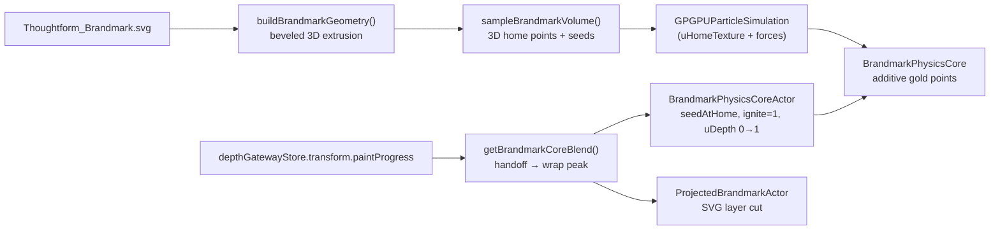

# ADR-023: Corridor Brandmark Physics Core

**Date:** 2026-06-16 (morph rev. 2026-06-17; wrap-blend rev. 2026-06-24; "crosshair unfurls into the armillary" rev. 2026-06-24)
**Status:** Active

**2026-06-24 "crosshair unfurls into the armillary" revision (supersedes the renderer-ownership timing below):** the Navigate 2D → 3D beat still read as a slide swap — the crisp mark dissolving into dust, then a sphere appearing — even after the renderer-ownership cut. Root cause: the bold, legible mark is the **DOM SVG**; the particle core is a DIM, sparse, sphere-merged element that does NOT read as a standalone crosshair (once the SVG was cut early the bare core was a faint radial dust-burst, exposed in open space before the substrate sphere arrived to give it structure). Two compounding aggravators: (1) `PRODUCTION_BASIS` had been switched to `edge-lattice` + `voxel` ("Dither 3"), making the bare core even sparser; (2) the substrate sphere unfurled on the SAME clock and buried the mark. New model — the SVG crosshair STAYS the front, legible mark for most of the wrap window while the substrate **armillary unfurls FROM its plane** (the gimbal rings start coplanar with the crosshair and rotate open — `gyroRingUnfold`), so the 2D mark visibly "opens into" the 3D globe (circle → equator/limb, sword → polar spine via `BRANDMARK_SWORD_TILT_RAD`). The DOM SVG only drops below the canvas (`BRANDMARK_CORE_PARTICLE_LAYER_BLEND ≈ 0.82`) and is cut (`BRANDMARK_CORE_SVG_CUT_BLEND ≈ 0.90`) LATE, once the sphere is ~80% formed — so the medium swap to the particle core is **hidden inside the finished armillary** instead of happening in open space. `uDepth` is decoupled from the cut (`BRANDMARK_CORE_DEPTH_START_BLEND ≈ 0.30`, end ≈ `0.82`): the core gains its dome HIDDEN behind the bold front SVG, so it is already 3D the instant the SVG drops away and reveals it. `PRODUCTION_BASIS` is restored to `dome-fill` + `dot` (dense filled silhouette that matches the SVG paint — fill → fill at the late handoff; see Invariant 12). The Z-stream baseline is dropped hard (`STREAM_VEL_BASE` 0.45 → 0.10) so a settled / slow-scroll view shows a COHERENT crosshair gaining depth, not a radial comet-smear (the old dispersion was only ever masked by the on-clock sphere). Tunable lag knob `SUBSTRATE_GYRO_REVEAL_LAG` (shellGeom, default 0) can delay the unfurl further if needed. **This supersedes the same-clock renderer-ownership timing in the follow-up below** (cover 0.24 / cut 0.32 / depth-after-cut); that mechanism is retained (z-index drop then `display:none` cut, no opacity dissolve), only the thresholds + basis + stream changed.

**2026-06-24 renderer-ownership follow-up (timing superseded above; mechanism retained):** the handoff no longer uses an opacity yield. The shared `getBrandmarkCoreBlend(progress)` still anchors timing, but `sceneGeom.ts` now exports the sub-thresholds: the particle core rises above the DOM SVG at `BRANDMARK_CORE_PARTICLE_LAYER_BLEND`, reaches flat cover by `BRANDMARK_CORE_PARTICLE_COVER_BLEND`, the SVG is cut with `display: none` at `BRANDMARK_CORE_SVG_CUT_BLEND`, and `uDepth` starts after `BRANDMARK_CORE_DEPTH_START_BLEND`. The renderer-ownership mechanism (z-index drop under the canvas, then `display:none` — never an opacity dissolve) is unchanged; only the threshold VALUES and the "depth after cut" ordering were revised by the "crosshair unfurls" pass above.

**Scope:** Home-v2 depth corridor brandmark — the central mark that travels Navigate → Encode → Build inside the accreting intelligence-layer artifact.

**2026-06-17 morph revision:** the SVG → core handoff is now a true **morph** (assembled FLAT particle cover, then a Z-extrude to 3D), and the core **never swirls** while the 2D mark is present (`seedAtHome` + `ignite = 1` + the `uDepth` Z-morph). This replaces the brief opacity-crossfade-with-swirl model. See the Decision + Invariants below.

**2026-06-24 wrap-anchor + blend revision:** the SVG → core handoff is no longer anchored to the camera dolly release. It now starts at `BRANDMARK_CORE_HANDOFF_PROGRESS = CORRIDOR_TIMELINE.accretion.substrate.start` (currently `0.30`), the moment the Navigate substrate sphere begins wrapping around the 2D mark, and completes at `BRANDMARK_CORE_BLEND_END = BRANDMARK_CORE_SIZE_MERGE_END` (currently `0.42`), when that wrap reaches its peak. **2026-06-24 sizing follow-up:** the size merge starts earlier at `BRANDMARK_CORE_SIZE_MERGE_START = CORRIDOR_TIMELINE.brandmark.thoughtformHold` (currently `0.14`) and completes at `BRANDMARK_CORE_SIZE_MERGE_END = CORRIDOR_TIMELINE.accretion.substrate.peakAt` (currently `0.42`). Both `ProjectedBrandmarkActor` and `BrandmarkPhysicsCoreActor` read `getBrandmarkWrapHalfExtent(progress)`, `getBrandmarkCoreBlend(progress)`, and the shared sub-thresholds, so the SVG grows toward sphere scale before the particle cover, drops below the canvas while particles take over, and is removed before the particle core extrudes.

**2026-06-17 subtle-glitch revision, softened 2026-06-24:** a small, in-palette **matrix glitch** accompanies the 2D → 3D extrude. The core's soft-halo gold look is otherwise unchanged (an LED-pixel restyle was prototyped and rejected — the user preferred the original soft-halo particles). `uGlitch` is now driven by a low-amplitude (`HANDOFF_GLITCH_INTENSITY = 0.35`) `sin(t·π)` bell over the same wrap blend `[BRANDMARK_CORE_HANDOFF_PROGRESS, BRANDMARK_CORE_BLEND_END]`, so it reads as dither resolution while the sphere unfolds rather than a separate digital break. The bell is exactly 0 at both ends, so the cloud is byte-stable outside the handoff. **Critical invariant:** `uGlitch` and `uTime` are shared between the vertex and fragment shaders and MUST carry matching precision (both `mediump`) — a precision mismatch silently fails to link the program on WebGL2 and the canvas renders nothing. See Invariant 8 below.

**2026-06-17 Z-stream momentum revision:** as the mark flies into the corridor toward the substrate sphere, particles now **stream toward the background** (local −Z) for a sense of momentum — the brandmark reads as flying backward into the sphere rather than floating in place. A vertex-only `uStream` uniform displaces particles back on Z: a base component (`0.4`) shifts the whole silhouette, and a seed-varied component (up to `1.0`, `pow(aLuma, 1.3)`) trails individual particles into a comet-tail. `BrandmarkPhysicsCoreActor` drives `uStream` from a **velocity-modulated envelope** gated to the handoff → substrate-wrap-peak band: a faster scroll trails further (momentum), with a baseline (`STREAM_VEL_BASE = 0.45`) so the stream still reads on a slow scroll, eased on wall-clock time so the velocity term doesn't jitter. The envelope fades to 0 by `BRANDMARK_CORE_SIZE_MERGE_END`, so the silhouette settles clean inside the sphere — the group CENTER is never moved (only in-shader Z), so brandmark↔sphere alignment is preserved at every frame. See Invariant 10 below.

**2026-06-22 Services centerpiece treatment:** the in-sphere core that shrinks into `#services` is now tuned as a calm, airy, dimensional **background element** (user direction: a 3D brandmark behind the copy, more space between particles, more artistic — and the residual wobble gone). It is driven entirely by the existing `uCleanField` / `recT` centerpiece gate (0 across the whole corridor + sphere, 1 only at the parked centerpiece), so the corridor / sphere stay **byte-identical**. Five gated knobs: (1) the GPGPU sim's MOTION forces (turbulence + flow) are damped to `CLEAN_FIELD_FORCE_FLOOR` (0) while `returnStrength` is held full — the cloud is pinned dead-still at home, killing the residual per-particle wobble (the shader pulse was already stilled by `uCleanField`; the SIM position jitter was not); (2) a `uCleanField`-gated `aLuma` rank-clip thins the DRAW via `CLEAN_FIELD_KEEP` (~0.65, ≈35% thinned) so the centerpiece reads as SPACED discrete points (the small on-screen mark packs the 1600 count densely otherwise) — visibility holds because survivors keep their full decoupled `CENTER_OPACITY`, **without** changing the count; (3) the dome is kept (`depthRef = depth`, no longer flattened) so the mark reads as 3D; (4) a small `recT`-eased sinusoidal X/Y tilt (`CENTER_DRIFT_*`, ~9–12°, never a full spin → never edge-on) reveals that volume; (5) opacity is an ABSOLUTE `CENTER_OPACITY` (~0.90), **decoupled** from the corridor `CORE_OPACITY` (the mark lerps corridor → absolute as recT → 1) so it reads as a present-but-soft background element. **Decoupling is load-bearing:** an earlier `CORE_OPACITY` _multiplier_ coupling made the centerpiece nearly VANISH the moment the corridor brightness was dialed down — never re-couple the centerpiece opacity to the corridor's. **Density — decoupled (2026-06-22c):** the count is the GLOBAL particle budget shared by the corridor AND the centerpiece. History: 1300 → 3600 (corridor read too dense/bright) → 1600 (calm, but then the centerpiece couldn't be made dense without re-densifying the corridor). Resolution: keep a LARGE count (6000) and thin the corridor back down with a second rank-clip end. The keep-mix is now `mix(uCorridorKeep, uCleanFieldKeep, uCleanField)` — corridor end (cleanField 0) keeps `uCorridorKeep`, centerpiece end (cleanField 1) keeps `cleanFieldKeep`. The actor passes `corridorKeep = min(1, CORRIDOR_DRAW_TARGET(1600) / count)` ≈ 0.27, so the corridor draws ~1600 (calm, ≈ prior) while the centerpiece draws `cleanFieldKeep` (~0.65) ≈ 3900 — dense, from the SAME cloud. So: raise the count to add centerpiece density; the corridor self-corrects. NOTE: 6000 crosses the GPGPU sim texture from 64×64 (4096) to **128×128 (16384)**, ~4× the per-frame compute (a tiny offscreen render, desktop only); the corridor `CORE_OPACITY` is also 0.72 (calm-down). `uCorridorKeep` defaults to 1.0 (no corridor thinning) for the lab + other consumers. The mobile / reduced-motion centerpiece remains the 2D `ServicesBrandmarkField`, hidden on desktop-with-motion by a `services.css` media query (no desktop double-paint). See Invariant 11 below.

**Tuning lab + shareable presets (2026-06-22b):** the three centerpiece values that were hardcoded shader constants — the rank-clip keep fraction, the clean dot-size multiplier, and the clean falloff edge — are now `BrandmarkPhysicsCore` props/uniforms (`cleanFieldKeep` 0.65, `cleanFieldDotScale` 0.50, `cleanFieldEdge` 0.40) whose DEFAULTS equal the prior constants, so production is **byte-identical** (the corridor actor never overrides them; they are vertex/fragment-single-stage uniforms, so Invariant 8 does not apply). `/test/brandmark-physics-core` exposes every centerpiece knob as a slider — plus a "Centerpiece view" button that snaps to the parked production look and a lab replica of the actor's drift (`CenterpieceDriftRig`) — and can SAVE a combo to the `brandmark_presets` table (migration `20260622_brandmark_presets.sql`) returning a short shareable slug, and LOAD by slug. **RLS note (deliberate):** that lab is an unauthenticated `(internal)` page, so `brandmark_presets` is anon INSERT + SELECT, immutable (no UPDATE/DELETE), non-sensitive, with size/format CHECKs — a deviation from the authenticated-only admin preset tables (`ui_component_presets`, `shape_presets`), justified by the unauthenticated access pattern.

**Render-mode switch + blending (2026-06-22d, lab exploration):** to explore a more retro-futuristic centerpiece (user found the soft-gold dots too "Christmas decoration"-like), the fragment shader gained an **opt-in render-mode branch** over the per-particle `gl_PointCoord`, driven by three fragment-only uniforms — `uShape` (`int`: 0 dot · 1 dither · 2 voxel · 3 glyph), `uGlyph` (`int`: which procedural symbol), `uShapeStroke` (`float`: glyph stroke / voxel gap / weight) — plus a material `blending` switch (`additive` ↔ `normal`; non-additive removes the bloom that reads as glow). The four modes all compute a per-particle coverage `mask` that feeds the EXISTING colour pipeline (twinkle / depth / tint / pulse / glitch), so palette + clean-field behaviour are preserved: **dot** is the original soft radial speck (byte-for-byte); **dither** stipples the soft coverage with an ordered screen-space Bayer threshold; **voxel** is a hard square + quadrant bevel; **glyph** is a procedural SDF symbol (+, ×, ▢, ◦, ◇, ✳). New props `shape`/`glyph`/`shapeStroke`/`blending` **DEFAULT to `dot` / `additive`**, and the corridor actor (`BrandmarkPhysicsCoreActor`) never sets them — so the corridor + parked centerpiece stay **byte-identical** (this is the lab-toggle version of the LED-pixel restyle noted above as "rejected"; the soft-halo dot remains the production default until a look is deliberately chosen and wired). The uniforms are **fragment-only**, so Invariant 8 (shared vertex/fragment precision) does not apply. **GLSL ES 1.00 constraint:** the material compiles as ES 1.00 even on WebGL2, so the Bayer threshold is computed **arithmetically** (`bayer2`→`bayer4`, no dynamic array indexing) and the mode switch uses `if/else` on `int` uniforms (no `switch`). The lab exposes the switch as a "Particle shape" section (shape / symbol / stroke / blending) persisted into the `brandmark_presets` blob, and a lab-only `ReticleOverlay` (corner brackets + mono labels) for retro-futuristic framing. **Production is untouched** in this pass.

**Particle basis + oriented primitives + production wiring (2026-06-22e, lab + production):** the previous render-mode pass changed only the per-particle MASK (each speck's shape inside a 3-4px sprite); the field itself was still a filled-silhouette dome of soft dots, so swapping `dot → voxel/glyph` couldn't move the cloud away from the "liquid filled droplet" read. This pass adds an orthogonal axis — **`basis`** — that changes WHERE particles live (their `homes`), separate from WHAT each draws (`shape`). Four bases share one `sampleBrandmarkParticles({ basis, ... })` entry point: **`dome-fill`** (legacy filled silhouette + shallow dome, default — byte-identical to the previous build), **`svg-outline`** (particles distributed uniformly along the contour of every brandmark path, with the per-particle tangent angle written into a new `aAngle` attribute), **`edge-lattice`** (dome-fill XY quantised to a regular grid, then de-duplicated so additive blending doesn't burn dense cells), and **`model-wire`** (svg-outline with per-path Z displacement so the contours fan into the depth plane and read as a wire-frame 3D artifact). The shader gained four oriented primitives — **dash · cell · bracket · scan** — that rotate `gl_PointCoord` by `aAngle` so they snap to the contour tangent when the outline / wire basis feeds them (`vAngle = 0` under `dome-fill` / `edge-lattice` so they degenerate to axis-aligned variants, still useful for tactical reads). New uniforms `uPrimitiveAspect` (length:width for `dash` / `scan`) and `uLineJitter` (perpendicular jitter on oriented primitives) are fragment-only — Invariant 8 does not apply. The vertex shader's `aAngle` is vertex-only, but the `vAngle` varying carries it to the fragment with no precision constraint (it's already a varying, not a uniform). The lab grew a "Visual preset" picker that bundles basis / shape / blending / sizing / clean-field into five named looks — **Luminous Dust** (legacy production), **Vector Trace** (outline + dash + normal blend — the Shift5 / Good Fella drafting feel), **Raster Field** (lattice + cell + normal blend — HORSE 2026 halftone), **Wire Artifact** (model-wire + dash — wireframe 3D), and **HUD Glyph** (dome-fill + glyph — the Shift5 reticle field). Settings schema bumped to `v: 2` (adds `basis`, `gridSnap`, `primitiveAspect`, `lineJitter`, `activePreset`); `v: 1` presets still load (missing keys fall back to defaults, so the loaded look matches the pre-basis era). **Production wiring:** `BrandmarkPhysicsCoreActor` now passes every appearance prop EXPLICITLY (`PRODUCTION_BASIS` / `PRODUCTION_SHAPE` / etc. constants at the top of the file, all defaulting to today's `dome-fill` + additive `dot`), so the corridor + parked centerpiece are byte-identical with this pass — promoting a lab preset to production is now a single constant edit and is no longer at risk of drifting if the lab's defaults change. **`basis` is mount-time geometry, not a per-frame ramp:** changing it re-builds the sim's `homePositions` and bumps the GPGPU texture / `aAngle` buffer. The actor pins `basis` for the entire corridor → centerpiece span, so reverse-scroll re-entry is snap-free (no remount on the scroll boundary). **Silhouette-match constraint:** `PRODUCTION_BASIS` MUST stay `dome-fill` for the SVG → core morph (Invariant 3) to remain a clean cut against a matched silhouette — the FLAT particle silhouette at `uDepth = 0` is the filled paths, just like the SVG. Switching to `svg-outline` / `model-wire` is a deliberate look choice that turns the morph from "fill → fill" into "fill → outline" (still legible as the same mark, but no longer pixel-identical at the cut). See Invariant 12 below.

**Related:**
[ADR-013 — Brandmark Journey Refactor](013-brandmark-journey-refactor.md),
[ADR-017 — Orbit Journey + Substrate Morph](017-orbit-journey-and-substrate-morph.md),
[ADR-018 — Home-V2 Depth Corridor](018-home-v2-depth-corridor.md),
[ADR-019 — Brandmark Silhouette Morph](019-brandmark-silhouette-morph.md),
[ADR-021 — Corridor Exit Zoom-Dissipate](021-corridor-exit-zoom-dissipate.md).

---

## Context

The home-v2 corridor brandmark was a flat DOM SVG glyph (`BrandmarkGlyph` rendered through `ProjectedBrandmarkActor`), perspective-projected onto the brandmark world position each frame. From the section-2 Thoughtform rest all the way through Build it remained the same flat plate — a small `rotateY` tilt was the only depth cue.

A previous decision (recorded 2026-06-06 in `ProjectedBrandmarkActor.tsx`) explicitly removed an earlier substrate-morph particle handoff ("the brandmark should stay the same 2D SVG mark throughout"). That decision was correct for the build it shipped against — the morph it removed swapped the SVG for a particle SPHERE / particle LOGO at Build, which read as the mark "becoming something else." But it left the corridor without the visceral "you are flying into something alive" cue; the current version places that cue at the substrate wrap rather than at the earlier camera dolly release.

Recent additions made a new direction possible:

- **A real 3D brandmark** ([ADR-018 follow-up](../../components/brand/Brandmark3D/Brandmark3D.tsx)) — `buildBrandmarkGeometry` produces a beveled `ExtrudeGeometry` from the source SVG, dialed in at `/test/brandmark-3d`.
- **A GPGPU particle simulation** ([lib/key-visual/gpgpu-simulation.ts](../../lib/key-visual/gpgpu-simulation.ts)) — curl-noise flow + return-to-origin + pointer + turbulence, written for the gateway key-visual but never wired into a production consumer.

The user's brief: "transform the brandmark into the particle system the moment you scroll into the corridor — the bright core of our intelligence layer artifact, with depth, like a 3D physical object."

This ADR records reversing the "stay 2D SVG" decision specifically for the in-corridor beats while preserving the SVG everywhere else.

---

## Decision

The corridor brandmark is a **GPGPU-driven 3D particle core** from the moment the substrate sphere begins wrapping around it through to Build. The crisp DOM SVG owns the section-2 Thoughtform rest and the early fly-in before that wrap.

```
section-2 rest          substrate wrap         Navigate → Build       epilogue / dock / #services
─────────────────       ─────────────          ─────────────────       ─────────────────────────
DOM SVG @ opacity=1  →  WRAP BLEND         →   particle core only  →  particle core shrink
                        ├ core cover early
                        ├ SVG drops below canvas
                        ├ SVG display:none cut
                        └ depth 0→1 after cut
                           flat 2D → 3D dome
particle core HIDDEN    core resolves            core fully 3D
(never swirls)          (same silhouette)        (breathing wobble)
```

The SVG and the particle core are the **SAME mark** — so the handoff is a **morph, not a crossfade between two different-looking things** (2026-06-17 morph rev., which replaced the earlier swirl-and-crossfade model the brief explicitly rejected). Both channels share `getBrandmarkCoreBlend(progress)`, anchored at `BRANDMARK_CORE_HANDOFF_PROGRESS` and ending at `BRANDMARK_CORE_BLEND_END`:

- **Renderer-ownership blend** — `BrandmarkPhysicsCoreActor` uses the shared blend to establish the particle silhouette early; `ProjectedBrandmarkActor` lowers the DOM SVG below the R3F canvas during the cover window, then cuts it from rendering once cover is established. The medium transition is visible because particles draw over the mark, not because the SVG fades.
- **Depth blend** — the same blend value drives `uDepth` 0 → 1, so the flat particle silhouette extrudes into its forward-domed 3D self as the sphere wraps around it.

**No swirl.** The particles never assemble from scattered dust: ignite is pinned to assembled (`ASSEMBLED_IGNITE = 1`) and the sim is seeded at home (`seedAtHome`), so the cloud IS the brandmark silhouette from frame one — it only ever flattens / extrudes (Z), never scatters (XY). The brandmark's XY silhouette is preserved at every `uDepth`, which is what makes the medium-swap read as the same mark.

---

## Architecture



### Layers

1. **Silhouette + depth sample** — [`lib/brandmark/sampleBrandmarkParticles.ts`](../../lib/brandmark/sampleBrandmarkParticles.ts) samples the brandmark's 2D silhouette via `sampleShape` (same primitive as v7 [`BrandmarkSilhouettePoints`](../../components/brand/BrandmarkParticleField/BrandmarkSilhouettePoints.tsx)) and adds depth via a forward dome (r²-falloff) plus a per-particle Z jitter (same recipe as [`intelligence-artifact/SubstrateBrandmark`](../../components/landing/intelligence-artifact/SubstrateBrandmark.tsx)). The brandmark silhouette is therefore guaranteed to read as the brandmark — depth is a layered enhancement, not the source of shape. (An earlier draft sampled the beveled `ExtrudeGeometry` mesh with `MeshSurfaceSampler`. That distributed particles by face area across the front cap / back cap / side walls and saturated into a featureless blob under additive blending. The silhouette+dome approach matches the readability of the v7 mark while keeping the physical-object feel.)
2. **Sim with 3D origins** — `GPGPUParticleSimulation` accepts an optional `homePositions: Float32Array` that gets packed into a static `uHomeTexture` (RGBA Float32 DataTexture). The position shader branches on `uUseHomeTexture > 0.5`:
   - **3D-origin path** — origin sampled from `uHomeTexture`; integration is first-order Euler (`pos += totalForce * dt`) so coefficients are world-units-per-second.
   - **Legacy path** — origin from the existing `posData.w` / `velData.w` two-channel pack with `origin.z = 0`; integration is the pseudo-momentum step the key-visual portal calibrated against. Untouched.
3. **R3F painter** — [`components/brand/BrandmarkPhysicsCore/`](../../components/brand/BrandmarkPhysicsCore/) owns the sim + `<points>` mesh with a corridor-tuned shader pair ([`shaders.ts`](../../components/brand/BrandmarkPhysicsCore/shaders.ts)). The shaders project through the R3F camera matrix (so the dome reads as foreshortening when the camera is off-axis) but use pixel-space point sizing (no `(K / Z)` perspective scale) — the legacy key-visual shader's `(300 / Z)` factor would blow up to ~145-pixel points at the corridor's parked camera distance and saturate the cloud. Falloff is the tighter v7 silhouette family (`smoothstep(0.30, 0.5, d)`). `ignite ∈ [0, 1]` interpolates between two force tables:
   - `IGNITE_OFF_FORCES` — `returnStrength: 0.4`, `flowStrength: 0.06`, `turbulence: 0.32` (dispersed cloud of dust).
   - `IGNITE_ON_FORCES` — `returnStrength: 6.0`, `flowStrength: 0.012`, `turbulence: 0.012` (assembled core, slight breathing wobble).
     In the corridor the actor pins `ignite = 1` (assembled) and seeds the sim at home, so these OFF forces are only exercised by the lab; the corridor never scatters. The morph is driven by `uDepth` (a render-shader Z-scale), NOT by the force tables.
4. **Corridor wiring** — [`BrandmarkPhysicsCoreActor`](../../components/landing/home-v2/DepthGatewayScene/BrandmarkPhysicsCoreActor.tsx) tracks `getBrandmarkWorldPosition(paintProgress)` + scales by `2 * getBrandmarkWrapHalfExtent(progress)` per frame, pins `igniteRef = 1`, shapes `opacityRef` into an early particle cover, drives `depthRef` to 1 by `BRANDMARK_CORE_BLEND_END`, passes `seedAtHome` so the cloud never swirls, and pauses the sim when the stage is off-screen. Mounted alongside `BrandmarkAccretionShell` in [`DepthGatewayScene/index.tsx`](../../components/landing/home-v2/DepthGatewayScene/index.tsx).
5. **SVG handoff** — [`ProjectedBrandmarkActor`](../../components/landing/home-v2/ProjectedBrandmarkActor.tsx) reads the shared core blend and sub-thresholds, drops the DOM layer below the R3F canvas once particle cover begins, and cuts the SVG with `display: none` once cover is established.

### Live-value props

`BrandmarkPhysicsCore` accepts `igniteRef` / `depthRef` / `opacityRef` / `pointSizeRef` / `pausedRef` (read-only refs) in addition to the matching static props, plus a `seedAtHome` flag. `BrandmarkPhysicsCoreActor` writes its refs from inside `useFrame` and the core reads them back, so the parent never re-renders. `depth` drives the `uDepth` Z-morph; `seedAtHome` starts the sim at the home silhouette (no scatter). Static props / scattered seed are kept for the lab and other simple consumers.

---

## Fallback tiers

| Path        | Trigger                                                                          | Behaviour                                                                                                                                                                                                                                                                                                                                         |
| ----------- | -------------------------------------------------------------------------------- | ------------------------------------------------------------------------------------------------------------------------------------------------------------------------------------------------------------------------------------------------------------------------------------------------------------------------------------------------- |
| GPGPU core  | `tier === "desktop"` AND `renderer.capabilities.isWebGL2`                        | Full sim — particles assemble across the ignite band, breathe at home.                                                                                                                                                                                                                                                                            |
| Static core | `tier === "mobile"` OR `!isWebGL2`                                               | No GPGPU compute. `BrandmarkPhysicsCore` builds the home positions into a one-shot `DataTexture` and binds it directly to `uPositionTexture` so the render shader paints particles AT home with the same additive gold treatment. The SVG handoff still uses the same layer-drop and cut thresholds so the static core takes over without a fade. |
| Static text | `webglOK === false` OR `prefers-reduced-motion` OR `corridorCapable() === false` | Existing `HomeCorridor` fallback path is unchanged — neither the canvas nor the actor mount; the static text overlay (`FallbackCorridor`) reads the corridor copy as plain flow content.                                                                                                                                                          |

The GPGPU consumer always supplies `homePositions`, so the legacy two-channel pack continues to drive the unmodified key-visual portal flow with byte-identical behaviour.

---

## Alternatives Considered

### Alternative A — Lighter shader-only point cloud (no live force sim)

A static 3D point cloud sampled from the same extrusion, with a per-frame shader-side wander instead of a true compute pass. Cheaper, lower risk, reuses the existing `BrandmarkSilhouettePoints` family.

- **Pros:** Half the GPU cost; no GPGPU plumbing; fits the existing `brandmark-particle` skill cap.
- **Cons:** Doesn't deliver the "physical object" feel the user explicitly asked for. The assemble-on-entry transition would have to be faked via opacity instead of a true convergence.

Rejected because the user's chosen direction (when asked) was the GPGPU path — they want the core to feel **alive**, not just **drawn**.

### Alternative B — Subscribe `BrandmarkPhysicsCore` directly to the depth store

Instead of an actor wrapper, have the painter read `paintProgress` itself and compute its own ignite envelope.

- **Pros:** One fewer file.
- **Cons:** Couples the painter to the corridor's state shape, breaking its lab-reusability and the `/test/brandmark-physics-core` tuning surface. The actor wrapper isolates corridor concerns from the painter's API surface.

Rejected on reusability grounds.

### Alternative C — Restore the 2026-06-06 substrate-morph (SVG → particle SPHERE at Build)

The earlier removed handoff swapped the SVG for a particle sphere at Build only.

- **Pros:** Already had a code shape (ADR-017 family).
- **Cons:** Reads as the mark BECOMING SOMETHING ELSE, which is exactly what the 2026-06-06 decision flagged. The current direction keeps the mark as a particle MARK throughout the corridor, only changing its medium.

Rejected — this is the decision being reversed in spirit but with a different visual outcome.

---

## Consequences

### Positive

- The corridor's central mark visibly **lives** as a 3D object — depth, breathing, a clean assemble that punctuates the camera's release into flight.
- The SVG and the core never fight: they share the same band, with the core drawing above the SVG before the SVG cuts out.
- The lab (`/test/brandmark-physics-core`) gives future agents a single tuning surface for the assemble envelope without touching production scenes.
- The legacy key-visual portal's GPGPU calibration is preserved exactly — the new path is opt-in via `homePositions`.

### Negative

- New GPU cost: the GPGPU compute pass runs every frame the corridor is engaged on desktops. Mobile is shielded by the static path; the corridor's `frameloop="demand"` already idles the GPU when the stage is off-screen.
- One more in-canvas painter tracks `getBrandmarkWorldPosition` per frame (alongside `BrandmarkAccretionShell`). They share the helper; both must be kept in step if the trajectory math evolves.
- The previous "stay 2D SVG throughout the corridor" docstring in `ProjectedBrandmarkActor` no longer holds — comment updated to reflect the handoff.

### Neutral

- The home-v2 corridor system is separate from the v7 `BrandmarkParticleCanvas` three-painter cap (`brandmark-particle` skill). This new painter does NOT count against that cap; it lives inside the corridor R3F canvas, not the global one.

---

## Invariants (do not regress)

1. **Single-mark rule.** Across the corridor span the SVG and particle core may overlap only inside the shared wrap blend from `BRANDMARK_CORE_HANDOFF_PROGRESS` to `BRANDMARK_CORE_BLEND_END`. That overlap is allowed because both painters are the same brandmark at the same world position and size; outside the blend, one renderer owns the mark.
2. **The epilogue / dock path is exempt from the corridor cut.** Once `useEpilogueOverride` is active, the in-canvas particle core owns the mark through the sphere ride-out and Services shrink; the SVG stays hidden rather than re-running the corridor ownership math.
3. **It is a MORPH, not a separate-cloud crossfade — and the blend is shared.** The SVG and the particle core are the same mark. `ProjectedBrandmarkActor` and `BrandmarkPhysicsCoreActor` BOTH read `getBrandmarkCoreBlend(progress)` plus the exported sub-thresholds from `sceneGeom.ts`, and BOTH read `getBrandmarkWrapHalfExtent(progress)` (size merge `BRANDMARK_CORE_SIZE_MERGE_START` → `_END`) so the SVG and particle core are the same apparent size through the blend. **Handoff ordering (revised 2026-06-24 "crosshair unfurls" pass):** the bold DOM SVG is the front, legible mark for MOST of the wrap window; it drops below the canvas late (`BRANDMARK_CORE_PARTICLE_LAYER_BLEND ≈ 0.82`) and is cut late (`BRANDMARK_CORE_SVG_CUT_BLEND ≈ 0.90`), once the substrate sphere is ~80% formed, so the medium swap is hidden inside the formed armillary. `uDepth` is intentionally DECOUPLED from the cut now (`BRANDMARK_CORE_DEPTH_START_BLEND ≈ 0.30`, before the cut): the core gains its dome while HIDDEN behind the bold front SVG, so it is already 3D the instant the SVG drops and reveals it. (This is the deliberate inverse of the prior "uDepth only after the cut" rule, which was correct only while the core was the EARLY-revealed front mark; the late-handoff model occludes the core during the depth ramp, so there is no visible flat-SVG/domed-core mismatch.) Do not reintroduce an EARLY cut that exposes the bare particle core in open space (it reads as the mark dissolving into dust), a crisp SVG fading above the canvas, a separate swirling cloud, or a symmetric `SVG = 1 - blend` / `core = blend` dissolve.
4. **The corridor core never swirls.** `igniteRef` is pinned to `ASSEMBLED_IGNITE` (1) and `BrandmarkPhysicsCore` is mounted with `seedAtHome`, so the particles are the brandmark silhouette from frame one. The 2D → 3D transition is a Z-only morph via `uDepth` (XY silhouette preserved at every value). Do not reintroduce a low-ignite "pre-gate swirl" while the flat mark is showing — the brief explicitly rejected it.
5. **`homePositions` opt-in is one-way.** The legacy key-visual portal's two-channel origin pack must keep working. Any future change to the position shader's force integration must branch on `uUseHomeTexture` to preserve that.
6. **The static path on mobile / no-WebGL2 paints the same silhouette.** The `BrandmarkPhysicsCore` reduced-motion branch reads the same `homes` buffer the GPGPU path consumes, so the visible mark on mobile is identical to a freshly-assembled desktop core — and `uDepth` flattens / extrudes it identically.
7. **No GPGPU compute when the stage is off-screen.** The actor pauses the sim early; the canvas's `frameloop="demand"` idles the rest of the GPU. Don't reintroduce a continuous warm-up loop without a corresponding fix in `FrameInvalidator`.
8. **Shared shader uniform precision must match (`uGlitch`, `uTime`).** The subtle-glitch revision shares `uGlitch` and `uTime` between the vertex and fragment shaders. The fragment runs `precision mediump float`, so both uniforms are declared **`mediump` in the vertex shader** to match. WebGL2 rejects a program whose vertex/fragment declare the same uniform at different precisions ("Precisions of uniform 'uTime' differ…") — the link fails silently and the corridor canvas renders nothing. Do not add a shared float uniform to one stage at a different precision than the other.
9. **The glitch is bounded by the blend bell and stays subtle + in-palette.** `uGlitch` is exactly 0 outside `[BRANDMARK_CORE_HANDOFF_PROGRESS, BRANDMARK_CORE_BLEND_END]`, and the actor caps it with `HANDOFF_GLITCH_INTENSITY` so it reads as the dither resolving during the sphere unfold. The vertex scanline displacement, tear-band amplification, and the fragment hue warble (toward the dawn accent, NOT an alien RGB split) + brightness flicker are all multiplied by `uGlitch`, so the soft-halo cloud is byte-stable everywhere else. Keep amplitudes small — the brief was "subtle and integrated", not a harsh digital break; an LED-pixel + heavy-tear variant was explicitly rejected.
10. **The Z-stream is in-shader only and fades by the substrate wrap peak.** `uStream` displaces particles on local −Z in the VERTEX shader; the actor NEVER moves the group center (it stays at `getBrandmarkWorldPosition`), so the brandmark↔substrate-sphere alignment is exact at every frame regardless of stream amplitude. The envelope is gated to `[BRANDMARK_CORE_HANDOFF_PROGRESS, BRANDMARK_CORE_SIZE_MERGE_END]` and fades to 0 by the wrap peak, so the parked composition inside the sphere is a clean silhouette. Do not drive the stream past the wrap peak, and do not move the group center to fake it — that would desync the core from the sphere/shell.
11. **The Services centerpiece treatment is `recT` / `uCleanField`-gated and must keep the corridor byte-identical.** Every centerpiece knob (sim-force calm, `aLuma` rank-clip thinning, dome-keep, drift tilt, opacity recede) reduces algebraically to its pre-treatment value at `recT = 0` / `uCleanField = 0`, which holds across the ENTIRE corridor fly-in + sphere phase — do not add a centerpiece term that isn't gated this way. The sim is **never paused** at the centerpiece (turbulence + flow are damped toward 0 while `returnStrength` holds home), so reverse-scroll re-warm is snap-free; do not "fix" the wobble by pausing the sim (that freezes a stale position texture and snaps on reverse). The thinning **reuses** the existing `mediump uCleanField` uniform + the `aLuma` attribute — do NOT add a new shared vertex/fragment uniform for it (Invariant 8). Particle COUNT is the GLOBAL budget shared corridor↔centerpiece: tune density via the TWO rank-clip ends — `uCorridorKeep` (corridor, cleanField 0) and `cleanFieldKeep` (centerpiece, cleanField 1) — `keepFrac = mix(uCorridorKeep, uCleanFieldKeep, uCleanField)`. Raise the count to add centerpiece density; the corridor self-corrects via `corridorKeep = min(1, CORRIDOR_DRAW_TARGET / count)`. The thinning/style uniforms (`uCorridorKeep`, `uCleanFieldKeep`, `uCleanFieldDotScale`, `uCleanFieldEdge`) are single-stage, so Invariant 8 does not apply to them. The drift is a bounded sinusoidal tilt (≤ ~12°) — never a full Y-spin, which would carry the shallow-Z silhouette edge-on and collapse it.
12. **`basis` is mount-time geometry; production pins it for the whole corridor → centerpiece span.** The new `basis` prop (`dome-fill` / `svg-outline` / `edge-lattice` / `model-wire`) drives `sampleBrandmarkParticles` and writes the sim's `homePositions` + per-particle `aAngle`. It is NOT a per-frame ramp — changing it remounts the GPGPU sim, the home-position texture, and the geometry attribute buffers. The corridor actor pins ONE basis (`PRODUCTION_BASIS` constant, today `dome-fill`) for the entire corridor → centerpiece arc so reverse-scroll re-entry never lands on a remount snap. `PRODUCTION_BASIS` MUST stay `dome-fill` while the SVG → core morph (Invariant 3) is held to "fill → fill"; switching it to `svg-outline` / `model-wire` is a deliberate look choice that converts the morph into "fill → outline" (the outline still reads as the mark, but the overlap no longer matches the SVG paint as closely). The shape uniforms `uShape`/`uGlyph`/`uShapeStroke`/`uPrimitiveAspect`/`uLineJitter` ARE per-frame and fragment-only, so swapping primitive modes is cheap; only the `basis` carries this mount-time constraint. Production sets all of `PRODUCTION_BASIS` / `PRODUCTION_SHAPE` / `PRODUCTION_GLYPH` / `PRODUCTION_BLENDING` / `PRODUCTION_SHAPE_STROKE` / `PRODUCTION_PRIMITIVE_ASPECT` / `PRODUCTION_LINE_JITTER` EXPLICITLY (rather than relying on the component's defaults) so a lab-side default change cannot drift production — promoting a lab `VISUAL_PRESET` is a single constant edit in `BrandmarkPhysicsCoreActor.tsx`.

---

## Files

- New: [`lib/brandmark/sampleBrandmarkParticles.ts`](../../lib/brandmark/sampleBrandmarkParticles.ts) — silhouette sample + dome depth + per-particle jitter.
- New: [`components/brand/BrandmarkPhysicsCore/BrandmarkPhysicsCore.tsx`](../../components/brand/BrandmarkPhysicsCore/BrandmarkPhysicsCore.tsx) + [`shaders.ts`](../../components/brand/BrandmarkPhysicsCore/shaders.ts) + [`index.ts`](../../components/brand/BrandmarkPhysicsCore/index.ts) — corridor-tuned shaders (pixel-space sizing, tight v7-family falloff). **Morph rev. (2026-06-17):** added the `uDepth` Z-morph uniform to the shader; `depth`/`depthRef` + `seedAtHome` props to the component (so the corridor holds the mark flat → extrudes it to 3D and never swirls).
- New: [`components/landing/home-v2/DepthGatewayScene/BrandmarkPhysicsCoreActor.tsx`](../../components/landing/home-v2/DepthGatewayScene/BrandmarkPhysicsCoreActor.tsx) — **morph rev.:** pins `ignite = 1`, drives `depthRef` (flat → 3D extrude) + opacity from `getBrandmarkCoreBlend(progress)`, passes `seedAtHome`.
- New: [`app/(internal)/test/brandmark-physics-core/page.tsx`](<../../app/(internal)/test/brandmark-physics-core/page.tsx>) — tuning lab
- Modified: [`lib/key-visual/gpgpu-simulation.ts`](../../lib/key-visual/gpgpu-simulation.ts) — added `uHomeTexture` + `uUseHomeTexture` uniforms, optional `homePositions` constructor field, first-order Euler integration on the 3D-origin branch.
- Modified: [`components/landing/home-v2/DepthGatewayScene/index.tsx`](../../components/landing/home-v2/DepthGatewayScene/index.tsx) — mounts `BrandmarkPhysicsCoreActor` alongside `BrandmarkAccretionShell`.
- Modified: [`components/landing/home-v2/ProjectedBrandmarkActor.tsx`](../../components/landing/home-v2/ProjectedBrandmarkActor.tsx) — **renderer-ownership rev.:** the SVG layer drops below the R3F canvas during particle cover and is cut with `display: none` once cover is established; welded path remains particle-owned.
- Modified: [`components/landing/home-v2/DepthGatewayScene/sceneGeom.ts`](../../components/landing/home-v2/DepthGatewayScene/sceneGeom.ts) — **wrap-blend rev.:** owns `getBrandmarkWrapHalfExtent(progress)`, `getBrandmarkCoreBlend(progress)`, and the shared handoff sub-thresholds used by both SVG and particle actors.
- Related (substrate, not the core): [`components/landing/home-v2/DepthGatewayScene/shell/shellGeom.ts`](../../components/landing/home-v2/DepthGatewayScene/shell/shellGeom.ts) — `BRANDMARK_SWORD_TILT_RAD`; the vertical gimbal orbit (`SUBSTRATE_GYRO_GIMBAL_RINGS[2]`) is rolled to it and held static so the sphere's spine traces the brandmark's. See the `brandmark-choreography` skill, "Vertical orbit ↔ brandmark spine alignment".

---

## References

- Live tuning: `/test/brandmark-physics-core`
- 3D mesh tuning: `/test/brandmark-3d`
- Skill: [`.claude/skills/brandmark-choreography/SKILL.md`](../../.claude/skills/brandmark-choreography/SKILL.md) — corridor section updated to point at this ADR.
- Skill: [`.claude/skills/brandmark-particle/SKILL.md`](../../.claude/skills/brandmark-particle/SKILL.md) — global painter cap unaffected; this painter lives inside the corridor R3F canvas.
